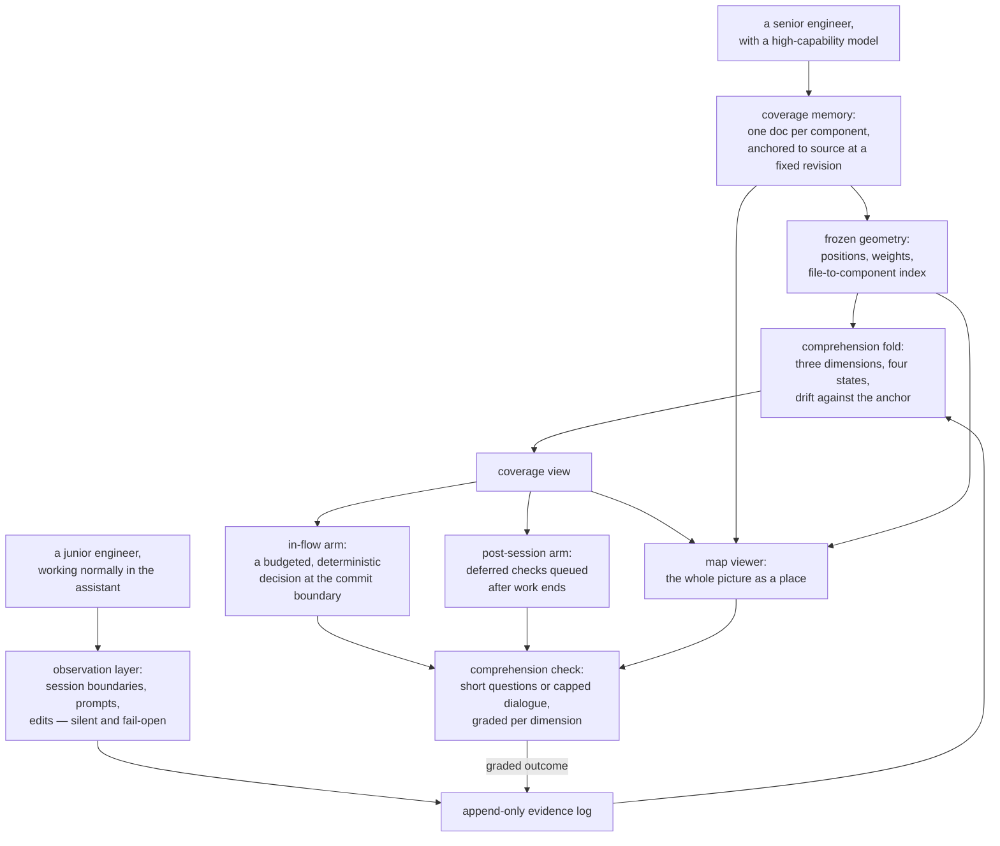

## Summary

SCALE keeps one person's genuine understanding of a codebase in sync with the code they are shipping. A senior engineer charts the repository once into a set of learnable components, each described by a prose doc anchored to source files at a fixed revision. A junior then works normally with a coding assistant; the system quietly observes that work, folds what it sees into a per-component estimate of comprehension across three dimensions, and occasionally asks a short grounded question to find out whether the estimate is real. The result is drawn as a stable spatial map. This document orients a reader to the whole arrangement; the eight provinces hold the detail.

## What it does

The problem is a recent one. An assistant can produce more working code in an afternoon than a person can internalize in a week, so shipping velocity and comprehension come apart. The code is fine; the mental model of it is not, and the gap stays invisible until it matters — a review, a debugging session, an incident, where someone must reason about a system they merely watched being written.

Three ideas hold the response together. Comprehension is worth writing down as an explicit per-component quantity rather than assumed. Ordinary work already emits enough signal to estimate that quantity — which files were edited, what was asked about, what was read — provided capturing it never costs the person anything. And an estimate from passive signal alone is not credible, so the system periodically asks, and only an answered question confirms anything.

## Related components

Eight provinces divide the system, each a reasonable place to enter depending on what you want to know.

[Coverage Memory](memory/) — read this to learn what the system knows about the codebase: the doc format, the protocol that writes the docs, and the loader that reads the tree back as data.

[Spatial Map](map/) — read this for how a folder of prose becomes a navigable place: frozen coordinates and weights, and the lookup from a file path back to the components responsible for it.

[Comprehension Model](comprehension/) — the conceptual centre, and the answer to what a score means: what may be observed, what may be concluded, and the replay turning one into the other.

[Signal Capture](capture/) — how a working session is observed at all, and the discipline that keeps every observer silent, bounded, and unable to fail in a way the person notices.

[Interventions](interventions/) — the in-flow arm and the only part with power to stop someone's work: whether a commit is worth interrupting, how that verdict is enforced, and the check itself.

[Quests](quests/) — the post-session arm and the alternative to interrupting: which components are selected once a session ends, and how a graded answer folds back wherever it was answered.

[Map Viewer](viewer/) — the visible surface: a local process serving the memory and coverage state, and a browser application drawing them as a map you can read and act inside.

[Platform and Packaging](platform/) — read this when something will not run: what may be configured, where private state lives, what commands exist under what latency contract, and how it installs.

## How it works

The loop runs in five stages, and the seams between them are the system's real structure.

**Charting.** A senior runs a build protocol with a high-capability model against a repository pinned at a fixed revision. It surveys the code, proposes a partition into a few provinces and a few dozen components, stops for approval, then writes one doc per component in parallel — what the component is, named ideas a person could be examined on, and its design reasoning with the provenance of that reasoning recorded. It cross-links the docs and hands geometry to a deterministic command that freezes each position and weight. This runs once and costs real money; everything after is cheap.

**Observing.** The junior installs a plugin and works normally. Hooks fire at session open and close, on each submitted prompt, and around each file modification, resolving what they saw to components — prompts by matching text against component names and declared ideas, edited files through the reverse index — and appending one raw, timestamped line to a log. Nothing is scored at capture time, nothing is printed, nothing touches a network while work is in flight, and every failure resolves to nothing having happened.

**Folding.** At a few natural moments the whole log is replayed from the beginning. Each component accumulates three scores: how well its structure is understood, how well its concepts are, how well its design reasoning is. Passive contact grants small credit that climbs toward a ceiling and stops. Graded answers blend in through a running average and are the only route to a confirmed state, which further requires more than one separate result and stamps the revision at which it was earned. A final pass measures how far the sources have travelled since that stamp; enough movement flips the component to stale regardless of its scores.

**Deciding.** One configured condition selects a timing. In-flow, a hook recognizes a commit and asks a pure function whether to interrupt; it sees the touched components, their coverage, the budget already spent this session, the size of the change, and the clock, and either permits or refuses while naming exactly one component. A refusal asks for a short check in chat, and the junior may decline — the commit then proceeds and the item is dropped, with no queue and no follow-up. Post-session, nothing interrupts at all; at session end a detached process queues questions about whichever components most deserve them. The two timings never cross.

**Reflecting.** A local server reads the memory, the frozen geometry, and the coverage view, and a browser application draws them: components at permanent positions, sized by weight, coloured by how well they are actually understood. Any component doc opens in place, and a check answered there travels back through the same recording path the command line uses.

## Design decisions

Six commitments shape everything downstream; most local decisions in the provinces follow from one of them.

**Files, not a database.** The memory is markdown committed beside the code it describes, and private state is plain documents in the person's home directory. That is what lets the memory be reviewed, diffed, and merged like any other artifact, lets a junior read it with no tooling, and lets the system run with no server and no account.

**Anchored to source at a fixed revision.** Every component declares which files it covers, and every confirmation records the revision at which it was earned. Without the anchor a score would decay silently as the code moved; with it, decay is measurable and can be surfaced as something needing re-confirmation. The cost is a memory that must be maintained as the code changes, and the drift machinery that would automate that is the least finished area of the system.

**Passive signals explore, never validate.** Editing a file or reading a doc is evidence of contact, not of understanding, so passive credit is capped and confirmation comes only from answered questions. Two separate components enforce this — a fair measure of how much credibility rests on it. It is also why raw observations are kept forever rather than folded in on arrival: the scoring rule is a research variable, and raw evidence can be re-scored over every session ever recorded.

**A frozen layout.** Positions are computed once and defended against every later run; growth is additive and never disturbs what is already placed. A map is only worth having if the same thing sits in the same place every time you look, and recomputing a layout is exactly the operation that destroys the memory a person has built of it. This looks like the strongest constraint in the system, and it is why geometry is a deterministic command rather than a judgement the build model may make.

**Two model tiers that never mix.** Building the memory is one-time and expensive, so it gets the most capable model available; checks and question generation recur every session and get a cheap one. Fixing the tiers in configuration rather than per call stops the recurring cost from quietly inheriting the build's model — given how often checks run, that is the difference between a usable prototype and an unaffordable one.

**The presentation metaphor is confined to the viewer.** What is stored is deliberately neutral: components, coverage, dimensions, four plain state names. One file in the viewer translates those names into presentation vocabulary, and nothing else branches on a state name. That reading is inferred rather than stated anywhere, but the arrangement is unambiguous — the metaphor could be changed, translated, or removed without touching anything that computes, records, or renders.

Underneath all six sits a seventh: interruption is the only thing here capable of harming its user — hence a decision to interrupt that can neither read nor write, ambiguity that always resolves to permitting, and a decline that is final.

## Where it sits

SCALE is one loop: a senior writes down what the codebase is, a junior's ordinary work says where they have been, a replay turns that into a per-component estimate of understanding, a budgeted question confirms the estimate, and a map shows the state back. If you read only three provinces, read [Coverage Memory](memory/) for what the system knows, [Comprehension Model](comprehension/) for what it concludes, and [Interventions](interventions/) for the one place it acts. If you are trying to make it run, start at [Platform and Packaging](platform/); if you want to see it, start at [Map Viewer](viewer/).
