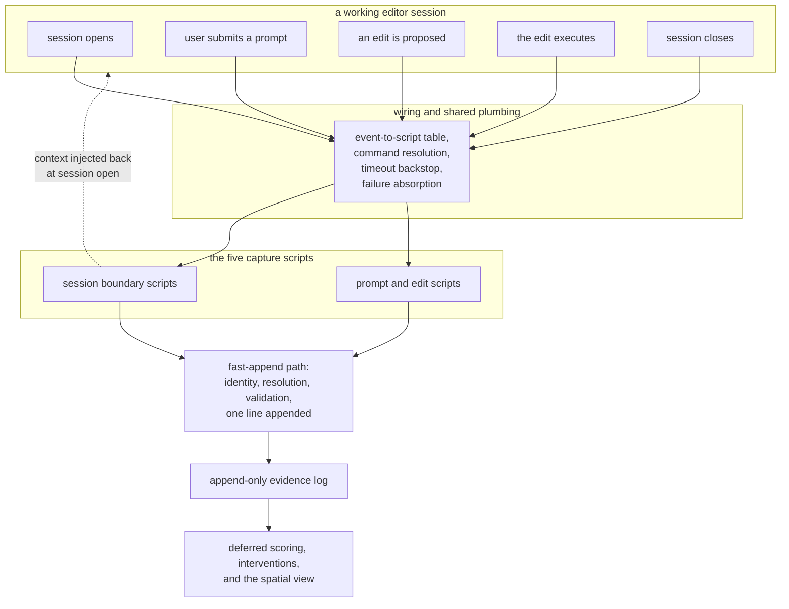

## Abstract

This province is everything the system does while someone is working: it watches an editor
session and turns what it sees into raw, timestamped observations, without ever making the
session slower, noisier, or blockable. It contains the wiring that connects editor events to
scripts, the scripts themselves — two at the session boundaries and three during ordinary work
— and the narrow command path that writes each observation to disk. It produces no
conclusions and grades nothing; every judgment about what an observation means is made
elsewhere, later.

## Introduction

The system's central claim is that a person's real comprehension of a codebase can be tracked
while they work, rather than asked about afterwards. That claim depends entirely on being able
to observe work as it happens. And observation of a working developer has one hard constraint
that dominates every other consideration: it must be free. Not cheap — free, in the sense that
no failure, delay, or message ever originates from it.

That constraint is what makes this a province rather than a handful of scattered files. Each
piece here is individually trivial: a table mapping events to scripts, five scripts that make
one call each, a command that appends a line. What binds them is a shared discipline. Every
one of them exits successfully no matter what happens. None of them prints to the user's
terminal. None of them contacts a network or a model while work is in flight. And on the
observation path proper — the one traversed on every prompt and every edit — none of them does
work that grows with the length of the record. The single exception is deliberate and sits at a
session boundary, where nothing is in flight: the summary assembled as a session opens does fold
the whole history, and is allowed to because the person is not waiting on a keystroke at that
moment. Read separately these pieces look almost empty; read together they are a single
consistent answer to the question of how to watch someone without them noticing.

The province also has a boundary that is worth stating up front, because it is easy to
misplace. Capture observes; it does not intervene. Exactly one hook in the editor's wiring is
allowed to interrupt, and it lives in a different province for precisely that reason. Anything
here that could have interrupted — the hook that fires before an edit and holds the power to
veto it, the hook that fires after and could feed a note back to the agent — deliberately stays
silent.

## Related Work

The four components of this province divide the work as follows.
[Hook Wiring and the Fail-Open Rule](./plugin-hooks/) is the substrate: the table of editor
events, the shared helper that resolves and runs the command, and the guarantees the other
three build on. [Session Start and Session End](./session-lifecycle-hooks/) covers the two
boundary scripts, one synchronous because its output must reach the agent before the first
turn, one detached because its work may reach the network.
[Capturing Touches, Prompts, and Review Latency](./edit-and-prompt-hooks/) covers the three
scripts that fire during work and the restraint they exercise.
[The Fast-Append Path](./evidence-append/) is the receiving side: where a person's state lives,
how an observation is resolved to component identifiers, and how it becomes one validated line.

Three components outside this province matter most for understanding it.
[The Append-Only Evidence Log](../comprehension/evidence-log/) defines the shape and meaning of
everything this province writes, and is the seam across which capture hands off to
comprehension. [Deny, Retry, and Defer-as-Drop](../interventions/gate-enforcement/) is the one
hook wired alongside these that is permitted to interrupt, and reading it clarifies by contrast
what the capture scripts are refusing to do.
[Selection, Generation, and Offline Fallback](../quests/quest-generation/) is the work the
session-closing script launches and then deliberately never hears back from.

## Description

The province is responsible for four things, and each of its components owns one of them.

The first responsibility is connection: making the editor run this code at the right moments,
and making that safe. A declarative table names the events of interest — session open, prompt
submitted, before and after any file-modifying tool, any shell command, session close — and
points each at a script. A shared helper underneath gives every script the same four
capabilities: read the event payload tolerantly, run the command synchronously under a hard
timeout with all child output captured, launch the command detached and abandon it, or emit a
context envelope. Every failure in every one of these resolves to the same outcome — nothing
happened.

The second responsibility is the session as a unit. The opening script asks for a short coverage
summary and injects it into the agent's context, which also resets the per-session record where
the interruption allowance is counted. The closing script hands follow-up work to a detached
child and returns instantly. Between them they define what a session is for everything
downstream: the scope of a budget, the window of components eligible for follow-up, and the
moment at which a fresh picture of coverage gets recomputed.

The third responsibility is the trace of ordinary work. Three scripts record intent from
submitted prompts, location from file modifications, and engagement from the interval between an
edit being proposed and executing. This last one is why there are two hooks around each edit
rather than one. All three are silent, and the one with veto power over an edit conspicuously
never uses it.

The fourth responsibility is durable writing. A single narrow command path derives which
repository this is from version control, locates the person's state directory outside the
working tree, resolves component identifiers — prompts by cheap text matching against component
identifiers, titles, and concept names; edited files through the reverse index with a
nearest-directory fallback — validates the entry, and appends exactly one line. It recomputes
nothing.

What the province explicitly does not do is as important as what it does. It does not score. It
does not decide whether a person understands anything. It does not ask questions. Those all
belong to comprehension and interventions, and the seam between them is the log file itself. The
one apparent exception is worth naming precisely, because a careless reading of it would suggest
the seam leaks: the summary produced when a session opens does read the log, but it does so by
calling the fold that comprehension owns and defines, and it uses the answer only as text handed
to the agent. Capture never interprets the log; at that one moment it borrows an interpretation
that belongs to someone else.

One honest limitation runs across the third and fourth responsibilities. The scripts forward the
editor's event payload on the input stream, but the commands they call take their inputs as
command-line arguments and do not read that stream. Both halves are individually complete and
individually tested; the wire between them is not yet connected, so the entries written during a
live session are structurally valid but empty of the file and prompt detail the design intends.
The review-latency signal fares worse still: with neither a file nor a duration supplied, its
command rejects the call outright and writes nothing, so that signal is absent from a live log
rather than merely thin. A reader inspecting a real log should expect all of this, and should not
conclude the resolution logic is broken — it is simply not being handed anything to resolve.

## Rationale

The grouping is drawn around a shared non-functional constraint rather than around a data type
or a layer, and that is what makes it the right seam. Everything in this province runs on the
path between a person and their editor. That single fact dictates every design choice inside it:
fail open, exit successfully, stay silent, bound every call in time, never touch a network,
never do work proportional to history, and hand anything heavy to a detached child. Those rules
are hard to hold if the code is scattered among the components that consume its output, because
each consumer would be tempted to ask for just a little more work at capture time. Keeping the
capture path in one province makes the constraint visible and auditable — a reviewer can ask of
any file here whether it could ever make a session slower, and expect a flat no.

The alternative grouping worth considering is by signal type: put the prompt hook next to the
prompt scoring, the touch hook next to the file index, the session hooks next to quest
generation. The code suggests this was rejected, and for good reason. Each of those pairings
straddles the latency boundary, which is precisely where mistakes are expensive and hardest to
see. A change made for the benefit of scoring would land in a file that runs inside a hook, and
nothing in the file's neighborhood would signal that this is forbidden. The chosen seam puts the
boundary between provinces instead, where it is crossed only by an append to a file.

A second reason the seam sits here is that capture must keep working when everything else is
broken or absent — no coverage memory, no configuration, no materialized coverage, no network,
no model key. Placing it downstream of anything that can be missing would compromise that
independence, which is why the observation path resolves component identifiers from data
already on disk and treats an empty result as an ordinary outcome rather than an error.

The one thing pointedly excluded from this province is the commit gate, even though it is wired
in the same table and calls the same command binary through the same helper. Keeping it out is a
statement about what capture is allowed to do. Interruption is budgeted, deliberate, and
attributable; observation is unlimited and invisible. Merging them would make the budget rules
harder to reason about and would put a decision that can block a person's work inside a body of
code whose defining property is that it never can.

## Conclusion

Signal capture is the system's sensory layer: five small scripts, one shared helper, and a
narrow append path, all governed by the rule that observing must never cost the person being
observed anything at all. It produces a raw, append-only stream of what actually happened during
real work and stops there. Start with [Hook Wiring and the Fail-Open Rule](./plugin-hooks/),
which establishes the guarantees everything else here assumes, then follow the stream across the
boundary into [The Append-Only Evidence Log](../comprehension/evidence-log/), where raw
observation begins to become a claim about what someone understands.
