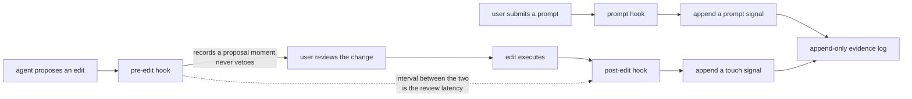

## Summary

These three scripts are everything the system observes while a developer is actually
working: what they ask for, which files change as a result, and how long they spend
looking at a proposed change before letting it run. All three are silent — none of them
blocks, prompts, or writes anything the user sees — and all three exit successfully no
matter what happens downstream. The pre-edit and post-edit pair is the only place in the
system that can measure human review time, and the pre-edit hook is notable for holding
the power to veto an edit and refusing to use it.

## What it does

The comprehension model needs to know where a person has been. Not where they claim to
have been, and not where they were told to go — where their attention actually went during
real work. Three kinds of trace are available cheaply from an editor session, and each says
something different.

A prompt says what the person was thinking about. It is intent, expressed in their own
words, before any code moved. A file modification says where the work landed, which is
often not where the intent pointed. And the gap between an agent proposing a change and
that change executing says something about engagement: a change accepted instantly was
probably not read, while one accepted after a pause probably was.

None of these is proof of understanding, and the system never treats them as such — passive
traces move a component out of the unknown state and grant a small amount of credit toward
the structural dimension, capped well below the threshold for validation. Only an active
check can validate. That deliberate weakness is what licenses these hooks to be so cheap and
so tolerant of noise: they build a map of attention, not a set of grades.

## Related components

Everything about how these scripts run — resolution, timeouts, failure absorption — is in
[Hook Wiring and the Fail-Open Rule](../plugin-hooks/), and the two hooks that bracket the
whole session rather than individual actions are in
[Session Start and Session End](../session-lifecycle-hooks/). What happens on the other end
of each call, including how a file becomes a component and a prompt becomes a set of
component mentions, is [The Fast-Append Path](../evidence-append/). The file-to-component
join those calls depend on is [File-to-Component Reverse Index](../../map/file-component-index/),
and the shape and semantics of the entries appended are
[The Append-Only Evidence Log](../../comprehension/evidence-log/). The rules that decide how
little these passive traces are worth relative to an active check are in
[Scoring: Exponential Averaging, Loyalty, Classification](../../comprehension/coverage-model/).
The states a component can be moved between and the three bounded dimensions that credit lands
in are defined by
[Coverage States and the Three Dimensions](../../comprehension/coverage-schema/), which matters
here because the cheapness and noisiness of these three scripts is only defensible given how
little that shape permits a passive trace to claim.
Finally, the pre-edit hook is best understood by contrast with
[Deny, Retry, and Defer-as-Drop](../../interventions/gate-enforcement/), which is the one
hook that does interrupt and which shows exactly what these three are refusing to do.

## How it works

The prompt hook fires when the user submits a prompt. It reads the payload, makes one call
asking for the prompt signal to be logged, and exits successfully. Its source comment is
blunt about why the exit code matters here more than anywhere else: a hook on this event
that exits with failure will swallow the user's prompt entirely. Of all the fail-open
guarantees in the capture layer, this is the one whose violation the user would notice
immediately and misdiagnose completely. The script also declines to add anything to the
agent's context, even though the event permits it — capture on this path is meant to be
invisible.

The pre-edit hook fires before any file-modifying tool runs. The event it handles is a
permission decision point: a hook here may allow, deny, or force a confirmation prompt.
This script prints nothing at all, which lets the edit proceed normally. Its comment states
the position plainly — the hook never gates edits, it only records a proposal moment so the
paired hook after execution can compute review latency. This is a deliberate refusal of
power at the exact place where a naive design would put its intervention, and it is the
clearest expression in the codebase of the rule that interruptions happen only at natural
boundaries and never mid-edit.

The post-edit hook fires after the same tools complete. It too may speak — this event
allows a hook to return a note that gets fed back to the agent — and it too says nothing.
It makes one call asking for the touch signal to be logged and exits. Downstream, that call
is supposed to map each edited file to the components that claim it, using the reverse index
with a nearest-directory fallback for files no component claims, and to append a touch entry
naming both the files and the resolved components.

The intended pairing works like this: the pre-edit call records a proposal timestamp keyed
by session and target file, and the post-edit call finds that pending record, closes it, and
emits a review-latency entry alongside the touch entry. The evidence format has a dedicated
entry type for exactly this, carrying a file and a duration in milliseconds.

That entry type is written but not consumed. The scoring model in use today folds prompts and
file modifications into a component's comprehension dimensions and ignores review latency
completely — no dimension moves because a change sat unaccepted for ninety seconds, and no
component's classification differs from what it would have been had the measurement never been
taken. The signal is retained as raw evidence and nothing more, which is a bet rather than an
oversight: recording it costs one extra hook per edit and preserves the option of modelling it
later, whereas discarding it would foreclose that option permanently. Anyone reading a
comprehension score should understand that this particular observation contributed nothing to it.

Here the honest state of the system has to be stated, because a reader who assumes the
described pairing is live will be wrong about the data. The three scripts forward the full
event payload on the input stream, as the comments describe. The commands they call,
however, take their file lists, prompt text, and latency figures as command-line arguments
and never read that stream. The scripts pass no arguments. As currently wired, then, the
touch entry appended after an edit names no files and resolves to no components; the prompt
entry carries no text and matches nothing; and the latency command finds neither a file nor
a duration, reports a usage error, and exits with failure — which the hook duly absorbs and
converts to silence, exactly as the fail-open rule requires. There is also no pending
proposal store on the command side for the pre-edit call to write into, so the pairing has
no place to keep its half-open records. Both halves of the mechanism exist and are
individually sound; they are not yet joined. Every one of these commands works correctly when
invoked with arguments, which is how the tests and manual use exercise them.

One invariant holds even when everything works: none of these hooks recomputes comprehension
scores. Appending a raw trace is cheap and bounded; folding the whole history into a score is
neither, and doing it on every keystroke-adjacent event would make the latency budget
unmeetable. Scores are materialized at deliberate, less frequent moments instead.

## Design decisions

The bracketing design exists because review latency has no single-event representation. The
comment on the pre-edit script ties it directly to the plan's note about pairing timestamps
across the two events. The alternative would be reconstructing timings from the conversation
transcript, which a hook does not receive and which would be expensive and brittle to parse.
Bracketing costs one extra process start per edit and yields the measurement directly. If
the pre-edit hook were removed to save that process start, the latency signal would become
unrecoverable — not degraded, but absent, since nothing else in the system sees the moment
of proposal.

The refusal to gate at pre-edit is the most consequential decision in this component and the
one most worth confirming with the authors. The evidence for the reasoning is the comment's
emphatic phrasing — that the hook never gates and only records — combined with the system's
stated rule that in-flow interventions fire only at natural boundaries. A mid-edit prompt
would be maximally disruptive and would arrive at the moment the developer is least able to
absorb a question, since they are in the middle of evaluating something else. It would also
blur a distinction the design depends on: capture is unconditional and free, interventions
are budgeted and rare. If this hook started asking questions, the budget rules enforced at
the commit boundary would be trivially bypassed and the interruption audit the project plans
would have nothing meaningful to audit.

Logging latency without modeling it is a bet on future analysis. The plan is explicit that
this signal is logged only in the current model, and this appears to be because its
interpretation is genuinely ambiguous — a long gap could mean careful reading or an
abandoned desk, and the system has no way to distinguish them. The design choice that makes
this cheap is retaining the raw trace rather than a derived score: if the signal later proves
valid, the whole history can be re-folded through a new model without having re-run anyone's
sessions. Reversing this — folding latency into the score now — would mean interventions
firing on a signal nobody has validated, and would also make the historical data unusable for
testing whether the signal was ever any good.

## Where it sits

These three scripts are the system's eyes during ordinary work: intent from prompts, location
from file modifications, engagement from the pause between proposal and execution. They are
uniformly silent, uniformly fail-open, and — in the pre-edit case — uniformly restrained,
holding a veto they never use. Their current limitation is that the detail they forward is not
yet read by the commands they call, so the entries they append are thinner than the design
intends. Read [The Fast-Append Path](../evidence-append/) next to see the receiving side, then
[The Append-Only Evidence Log](../../comprehension/evidence-log/) to see what these traces
become once the fold runs over them.
