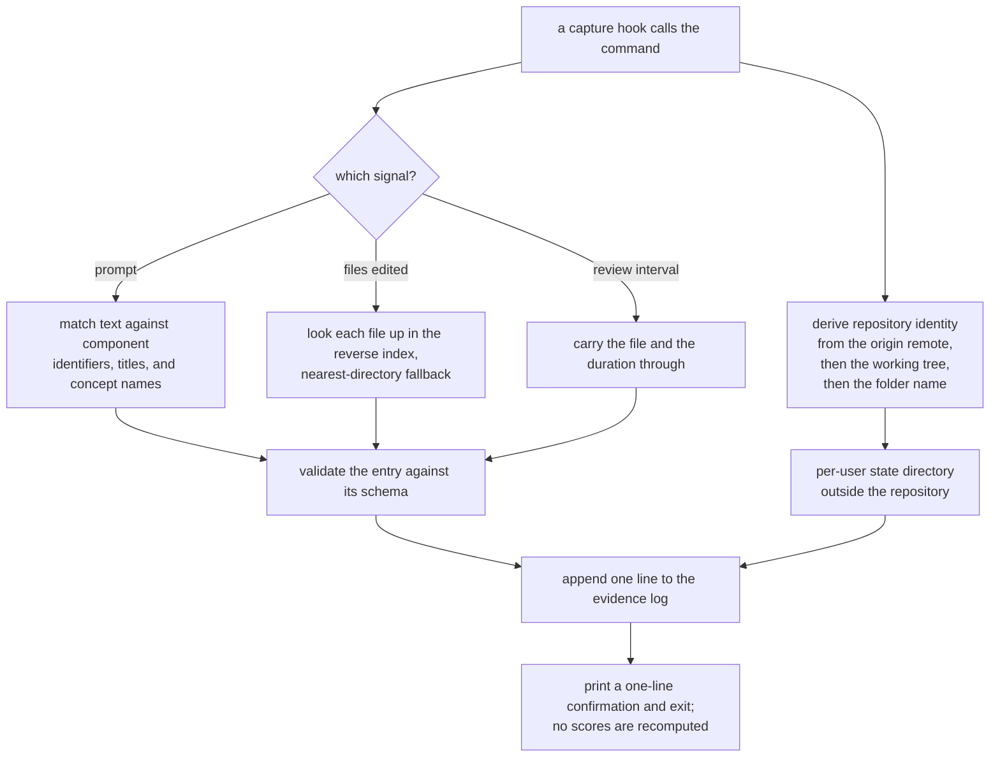

## Abstract

This is the receiving half of signal capture: the small set of commands the hooks call and
the module that knows where a person's state lives on disk and how to write to it safely. Its
job is to turn a raw observation into exactly one validated line in an append-only log, in
well under the time a keystroke takes, without ever recomputing anything or contacting
anything. Everything that makes the capture layer feel free to the developer is a consequence
of how narrow this path is kept.

## Introduction

Capture systems usually die of one of two causes. Either they do too much work at the moment
of observation and become the slow thing everyone disables, or they process observations
eagerly into summaries and discover a year later that the summary was the wrong one and the
raw data is gone.

This path is designed against both. The work done per signal is bounded by a constant: derive a
directory, resolve some identifiers from data already on disk, validate a small object, append
one line. And what gets written is the observation itself rather than its consequence — the
files that were edited and the components they map to, not the credit that should be awarded
for having edited them. The scoring model is a separate, pure function applied later to the
whole log, which means the model can change and the past can be reinterpreted.

Before any of that can happen, the path has to answer a question that sounds trivial and is
not: whose state, for which repository, and where.

## Related Work

The callers of this path are [Capturing Touches, Prompts, and Review Latency](../edit-and-prompt-hooks/)
during ordinary work and [Session Start and Session End](../session-lifecycle-hooks/) at the
boundaries, both running under the guarantees of
[Hook Wiring and the Fail-Open Rule](../plugin-hooks/). What is written here is defined by
[The Append-Only Evidence Log](../../comprehension/evidence-log/), and the join that turns an
edited file into component identifiers is
[File-to-Component Reverse Index](../../map/file-component-index/). Resolving a prompt depends
instead on having the whole coverage memory in hand as data: the identifiers, titles, and
concept names the matcher compares against are produced by
[Loading the Coverage Memory Tree](../../memory/paper-loader/), whose habit of returning less
data rather than failing is exactly what lets this path treat an absent or half-written memory
as an ordinary empty result instead of an error. The directory layout and
repository-identity rules described here are shared with everything else that touches per-user
state and are catalogued in
[Per-User State Layout and Repository Identity](../../platform/state-directory/). The deferred
work this path deliberately refuses to do is
[Impure Edges: Git Churn, Clock, and Disk](../../comprehension/coverage-materialization/), and
the full set of commands this one is a corner of is
[The Command Surface](../../platform/cli-surface/).

## Description

Repository identity is derived best-effort and never throws. The first attempt asks the version
control system for the origin remote's address; if one exists, it is normalized so the two common
address styles collapse to the same host-and-path form, then slugified into something
filesystem-safe. Failing that, the name of the working tree's top directory is used, and failing
that, the current directory's name. Every version-control call is wrapped so that a missing
repository, a missing tool, or any other failure simply moves to the next option. The resulting
slug names a directory under the user's home holding four well-known files: configuration,
materialized coverage, the evidence log, and pending work. A fifth, the per-session record, sits
alongside them without a schema, because it is internal to the command layer and never leaves it.

The read helpers are asymmetric on purpose, and the asymmetry is calibrated per file rather than
applied uniformly. Configuration is the only thing exposed both ways: a strict reader that parses,
validates, and throws on anything wrong, for the interactive commands where a corrupt setting
should be reported rather than silently ignored, and a forgiving wrapper around it that returns
nothing at all on any failure. Materialized coverage and pending work are exposed only in the
forgiving form, returning nothing and an empty list respectively. The commands on the latency
path use only the forgiving readers, which is why a signal can still be logged in a state
directory that has never been initialized, contains a truncated file, or was written against an
older schema. The per-session record goes further still: its reader defaults every individual
field, so a partially written record degrades field by field instead of being discarded whole,
and only a missing or unreadable file causes it to give up entirely.

Writing is the opposite. The append helper validates the entry against the evidence schema before
touching the disk, creates the directory if needed, and performs a single asynchronous append of
one serialized line followed by a newline. There is no read-modify-write, no locking, and no
rewriting of earlier lines — the log grows only at the end, which matters because hooks can
overlap.

Three signal commands sit on top of that helper. The prompt command takes text and resolves it to
component identifiers by loading the coverage memory and comparing the lowercased, whitespace-
normalized text against each component's identifier, its title, and every one of its concept
identifiers and names, trying both the hyphenated and the spaced form of each and ignoring
candidates shorter than three characters. One hit anywhere marks that component mentioned. An
explicit list of identifiers may be supplied instead, which short-circuits the matching entirely.
The resulting entry carries the matched identifiers and, when the text is non-empty, the text
itself.

The touch command takes file paths, relativizes each against the working directory, and looks each
one up in the file-to-component index — preferring the persisted index if the coverage memory has
one and rebuilding it in memory from the papers' declared sources otherwise. The lookup falls back
to the nearest enclosing directory for files no component claims outright, which is what keeps
newly added files from vanishing from the record entirely. Explicitly supplied identifiers are
merged in rather than replacing the matched ones. The entry names both the files and the union of
resolved components.

The review command is the simplest and the strictest: it requires a file and a duration, and if
either is missing it prints a usage line and exits with a failure code rather than writing a
malformed entry.

All three print a short confirmation and stop. None of them recomputes coverage — the comments are
explicit that no recompute happens here — and none of them makes a network call.

One gap must be stated plainly, because it changes what a reader should expect to find in the log.
These commands read their inputs from command-line arguments only. The hooks that call them pipe
the editor's event payload on the input stream and pass no arguments, and nothing on this side
reads that stream. So the entries written during a live session are structurally valid but empty of
detail: a touch with no files and no components, a prompt with no text and no matches, and, for the
review signal, no entry at all because the usage check rejects the call. The matching logic, the
index lookup, the fallback behavior, and the append are all real and exercised by direct invocation
and by tests; the wire between the payload and the arguments is the piece that is missing.

## Rationale

Appending raw rather than scoring in place is the decision the whole comprehension model rests on.
The comments state the position directly: the append path is bounded and must stay under a fraction
of a second, no recompute is permitted here, and coverage is a materialized view of the log rather
than an independently maintained value. The deeper reason appears to be research caution. A scoring
model chosen before any real sessions have been observed is almost certainly wrong in its
constants; keeping the observations means those constants can be changed and the entire history
re-folded. If the reverse choice had been made and only scores were kept, every tuning change would
require new participants.

Matching prompts by substring rather than by a model is the clearest case of a deliberately weak
mechanism being the right one. The comment names the reason as staying inside the append latency
budget. The mechanism will produce false positives — a component whose title happens to be a common
word will match constantly — and this is survivable only because of a rule set elsewhere: passive
signals can move a component out of the unknown state and grant a capped sliver of structural
credit, but can never validate it. A false positive therefore costs a slightly optimistic picture of
where attention went, not a false claim of understanding. If passive signals were allowed to
validate, this matcher would have to be far more careful and far slower, and the latency budget
would be unmeetable.

Placing state outside the working tree, keyed by repository identity, resolves two constraints at
once. The coverage memory is meant to be committed and shared; a person's comprehension record is
not. Keying on the remote rather than on a filesystem path means a developer with two clones sees
one continuous record — the record represents understanding of a codebase, not of a folder. The
layered fallback exists so that a repository without a remote, or a directory not under version
control at all, still works: degradation rather than refusal, consistent with the fail-open posture
of the whole capture layer.

The strict-write, forgiving-read asymmetry follows from where each error can be recovered. A bad
line, once written, is permanent and will be met by every future fold; catching it at write time
costs one schema check on a small object. A bad line encountered during a read can simply be
skipped, and a missing or half-written file can be treated as empty.

## Conclusion

This path is the narrowest, most frequently traversed piece of the system: identity resolved from
version control, components resolved from data already on disk, one validated line appended, done.
Its restraint is what buys the capture layer its invisibility, and its rawness is what leaves the
comprehension model free to change its mind later. Read
[The Append-Only Evidence Log](../../comprehension/evidence-log/) to see what these lines mean, and
[Impure Edges: Git Churn, Clock, and Disk](../../comprehension/coverage-materialization/) to see the
deferred work this path so carefully avoids.
