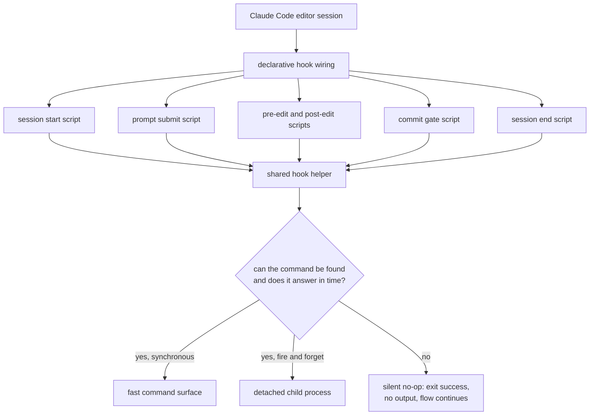

## Abstract

This component is the wiring and the shared plumbing that connect a running editor
session to the coverage system: a declarative map from editor lifecycle events to
small scripts, plus one helper module those scripts all share for finding the
command surface, running it, bounding it in time, and swallowing its failures. Its
single overriding rule is that it fails open — a missing, slow, or broken
installation degrades to nothing happening at all, never to a blocked or noisy
session. Everything else in signal capture is built on the guarantee this component
provides.

## Introduction

Observing a developer at work is easy to do badly. The obvious approach is to insert
code into the path between the person and their tool, and the obvious failure mode is
that the inserted code becomes part of that path: it adds delay, it prints errors, it
sometimes refuses to let work proceed. A comprehension system that made an engineer
wait would be resented long before it taught anything, and a research prototype whose
telemetry can wedge a participant's editor produces no data at all.

So the wiring layer is written under an inversion of the usual priority. Correct
capture is desirable; uninterrupted work is mandatory. Every decision in this
component follows from choosing the second whenever the two conflict. The result is a
layer that is boring by design: a table saying which editor events run which script,
and a helper that makes running anything from those scripts as close to unobservable
as a subprocess can be.

## Related Work

The two families of scripts this wiring points at are documented separately:
[Session Start and Session End](../session-lifecycle-hooks/) covers the two ends of a
session, and [Capturing Touches, Prompts, and Review Latency](../edit-and-prompt-hooks/)
covers the three that fire during work. Every synchronous call these scripts make lands
in [The Fast-Append Path](../evidence-append/), which is the only reason the sub-second
latency target is achievable at all. One entry in the wiring is not a capture hook but
an intervention: the commit gate described in
[Deny, Retry, and Defer-as-Drop](../../interventions/gate-enforcement/) is the single
place where a hook is permitted to interrupt, and it earns that permission by making the
decision elsewhere and staying a thin translator. The scripts here reach the system
through the interface catalogued in [The Command Surface](../../platform/cli-surface/),
and the way this whole directory is shipped to a participant's machine is the subject of
[Bundling and Distributing the Plugin](../../platform/plugin-packaging/). That same package
also ships this table's deliberate counterpart: where the wiring here fires without anyone
asking for it, [User-Initiated Entry Points](../../interventions/slash-commands/) are the ones
a developer types on purpose, and reading the two together gives the complete surface through
which the system can be reached from a session.

## Description

The declarative half is a small table. It names each editor lifecycle event the system
cares about — the start of a session, the submission of a prompt, the moment before and
the moment after a file-modifying tool runs, an attempted shell command, and the end of
a session — and for each names a script to run, with a timeout of a few seconds declared
alongside. The scripts are addressed through a root path the editor exports for the
plugin, so the same table works no matter where the plugin has been unpacked.

Three of those entries carry a matcher over tool names, and two of the three share the
same one: the file-modifying tools are matched as a group, once before execution and
once after. The third matcher covers every shell command, and only before execution.
That third matcher is far broader than what the commit gate actually wants, and this is
deliberate. The wiring cannot see command text; only the script can. So the
matcher lets every shell invocation through and the script does a cheap check up front,
exiting immediately for the overwhelming majority that are not commits — one process
start and one regular expression, paid to keep the discrimination in reviewable code
rather than in an unversioned configuration string.

The shared helper is where the fail-open rule is actually implemented. It offers four
things. First, reading the event payload from standard input, returning an empty string
if the stream is absent or errors, and parsing it while tolerating anything malformed by
returning an empty object. Second, a synchronous run: it resolves the command, spawns it
with the payload piped in, captures both output streams so nothing can leak to the
terminal, and imposes a timeout. If the spawn fails because the command does not exist,
it retries once through the development fallback — running the command package's source
entry point through an on-demand runner that compiles it in place, but only if that entry
point is actually present on disk. If everything fails, the caller receives a plain result object saying so; the
helper never throws.

Resolution order matters and is short: an environment variable naming the binary wins if
set, otherwise the plain command name is tried on the search path, otherwise the source
fallback. The first attempt is optimistic — the helper does not probe for the binary before
using it, because probing costs a process start on every hook. It simply tries, and treats
the not-found error as the signal to fall back.

The timeout deserves attention because there are two of them. The wiring declares a
timeout of a few seconds, enforced by the editor. The helper enforces its own, much
tighter, defaulting to something well above the sub-second target but far below the
outer limit, and overridable through an environment variable for debugging. The inner
one exists so that a hung command is killed by the layer that knows the latency contract,
rather than by the editor after a delay the user would feel.

The fourth thing the helper offers is the detached launch. It spawns the command with an
extra flag marking the run as detached, with both output streams discarded and only the
input stream open, writes the payload, closes it, attaches an error handler that silently
retries the development fallback if the binary was not found, and then unreferences the
child so the parent process can exit without waiting. This is what lets a session-end
hook trigger work that may involve a network call and still return instantly.

A last, smaller piece of the helper builds the envelope used when a hook wants to add
text to the agent's context. It trims the text and emits nothing at all when the text is
empty — so a system with no coverage memory injects silence rather than an empty
structure.

The invariants worth holding are these. No script here exits with a failure code. No
child output reaches the user's terminal. No synchronous call is unbounded in time. No
call in this layer contacts a model or a network. And every failure — missing binary,
malformed payload, crashed child, timeout — resolves to the same outcome: nothing
happened, the session continues.

## Rationale

The fail-open rule is stated directly in the source comments, which describe the working
flow as sacred and say a broken installation should degrade to a no-op rather than a
wall. Taking that at face value, the reasoning appears to be that this system's value is
entirely in the comprehension it builds later, while its cost is paid immediately and
continuously by the person being observed. Any design that lets the deferred benefit
impose an immediate cost inverts the trade. Reversing the decision would be quietly
catastrophic in the study setting: a participant whose editor stalls or fills with errors
would disable the plugin, and the resulting data loss would be total rather than partial.

Keeping models and networks out of this layer follows from the same budget. The comments
name a sub-second target for hook-path work and describe it as pure file reading and
appending. The detached launch exists precisely because one event — the end of a session
— wants work that cannot meet that budget, and the chosen resolution is to move the work
off the path entirely rather than to relax the budget for one case. If detachment were
dropped and the call awaited instead, closing a session would visibly hang, which is
both the most annoying possible moment to hang and the one where the user has already
mentally left.

Runtime resolution of the command with a source fallback appears to be aimed at two
audiences at once. A study participant installs normally and the binary is on the path.
A developer working in the monorepo may have nothing linked, and the fallback runs the
same code from source. Pinning a path would break one of those two, and requiring a
global install would add a setup step that could fail silently on a participant machine
— which, given the fail-open rule, would mean capture silently producing nothing with no
one noticing.

The coarse matcher trades a little efficiency for a lot of clarity: every shell command in
a session pays for one short-lived process. The wiring's comment notes that the script
narrows the match itself, and the gate script describes its pre-filter as cheap so that
non-commit calls cost nearly nothing. The alternative — a precise expression in
configuration — cannot work at all, because the decision depends on command text the
matcher never receives. Pushing the test into the script is not merely tidier; it is the
only placement that can work.

## Conclusion

This component is the contract every other capture component relies on: editor events
arrive, small scripts translate them, a shared helper runs the real work under a bound
and absorbs every failure, and nothing that goes wrong here is ever the user's problem.
Read [Session Start and Session End](../session-lifecycle-hooks/) and
[Capturing Touches, Prompts, and Review Latency](../edit-and-prompt-hooks/) next to see
what the individual scripts do with that contract, and
[The Fast-Append Path](../evidence-append/) to see what has to be true on the other side
of the call for the latency budget to hold.
