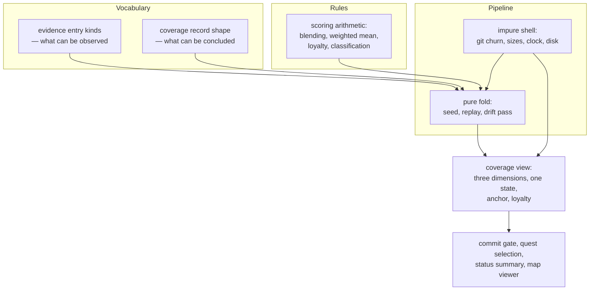

## Summary

This province owns the question of how well one person understands one component of a codebase. It defines the vocabulary of raw observations, the vocabulary of conclusions, the arithmetic that connects them, the deterministic replay that applies that arithmetic to a whole history, and the layer that supplies the replay with real numbers from a real repository. Everything downstream that decides whether to interrupt a commit, what to ask about, or how to draw the map, reads what this province produces and adds no opinions of its own.

## What it does

SCALE's premise is that comprehension can be tracked as a measurable quantity that drifts out of sync with the code, and that the drift is worth surfacing. Making that premise operational requires answering four separate questions, and it is easy to conflate them. What counts as an observation? What counts as a conclusion? By what rule does one become the other? And when does the conversion happen?

Keeping those four questions apart is the organising idea of this province. The observation vocabulary is fixed and deliberately raw: a file was edited, a prompt mentioned something, a question was answered with this grade on this dimension. The conclusion vocabulary is small and bounded: three comprehension dimensions, one of four coarse states, a commit at which understanding was last confirmed, and a measure of how far the code has since travelled. The rule connecting them is a handful of pure functions. And the conversion is a full replay from the beginning of history, run at a few natural moments, never continuously.

The reason this separation earns its keep is that the rule is the part expected to change. It is a research variable — the prototype exists partly to find out what a good rule looks like. By keeping observations raw and conclusions derived, the rule can be rewritten and re-run over every session ever recorded, and nothing is lost. Almost every structural decision in this province is downstream of that single commitment.

## Related components

Five components divide the work. [Coverage States and the Three Dimensions](./coverage-schema/) fixes what can be concluded — the bounded dimensions, the four states, the validation anchor, and loyalty — and is the shape every consumer in the system reads. [The Append-Only Evidence Log](./evidence-log/) fixes what can be observed, defining the seven entry kinds and the guarantees that make the log re-foldable years later. [Scoring: Exponential Averaging, Loyalty, Classification](./coverage-model/) holds the arithmetic: how a graded score blends into a running value, how three dimensions collapse into one, how churn becomes loyalty, how the four states are chosen, and how per-component understanding aggregates into overall progress. [Pure Materialization of Coverage](./state-engine/) applies that arithmetic in order over an entire history, threading the accumulators the classification rules need and running the drift comparison as a final pass. [Impure Edges: Git Churn, Clock, and Disk](./coverage-materialization/) is the only component here that touches the outside world, gathering churn, sizes, the current commit and the timestamp, and writing the result where everyone else can find it.

Three components elsewhere are close enough to this province that they should be read alongside it. [The Fast-Append Path](../capture/evidence-append/) is the other end of the evidence contract — the few milliseconds in which a signal becomes a line in the log — and it exists in the shape it does precisely because this province refuses to do any work at capture time. [The Pure Pre-Commit Decision](../interventions/commit-gate/) is the most demanding consumer of what this province produces, reading states and dimensions to decide whether a commit is worth interrupting, and reusing this province's weighted-mean rule so that its ranking matches what the learner sees elsewhere. [The Frozen Map Document](../map/map-schema/) supplies both the set of components that coverage is even defined over and the importance weights behind the overall progress figure, which makes progress a joint property of the map and the coverage rather than of coverage alone.

## How it works

Read as a pipeline, the province runs left to right: hooks append raw entries; at a recompute point the impure shell gathers everything the fold needs; the fold seeds an empty record per mapped component, replays the history in timestamp order, and finishes with a drift comparison; the result is written once as a whole document; consumers read it.

The division of responsibility among the five components follows a deliberate axis — from vocabulary, through rules, to execution, with impurity pushed as far out as it will go.

The two schema components are pure vocabulary. They describe shapes and enforce bounds and know nothing about how anything is computed. Their independence is what allows the arithmetic to be replaced without touching either end of the pipeline. The scoring component holds the rules, in one place, with its constants exposed as a single overridable set, because those constants are research parameters rather than facts. That claim is very nearly true and it is worth knowing where it frays: the ceilings on passive credit are supplied from configuration, and the size of each passive increment is a fixed constant belonging to the fold, so a small amount of arithmetic does live outside the scoring component. The fold component holds ordering, seeding and the accumulators, and no formulas beyond those increments — it decides when to apply a rule, almost never what the rule is. The materialization component holds every side effect in the province and no rules at all.

Three invariants hold across the whole province and are the fastest way to check whether you have understood it.

Coverage is always derived, never authored. No code path writes a comprehension number directly; the only way a number comes into existence is as the output of a full replay. This is why the coverage file can be deleted without loss, and why it is legitimately out of date between recompute points.

Passive contact explores but never validates. Editing a file, mentioning a component in a prompt, or opening its paper grants a small credit that climbs toward a cap and stops. Reaching the validated state additionally requires a minimum number of separate graded results, a count that is deliberately not stored in the coverage record and, unlike almost every other threshold here, is not exposed for tuning either. Two independent mechanisms enforce the same rule, which reflects how much of the system's credibility depends on it.

Drift outranks confidence. A component whose sources have churned past a threshold since the commit at which it was validated reports as stale no matter how high its scores are, and classification checks this before anything else. This is also the province's least finished area, and honesty about it matters: the churn measurement that actually produces staleness lives in the materialization layer, not in the standalone drift command, which currently reports only commit identifiers. And because churn is measured from anchors recorded by the previous run, staleness needs at least two rebuilds to appear and one extra rebuild to clear after re-validation.

One signal is captured but deliberately not modelled. Review latency — the time between an edit being proposed and being accepted — is recorded as raw evidence and has no effect on any score in this version. That is exactly the situation the raw-evidence design was built for: the data accumulates now, and a later model can use it without any session being lost.

## Design decisions

The seam that defines this province is the boundary between recording what happened and concluding what it means. Everything on one side of that boundary — hooks, the tutor, the viewer — produces observations. Everything on the other side — the gate, quest selection, the status summary, the map — consumes conclusions. Nothing outside this province does both, and nothing inside it does either job for anybody else. That is what makes the grouping natural rather than merely convenient: the components here are the only ones that hold an opinion about comprehension.

The internal split, from vocabulary to rules to execution to side effects, appears to be chosen so that the part most likely to change is also the part with the fewest dependencies. The scoring arithmetic can be rewritten without touching the schemas, the fold, or the shell. The fold can be reorganised without touching the arithmetic. Only the shell knows about git. Reversing any of those separations has a concrete cost: putting the arithmetic in the fold makes it untestable against hand-written cases; putting git in the fold makes reproducibility unverifiable; putting counters in the stored record makes the raw evidence non-re-fittable and quietly turns the cache into the source of truth.

The one place this province deliberately accepts an awkward result is the churn dependency. Anchors are an output of the fold and churn is an input to it, and the cycle is broken by reading the previous run's answer. That is not elegant, and it produces the visible lag described above. It is chosen, the code suggests, because the two clean alternatives are both worse for this system: folding twice doubles git work on a path that runs while somebody is starting a session, and computing churn inside the fold sacrifices the purity that the rest of the province is built around.

## Where it sits

This province is the answer to "how well do you actually understand this?" — as a vocabulary, a rule, a replay, and a thin layer of contact with the real repository. If you read only two of its papers, read [The Append-Only Evidence Log](./evidence-log/) for what goes in and [Coverage States and the Three Dimensions](./coverage-schema/) for what comes out; if you want to know how one becomes the other, [Pure Materialization of Coverage](./state-engine/) is the middle of the story. From here, the natural next step is outward: [The Fast-Append Path](../capture/evidence-append/) to see how observations arrive, and [The Pure Pre-Commit Decision](../interventions/commit-gate/) to see what the system does with a conclusion once it has one.
