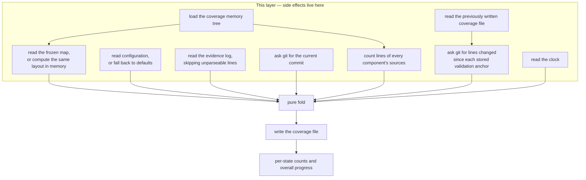

## Summary

This component is the impure shell around the comprehension model. It reads the coverage memory tree, the frozen map, the configuration, the evidence log and the previously written coverage file, asks git for the current commit and for how many lines have changed since each component's validation anchor, measures how large each component is, calls the pure fold, and writes the result to the user's state directory. It also provides the tally that turns a coverage view into the per-state counts and overall progress figure shown by the status summary and the map viewer.

## What it does

Every design decision in this province pushes side effects outward, and this is where they land. That arrangement is only useful if the boundary is genuinely clean, so it is worth being precise about what crosses it: the fold receives a set of components to seed, a configuration, a list of evidence entries, the current commit identifier, a table of per-component churn, a table of per-component sizes, and a timestamp. Nothing else. Everything on that list is produced here by touching the outside world.

Two of those inputs are more interesting than the rest. Sizes are the denominator of loyalty, so they are always computed — for every component, on every recompute — by counting the lines of all of its declared source files as they exist now. Churn is the numerator, and it cannot be computed without knowing where to measure from, which is the crux of this component's most subtle behaviour.

The last thing a newcomer needs is a sense of when this runs. It is not continuous. Hooks append evidence and do nothing else; coverage is rebuilt only when some command is about to read it, which keeps the cost off the path that fires while somebody is typing. Between those points the coverage file is simply out of date, and that is by design.

## Related components

The fold this component wraps is [Pure Materialization of Coverage](../state-engine/); everything here exists to give that function honest inputs and a place to put its output. The evidence it reads is defined by [The Append-Only Evidence Log](../evidence-log/), and the tolerant line-by-line parsing here is the counterpart to the fast, unconditional appends made elsewhere. The directory it reads and writes, and the rule that maps a working directory to a per-user state folder, belong to [Per-User State Layout and Repository Identity](../../platform/state-directory/).

On the repository side it depends on [Loading the Coverage Memory Tree](../../memory/paper-loader/) to discover the components and their declared sources, on [File-to-Component Reverse Index](../../map/file-component-index/) for the mapping from a component to the set of files whose churn and size represent it, and on [Deterministic Layout and Incremental Placement](../../map/frozen-layout/) as its fallback when no frozen map has been written yet. The staleness story it participates in is also the subject of [Source Drift and Staleness Flagging](../../map/drift-detection/), and comparing the two is instructive: the churn measurement that actually produces staleness lives here, not there. Its callers are the commands catalogued in [The Command Surface](../../platform/cli-surface/).

Two of the recompute points described below are worth following to their own papers. [Session Start and Session End](../../capture/session-lifecycle-hooks/) is the tightest of them, because the opening hook has to produce a coverage summary before the assistant's first turn — that is the latency budget the git work here is really spending, and the reason churn is read from the previous answer rather than folded twice. [Serving the Map and Its JSON API](../../viewer/local-server/) is the other, and it is the only caller that decides for itself whether a rebuild is warranted, by comparing when the evidence log was last written against the coverage file it already has.

## How it works

Nothing here runs on a timer or a watch. The governing rule is simple to state: editor hooks never rebuild, and any command that needs a current view rebuilds first. So a rebuild happens when a session begins and the assistant asks for its starting context, when a graded result is recorded, when the pre-commit decision runs, when the status summary is printed, when quests are generated or completed, when someone explicitly asks for a rebuild, and when the local viewer is asked for coverage and notices that the evidence log has been written to more recently than the coverage file. The module's own header note lists a shorter set than the callers actually amount to, which is worth knowing if you go looking for them; the principle it states is nonetheless the right one. Between any two of these moments the coverage file is simply out of date in the ordinary sense of the words, and no part of the system pretends otherwise.

A recompute itself proceeds in a fixed order. It resolves the per-user state directory for the working directory, loads the coverage memory tree from the repository, obtains a map, reads configuration, reads evidence, and asks git for the short identifier of the current commit.

Each of those reads has a fallback. If no frozen map exists on disk, or it fails to parse, the same deterministic layout that the layout command would produce is computed in memory from the loaded tree — so a rebuild works before anyone has ever frozen a map. If no configuration file exists, a schema-defaulted configuration keyed on the current operating-system user is used, which is what lets a result be recorded before the initialisation command has been run. If the repository is not a git repository at all, the request for the current commit fails quietly and comes back as an empty identifier. That case deserves care, because the result is not quite "no anchor": a component that reaches the validated state during such a run is stamped with a blank identifier, which is a different thing from the explicit nothing that marks a component never validated. The practical effect is benign, since the churn step later skips any component whose anchor is blank, so no diff is ever attempted and no such component can be reported as drifted. But the record does read as previously validated, and anyone comparing anchors across runs should expect to see blanks rather than absences. If the evidence log is unreadable, it is treated as empty; if individual lines fail to parse, they are skipped and the rest of the log is used.

Sizes are computed by reading each declared source file and counting newline bytes — the same convention a line-counting utility uses, which means a final line with no trailing newline is not counted. Sizes are summed per component across all of its sources, and they are always supplied to the fold because loyalty cannot be interpreted without a denominator.

Churn is where the interesting dependency lives. To ask git how much a component has changed since it was validated, you need the component's validation anchor — but anchors are an output of the fold, not an input. The cycle is broken by reading the previously written coverage file and using the anchors recorded there. For each component in that file that carries an anchor, git is asked for the numeric diff statistics between that anchor and the current commit, restricted to the component's source files, and the added and deleted line counts are summed. Entries reported as binary are ignored rather than being counted as an unknown quantity, and any failure of the git invocation yields zero churn for that component. Components with no measurable churn are simply omitted from the table.

The consequences of that arrangement are worth stating explicitly, because they show up as observable behaviour. On a very first rebuild there is no previous coverage file, so the churn table is empty and nothing can be stale — staleness structurally requires at least two rebuilds. And because a fresh validation moves a component's anchor forward only in the run that records it, while that same run measured churn against the old anchor, a component that has just been re-validated after drifting can still be reported stale until the following rebuild measures zero churn from the new anchor. This is a genuine rough edge in the current implementation, not a modelled grace period.

It also matters that per-component staleness reaches the user through this path and not through the standalone drift command, whose name suggests otherwise. That command is a deliberate placeholder: it prints the commit the map was built from alongside the current one, and then says in as many words that per-component source churn is not implemented. Nothing about it is wired to loyalty. The churn measurement described here is the only one that does any work today, which is why a reader chasing staleness should start in this layer rather than in the command that appears to own the subject.

After the fold returns, the state directory is ensured to exist and the whole coverage document is written out as a single formatted file. The fold has already validated it against its schema, so nothing invalid reaches disk.

A second, smaller function tallies a coverage view against a map: it walks the map's nodes, counts how many fall into each of the four states — treating a node with no record as fog — and computes the importance-weighted progress figure. Doing the tally over map nodes rather than over coverage keys is what makes the totals stable: the denominator is the size of the mapped codebase, so progress does not jump when a new component first receives evidence.

## Design decisions

Concentrating the side effects here appears to be a direct consequence of wanting the comprehension model to be arguable. The module's own header describes itself as owning the impure edges while the actual fold stays pure, and the payoff is visible in how the scoring code is tested: with literal inputs and no repository. If git and the clock were read inside the fold, the same test would require constructing a repository with a specific history, and the reproducibility claim — that identical evidence yields an identical result — would become untestable rather than merely unverified.

Deriving churn from the previously persisted anchors is the pragmatic resolution of a real circular dependency, and the code comments flag it as such. The clean alternative is to fold twice — once to discover the anchors, then again with the churn those anchors imply — but that doubles the git work on a path that runs when a session starts, where the latency budget is tight. Reading the previous answer costs one file read and is correct in the steady state; its price is the one-rebuild lag described above. Reversing this decision in the other direction, by moving churn into the fold, would trade a small lag for the loss of purity, which the design clearly weighs as the more expensive of the two.

Failing soft everywhere is a hook-path decision. These functions can be invoked from the machinery that runs while somebody is working, and an uncaught exception there is not a missing statistic — it is a disrupted session. So every read is wrapped, and each fallback is chosen to be the least surprising: an empty log rather than an error, a computed layout rather than a refusal, an empty commit identifier rather than a crash outside a repository. The one place this is deliberately generous is evidence parsing, where a partially written final line is a realistic result of concurrent appends and losing that one signal is obviously better than making coverage unreadable.

Rewriting the coverage document wholesale rather than patching it follows from its status as a derived view. Because it has no authority of its own, there is nothing in it worth preserving across a rebuild, and patching would quietly reintroduce the incremental-update problem that the replay design exists to avoid.

## Where it sits

This component is the seam between a deterministic comprehension model and a messy world of repositories, clocks and partially written files. It gathers honest inputs, calls the fold, writes the answer, and refuses to fail loudly when the world is not cooperating. Understanding it means understanding why staleness needs two rebuilds, why sizes are always measured but churn often is not, and why the coverage file can always be deleted. Read [Pure Materialization of Coverage](../state-engine/) for what happens between its inputs and its output, [Per-User State Layout and Repository Identity](../../platform/state-directory/) for where the files it touches live, and [Source Drift and Staleness Flagging](../../map/drift-detection/) for the part of the staleness story that is still unfinished.
