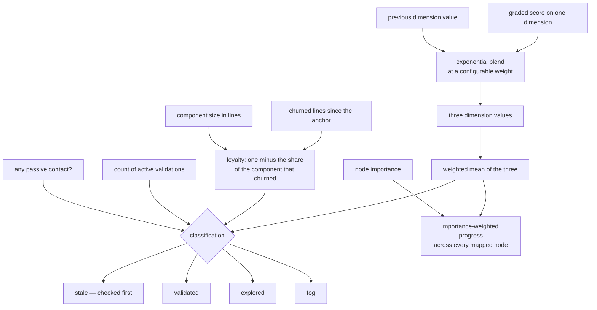

## Abstract

This component is the arithmetic of comprehension: how a graded result changes a dimension, how the three dimensions collapse into one comparable number, how code churn becomes a loyalty figure, how those inputs pick one of the four coverage states, and how per-component understanding aggregates into a single progress number across the whole map. It is a set of small pure functions with no dependencies on files, time, or randomness, and every constant it uses is exposed in one overridable object because those constants are research parameters, not facts.

## Introduction

Once you have raw evidence and a place to put the result, the interesting question is the mapping between them, and it is genuinely a design problem rather than a mechanical one. Consider what has to be true of a good mapping. Someone who answers a hard question well should visibly move. Someone who answers badly once, having previously demonstrated real understanding, should dip but not be reset to nothing. Someone who has been shown a component many times but never questioned about it should never reach the state that stops the system asking. And someone whose understanding was real but whose code has since been rewritten should be surfaced as needing another look, no matter how high their scores were.

Those four requirements are exactly what the functions here implement, and each one corresponds to a specific mechanism: exponential blending for movement with memory, a two-part bar for the validated state, capped passive credit enforced upstream, and a staleness branch that is checked before anything else.

Everything here is pure. Churn and component sizes arrive as arguments; nothing reads the repository, the clock, or the configuration file. That makes the model directly testable against hand-written inputs, which is the only practical way to have confidence that a scoring rule behaves as intended across the edge cases that matter.

## Related Work

The values this component produces are stored in the shape defined by [Coverage States and the Three Dimensions](../coverage-schema/), and the evidence that feeds it is defined by [The Append-Only Evidence Log](../evidence-log/). Its immediate caller is [Pure Materialization of Coverage](../state-engine/), which walks the evidence in order and applies these functions one entry at a time while keeping the accumulators the classification rules need. The real churn and size numbers those rules consume are gathered by [Impure Edges: Git Churn, Clock, and Disk](../coverage-materialization/), which is deliberately a separate layer so that this one can stay pure.

The thresholds have defaults here but are overridden in practice from [Conditions, Budgets, Thresholds, and Model Tiers](../../platform/config-schema/), which is where a study operator actually re-fits them. The importance weights used by the progress aggregate come from [The Frozen Map Document](../../map/map-schema/), so overall progress is a property of the map and the coverage together rather than of coverage alone. That aggregate is what a learner actually sees at the top of [Composition and the Unification Header](../../viewer/app-shell/), which renders it and nothing more, so any re-fitting of the weights here shows up immediately as a movement in the headline number. On the consumption side, [The Pure Pre-Commit Decision](../../interventions/commit-gate/) reuses the same weighted-mean helper to rank which touched component is worth asking about, which is why the ranking a developer experiences is consistent with the number they see on the map. Finally, [Source Drift and Staleness Flagging](../../map/drift-detection/) is the intended supplier of the churn figures behind loyalty, and is currently the least complete part of that story.

## Description

The blending rule takes a previous dimension value and a new graded score and returns a mix of the two, weighted by a single parameter. At the default weight the new score and the accumulated history count equally, so one strong result on a dimension that started at zero lands halfway between zero and that score, and a second identical result lands three quarters of the way there. Each further result closes half the remaining gap, so the value approaches the score it is being fed but never quite arrives. The consequence worth internalising is that reaching a high dimension value always takes several separate demonstrations — the arithmetic makes a single answer insufficient even before the separate count-based rule does. The same rule cuts the other way: a weak answer pulls the value down by the same proportion, so the model is not a ratchet.

The weighted mean collapses the three dimensions into one number for comparison. Weights are per-dimension and default to equal, meaning rationale counts exactly as much as structure. The function guards against a zero weight sum by returning zero rather than dividing, which is the sort of defensive branch that only matters if someone re-fits the weights carelessly.

Loyalty is one minus the ratio of churned lines to component size, clamped so it never goes below zero. The ratio form is deliberate: fifty changed lines is a rewrite of a small component and a footnote in a large one, so absolute churn would misrepresent both. One edge case is worth memorising because it is counterintuitive — a component whose size is reported as zero yields loyalty zero, that is, treated as completely churned. That is the safe direction to fail in, since a size of zero means the sources could not be measured, and the model would rather over-report a need for re-validation than silently under-report drift.

Classification takes an already-updated record plus three pieces of context: whether a passive signal just landed, how many active validations this component has accumulated, and any constant overrides. It checks in a fixed order. First, staleness: a component that was previously validated — recognised either by its current state or by carrying a validation anchor at all — whose loyalty has fallen below the staleness floor is stale, and no later branch can rescue it. Second, validation: the weighted mean must clear the validation bar and the accumulated active-validation count must reach its minimum, both together. Third, exploration: any passive contact just landed, or the record already reads explored or validated, or the weighted mean is anything above zero. Only a component that satisfies none of these is fog.

The exploration test is worth reading precisely, because it is easy to summarise as "anything that is not fog stays out of fog" and that is not what it says. It names the explored and validated labels specifically; a record already carrying the stale label is not among them. In practice a stale component almost always survives on the third clause anyway, since it has scores above zero, but the distinction matters if you are reasoning about the branch rather than about the typical case.

Two properties of that ordering deserve attention. Because the stale branch comes first and depends on loyalty, and because loyalty is only lowered by a separate drift pass rather than during the evidence walk, staleness in practice is decided after the fold rather than during it. And because the validated branch is re-evaluated on every entry, a component can leave the validated state without any drift at all: if a later poor result drags the weighted mean back under the bar, the next classification returns explored while the validation anchor stays where it was.

It is also worth knowing how much of this is actually adjustable, because the answer is less than the design implies. Of the five constants the model exposes, only two are overridden when classification is called: the validation bar and the staleness floor. The blending weight is tunable as well, but it is handed to the blending rule directly rather than through the classification overrides. The remaining two — the per-dimension weights and the minimum count of active validations — always fall back to the model's own defaults. The minimum count is the notable case, because it has no entry in the configuration anywhere in the system, so the requirement of more than one graded result is effectively hard-wired.

The active-validation count is not a field of the stored record. It is an accumulator owned by the caller and threaded through the fold. That is a design constraint with real consequences: because the count is not persisted, coverage cannot be correctly updated incrementally from a single new entry — the count would restart at zero and the component would silently fail the validation bar. Coverage has to be rebuilt from the whole log.

Finally, overall progress sums each mapped node's importance multiplied by its weighted mean dimensions, divided by total importance. Nodes with no coverage record contribute zero to the numerator but their full importance to the denominator. Progress is therefore a fraction of the entire mapped codebase, not a fraction of the parts the person has already met, which is what makes the number meaningful early on when most of the map is untouched.

## Rationale

The blending choice looks like a direct answer to two failure modes the code comments allude to when they describe the weight as controlling how fast and how visibly things move. Replacing the value outright would make the display jumpy and would let one hard question erase a genuine record. Averaging all history equally would mean that after a dozen checks nothing a learner does moves the needle, which for a system whose whole point is to make progress visible would be fatal. Exponential blending is the standard compromise, and exposing its weight as a tunable acknowledges that the right decay rate is an empirical question.

Requiring both a score bar and a count of separate validations appears to be motivated by what the validated state does rather than what it means. Validated is the state that stops the pre-commit gate from interrupting. If one high-scoring answer could reach it, the cheapest path through the system would be to answer one easy question well and never be asked again — which would defeat the intervention entirely. Requiring several separate occasions also spreads validation across time, so it is harder to satisfy by momentary recall. Removing either half would break it in a different direction: score alone rewards luck, count alone rewards attendance.

Checking staleness first is a statement about which failure is worse. The alternative orderings all lead to a validated-looking component that no longer matches its code, and the whole point of anchoring papers to a commit is to make that situation visible. The code's own framing — a previously validated component whose code drifted away — treats drift as invalidating rather than as merely discounting. The rejected alternative of lowering scores on drift would be worse than it sounds: it would destroy the record of understanding the person genuinely demonstrated, so a later re-validation would have to start from nothing.

Collecting the constants into one overridable object is a small structural decision whose stated purpose is that they can be re-fit or overridden per configuration without touching call sites. Its practical value shows up in the way the caller passes only the two thresholds it actually takes from configuration and lets the rest fall back to defaults — a partial override, not a full replacement, which keeps the configuration file from having to enumerate every parameter. The honest cost of that convenience is visible in the minimum-validation-count constant: because a partial override is always accepted, nobody is forced to notice that this particular number was never wired to configuration at all, and it silently stays at its default in every deployment.

## Conclusion

This component is where the system's opinions about learning are written down as arithmetic: memory with decay, a deliberately hard bar for claiming understanding, drift that outranks confidence, and a progress figure measured against the whole map rather than the part already visited. It knows nothing about files, git, or time — those arrive as arguments. Read [Pure Materialization of Coverage](../state-engine/) to see these functions applied in order over a real history, [Impure Edges: Git Churn, Clock, and Disk](../coverage-materialization/) to see where the churn and size numbers actually come from, and [Coverage States and the Three Dimensions](../coverage-schema/) for the record these values land in.
