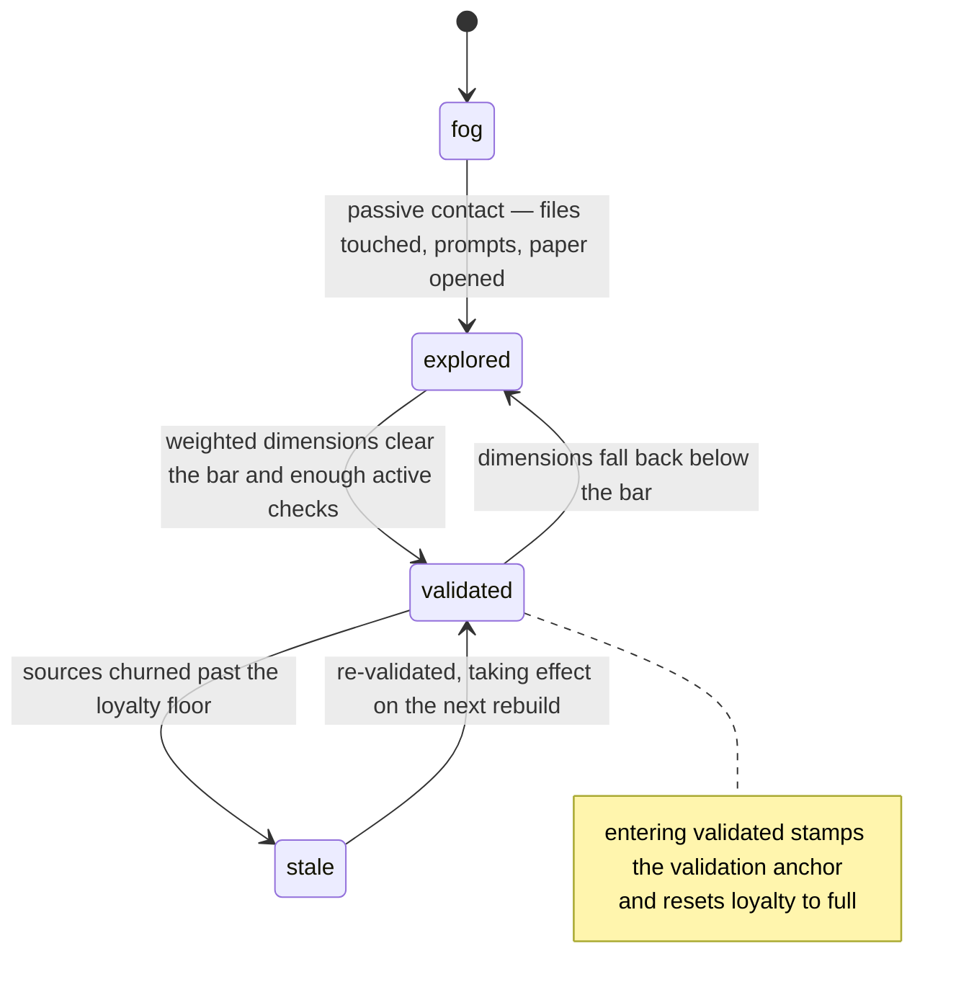

## Abstract

This component defines the shape of what SCALE knows about one person's understanding of one component: three bounded comprehension dimensions, a coarse state label, an anchor to the commit at which understanding was last confirmed, and a loyalty number describing how far the code has moved since. Every other part of the system — the commit gate, the map viewer, quest generation, the status summary — reads this shape and nothing more. It is deliberately tiny, because it is the one structure that must survive every future change to how scores are computed.

## Introduction

A learning system needs somewhere to put the answer to "how well does this person understand this part of the codebase?" The naive answer is a percentage. That collapses too much: a junior who can navigate a module's files but cannot say why it was built that way has real, partial understanding, and a system that reports one number cannot tell those two situations apart, cannot choose a question that targets the gap, and cannot show the learner what is actually missing.

SCALE therefore splits comprehension into three dimensions. Structure is knowing the shape — which files, which pieces, what calls what. Concepts is knowing the ideas the component trades in. Rationale is knowing why the design is the way it is, including what was rejected. Each is a number between zero and one, and the schema enforces those bounds so no downstream arithmetic can quietly produce a value nobody can interpret.

On top of the three numbers sits a coarse state, because most consumers do not want to reason about thresholds. A map wants to know whether to draw a node dark or lit. A pre-commit decision wants to know whether this is unfamiliar ground. Four states cover it: fog for never encountered, explored for passive contact only, validated for demonstrated understanding, and stale for previously validated understanding whose code has since moved.

## Related Work

The raw signals that eventually become these numbers are defined by [The Append-Only Evidence Log](../evidence-log/), which is the input side of the same story this component is the output side of. The arithmetic that turns those signals into dimension values, and the rules that pick one of the four states, live in [Scoring: Exponential Averaging, Loyalty, Classification](../coverage-model/). The fold that walks the whole evidence history and produces a record of exactly this shape is [Pure Materialization of Coverage](../state-engine/), and the layer that supplies it with real churn numbers and writes the result to disk is [Impure Edges: Git Churn, Clock, and Disk](../coverage-materialization/).

Most of the thresholds that decide where one state ends and the next begins are tunable and come from [Conditions, Budgets, Thresholds, and Model Tiers](../../platform/config-schema/) — the validation bar, the staleness floor, the blending weight, and the two passive credit ceilings. Not all of them are: the minimum number of separate graded results required for validation has no entry in the configuration and is fixed at the scoring model's own default, so it can only be changed by editing the model. Either way this schema stores results, never policy. The identifiers this record is keyed on are not invented here either: they are the permanent identities fixed by [Paper Format and Frontmatter Contract](../../memory/paper-format/), which is why renaming one orphans a person's accumulated history rather than carrying it across. The most demanding consumer is [The Pure Pre-Commit Decision](../../interventions/commit-gate/), which reads states and dimensions to decide whether to interrupt a commit — a good illustration of why the coarse label is worth storing. [Selection, Generation, and Offline Fallback](../../quests/quest-generation/) is the other major reader, choosing which components deserve a check after a session by looking at exactly these states and dimensions and nothing else. Finally, [The Single Skin Boundary](../../viewer/terminology-skin/) is the only place where these four neutral state names are translated into the strategy-game vocabulary the map viewer displays; everything upstream of that boundary, including this schema, stays neutral.

## Description

A single component's record holds four things. The dimensions object carries the three comprehension numbers, each validated on parse to lie within zero and one. The state field carries one of the four labels. The validation anchor carries the short commit identifier at which this component was last confirmed understood, and when it never has been, the field is present and explicitly holds nothing rather than being left out. That explicit nothing is meaningful, not merely absent, and downstream code branches on it to decide whether a component is even eligible to go stale. It is worth distinguishing it from a blank identifier, which is a different thing entirely: a blank arises when a validation is recorded outside a git repository, and it counts as previously validated for classification purposes even though no diff can ever be measured from it. Loyalty carries a number, also bounded to zero and one, that is one minus the proportion of the component's source lines that have churned since the anchor.

The single most common misreading of this record is to treat loyalty as a comprehension score. It is not. All three dimensions can sit at their maximum while loyalty falls to zero — that is precisely the situation the stale state exists to describe. The person understood the component perfectly; the component then changed underneath them. Loyalty is a statement about the code's movement, and it is only interpretable relative to the anchor, which is why the two fields must always be read together.

The state label is derived, not authored. Nothing in the system is supposed to set a state directly; the classification rules own it, and the field on disk is a cached answer. This matters because the derivation is not monotonic in the way people expect. A component that has been validated and whose dimensions later drift downward — because a subsequent check went badly and the blending arithmetic pulled a dimension down — falls back to explored while keeping its validation anchor. So a non-empty anchor with a non-validated state is a normal, expected combination, not corruption.

Above the per-component record sits the per-user document: a user label, a last-updated timestamp, and a map from component identifier to record. The keys are the stable identifiers declared at the top of each paper, which is why those identifiers are described everywhere as permanent. Renaming a component's identifier does not migrate its coverage; it orphans it, because this map is keyed on exactly that string and has no other way to recognise the component.

The document is per-user and lives in the user's own state directory rather than in the repository. It is not committed, it is not shared, and there is one such document per repository per user. That placement is what makes the whole model honest: the coverage memory in the repository describes the code, and this document describes one person's relationship to it.

A fixture in the repository shows the shape concretely. It holds two components: one validated, carrying a real anchor and a loyalty value just under full; and one explored, with no anchor at all, full loyalty, a moderate amount of structure credit, a little concepts credit, and no rationale credit whatsoever. That second record is the typical silhouette of passive contact — movement on structure, a trace on concepts, nothing on the dimension that only grading can move. It is worth knowing that this fixture is a hand-written illustration of the schema, not the computed result of folding the evidence fixture that sits beside it; folding that evidence would leave the weighted mean far below the validation bar and would only ever count one graded result, so nothing in it could reach the validated state. The two fixtures exercise their schemas independently.

## Rationale

The three-dimension split is the load-bearing decision, and the code suggests it was made for the sake of the interventions rather than for reporting. Every active check in the system tags its result with exactly one dimension, and the grading rubric produces per-dimension scores; if comprehension were a single number, a check could report only that the learner did badly, and the next check would have no basis for asking about rationale rather than structure. Reversing this decision would not just coarsen the display — it would remove the signal that lets question selection be targeted at all.

Storing the derived state is a deliberate denormalisation. This appears to be because the state is read far more often than it is written, and by consumers in other packages — the map viewer reads it without access to the scoring code, and the pre-commit decision reads it on a latency-sensitive path. The cost is the usual cost of a cache: if some code path wrote dimensions without re-running classification, the stored label would lie. The system avoids that by only ever producing whole records through the materialization fold, never by patching fields in place.

Keeping loyalty and the validation anchor in the per-user record rather than in the shared map is what makes staleness personal. The code comments frame staleness as re-validation pressure, and pressure only makes sense relative to a specific person's last confirmation. If staleness were computed once per repository against the build commit, everyone would go stale simultaneously whenever the code moved, including someone who had just finished a check — which would turn the signal into noise and, by the system's own budget logic, into unwanted interruptions.

Bounding every number in the schema itself, rather than trusting the callers, is a smaller decision with a real payoff. The fold already clamps each dimension as it writes it, and the loyalty formula already limits its own ratio, but neither guard covers a file that arrives from somewhere else. The schema is the backstop, so a hand-edited or hand-seeded coverage file cannot introduce a value that pushes the weighted mean past one and silently validates everything. It is also the last check before a rebuilt view is returned, which turns an arithmetic bug into a loud failure rather than a plausible-looking number on disk.

## Conclusion

This component is a vocabulary, not a mechanism. It fixes what can be said about a person's understanding of a component — three dimensions, one of four states, a point in history where understanding was confirmed, and a measure of how far the code has since travelled from that point — and it deliberately says nothing about how those values are arrived at. Read [The Append-Only Evidence Log](../evidence-log/) next to see what flows in, and [Scoring: Exponential Averaging, Loyalty, Classification](../coverage-model/) to see the rules that turn that flow into these fields. If you want to see the whole pipeline in one place, [Pure Materialization of Coverage](../state-engine/) is where the two meet.
