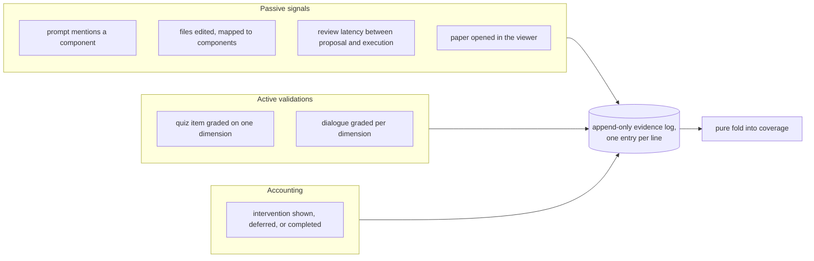

## Summary

The evidence log is the system's only durable record of what actually happened: every prompt that mentioned a component, every file edit mapped back to a component, every graded check, every intervention shown or skipped. Entries are appended and never modified, and they are stored in the shape they were observed in rather than as scores, so the comprehension model can be changed later and re-run over the whole history. This component defines the entry kinds and the guarantees each one makes.

## What it does

Two forces shape this design. The first is that the capture path runs inside a developer's editing session, on hooks that fire while they work, and must add no perceptible latency — so whatever happens at capture time has to be trivially cheap. The second is that the way raw signals should be converted into comprehension scores is not settled; it is precisely the thing the prototype exists to study. Those two forces point at the same answer: capture the observation, not the conclusion.

So the log is append-only and raw. A file edit is stored as which files were edited and which components they mapped to, not as an increment to a structure score. A quiz answer is stored as a component, a dimension, and a grade, not as a new dimension value. The comprehension numbers are then a derived view that can be thrown away and rebuilt at any time. If the blending weight changes, or the passive-signal caps move, or somebody decides review latency should count after all, no history is lost — the fold simply runs again over the same lines and produces different numbers.

A newcomer should hold onto one distinction before reading further: passive signals versus active validations. Passive signals record contact with a component. Active validations record that someone demonstrated understanding of it under grading. The system's central rule is that contact alone can never amount to demonstrated understanding, and the split between these entry kinds is where that rule becomes enforceable.

## Related components

The entries defined here are written by the fast-append path described in [The Fast-Append Path](../../capture/evidence-append/), which validates one line and appends it — that is the whole hot path. The passive kinds in particular are produced by [Capturing Touches, Prompts, and Review Latency](../../capture/edit-and-prompt-hooks/), and the mapping from an edited file to the component identifiers stored on a touch entry is done by [File-to-Component Reverse Index](../../map/file-component-index/). The active kinds are produced by [Recording a Validation Outcome](../../interventions/validation-recording/), which is also the place the recorded commit identifier and the origin marker are stamped. The graded content of those active entries comes from [Quiz and Socratic Protocols](../../interventions/tutor-skill/), whose two check formats correspond one for one to the two active kinds defined here, and whose governing discipline — grade and report, never compute — is exactly what keeps derived numbers out of this file. The same active entries are also written by [The Shared Completion Path](../../quests/quest-completion/), which appends the graded results here first and only afterwards rebuilds the derived view. That every writer is a short-lived editor process that swallows its own failures is a property of [Hook Wiring and the Fail-Open Rule](../../capture/plugin-hooks/), and it is the direct reason this log's readers tolerate a truncated final line instead of treating it as corruption.

On the reading side, [Pure Materialization of Coverage](../state-engine/) is the only consumer that interprets these entries, folding them in timestamp order into records of the shape defined by [Coverage States and the Three Dimensions](../coverage-schema/). The intervention accounting entries are read back by [The Pure Pre-Commit Decision](../../interventions/commit-gate/) as evidence that a component was recently addressed, which is how the "skip counts as handled" behaviour is realised without a separate queue.

## How it works

The log is a file of independent lines, one entry per line, written by appending and never by rewriting. Nothing in the system opens it to revise an earlier line, and no entry ever holds a score the model computed — only the observation as it was seen. That is what makes the whole file replayable: the numbers a reader eventually sees are produced fresh from these lines every time, so a different rule applied to the same file yields a different answer without any line changing.

Every entry, regardless of kind, carries a timestamp and a user label. The timestamp is the sort key for the fold and is expected to be a full date-and-time string, which sorts correctly as text — a small but load-bearing property, because the fold sorts lexically rather than parsing dates.

Beyond those two shared fields, an entry's shape is decided entirely by a single tag naming its kind. The tag is not a hint; it selects which of several alternative shapes the rest of the line must satisfy, and the parser is built as a choice among those shapes keyed on it. A line whose tag says it is a graded quiz result is required to carry a component, a dimension, and a score, and fails to parse without them; a line whose tag says it is a file touch is required to carry a list of files and a list of component identifiers, and has no score field for a reader to be confused by. The same tag drives the reading side, where the fold branches over the full set of kinds and has a defined answer for each one rather than inspecting fields to guess what it is looking at.

Seven kinds exist. A prompt entry records that a prompt the developer typed mentioned one or more components, matched by keyword or slug, and optionally keeps the prompt text. A touch entry records a set of edited files together with the component identifiers those files resolved to. A review-latency entry records one file and the number of milliseconds between an edit being proposed and being executed. A paper-read entry records that a component's paper was opened in the viewer. A quiz-result entry records one component, exactly one dimension, and a grade between zero and one. A dialogue-result entry records one component and a partial map from dimension to grade, since a Socratic exchange may touch two dimensions and leave the third ungraded. An intervention entry records that a check was shown, deferred, or completed for a component, under a stated timing and modality.

That last kind carries no grades at all. It is bookkeeping: it is how the system knows an interruption happened, and it is the mechanism behind the rule that deferring a check drops it rather than queueing it. The deferral is written into the log as an intervention outcome, the gate sees the component as recently addressed, the retried commit passes, and nothing is ever enqueued anywhere. The evidence log is the only trace that the moment occurred.

The two active kinds carry two extra fields that the passive kinds do not. The first is the commit identifier as of the moment the result was recorded. This exists because the coverage view is rebuilt from scratch on every recompute: if the validation anchor were taken from whatever commit happens to be current during a rebuild, it would slide forward every time, the measured churn since validation would always be zero, and nothing could ever be detected as stale. Pinning the commit at record time makes the anchor re-derive to the same past point on every future rebuild. The second extra field is the origin, distinguishing a system-initiated check from one the user started themselves. The comment on this field is explicit that it is accounting metadata and that the scoring model treats both identically.

Both extra fields are declared optional, and so is the prompt text. The stated reason is backward compatibility: lines written before a field existed must still parse. This has a practical consequence worth internalising — the fold has to cope with an active entry that carries no commit identifier, and it does so by falling back to the current commit for that entry alone. The fixture log in the repository is exactly such a case: it contains a graded quiz result with no commit identifier, alongside a prompt, a touch, and a completed-intervention entry, and it is the canonical example of what an older log looks like to a current parser.

The reader that consumes this log in practice is forgiving in one more way that belongs to this component's contract: a line that fails to parse is skipped rather than treated as fatal. Because the file is appended to concurrently from short-lived hook processes, a truncated final line is a realistic outcome, and losing one signal is strictly better than making the whole coverage view unreadable.

## Design decisions

Keeping the log raw and append-only is the decision everything else follows from. The code comments describe the log as being kept raw "so the coverage model can be re-fit later without data loss", which is an unusually direct statement of intent. The alternative — updating scores at capture time — would be cheaper to read but irreversible, and it would put arithmetic and file rewriting on a path that fires during editing. Reversing this decision would not merely slow the hooks; it would destroy the ability to answer the research question, because there would be no way to compare what a different scoring model would have concluded from the same session.

The tagged-union shape appears to be chosen so that both the parser and the fold can be exhaustive. Because each kind declares its own required fields, a graded result cannot exist without a grade, and the fold's dispatch over kinds is total — there is no branch where the code has to guess whether an optional field is meaningful. A single wide record with everything optional would parse more inputs, which sounds tolerant but in practice means malformed evidence would survive parsing and fail later, further from the cause.

The recorded-commit decision is the subtlest one and the comments spell out the failure it prevents. If the anchor drifted forward on each rebuild, staleness would be structurally unreachable: the churn measured since validation would always be measured since now. That would silently disable one of the four coverage states. Making the field optional rather than required is the pragmatic half of the same decision — it trades a small amount of accuracy on old lines for the guarantee that adding a field never breaks an existing log.

Recording origin without letting it affect scoring reflects the project's stated position that self-directed learning is a first-class path, not a lesser one. Weighting it differently would make the autonomy route worth less than being interrupted, which would undercut the argument the prototype is trying to make; dropping the field entirely would make the two paths indistinguishable in analysis. Recording it and ignoring it is the only option that keeps both properties.

## Where it sits

The evidence log is the system's ground truth, and everything a reader sees on the map is a re-derivable opinion about it. Its discipline is narrow and strict: append raw observations, never rewrite, keep every new field optional, and pin active validations to the moment they happened. Read [Pure Materialization of Coverage](../state-engine/) next to see how these lines become numbers, [Coverage States and the Three Dimensions](../coverage-schema/) for the shape they become, and [The Fast-Append Path](../../capture/evidence-append/) for the other end — the few milliseconds in which a line gets written.
