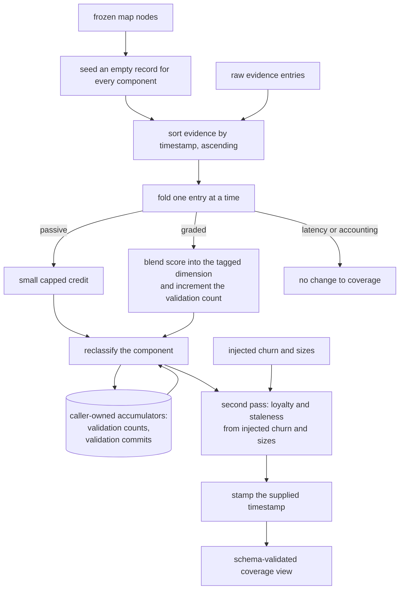

## Abstract

This component is the fold that turns a history of raw signals into a coverage view: it seeds an empty record for every component on the map, walks the evidence in timestamp order applying the scoring rules, then applies a separate drift pass that sets loyalty and flips drifted components to stale. It is entirely pure — no repository access, no filesystem, no clock — so the same evidence and the same injected inputs always produce exactly the same result. That determinism is what makes the whole comprehension model testable and what makes a rebuild safe to run at any time.

## Introduction

The design that makes the capture path fast — append raw signals and compute nothing — pushes all the work here. Nothing in the system ever writes a comprehension number directly; the numbers exist only as the output of this fold. That is a strong claim, and it has an important consequence for anyone reading the coverage file: it is a cache, and deleting it loses nothing that the evidence log cannot reproduce.

The reason this component is separated from the code that reads the repository is discipline rather than layering for its own sake. Comprehension scoring is a research artefact whose correctness has to be argued, and an argument about a function that reads git and the wall clock is much weaker than an argument about a function whose every input is visible in its arguments. So the impure work — asking git how many lines changed, measuring how big a component is, asking what time it is — happens in a caller, and arrives here as plain data.

The third thing to understand before the details is that this fold is not a state machine advancing through time so much as a replay. It always starts from nothing. Every rebuild re-derives the same past from the same lines, which is why the anchoring rules about commits matter so much: any input that depends on "now" would make yesterday's history look different today.

## Related Work

The entries this fold consumes are defined by [The Append-Only Evidence Log](../evidence-log/), and the record it produces is defined by [Coverage States and the Three Dimensions](../coverage-schema/). Every piece of arithmetic it applies — the blending rule, the weighted mean, the loyalty formula, and the classification order — lives in [Scoring: Exponential Averaging, Loyalty, Classification](../coverage-model/); this component supplies the ordering, the accumulators, and the seeding, not the formulas. Its only real caller is [Impure Edges: Git Churn, Clock, and Disk](../coverage-materialization/), which gathers churn, sizes, the current commit and the timestamp, calls this fold, and writes the result to disk.

Two external components complete the picture. The set of components that get seeded comes from [The Frozen Map Document](../../map/map-schema/), which is why a component that exists as a paper but has not been laid out never appears in coverage at all. The thresholds that shift where the caps and bars sit come from [Conditions, Budgets, Thresholds, and Model Tiers](../../platform/config-schema/), passed in as part of the configuration rather than read here.

[The Shared Completion Path](../../quests/quest-completion/) is the clearest illustration of the whole-history rule in ordinary use: having graded a set of answers it appends them as new evidence and then re-derives the entire coverage view rather than adjusting the affected component in place, which is precisely the discipline the caller-owned validation count forces on everyone.

## Description

Materialization runs in five steps. It first seeds an empty record — fog, all three dimensions at zero, no validation anchor, full loyalty — for every node on the frozen map. This is why the map, not the evidence, determines the universe of components: a component with evidence but no map node would have nowhere to be recorded, and a component with a node but no evidence still appears, correctly, as fog.

It then sorts the evidence ascending by timestamp using a plain text comparison, which is correct for the timestamp format in use, and stable, so entries recorded within the same instant keep the order they were written. Sorting matters because the blending rule is order-dependent: the same two scores applied in opposite orders give different answers.

The walk applies one entry at a time, producing a new view each time rather than mutating in place. Review-latency entries and intervention-accounting entries return immediately with no change — the first because latency is deliberately unmodelled in this version, the second because it is bookkeeping. For the remaining kinds, the component identifiers named by the entry are resolved and each one is updated.

A touch or prompt entry raises the structure dimension by a small credit toward the passive cap. A paper-read entry raises all three dimensions by a small credit toward a separate, slightly higher cap. It is worth noticing which half of that is adjustable: the caps are configuration, re-fittable by a study operator, but the credit amounts themselves are fixed constants inside this module and are not exposed anywhere. So an operator can change how far passive contact is ultimately allowed to reach, but not how many touches it takes to get there. Both entry kinds use the same helper, whose two properties are worth stating exactly: it never raises a value past the cap, and it never lowers a value that is already above the cap. So a component whose concepts dimension reached a high value through graded checks is not dragged back down by someone opening its paper. A graded quiz entry blends its score into the single tagged dimension and increments that component's validation count. A dialogue entry does the same for each dimension it scored, skipping unscored ones, and also counts as one validation rather than one per dimension.

After the dimensions change, the component is reclassified using the accumulated validation count and exactly two thresholds taken from configuration — the validation bar and the staleness floor. Everything else the classification needs, including the minimum number of graded results and the relative weights of the three dimensions, falls back to the scoring model's own defaults, because the fold does not pass them. If and only if the result is validated does the fold touch the validation anchor, setting it to the most recent validation commit recorded for that component; and only on the transition into validated, meaning the component was not already validated a moment ago, does it reset loyalty to full.

Two accumulators are threaded through the whole walk by the caller: the per-component count of active validations, and the per-component commit of the most recent active validation. Neither has a home in the stored record. The count is the reason coverage cannot be updated incrementally — a fold over a single new entry would see a count of one and could not validate anything that legitimately deserved it. The commit accumulator prefers the entry's own recorded commit and falls back to the run's current commit only for older entries that predate that field.

The drift pass runs last, over every component that carries a validation anchor. Components that were never validated are skipped entirely and keep full loyalty. For the rest, loyalty is computed from injected churn and size, with two guards: zero churn means full loyalty regardless of size, and nonzero churn with an unknown size means zero loyalty. A component that is currently validated and whose loyalty falls below the staleness threshold flips to stale.

Finally the supplied timestamp is stamped in — the function never reads the clock — and the whole view is validated against its schema before being returned, so a bug in the arithmetic that produced an out-of-range dimension fails loudly here rather than being written to disk.

There is one behaviour that surprises people and is worth stating plainly. Because loyalty starts at full for every seeded component and is only ever lowered by the drift pass, the staleness branch inside classification effectively never fires during the evidence walk. Staleness is decided entirely by the second pass. Combined with the fact that the caller derives churn from the previously written coverage file, this means recovering from stale takes two rebuilds: the first re-validates and moves the anchor forward but is still measured against the old churn figure, and only the next rebuild measures zero churn and reports the component as validated again.

## Rationale

Purity here is not stylistic. The header comment states the goal directly — the same evidence and options always fold to an identical result — and the practical payoff is that the entire comprehension model can be tested with hand-written inputs and no repository at all. Reversing this would make results depend on when they were computed, and a learner would see their own scores change for reasons unrelated to anything they did.

Full re-materialization instead of incremental patching follows from a structural fact rather than a preference: the validation count that gates the validated state is a caller-owned accumulator with no field in the persisted record. The code comments call this out explicitly. The alternative — adding counters to the stored record and patching it as entries arrive — would make the stored file the authoritative source, and the moment that happens the raw evidence stops being re-fittable, which is the property the whole capture design exists to protect.

Capping passive credit is the arithmetic form of the project's central rule that passive contact explores but never validates. With the default cap and equal dimension weights, a component that is only ever edited cannot get its weighted mean anywhere near the validation bar, no matter how many times it is touched — and even if it could, the separate count requirement would still block it. Two independent mechanisms enforce the same rule, which appears deliberate given how much of the system's credibility rests on it. Removing the cap would mean an actively developed file would validate itself through editing alone, and the map would report understanding that nobody ever demonstrated.

Handling drift as a second pass rather than inside the walk reflects what churn actually is: a comparison between two commits, not an event that happened at a point in the history. There is no entry in the log at which it would be correct to apply it, and applying it on every entry would repeat the same figure meaninglessly. The cost of the separation is the one-rebuild lag described above — a real and currently unmitigated wrinkle, not an intended feature.

## Conclusion

This is the component where the system's raw record becomes its opinion: seed from the map, replay the history in order, apply the drift comparison once at the end, and validate before returning. Understanding it means understanding why the coverage file can be deleted without loss, why coverage must always be rebuilt whole, and why passive editing alone can never move a component into the validated state. Read [Scoring: Exponential Averaging, Loyalty, Classification](../coverage-model/) for the formulas this fold applies, [Impure Edges: Git Churn, Clock, and Disk](../coverage-materialization/) for where its injected inputs come from, and [The Append-Only Evidence Log](../evidence-log/) for the history it replays.
