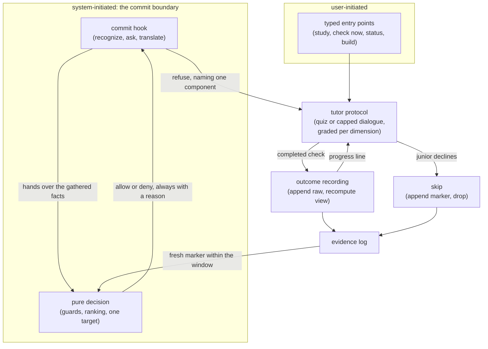

## Abstract

This province is the in-flow arm of the system: the part that acts on a junior while
they are working, rather than after. It contains one deterministic decision about
whether to interrupt a commit, the machinery that gathers that decision's inputs and
enforces its verdict, the conversational protocol that runs the resulting
comprehension check, the single write that turns a grade into comprehension state,
and the typed entry points through which a junior can start the same protocols on
purpose. Its organizing constraint is that interrupting someone is expensive, so the
decision to do it is small, pure, budgeted, and always escapable.

## Introduction

Everything else in the system observes. The memory province writes down what the
codebase is; the capture province records what the junior did; the comprehension
province turns those records into a picture of what they understand; the map and
viewer provinces display it. None of that changes anyone's behaviour on its own.

This province is where the system finally does something to the junior — and it is the
only province with the power to stop their work. That power is why its components are
shaped the way they are. The policy that authorizes an interruption is a pure function
with no ability to read or write anything, so its promises can be proved rather than
observed. The machinery around it fails toward permitting on every ambiguity, because a
learning tool that blocks commits when it is broken will be uninstalled. The check
itself is capped in length and grounded in the code the junior just wrote. And a junior
who does not want to do it can always say so, once, finally, with no queue and no
follow-up.

The same conversational protocol also serves a completely different purpose here: when a
junior asks to learn something, they enter it themselves, with no budget and a reading
guide first. That the imposed path and the chosen path share one protocol but differ in
their framing is the most important idea in this province.

## Related Work

The province's five components divide as follows. [The Pure Pre-Commit
Decision](./commit-gate/) is the policy itself — an ordered set of guards and a ranking
rule, with no side effects at all. [Deny, Retry, and Defer-as-Drop](./gate-enforcement/)
is the body around it: the hook that notices a commit, the command that assembles the
facts and charges the budget, the refusal the agent obeys, and the skip that releases a
blocked commit. [Quiz and Socratic Protocols](./tutor-skill/) is the conversation the
refusal asks for and the reading guide a voluntary junior gets, together with the grading
rubric for the three dimensions. [Recording a Validation Outcome](./validation-recording/)
is the single write that converts a grade into comprehension state and, as a side effect,
produces the marker that lets the retried commit through. [User-Initiated Entry
Points](./slash-commands/) is the set of typed doors into these protocols, which supply
the framing that distinguishes chosen learning from imposed learning.

Outside the province, three neighbours matter most. Everything this province writes lands
in [The Append-Only Evidence Log](../comprehension/evidence-log/), which is also where the
gate reads its markers from — the log is simultaneously the record of what happened and
the coordination channel between a refusal and its retry. The commit hook is one entry in
the wiring described by [Hook Wiring and the Fail-Open Rule](../capture/plugin-hooks/),
whose fail-open discipline this province inherits wholesale. Every constant the policy
consults — the active condition, the enabled triggers, the session cap, the cooldown, the
changed-line floor, the validation bar — comes from
[Conditions, Budgets, Thresholds, and Model Tiers](../platform/config-schema/), which is
also what switches this whole province off under a post-session condition. The
counterpart that takes over when it does is
[Selection, Generation, and Offline Fallback](../quests/quest-generation/), the
post-session arm, and the contrast between the two is the study's central comparison.

## Description

The province is responsible for four things: deciding whether to interrupt, enforcing
that decision, conducting the check, and writing down its result. The components split
along seams chosen so that each of those responsibilities can be reasoned about
independently.

Deciding is isolated to the smallest possible surface. Given a set of touched components,
the junior's coverage, the configuration, the session's budget accounting, the size of the
staged change, a set of recently addressed components, and the current time, one function
returns either a permission with a stated reason or a refusal naming exactly one component.
It performs no reads and no writes. This is what makes the interruption budget a provable
property: at most one interruption per commit, at most a configured number per session, none
inside the cooldown window, none on a trivial change, and none at all under a post-session
condition or when the commit trigger is disabled.

Enforcing is where all the input and output lives. A hook on shell commands recognizes a
commit with a cheap pattern test, invokes the decision command, and translates the verdict
into a structured permission refusal carrying the reason text. The command does the
gathering: staged files mapped to components, the changed-line count, coverage
re-materialized from the log, importance weights from the frozen map, the session record,
and a scan of the log for markers inside a short freshness window. On a refusal it records
that an intervention was shown and charges the budget; on a permission it clears the
outstanding pending marker, but only once the component that marker names has actually
been addressed. Every failure — missing tool, timeout, unparseable output, absent field —
resolves to permitting the commit.

Conducting is the only non-deterministic part of this province, and it is governed by written
protocol rather than by code. A check is either one or two multiple-choice items, each
tagged with a single coverage dimension, or a dialogue of at most three exchanges; both are
grounded in the component's recorded concepts and rationale and in the diff the junior just
wrote; both are graded against an explicit three-band rubric per dimension; neither may
reveal its answer before a genuine attempt. The protocol grades but never computes: it
submits an outcome and lets the scoring model own the arithmetic.

Writing down is one command with two accepted shapes. It stamps the current repository
revision onto the outcome so the validation stays anchored to the code it was earned
against, appends the raw entry to the log, recomputes coverage from the whole log, and
prints how far the component now sits from the validation bar. Nothing is mutated in place,
so the scoring model can be re-fit later over data that was never lost.

The escape hatch cuts across all four. A junior who declines has a marker appended for the
component and nothing else happens: no queue, no reminder, no follow-up. The refusal, the
completed check, and the skip all converge on the same short-lived marker, which is why the
policy needs only one test to handle three situations, and why a single commit can be
interrupted at most once without anyone counting.

The entry points sit alongside all of this and supply framing. Entered voluntarily, the same
tutor protocol applies no budget, teaches before it checks, and records under a different
origin. Entered from a refused commit, it is terse, budgeted, and obliged to leave the junior
with a way to proceed.

Two honest limits belong in this overview. First, nothing in this province fires on a
schedule: a check happens when a commit is refused or when someone asks for one, and the
configured modality only says which shape a check takes when one occurs. Second, the
configuration carries a per-commit budget number that the decision never reads — the
per-commit cap is produced by the marker mechanic instead, so tuning that number has no
effect.

## Rationale

The seam that defines this province is between observing and acting. Every component here
either decides to act, acts, or records the result of having acted; nothing here interprets
signals or renders state. That boundary is worth defending because acting is the only thing
in the system that can harm the user, and concentrating it makes the harm auditable. If the
gate's policy were spread across the hook, the tutor, and the recording command — each of
which could plausibly host a piece of it — then no one could state what the interruption
budget actually is, let alone test it.

Within the province, the finer seam is between the decision and everything else. The code
draws it explicitly and at some cost: the decision could trivially read the clock and the
staged diff itself, and the caller would shrink by half. The reason it does not appears to be
that a promise about interruption frequency is a promise to a person, and promises that can
only be checked by watching the system in the wild are not really checkable at all. Isolating
the policy makes the guarantee a unit test. The cost is a longer, uglier caller, which is
exactly the trade this province takes everywhere: complexity is pushed into the parts that
touch the world so the parts that decide stay clean.

The third grouping decision is that the conversational protocol lives here rather than with
the memory it draws on. The protocol reads papers and quotes their rationale, which might
argue for placing it in the memory province. It sits here instead because what it is, is an
intervention: it consumes a person's attention under a budget, produces evidence, and hands
back to a gate. Grouping it with the gate keeps the caps, the escape hatch, and the recording
obligation in one place — and those obligations, not the reading, are the parts that break if
someone changes them carelessly.

Finally, the province deliberately contains both the imposed path and the chosen path, even
though the study treats only the imposed one as the manipulated variable. The code suggests
this was intentional: the same protocol serves both, and the only differences are the budget,
the reading guide, and a recorded origin marker. Splitting them into separate provinces would
have duplicated the protocol and lost the very comparison that makes the origin marker useful.

## Conclusion

This province is small in code and large in consequence: one pure decision, one enforcement
path built to fail toward permitting, one conversational protocol with hard caps, one write
that never mutates, and a handful of doors a junior can walk through on their own. Read
[The Pure Pre-Commit Decision](./commit-gate/) first to see the policy in its clearest form,
then [Deny, Retry, and Defer-as-Drop](./gate-enforcement/) to see how a verdict becomes a
blocked commit and how a junior gets out of one, and then
[Quiz and Socratic Protocols](./tutor-skill/) for what the whole apparatus exists to buy.
