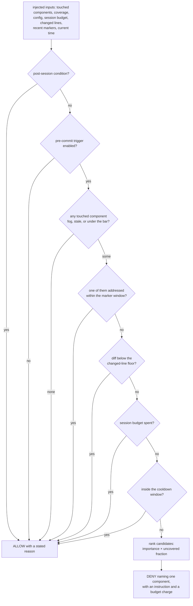

## Abstract

This component is the single function that decides whether a comprehension check
may interrupt a commit. It takes the touched components, the junior's coverage,
the configuration, the session's budget accounting, the size of the staged diff,
the set of recently addressed components, and the current time — all handed to it
— and returns either an allow with a reason or a deny naming one component. It
reads nothing and writes nothing, so the interruption budget it enforces is a
property that can be proved by test rather than a behaviour that must be observed
in the wild.

## Introduction

An in-flow intervention is a hostile act: it stops a person mid-task. The system
is willing to do that, but only under promises — at most one check per commit, at
most a small number per session, never within a cooldown window of the last one,
never on a trivial change, and always with a way out. Those promises are worthless
if they are scattered across a hook script, a command handler, and whatever the
tutor happens to do. They also cannot be verified: a policy that reads the clock
and the filesystem behaves differently every time you run it.

So the policy was collapsed into one place and stripped of every side effect. The
component described here contains the whole decision and none of the machinery
that gathers its inputs. Gathering — running git, materializing coverage, loading
the session record, reading the clock — belongs to the caller, which is documented
separately. What remains here is a small ordered set of questions and a ranking
rule, and nothing else.

## Related Work

The caller that assembles this function's inputs, spends the budget it authorizes,
and translates its verdict into something the agent obeys is
[Deny, Retry, and Defer-as-Drop](../gate-enforcement/); read that paper
immediately after this one, because a deny here does nothing on its own. The deny
instruction points the agent at [Quiz and Socratic Protocols](../tutor-skill/),
the conversation that actually teaches and grades. That conversation ends by
calling [Recording a Validation Outcome](../validation-recording/), which is what
produces the marker that lets the retried commit through — the closing link in the
loop this component opens. The candidate test depends on the state names and the
three dimensions defined in
[Coverage States and the Three Dimensions](../../comprehension/coverage-schema/),
and on the same purity discipline used by
[Pure Materialization of Coverage](../../comprehension/state-engine/), which is
the sibling example of pushing all input and output to the edges. The numbers
underneath those states — the collapsed comprehension figure this decision
compares against the validation bar, and the uncovered fraction that drives the
ranking of a single target — are produced by
[Scoring: Exponential Averaging, Loyalty, Classification](../../comprehension/coverage-model/),
so a change to the scoring constants quietly changes which touched components
become candidates here. Every constant
the decision consults — the validation bar, the session cap, the cooldown, the
changed-line floor, the active condition — comes from
[Conditions, Budgets, Thresholds, and Model Tiers](../../platform/config-schema/).
The touched-component list handed in is produced by
[File-to-Component Reverse Index](../../map/file-component-index/), which maps the
staged file paths onto component identifiers.

## Description

The decision proceeds as an ordered sequence of questions, and the first one that
matches ends it. This ordering is itself the policy: cheap and absolute exclusions
come first, and the expensive judgement comes last.

The first question is whether the junior is even in an in-flow condition. Under a
post-session condition the gate is a deliberate no-op — hooks still collect
evidence, but nothing ever interrupts. The second question is whether the
pre-commit trigger is enabled for this user at all; triggers are a configurable
list, so a person who tolerates no commit-time interruption simply removes it. A
second trigger kind, firing after the agent finishes a task, exists in the
configuration but is not wired into this decision.

The third question is whether anything worth checking was touched. A touched
component qualifies as a candidate in exactly three cases: it has never been
explored, it has gone stale and needs re-validation, or it has been explored but
its weighted comprehension mean still sits below the validation bar. A component
that is already validated, or explored at or above the bar, is skipped — the
junior has demonstrated understanding and there is nothing to buy by interrupting.
A touched identifier with no coverage record at all is treated as never explored,
which is the conservative reading. Duplicates in the touched list are collapsed.

The fourth question is the one that makes the whole retry mechanic work. The
caller hands in a set of components that were addressed within a short freshness
window — either because a check was just recorded for them, or because the junior
just skipped them. If any candidate is in that set, the commit is allowed. The
decision cannot distinguish "you just proved you understand this" from "you just
told me you did not want to", and it deliberately does not try. Both mean the same
thing at this moment: this component has had its turn, let the commit through.
That single test is simultaneously the retry-passes path and the skip-is-final
path, and because the window expires on its own, it is also what caps a single
commit at one interruption. There is no per-commit counter anywhere in the
decision; the cap is a consequence of the marker, not an accounting field. The
configuration does carry a per-commit budget number, but this decision never reads
it — worth knowing, because a reader who tunes that number will see no effect.

The fifth, sixth, and seventh questions are the ordinary budget guards: a diff
below the changed-line floor is too trivial to be worth stopping; a session that
has already spent its allowance stays quiet; and a check that would land inside the
cooldown window since the last one is suppressed. The elapsed-time comparison is
written to be safe against unparseable timestamps: if either the current moment or
the stored last-intervention time fails to parse, the gap between them is reported
as infinite. The effect is that a corrupt timestamp can never trap the gate inside a
permanent cooldown and silence it forever; it fails in the direction of the gate
still being able to fire, and the session counter is what keeps that from becoming
noisy.

Only if every guard passes does the decision fire. It then picks a single target.
When importance data is available — a per-component weight from the frozen map —
candidates are ranked by importance multiplied by the fraction of comprehension
still missing, so a large, poorly-understood component outranks a small one the
junior almost knows. Without importance data it falls back to the lowest
comprehension mean first, then to state priority, and finally to the identifier
itself, so the ordering is total and the outcome is reproducible. The verdict
carries the component, an instruction telling the agent to run a check in the
configured modality and how the junior can skip instead, and a flag telling the
caller that this deny is the one that should charge the session budget.

The invariant worth holding onto: the same inputs always produce the same verdict,
and the verdict alone never changes anything. Every consequence — the evidence
written, the budget spent, the commit blocked — is somebody else's job.

## Rationale

The dominant decision is purity, and the code says so directly: the header calls
this the beating heart of the minimal-interruption principle and lists the injected
inputs one by one. The reasoning appears to be that a budget is a promise, and a
promise that cannot be tested is a wish. With the clock and the filesystem removed,
a test can assert that eleven consecutive commits inside a cooldown window produce
exactly one refusal, and that assertion holds for all time. If the decision instead
shelled out to git and read the state directory itself, the same test would need a
fixture repository, a fixture state directory, and control of the system clock, and
would still be a behavioural observation rather than a proof.

Naming exactly one component on a refusal follows from the same principle from the
other direction. The interruption is priced in the junior's attention, and that price
scales with how much the refusal asks for. One component is a two-minute check; four
components is a review meeting nobody agreed to. The ranking formula is itself a
judgement — importance times uncovered fraction says that the system would rather buy
comprehension of a central component the junior barely knows than of a peripheral one
they nearly know. Reverse it and the gate would spend its scarce interruptions on the
cheapest possible wins.

Realizing the per-commit cap through the marker set rather than a counter is the
subtlest choice here, and the header comment states it explicitly. The likely force
is that the decision has no way to observe commit identity — it sees a staged diff
and a moment in time, not a commit attempt with a name. A counter would therefore
need external bookkeeping about when a commit begins and ends, which is exactly the
kind of stateful coupling purity was meant to remove. The marker instead expires by
itself and covers three cases at once. The cost is that the mechanism only works if
the caller writes markers faithfully and the freshness window is long enough to
survive a real tutor conversation but short enough not to leak into the next piece
of work; reverse that balance in either direction and the gate either blocks a
retry the junior earned or goes quiet for the rest of the hour.

Returning a reason on every allow, not just on every deny, reads as instrumentation
for the interruption audit the project plans. Without it, a gate that never fires
looks identical to a gate that is broken, and during a study that difference is the
whole result.

## Conclusion

This is the smallest and most load-bearing piece of the in-flow arm: an ordered set
of guards and a ranking rule, with no ability to affect the world. Understanding it
means understanding that the interruption budget is not enforced by discipline
scattered through the system but concentrated in one testable place, and that the
retry, the skip, and the one-per-commit cap are all the same mechanism seen from
three angles. Read next how this verdict is gathered, charged, and enforced in
[Deny, Retry, and Defer-as-Drop](../gate-enforcement/), what the deny asks for in
[Quiz and Socratic Protocols](../tutor-skill/), and how the loop closes in
[Recording a Validation Outcome](../validation-recording/).
