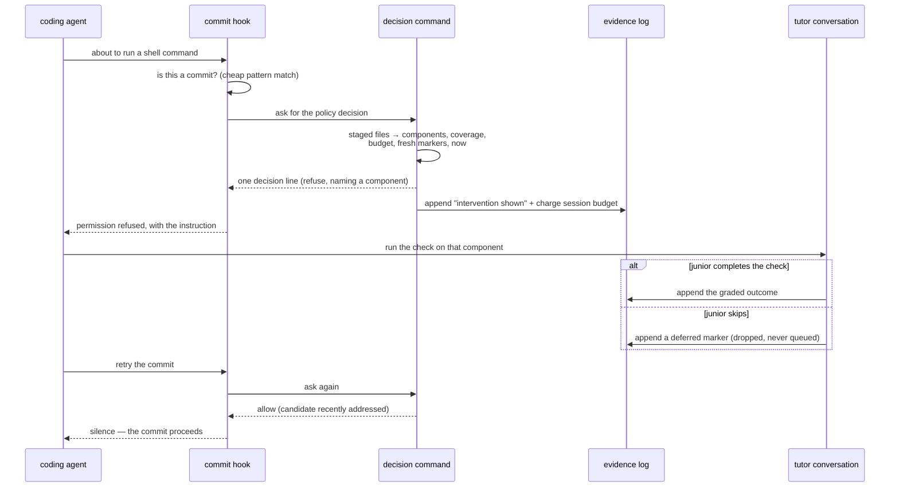

## Abstract

This component is everything around the pre-commit decision that makes it real:
the hook that notices a commit is about to happen, the command that gathers the
decision's inputs and charges the budget when it fires, the refusal envelope the
agent actually obeys, and the skip command that lets a junior walk away. Its
governing rule is that a refusal is only ever issued on an explicit, well-formed
refusal from the policy — every other outcome, including every kind of breakage,
lets the commit through.

## Introduction

The pre-commit decision is a pure function that returns a verdict. A verdict does
not stop anything. Something has to notice that a commit is being attempted,
assemble the facts the decision needs, turn its answer into a form the coding agent
respects, and then handle the two ways the story can end — the junior does the
check, or the junior declines. That is this component.

It sits on the most sensitive path in the whole system. It runs before every shell
command the agent issues, and it can block work. Two constraints follow directly.
First, it must be cheap: a pattern match rules out the overwhelming majority of
commands before anything heavier starts. Second, it must never fail into blocking:
a person whose commits stop working because a learning tool was misconfigured will
uninstall the learning tool, and rightly.

## Related Work

The verdict this component gathers inputs for and acts on is defined in
[The Pure Pre-Commit Decision](../commit-gate/); that paper explains what the
guards mean, this one explains where their inputs come from and what happens next.
The refusal text sends the agent to [Quiz and Socratic Protocols](../tutor-skill/),
which is also the party responsible for invoking the skip command on the junior's
behalf when they bail. A completed check reaches the log through
[Recording a Validation Outcome](../validation-recording/), and both that path and
the skip path write into [The Append-Only Evidence Log](../../comprehension/evidence-log/),
which is where the marker scan reads from. The coverage this component hands to
the decision is not stored anywhere; it is rebuilt on the spot by the gathering
step described in
[Impure Edges: Git Churn, Clock, and Disk](../../comprehension/coverage-materialization/),
which is the reason a commit check costs a repository walk rather than a file
read. The session budget record, the configuration, and the log this hook
consults all live in the per-user layout defined by
[Per-User State Layout and Repository Identity](../../platform/state-directory/),
whose deliberately non-throwing accessors are much of what makes the fail-open
promise below cheap to keep. The fail-open discipline and the
plugin-wide wiring that puts this hook on the shell-command event are described in
[Hook Wiring and the Fail-Open Rule](../../capture/plugin-hooks/). The commands
themselves are two entries on the surface documented in
[The Command Surface](../../platform/cli-surface/), which explains why the whole
hook path is restricted to deterministic file and git reads.

## Description

The hook receives a payload describing the tool call the agent is about to make.
Its first act is a cheap pattern test on the command string to see whether this is
a commit at all; the editor-side matcher is broad, covering every shell command, so
this filter is what keeps the cost of an ordinary command at essentially nothing.
If it is not a commit, the hook exits silently — emitting nothing is equivalent to
permitting, and staying silent avoids even the cost of writing output.

If it is a commit, the hook invokes the decision command, passing the original
payload on standard input, and expects one line of structured output back. Anything
other than a clean, parseable, explicitly negative answer is treated as permission
granted: a tool that cannot be found, a spawn that times out under the backstop
timeout, a non-zero exit, output that does not parse, or output whose decision field
is missing or true. Only an explicit refusal produces a block. The comment in the
source states the intent plainly — the junior's flow is never blocked on doubt.

When it does block, it writes a structured permission refusal containing the reason
text the decision produced, and still exits successfully. The reason is what the
agent reads: it names the component, says why it was picked, tells the agent to run
the tutor protocol, and tells it that the junior may instead run the skip command
and retry. This is why the refusal is expressed as a structured envelope rather than
as a failing exit status — the block is only useful if it carries the instruction
that resolves it.

On the command side, the decision command does all the gathering the pure decision
refuses to do. If the repository has no coverage memory at all, it permits
immediately. Otherwise it loads the papers, obtains the file-to-component index —
preferring the persisted one, falling back to building it in memory from the papers'
source lists — and maps the staged file paths onto component identifiers. It counts
the total added and deleted lines in the staged diff for the trivial-change guard,
treating binary files as contributing nothing. It re-materializes coverage from the
evidence log, pulls per-component importance from the frozen map, reads or synthesizes
the session record, and scans the evidence log directly for markers inside the
freshness window. That scan is the one piece of logic worth reading twice: a component
counts as recently addressed if it has a fresh graded outcome of either modality, or a
fresh intervention record whose outcome was deferred or completed. Malformed lines and
entries without a component are skipped rather than fatal.

The freshness window is what makes that scan a marker rather than a memory. It is a
fixed span of ten minutes measured back from the moment of the decision, held as a
constant in the command rather than in the configuration, and anything older is simply
not seen. The length is a compromise between two failure modes. Too short and a genuine
tutor conversation outlives its own marker, so the junior finishes the check, retries,
and is refused again for the component they just demonstrated. Too long and a check from
earlier in the day silently unlocks an unrelated commit hours later, which would quietly
convert a per-commit cap into a per-morning one. Because the window closes on its own,
nothing ever has to delete a marker, and the log stays append-only.

The command then calls the decision and acts on it. On a refusal it appends an
intervention record with outcome shown — accounting only, with no effect on the
junior's scores — and then charges the budget by incrementing the session counter,
stamping the time, and remembering which component the refusal was waiting on. The
evidence append is best-effort: a write failure is swallowed, because the refusal is
what matters to the hook and turning a block into an error would be worse than losing
one accounting record. Whatever happens, the command prints one decision line and
exits successfully. It never blocks anything itself; that separation is why the same
command can be called from a script or a test without side effects on the shell.

On a permission, if the component the last refusal was waiting on now appears in the
marker set, the pending marker is cleared, so the session record's view of what is
outstanding matches reality.

The skip command is the escape hatch and is deliberately tiny. It appends an in-flow
intervention record with outcome deferred for the named component, stamped with the
configured modality for accounting, and clears the pending marker if it matches. That
record is precisely what the marker scan looks for, so the very next commit attempt on
the same staged diff passes. Nothing is enqueued anywhere; the component simply stays
unvalidated and the map shows it. Both commands fall back to schema defaults when no
configuration has been written yet, so the gate and the skip both work before the state
directory has been initialized.

## Rationale

The split between a policy-free hook and a policy-owning command is stated outright in
the hook's header, and the forces behind it are easy to reconstruct. The hook scripts
ship as plain files with no build step; anything implemented there is untyped, untested,
and cannot import the shared schemas. Anything implemented in the command is typed,
shares the coverage model with the rest of the system, and can be unit-tested against
the pure decision. Putting the budget in the hook would mean maintaining two versions
of a promise the study depends on. The cost of the chosen split is a process spawn on
every commit, which the cheap pattern pre-filter and a bounded timeout are there to
contain.

Failing open on every ambiguity appears to be the single most deliberate choice in the
component, since it is repeated in the shared helper, in the hook, and in the comment
about never blocking on doubt. The reasoning seems to be an asymmetry of harm: a
missed check costs one learning opportunity that will recur the next time the junior
touches that code, while a spurious block costs trust in the whole system and probably
its removal. Reversing this would mean that a slow filesystem or an unlinked binary
silently converts a learning tool into a commit freeze, with no obvious cause to the
person suffering it.

Charging the budget at the moment of refusal, rather than when the check completes, is
the choice that makes the promise honest. If the budget were only spent on completed
checks, a junior who skips would face a fresh refusal on the next commit, and the skip
would not really be an escape. Spending on the refusal means an offer costs a slot
whether or not it is taken — the system is limited in how often it asks, not in how
often it succeeds.

Treating the skip as an append-and-drop rather than a deferral into a queue is the
project's clearest statement about autonomy, and the code comments name it as such. Two
forces seem to converge. Experimentally, the in-flow and post-session arms must not
leak into each other, or the comparison between them is meaningless. Ethically and
practically, an escape hatch that quietly reschedules the thing you escaped is not an
escape hatch, and a junior who discovers that will stop trusting the button. The
consequence of the decision is deliberately left visible rather than enforced: the
component stays unvalidated on the map, and it will come around again only through
genuine re-encounter or through the junior's own initiative.

## Conclusion

This component is the mechanical body around a purely logical decision: it notices,
gathers, charges, blocks, and offers a way out — and it is built so that every way it
can go wrong ends in the commit succeeding. Once you see that the refusal, the retry,
and the skip are all mediated by one short-lived marker written into the evidence log,
the whole in-flow arm collapses into something simple. Read [The Pure Pre-Commit
Decision](../commit-gate/) for the policy this enforces, [Quiz and Socratic
Protocols](../tutor-skill/) for what the refusal asks the agent to do, and
[Recording a Validation Outcome](../validation-recording/) for the write that ends
the loop.
