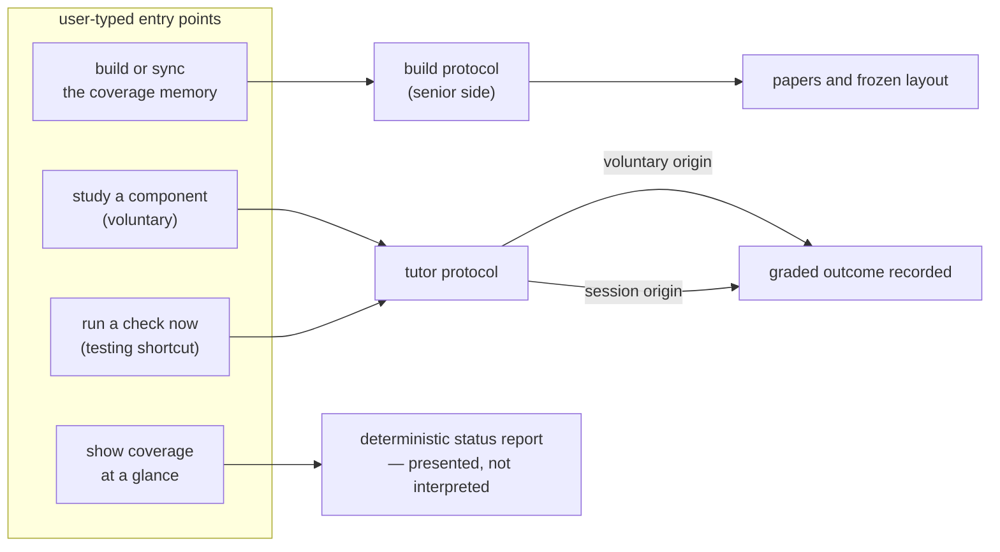

## Abstract

This component is the set of user-typed entry points the plugin exposes: build or
sync the coverage memory, study a component voluntarily, fire a comprehension check
on demand, and show coverage at a glance. Each is a short instruction file that
names the protocol to run and the constraints that apply, then hands over — the
work happens in the two skills and the deterministic report they delegate to. Their
real content is the framing: which protocol, with what target, under which budget
rules, and recorded under which origin.

## Introduction

Almost everything else in the system is system-initiated: a hook fires, a gate
refuses, a signal is appended. That is deliberate, because system-initiated
intervention is the variable the project is studying. But a learning system that can
only be entered when it decides to interrupt you is a system you cannot use on
purpose, and the project treats autonomy — choosing which part of the codebase to
understand, and when — as central rather than incidental.

These entry points are that door. They are also the only way to reach the senior-side
build protocol and the only way to see the whole picture without starting the map
viewer. What makes them worth documenting separately from the protocols they invoke is
that they carry the framing, and the framing changes the meaning of the outcome: the
same tutor protocol, entered voluntarily, produces evidence tagged differently and
governed by different rules than the same protocol entered through a refused commit.

## Related Work

Two of the four entries route into [Quiz and Socratic Protocols](../tutor-skill/),
which defines everything they deliberately do not restate — grounding, caps, the
rubric, and how outcomes are submitted. The manual check entry is explicitly a
shortcut into the same path that [Deny, Retry, and Defer-as-Drop](../gate-enforcement/)
opens when a commit is refused, which is why it exists and why it records under the
system-initiated origin. The build entry delegates to
[The Mode B Build Protocol](../../memory/memory-builder-skill/), including its
approval pause and its sync mode; the plan-only variant this entry accepts is
answered by [Pre-Flight Build Cost Estimation](../../memory/build-cost-estimator/),
which is what makes an approval pause meaningful rather than ceremonial — the person
being asked to approve is told roughly what the build will cost first. The status
entry is a presentation layer over one
command from [The Command Surface](../../platform/cli-surface/), and its output is a
deterministic report rather than anything this component computes. All four are
distributed through the same packaging and discovery mechanism as the hooks described
in [Hook Wiring and the Fail-Open Rule](../../capture/plugin-hooks/), and the build
step that assembles that folder into something installable is
[Bundling and Distributing the Plugin](../../platform/plugin-packaging/) — these
entries only exist for a user because they are copied there. The map-side
equivalent of the voluntary study path — starting a check from a component's panel
rather than from the chat — is [Running a Quest in the Browser](../../viewer/quest-runner-ui/),
launched from the reading surface described in
[Reading a Paper In-App](../../viewer/component-panel/); together they are the useful
contrast, since the panel offers the same voluntary check next to the paper itself
rather than behind a typed command.

## Description

Each entry is a markdown file with a one-line description and a body of instructions
addressed to the agent. There is no executable behaviour here at all; the file is
prompt material that the agent reads when the user invokes it. Three of the four accept
an optional argument — the two learning entries take a component to work on, and the
build entry takes a scope or a request for a plan only — and in each case the file says
what to do when the argument is absent. The status entry takes nothing.

The build entry is senior-side and the only one that writes to the coverage memory. It
distinguishes two situations. With no coverage memory present, it asks for the full
build: propose a set of provinces and components for approval, write the papers with
work fanned out one province at a time, cross-link them and verify that no link is
dead, and finally freeze the spatial layout. With a memory already present it asks for
sync mode instead: find which components' sources have moved, update those papers up
and down the tree, place any genuinely new components without disturbing the existing
ones, and re-verify links. Its argument can scope a sync to one province or component,
or request only the survey plan without writing anything. The single hard instruction
is the approval pause: stop for a human after the survey, before writing. It also
states that this is to be run on a high-capability model, which matches the two-tier
model policy the system enforces elsewhere.

The study entry is the voluntary learning path. It names the tutor protocol in study
mode and states the three things the protocol needs to know: that no interruption
budget applies because this is the junior's own initiative, that a reading guide over
the paper comes before any check, and that the resulting validation is recorded with
the voluntary origin. With no argument it instructs the tutor to offer a short menu of
the junior's unexplored, weakly covered, and stale components. It also says explicitly
that a junior who only wants to read may do so and nothing is recorded — the check is
offered, not imposed.

The manual check entry is the same tutor protocol entered from the other side. It is
described as a development and testing shortcut into the in-flow path, so that item
quality can be iterated without waiting for a qualifying commit. It names a target or
tells the tutor to pick the most recently touched weak component, asks for the check in
whatever modality is configured, grounded in the component's paper and the session's
diff, graded per dimension and submitted one call per item under the default
system-initiated origin. It repeats two constraints — no answer revealed before an
attempt, and keep it short and supportive — even though the protocol already states
them, presumably because this entry is used by people iterating on the protocol itself.

The status entry is the only one that starts nothing. It runs the deterministic status
report and asks the agent to present it concisely: the header identifying repository,
user, active condition, and model tiers; the importance-weighted total coverage; counts
by state; a per-province rollup with each component's state and comprehension mean; the
list of components needing re-validation; and the count of outstanding quests. It notes
a structured output form for programmatic use and tells the agent where to point a user
whose memory or state is not yet set up. It is read-only by construction — no check, no
recording, no state change.

One thing a reader should not infer from this set: none of these entries schedules
anything. The configured modality is what a check uses when a check happens, and a check
happens only when the gate refuses a commit or when someone types one of these entries.
There is no timer and no automatic firing.

## Rationale

Implementing these as instruction files rather than as subcommands follows from what they
start. Three of the four begin something conversational — a reading guide, a graded
dialogue, or a multi-stage build with a human approval pause in the middle — and the
deterministic tool is explicitly built to make no model calls, precisely so it can be safe
on the commit path. Putting these behind that tool would either force it to acquire a
model client, breaking the property that its hot path is pure file and git work, or reduce
them to printing instructions for the user to follow by hand. The chosen form keeps the
conversational work with the party that can conduct a conversation.

Delegating the protocol rather than restating it appears to be a deliberate anti-drift
measure, though it is applied unevenly and the exceptions are instructive. The study and
manual-check entries genuinely delegate, adding only framing. The status entry, by
contrast, describes the shape of a report that the command itself produces, which means a
change to that report leaves this description stale — an accepted cost, probably because
the description doubles as guidance on how to present the output rather than as a
specification of it. The manual-check entry also re-states two protocol constraints, which
is redundancy chosen for emphasis at the cost of a second place to update.

Exempting voluntary learning from the budget is stated in the study entry itself, and the
reasoning holds up under inspection: budgets exist because interruptions are imposed, and
nothing about a person choosing to read is an interruption. Carrying that distinction into
the recorded origin matters just as much, because otherwise the evidence log could not tell
apart a check a person sought out from one they were pushed into — a difference that the
study's whole design turns on. If voluntary study consumed budget, a junior who studied on
their own in the morning would have bought themselves fewer system-initiated checks in the
afternoon, which inverts the incentive the system is trying to create.

The manual-check entry exists for a plainly practical reason, and the file says so: item
quality is the risk the project names most often, and iterating on it through the real gate
would require staging a large enough diff on sufficiently under-covered code for every
experiment. Making the same path reachable in one keystroke turns that loop from minutes
into seconds. The cost is a command that can inflate coverage under the system-initiated
origin without any real interruption having occurred, which is worth knowing when reading
evidence produced during development.

## Conclusion

These four short files are the system's front door: they decide which protocol runs, with
what target, under which budget rules, and under which origin — and then get out of the
way. Understanding them means understanding that the framing around a check, not the check
itself, is what distinguishes voluntary learning from an imposed one, and that nothing in
this system fires on its own. Read [Quiz and Socratic Protocols](../tutor-skill/) for what
two of them start, [The Mode B Build Protocol](../../memory/memory-builder-skill/) for what
the build entry delegates to, and [Deny, Retry, and Defer-as-Drop](../gate-enforcement/) for
the system-initiated counterpart they deliberately sit alongside.
