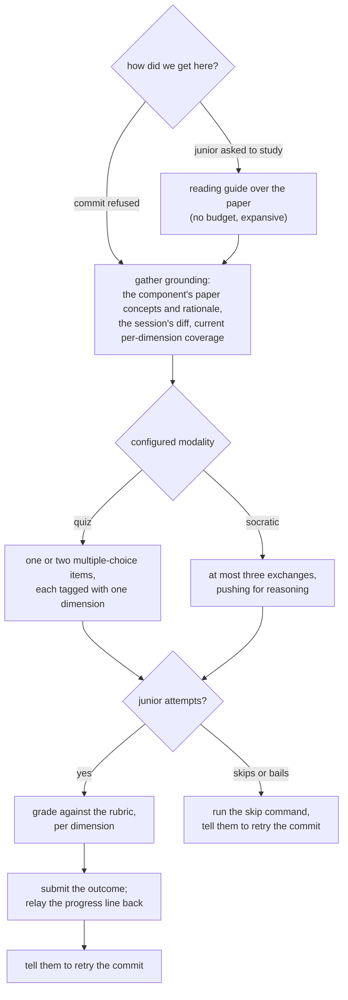

## Abstract

This component is the instruction document that turns a general coding assistant
into a comprehension tutor: it defines two short, grounded check formats — a one-
or two-item multiple-choice quiz and a dialogue capped at three exchanges — plus
the grading rubric for the three coverage dimensions and the exact way an outcome
is submitted. Its central discipline is that the tutor grades and reports but never
computes: it produces evidence, and the scoring model lives elsewhere. It is also
the party responsible for writing the skip marker when a junior declines, so a
blocked commit is never left stuck.

## Introduction

Everything else in the in-flow arm is deterministic file and git work. This piece is
not: it is a conversation with a person, run by a language model, and its output is
a number that will be treated as evidence about that person's understanding. That
combination is fragile. A check that asks generic textbook questions measures
general knowledge rather than knowledge of this codebase. A check that reveals its
own answer measures nothing. A check that runs for ten minutes violates the
interruption budget everything else works to keep. A check that edits the coverage
file directly destroys the property that coverage is a recomputable view of raw
signals. So this component is written as non-negotiable rules rather than as
suggestions, and most of them protect a property some other component depends on.

## Related Work

The system-initiated entry into this protocol is a refusal produced by
[The Pure Pre-Commit Decision](../commit-gate/) and delivered by
[Deny, Retry, and Defer-as-Drop](../gate-enforcement/), whose refusal text names
the component to check and mentions the skip command this protocol is required to
run on the junior's behalf. Every outcome leaves through
[Recording a Validation Outcome](../validation-recording/), which owns the two
submission shapes described here and prints the progress line the tutor is told to
relay. The user-initiated entries — voluntary study and the manual check — are
described in [User-Initiated Entry Points](../slash-commands/). The grounding
material comes from the frontmatter contract in
[Paper Format and Frontmatter Contract](../../memory/paper-format/): the quizzable
concept units and the rationale entries with their rejected alternatives exist
precisely so that this protocol has something specific and gradable to ask about.
The three dimensions and the states the tutor talks about are defined in
[Coverage States and the Three Dimensions](../../comprehension/coverage-schema/),
and the arithmetic this protocol is forbidden from performing — how a single raw
score moves a dimension, and how the dimensions collapse into the figure the
junior is shown — belongs to
[Scoring: Exponential Averaging, Loyalty, Classification](../../comprehension/coverage-model/);
the rubric here deliberately stops at emitting numbers so that model can be re-fit
later without invalidating anything the tutor said. When no component is named and
no refusal supplied one, the fallback target is whatever the junior most recently
touched, a fact that exists only because of the silent observation described in
[Capturing Touches, Prompts, and Review Latency](../../capture/edit-and-prompt-hooks/).
The post-session counterpart, which generates items ahead of time instead of
improvising them in conversation, is
[Selection, Generation, and Offline Fallback](../../quests/quest-generation/) — the
instructive contrast, since it must produce the same kind of graded evidence without
a live tutor present — and the shape those pre-generated items must take, including
the permissive validation applied to anything a model wrote, is set out in
[Quest Documents and Item Shapes](../../quests/quest-schema/).

## Description

The protocol begins by establishing what it is checking and why it was invoked. The
target component comes from one of three places: an explicit argument when the junior
asked to study something, the refusal text when the gate sent the agent here, or the
most recently touched under-covered component reported by the tool.

Grounding is the first rule and the one the protocol repeats most. Items must come
from a named concept or rationale entry in the target component's paper and, when
available, from the diff the junior just wrote. The preferred form is a question about
the change in front of them rather than a question about the topic in general. When
the paper or the tool is unavailable, the protocol degrades rather than fabricating:
run a minimal check from the diff alone, or tell the junior the memory is not built.

The two modalities differ in shape but not in what they produce. The quiz form is one
or two multiple-choice items, each tagged with exactly one dimension and aimed at the
component's currently weakest dimension and at a concept the junior's own diff touched.
Each item has a stem grounded in a specific paper entry and exactly four options: one
correct and three plausible distractors representing real misconceptions — the
plausible-but-wrong reading of the design, the alternative the paper explicitly
rejected, or the naive assumption the code contradicts. Options must be mutually
exclusive and similar in length and register, because a longer or more hedged option
is a giveaway. The junior picks; only then is the answer revealed, with one tight
paragraph of reasoning drawn from the paper's rationale. A correct pick scores full
marks, a wrong pick scores nothing, or up to a small partial credit when the stated
reasoning shows genuine partial understanding.

The dialogue form opens with one real question about the diff and the design reasoning
behind it, runs at most three exchanges, and each turn acknowledges the correct part of
the answer before pushing one level deeper or sideways into an untouched concept. One
nudge is permitted when the junior is stuck. After the last exchange, or after an
explicit admission of not knowing, the tutor synthesizes: confirms the correct model,
corrects misconceptions, and fills the remaining gap. Only then does grading happen,
across the whole dialogue, one score per dimension actually probed.

The rubric is stated as three bands per dimension. Structure runs from being unable to
locate the moving parts, through naming them but being fuzzy on how they connect, to
tracing data and control flow correctly and stating invariants. Concepts runs from
misidentifying the idea to stating it precisely and predicting behaviour in a new case.
Rationale runs from no idea why the code is built this way, through knowing the decision
but not the alternatives, to explaining the decision, the rejected alternatives, and what
would break if it were reversed. The explicit guidance is to reward reasoning shown over
keyword matching, and to be calibrated rather than generous, because these numbers feed a
blending update and inflation propagates.

Submission has exactly two shapes and no others. A quiz submits once per item, because
each item is one probe on one dimension. A dialogue submits once for the whole
conversation, carrying the per-dimension rubric scores together. An origin marker
distinguishes system-initiated checks from voluntary ones. The protocol is emphatic
that there are no other flags, and that a skip is never recorded through the completion
path.

That last point is a hard obligation. If the junior declines in the gate path, the tutor
must run the skip command itself for the named component, and then tell them to re-run
the commit. The same applies to bailing partway through: the skip is written, nothing
further is recorded, whatever partial progress already landed stays, and there is no
penalty for stopping. Outside the gate path there is nothing to defer and the tutor
simply stops. Either way, in the gate path, the last thing the tutor says is to retry the
commit — otherwise the junior is left staring at a blocked commit with no idea how to
proceed.

Finally, the tutor is told to relay the progress line the tool prints — the weighted
comprehension mean against the validation bar — so the junior sees the map move. The
protocol explains the validation rule so the tutor can answer honestly when asked whether
a component is done: the bar must be crossed and at least two active validations must
exist, so a single strong check visibly shifts the numbers but cannot on its own complete
a component, and the tutor must not promise otherwise. Two cautions belong with that.
The protocol states the bar and the blending weight as concrete numbers, but both are
configurable, so a repository that has tuned them will have a tutor quoting the defaults;
and the same passage offers a shortcut — read the progress line, and if the mean has
reached the bar the component is finished — which drops the second half of the rule it
had just stated. A tutor following the shortcut rather than the rule will occasionally
tell a junior a component is complete when the classifier still counts only one
validation, so the surrounding text, not the shortcut, is the part to trust.

The voluntary mode inverts the order deliberately. With no component named, the tutor
offers a short menu of the junior's weakest and stale components. It then walks through
the paper — the hero visual, the key concepts, the rationale — in its own words,
pointing at the source files rather than pasting them, and answers questions. Only then
does it offer a check, in the same configured modality, recorded with the voluntary
origin. If the junior only wants to read, nothing is recorded and the door is left open.
Nothing in the system fires either modality automatically on a schedule; this protocol
runs when the gate, a command, or the junior asks for it.

## Rationale

The instruction to record rather than compute is the load-bearing one, and it is stated
as a numbered rule. The force behind it appears to be that the coverage file is a
derived view: it is re-materialized from the raw log whenever anything changes, and the
scoring constants are meant to be re-fit later against the same raw data. A tutor that
wrote coverage directly would produce state that no recomputation could reproduce, and
the first re-materialization would silently erase it.

The hard caps on length trace straight back to the interruption budget. Everything
upstream works to ensure that at most one check fires per commit and a couple per
session; none of that discipline survives if the check itself is open-ended. If the caps
were removed, the gate's guarantee would become a guarantee about frequency only, and
frequency without duration is not a budget.

Building distractors from the paper's rejected alternatives is a small choice with a
large effect, and it is the clearest link between the memory format and the assessment.
A junior who has read only the code can usually recognize what the code does; only
someone who has understood why it was built that way can tell the real decision from the
alternative that was considered and dropped. That is what makes the rationale dimension
gradable at all, and it explains why the paper format insists that rationale entries name
their alternatives.

The no-reveal rule reads as a measurement-validity concern rather than a pedagogical
one. The number produced feeds a running average that drives a state machine and,
eventually, study results; a score obtained after the answer was telegraphed carries no
information about the junior at all. It is notable that the voluntary path deliberately
does the opposite — it teaches first, then checks — which suggests the authors accepted
that voluntary scores are softer evidence in exchange for the check being welcome rather
than imposed.

Making the tutor responsible for writing the skip marker looks like a lesson learned from
the mechanics. The commit is blocked, and only a marker unblocks it; a junior who says
"not now" and receives sympathy but no marker is stranded. Assigning that duty to the
conversational party — the only one present at the moment of refusal — closes the hole,
and the repeated instruction to end by telling them to retry the commit suggests that
leaving the junior without the final step was a real failure mode.

## Conclusion

This component is where a deterministic system briefly hands control to a conversation,
and almost every rule in it exists to keep that handoff from damaging the deterministic
parts around it: grounded so the score means something about this codebase, capped so
the interruption stays affordable, tagged per dimension so the coverage model can use
it, submitted rather than computed so coverage stays a reproducible view, and always
accompanied by an exit. Read [The Pure Pre-Commit Decision](../commit-gate/) for what
summons it, [Recording a Validation Outcome](../validation-recording/) for what happens
to its grades, and [Paper Format and Frontmatter Contract](../../memory/paper-format/)
for where its questions come from.
