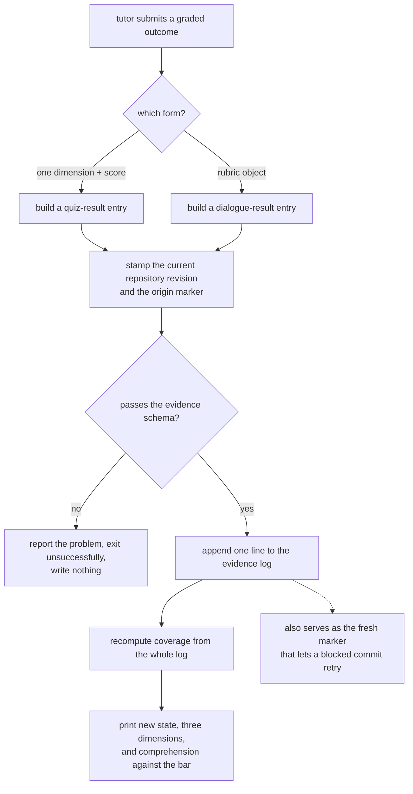

## Summary

This component is the single write that turns a graded conversation into
comprehension state. It accepts an outcome in one of two shapes — a score on one
named dimension, or a set of dimension scores from a dialogue — stamps it with the
current repository revision and an origin marker, validates it, appends it to the
append-only log, recomputes coverage from the whole log, and prints how far the
component now sits from the validation bar. The same append is, incidentally, the
marker that releases a commit the gate blocked.

## What it does

Every other part of the in-flow arm is either a decision or a conversation. This is
the only part that changes what the system believes about a person. That makes it the
right place to enforce two rules the rest of the system depends on.

The first is that comprehension state is never edited, only derived. The log of raw
signals is the truth; the coverage file is a view that can be thrown away and rebuilt
at any time. If any writer bypassed that — including this one — the guarantee that the
scoring model can be re-fit later over the original data would be gone, and so would
the ability to recompute after a change to the constants.

The second is that a validation is anchored in time. Comprehension decays not because
people forget on a schedule but because code moves underneath them. Deciding whether it
has moved requires knowing which revision the person actually demonstrated understanding
against, and that fact is only available at the moment of recording.

## Related components

The producer of every outcome this command accepts is
[Quiz and Socratic Protocols](../tutor-skill/), whose two submission shapes correspond
exactly to the two forms handled here, and which is told to relay the progress line this
command prints. In the gate path, the append performed here is the fresh marker scanned
for by [Deny, Retry, and Defer-as-Drop](../gate-enforcement/) and tested by
[The Pure Pre-Commit Decision](../commit-gate/); the skip command described in the
former writes a different kind of marker that reaches the same conclusion. The append
target and its schema are described in
[The Append-Only Evidence Log](../../comprehension/evidence-log/), and the actual
write is performed by the same validated single-line append that the capture hooks
use, described in [The Fast-Append Path](../../capture/evidence-append/); that
sharing is the whole reason a graded conversation and a silent file touch end up as
peers in one log. Where that log, the configuration this command reads its bar
from, and the coverage view it rewrites all live is settled by
[Per-User State Layout and Repository Identity](../../platform/state-directory/).
The fold that turns those entries into dimension scores and states is
[Pure Materialization of Coverage](../../comprehension/state-engine/), the
arithmetic inside that fold — including the averaging that makes a single strong
answer move the number only a little, which is exactly what the progress line
printed here exposes — is
[Scoring: Exponential Averaging, Loyalty, Classification](../../comprehension/coverage-model/),
and the surrounding git, clock, and disk work is in
[Impure Edges: Git Churn, Clock, and Disk](../../comprehension/coverage-materialization/).
The post-session arm reaches the same log through
[The Shared Completion Path](../../quests/quest-completion/), which is the instructive
comparison: two different intervention timings, one common way of writing down what was
learned.

## How it works

The command takes a component identifier and one of two mutually exclusive outcome
forms. The dialogue form is a single object of dimension names to scores, parsed from
the argument; a parse failure is reported and nothing is written. The quiz form requires
both a dimension name and a numeric score, and their absence produces a usage message
rather than a partial write. An origin argument, defaulting to system-initiated,
distinguishes checks the system asked for from ones the junior chose; anything other
than the two accepted values is refused up front. That marker is carried for analysis
only. Nothing downstream weighs one origin above the other — the fold that turns
entries into dimension scores never looks at the field at all, so a voluntary check
moves the numbers by exactly as much as an imposed one. The distinction exists so that
a later reading of the log can separate learning a person sought out from learning that
was pushed on them, which is a question the study cares about and the scoring model
does not.

Before building the entry, the command captures the repository's current short revision.
This is the crux of the temporal anchoring: the revision recorded is the one that was
current when the junior demonstrated the understanding, not the one current at some later
recomputation. Downstream, the fold uses that per-entry revision as the validation anchor
whenever it is present, falling back to a run-level revision only for older entries that
predate the field. Outside a git repository the revision is simply empty, and the command
carries on.

The entry is then validated against the evidence schema as it is appended. That schema
constrains scores to the unit interval and dimension names to the three known ones, so a
malformed grade is rejected at the boundary rather than silently skipped later by the
reader, which treats unparseable lines as absent. A validation failure prints the first
line of the problem and exits unsuccessfully; nothing reaches the log.

With the append done, coverage is re-materialized from the whole log. This is not an
optimization detail but the semantic point: the outcome is not applied to the component,
it is added to the record and the record is re-read. The result is that recomputation is
idempotent, that changing a scoring constant and recomputing yields a consistent world,
and that no state exists which the raw log cannot reproduce.

The command then reports. If the identifier is not a component on the map it says so
plainly and stops — but the entry has already been written, which is deliberate: the log
must not lose data because the map is stale. Otherwise it prints the component's new
state and all three dimension values, and then a progress line giving the weighted
comprehension mean against the configured validation bar, with a verdict of validated or
needs-more-validation. That progress line is the junior's feedback channel; the tutor is
instructed to read it back to them so they can see the effect of the check they just did.
It is worth knowing that the printed verdict reflects the full validation rule — crossing
the bar is necessary but the fold also requires a minimum number of active validations —
so a component can sit at or above the bar and still not read as validated on a first
check.

The bar itself is read from the configuration with a fallback, so the command works before
any state directory has been initialized. The blending weight that combines this score
with the previous one belongs to the fold, not to this command. A comment beside the
progress line explains how many strong checks it takes to cross the bar, and it quotes a
blending weight lower than the one the configuration now defaults to; the arithmetic in
that comment is therefore pessimistic and should be treated as commentary rather than as
the authoritative constant.

One consequence of the append is not a designed feature of this command at all, and it is
the reason the in-flow loop closes. A graded outcome written here is exactly the kind of
fresh entry the pre-commit decision's marker scan looks for: the scan accepts any graded
outcome of either modality that landed inside its freshness window, and this command has
just written one for the component the refusal named. So the junior finishes the check,
this command runs, and the retried commit is allowed — not because anything told the gate
that the check had happened, but because the evidence of it is sitting in the log where
the gate already looks. The command has no notion that a commit is blocked and no code
path that unblocks one.

Two smaller facts are worth carrying. First, this command is only for completed checks: a
skip goes through the separate defer command, and there is no flag here that expresses
one. Second, the source's own section header still labels this command a stub even
though the implementation is complete and does real work — a leftover from the scaffolding
phase, not a statement about its maturity.

## Design decisions

The append-then-recompute shape is the decision everything else here follows from, and it
is consistent with how the rest of the system treats state. The evident force is that the
scoring model is explicitly provisional — the project describes it as a first version whose
constants may be re-fit — and a provisional model must never be allowed to consume its
inputs. Keeping the raw grade means a future model can be run over the same history and
produce a different, better answer. If this command instead nudged the coverage file
directly, that history would exist only in the numbers the old model produced, and every
recomputation would fight the hand-written values.

Anchoring to the revision at record time rather than at recompute time is the subtler
choice, and the code comments call it out in two places, which suggests it was a bug before
it was a design. The failure it prevents is quiet and severe: if the anchor were taken from
the current revision each time coverage is rebuilt, then any rebuild would move every
component's validation point forward to today's code, and drift — the whole basis for
declaring a component stale — could never accumulate. Comprehension would look permanently
fresh. Making the anchor a property of the entry rather than of the run makes staleness
survive re-materialization, which is exactly the invariant the staleness mechanism needs.

The deliberately narrow argument surface reads as a concession to who the caller is. This
command is invoked by a language model working from a written protocol, and every extra
option is an opportunity for a plausible-looking wrong call. The protocol document
reinforces this by stating that no other flags exist, which implies that inventing flags was
a real failure. Most importantly, keeping deferral out of this command entirely means a skip
and a completed check can never be confused: they write different entry types with different
consequences, one accounting-only and one score-changing, and no single mistyped argument can
turn one into the other.

Recording outcomes for unknown identifiers, rather than rejecting them, follows from the same
respect for the raw log. The moment when identifiers most often fail to match is exactly when
the coverage memory is behind the code — which is also when evidence about what the junior is
learning is most valuable. Dropping it would lose data precisely when the system is least able
to afford it; keeping it costs only a line that a future rebuild may well make meaningful.

## Where it sits

This is a small command carrying two large invariants: comprehension state is always derived
from an untouched log, and a validation is pinned to the revision it was earned against.
Around those, it offers exactly two ways to submit a grade, prints one honest line of feedback,
and — without being designed for it — produces the marker that lets a blocked commit proceed.
Read [Quiz and Socratic Protocols](../tutor-skill/) for where its inputs come from,
[Pure Materialization of Coverage](../../comprehension/state-engine/) for what happens to them,
and [Deny, Retry, and Defer-as-Drop](../gate-enforcement/) for the side effect that closes the
in-flow loop.
