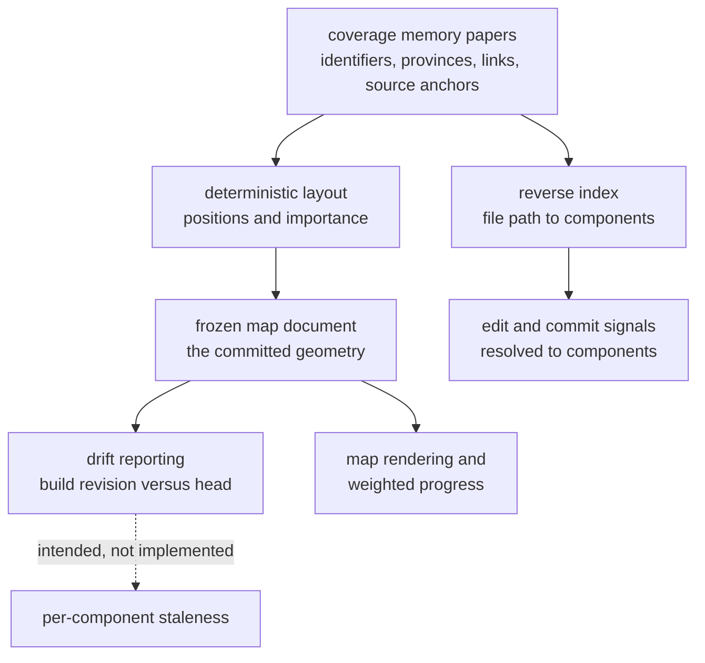

## Abstract

This province owns everything that turns a set of prose papers into a navigable place and keeps that place addressable from the outside. It defines the frozen document that records where each component sits and how much it weighs, the deterministic computation that fills that document in and never disturbs what it has already placed, the reverse lookup that resolves a file path back to the components responsible for it, and the reporting of how far the code has moved since the papers described it.

## Introduction

A coverage memory is a folder of markdown. Read on its own, it is a document set: hierarchical, searchable, and entirely without geography. That is enough to look things up and not nearly enough to remember them. The premise this province rests on is that people navigate places far better than they navigate lists — that a learner who has seen a codebase drawn as a stable arrangement of regions can recall roughly where a subsystem lives, and reach for it, long before they could recall its name.

Turning documents into a place requires committing to positions, and committing to positions is a stronger promise than it first appears. It means the arrangement must be reproducible, so regenerating it changes nothing. It means growth must be additive, so adding a component cannot nudge its neighbours. It means visual grouping must be guaranteed rather than hoped for, so regions stay recognizable. Those promises are the reason this province exists as a distinct concern rather than as a rendering detail inside the viewer.

The province also carries the map's second, less pictorial job. The same papers that supply component identities also declare which files each component covers, and that declaration inverted is the bridge between the world of file paths — where all runtime signals originate — and the world of components, where all reasoning happens. Both artifacts are derived from the same papers, and both are about addressing: one addresses by position, the other by path.

## Related Work

Within this province, [The Frozen Map Document](map-schema/) defines the shape everything else agrees on — normalized positions, an importance weight, a province grouping, a link graph, and a stamp of the revision the papers were built against. [Deterministic Layout and Incremental Placement](frozen-layout/) is the sole writer of that document and the source of its stability guarantees: seeded rather than random, additive rather than recomputed, with province separation established by arithmetic instead of by simulation. [File-to-Component Reverse Index](file-component-index/) handles the other direction of addressing, inverting declared source anchors into a path lookup with a bounded guess for files no paper has claimed yet. [Source Drift and Staleness Flagging](drift-detection/) is where the province is most incomplete, and its paper says so: the command reports revision identifiers and defers the per-component analysis it is named for.

Outside the province, the closest neighbour is [Loading the Coverage Memory Tree](../memory/paper-loader/), which supplies every input this province consumes — component identifiers, province groupings, source anchors, and the cross-links that become edges — so a change in how papers are parsed propagates directly into geometry. [Scoring: Exponential Averaging, Loyalty, Classification](../comprehension/coverage-model/) is the most consequential consumer: it multiplies this province's importance weights into the single aggregate figure a learner watches, which means a layout decision quietly becomes a scoring decision. [Drawing the Map from Frozen Geometry](../viewer/map-canvas/) is the reason the geometry has to be good, rendering positions and weights literally and inheriting every stability property this province guarantees.

## Description

Responsibility divides along two axes: what is frozen versus what is derived, and what is defined versus what is computed.

The schema component defines. It fixes the document format — the unit-square coordinate convention, the bounded importance weight, the province entries that carry a name but no geometry of their own, the three declared edge kinds of which only two can be produced at all and in an ordinary two-level memory only one ever appears, and the build revision stamp. It is also the validation boundary: layout output is parsed through it before being written, so malformed geometry fails at the door rather than surfacing later as a broken render. The fixture document that accompanies it is a minimal valid instance, proving the shape is inhabitable and giving tests something concrete to check.

The layout component computes. It sorts its inputs for reproducibility, derives a seed by hashing the sorted set of component identifiers, sizes each province from its node count, places province centres on a ring whose radius provably keeps neighbouring regions disjoint, seeds nodes on a compact spiral inside their region, and then relaxes the arrangement with alternating passes that pull nodes toward their region's centre and push apart any pair that is too close. Crucially, when a prior map exists, every component already placed is loaded at its exact recorded position and treated as immovable; only unknown identifiers are placed, and they settle around the frozen ones as obstacles. A full recompute is available but must be asked for explicitly, because it deliberately discards the accumulated spatial memory. The same pass derives each component's importance from how many other papers link to it, normalized against the most-linked component — a proxy for the code-centrality measure the design originally called for, and one a reader should treat as measuring the documentation graph rather than the dependency graph.

The reverse index derives. It flattens every paper's declared source anchors into a lookup from normalized path to the list of components claiming it, preserving the many-to-many relationship rather than arbitrating it. Lookup tries an exact match first and, failing that, scores every indexed path by how many leading directory segments it shares with the target, returning the best-scoring components — but only if at least one segment is shared, so an unrelated file resolves to nothing rather than to an arbitrary component. Unlike the map document, this artifact is not committed: it is a pure function of the papers and is rebuilt in memory whenever the persisted copy is missing.

The drift component reports, and reports less than its name promises. It reads the frozen document, prints its build revision against the repository's current one, and states plainly that per-component source churn is not implemented. The staleness that genuinely reaches a learner is computed elsewhere, during coverage re-materialization, and it anchors on each component's own last-confirmed revision rather than on the map's build stamp. This province therefore holds the reference point for drift without holding the working measurement of it, and any accurate mental model has to keep those two facts apart.

## Rationale

The seam that defines this province is derivation from papers plus permanence. Everything here is computed from the coverage memory rather than authored, and everything here answers a question of the form "where is this" — where on the canvas, or which component owns this path. That is a genuinely different concern from what the papers say, which belongs to the memory province, and from what a particular person understands, which belongs to the comprehension province. Keeping geometry out of the papers means an author never hand-places anything and cannot accidentally make the map inconsistent with the text; keeping geometry out of the viewer means the arrangement survives independently of any rendering technology and can be shared, committed, and diffed.

The second organizing principle is the split between what is frozen and what is regenerable, and this province deliberately contains one of each so the contrast is visible. Coordinates are committed because they carry history that cannot be recomputed — recomputing them is exactly the operation that destroys their value. The reverse index is thrown away and rebuilt because recomputing it is free and exact, and committing it would add merge conflicts without adding information. That distinction is not obvious from the outside, since both artifacts are derived from the same source; grouping them together is what makes the difference in their treatment legible rather than arbitrary.

Placing drift here rather than in the comprehension province is the least comfortable of these decisions, and the code suggests why it was made: drift is defined relative to the map's build revision, and the map document is the artifact that carries that revision. But because the working staleness computation anchors per component instead, the concern is currently split across two provinces, with the reporting surface in one and the measurement in the other. If the designed behaviour were completed, the natural resolution would be for this province to own the measurement of how far source anchors have moved and for the comprehension province to own what that means for a person's understanding. Until then, the honest description is that this seam is provisional, and the drift paper is the place to read about the gap rather than around it.

## Conclusion

This province is the map's substrate: a schema that fixes what a position means, a computation that assigns positions once and defends them against every future run, an index that translates file paths into components so that signals from the outside world can land, and a drift surface that currently reports more than it measures. Read the layout paper for the guarantees that make the map trustworthy, the schema paper for the contract the rest of the system depends on, and the drift paper for a clear account of what is not yet built.
