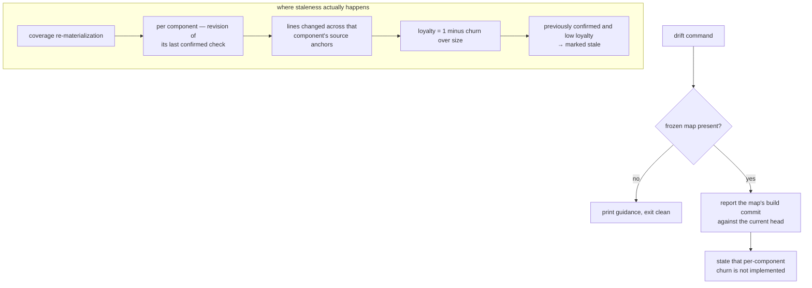

## Summary

Code changes after someone has understood it, and understanding that is no longer true of the current code is worse than no understanding at all. This component is the place where the system is supposed to detect that: comparing what the coverage memory describes against what the repository now contains. What is actually implemented under this name is a minimal stub that reports the map's build revision against the current one and says openly that per-component analysis is missing; the staleness that genuinely works is computed on a different path entirely.

## What it does

Every other part of this system builds up a claim: this person understands this component. The claim is made about a specific state of the code. When the code moves, the claim quietly stops being warranted — nothing announces it, and the coverage number keeps saying what it said yesterday. Detecting that decay is the fourth coverage state, and without it a coverage memory becomes steadily more flattering and less true the longer a project lives.

The design intends this component to be the detector. It should walk every component's source anchors, ask the repository how much of that code changed since the component was last confirmed, express the result as a proportion of the component's size, and flag components whose proportion crosses a threshold so they can be re-checked.

That is not what the command does today, and a reader who assumes otherwise will be badly surprised by the source. This paper documents both the stub that exists and the mechanism that partially fulfils its purpose elsewhere, because knowing which is which is the whole value of reading it.

## Related components

The revision this command reports comes from the stamp described in [The Frozen Map Document](../map-schema/), which is the only real consumer of that field. The measurement it is supposed to perform is defined over each component's declared source anchors — the same anchors inverted by [File-to-Component Reverse Index](../file-component-index/) — so what counts as "this component's code" is settled there, not here. The stamp only means anything because [The Mode B Build Protocol](../../memory/memory-builder-skill/) writes it at the end of a build and not before: it marks the revision a human actually read while describing the code, which is the only baseline against which "how far has the source moved" is a meaningful question.

The staleness that does work is implemented in [Impure Edges: Git Churn, Clock, and Disk](../../comprehension/coverage-materialization/), which measures churn against each component's own last-confirmed revision and feeds it into the pure fold. The arithmetic that turns churn into a loyalty value and then into a state change belongs to [Scoring: Exponential Averaging, Loyalty, Classification](../../comprehension/coverage-model/), and the state it can flip a component into is defined in [Coverage States and the Three Dimensions](../../comprehension/coverage-schema/). Downstream, a stale component is one of the situations that can produce work for the learner through [Selection, Generation, and Offline Fallback](../../quests/quest-generation/), and the only place that state becomes a word and a colour a person actually sees is [The Single Skin Boundary](../../viewer/terminology-skin/) — so the vocabulary of drift is decided in the viewer, never in the record. The command itself is one entry in [The Command Surface](../../platform/cli-surface/), which sets the conventions — exit cleanly, degrade quietly — that this stub follows.

## How it works

What the command does is short enough to describe completely. It reads the frozen map document from the current repository. If the document is missing or unparseable, it prints a line telling the reader to build the layout first and returns without setting a failure code. Otherwise it reads the short identifier of the repository's current head revision, prints one line reporting the map's build revision alongside that head revision, substituting a placeholder for either if it is unavailable, and prints a second line stating that per-component source churn is not implemented. It never inspects any component, never touches any source file, and never changes any state. It cannot fail in a way that matters.

That second line is not an oversight left in the code; it is the honest surface of a deliberately minimal implementation. The command exists so that the shape of the eventual feature is real — it has a name, a place in the command hierarchy, help text, and a defined failure behaviour — while the analysis behind it is deferred.

The help text is worth reading as part of the component. The one-line description attached to this command states the designed behaviour — flag components whose sources changed since the revision the map was built from — and then marks itself as a minimal stub in a trailing parenthesis. So the intended scope is recorded in the interface itself rather than only in a plan document, and the caveat travels with it. The printed disclaimer is the same admission repeated where someone who ran the command rather than read the help will see it. Both are deliberate, and together they are the reason this component can be described accurately at all: the code says what it was supposed to do and what it does not yet do.

The mechanism that actually produces staleness runs during coverage re-materialization, and understanding the difference between the two reference points is the most important thing in this paper. The stub compares one repository-wide pair of revisions: when the papers were built, versus now. Real staleness is per component and per reader. For each component that has ever been confirmed, the system remembers the revision at which that confirmation happened. Churn is then measured as the number of lines changed across that component's source anchors between that remembered revision and the current head. Size is measured as the total line count of those same anchors at the current head. Loyalty is one minus churn over size, floored at zero, so a component whose sources have been rewritten wholesale scores zero and one untouched since confirmation scores one. A component that was previously confirmed and whose loyalty falls below the configured threshold is reclassified as stale. Components that were never confirmed have no remembered revision, so nothing is measured for them and nothing can go stale — you cannot lose an understanding you never demonstrated.

Two consequences follow. First, the map's build stamp is currently decorative with respect to staleness: no working code path uses it as a churn reference. Second, the honest summary of the system's drift capability is that per-component staleness exists and is wired into coverage, while the command named for reporting drift does not perform it. The gap is not that staleness is missing; it is that the reporting and the computation live in different places and only one of them was finished.

## Design decisions

Shipping a visible stub rather than omitting the command is a decision about interface stability. The code marks it as minimal and names the phase in which the real analysis belongs, which suggests the intent was to fix the command's name, position, and contract early so that later work changes only its internals. Reversing this — waiting to introduce the command until it worked — would mean documentation, scripts, and any automation referencing it would all need revision at the moment the feature landed, and in the meantime a reader would have no indication that drift was even a planned concern. The cost is the one this paper exists to mitigate: a command that looks implemented and is not.

Anchoring real staleness per component rather than map-wide is the sharper design decision, and it explains why the stub's comparison is not simply the missing feature at smaller scale. Confirmations happen at different times for different components, so there is no single revision that is "the last time things were understood". Using the map's build revision instead would produce two failure modes at once: any change anywhere would make every component look equally drifted, and rebuilding the map — which happens for reasons unrelated to a reader's comprehension — would reset everyone's staleness to zero. The per-component anchor keeps drift a property of the relationship between one reader and one component, which is what the coverage model is trying to represent.

Exiting cleanly when the map is absent follows the convention of the surrounding command surface. This appears to be because commands here may be reached from automated paths where a non-zero exit surfaces as a broken hook or an aborted script, and "the map has not been built yet" is an ordinary state rather than an error. The trade is that a mistyped or misconfigured invocation looks like a successful one; the mitigation is that the printed line always says what was and was not found.

Keeping churn analysis off the fast path is a straightforward latency judgment. Measuring churn requires repository history queries proportional to the number of components and their anchor counts, which cannot fit inside the budget the capture hooks work to. This is why drift is a deliberate operation and why the working implementation rides along with coverage re-materialization, which is already an expensive, occasional pass rather than a per-keystroke one.

## Where it sits

This is the component where the honest answer differs most from the intended one: the command bearing its name reports two revision identifiers and admits its own incompleteness, while the staleness that actually reaches a reader is computed during coverage re-materialization from each component's own last-confirmed revision. Understanding it means holding both facts, and knowing that the map's build stamp is not currently what makes anything stale. The neighbours to read next are the impure materialization step that measures churn for real, the scoring rules that convert it into a loyalty value and a state change, and the map document whose stamp is waiting for this component to become what it was designed to be.
