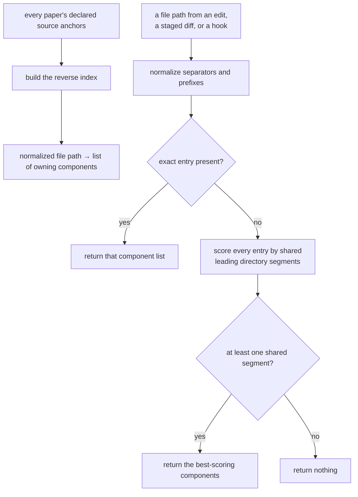

## Abstract

Every signal the system collects arrives as a file path — a file was edited, a file appeared in a staged diff — while everything the system reasons about is a component. This index closes that gap. It inverts the source anchors declared across all papers into a lookup from file to owning components, and resolves unknown files by falling back to the nearest directory that some anchor lives in.

## Introduction

The coverage memory describes components, and a component declares which files it covers. That direction is the useful one for a reader: open a paper, see what code it explains. But every runtime question runs the other way. A hook fires because someone edited a file; the commit gate inspects a staged diff full of paths. Neither can act until the paths become component identifiers.

Inverting a small mapping is trivial. What makes this component worth its own paper is the case the inversion cannot handle: a file that no paper claims. That is not an exotic edge case — it is the normal condition of any repository where work continues after the memory was built. Every new file starts unclaimed. If unclaimed files resolved to nothing, the system would be blind to exactly the code most likely to be poorly understood, and a person could write an entire new subsystem without a single signal being recorded. So the index carries a deliberate guess, and with it a deliberate limit on how wild that guess is allowed to be.

## Related Work

The anchors this index inverts are declared under the contract set out in [Paper Format and Frontmatter Contract](../../memory/paper-format/), and they reach this component through [Loading the Coverage Memory Tree](../../memory/paper-loader/), which projects each paper down to an identifier and a list of paths. It is a sibling artifact to [The Frozen Map Document](../map-schema/): both are derived from the same papers, but the map is committed and frozen while this one is regenerated freely. Regenerating it is one of the closing steps of [The Mode B Build Protocol](../../memory/memory-builder-skill/), which is what keeps the lookup honest: a paper whose declared anchors were never re-inverted attributes edits to whatever the previous build believed.

Its consumers are all on the signal side. [Capturing Touches, Prompts, and Review Latency](../../capture/edit-and-prompt-hooks/) needs it to turn an edited file into the component that gets explore credit, and [The Pure Pre-Commit Decision](../../interventions/commit-gate/) needs it to turn a staged diff into the set of components a commit is touching before it can decide whether to ask for a check. What both of them ultimately write is described in [The Append-Only Evidence Log](../../comprehension/evidence-log/), so an attribution mistake here becomes a permanently recorded mistake there. The moment of resolution is owned by [The Fast-Append Path](../../capture/evidence-append/), which consults this lookup as the line is written rather than deferring it, and which supplies the nearest-directory guess when no paper claims the file — meaning the latency budget that path lives under is the real reason this lookup has to be a plain table and not a search. The index is built and written by a subcommand of [The Command Surface](../../platform/cli-surface/), which also implements the read-or-rebuild behaviour that makes the persisted file optional.

## Description

Building the index is a single pass over the papers. For each paper, each declared source path is normalized and used as a key, and the paper's identifier is appended to that key's list, skipping duplicates. Normalization rewrites backslash separators into forward slashes, strips a leading current-directory prefix, and strips trailing slashes, so the same file written three ways collapses to one key. The result is a plain mapping from path to a list of component identifiers.

The list, rather than a single identifier, is the first thing to understand. Two components may legitimately anchor the same file — a large shared module might be explained from a data perspective by one paper and a control-flow perspective by another. When that happens, an edit to the file credits both. Nothing deduplicates or arbitrates; the ambiguity is preserved and passed on, and the consumers treat it as a set.

Lookup has two stages. The path being looked up is normalized the same way, and an exact key match short-circuits immediately, returning that component list untouched. This is the common case and it is cheap.

When there is no exact match, the fallback runs. The target's directory is compared against the directory of every indexed source, scoring each by how many leading path segments they share. The best score wins; entries tied at the best score all contribute, so a file sitting between two components' directories resolves to both rather than arbitrarily to one. The scoring is per segment, not per character, so a directory that merely shares a name prefix with another does not accidentally score as related.

The floor is what keeps this honest. If the best score is zero shared segments, the lookup returns nothing at all. Without that check the search would always produce a winner, because zero is still the best available score when nothing matches — and a repository-root file, or a file in a tree the memory does not cover, would be attributed to whichever component the iteration happened to reach first. The root case is worth making concrete: a file sitting directly at the top of the repository has no directory at all, the shared-segment count against every indexed path is therefore zero, and it can never be attributed through the fallback no matter how the rest of the tree is arranged. The same is true in reverse for an indexed source declared at the repository root — it can never win the fallback for anything. Configuration files, lock files, and top-level manifests are consequently invisible to this lookup unless a paper claims them by exact path. That attribution would be invisible: it would appear in the evidence log as a genuine touch, would raise that component's coverage, and nothing downstream could tell it apart from a real signal. Returning nothing is the correct answer to an unanswerable question, and the design accepts the resulting blind spot rather than filling it with noise.

The fallback's guesses are still guesses, and they are not marked as such. A component that receives credit through the nearest-directory path is recorded identically to one matched exactly. The system's stated intention is that unmatched files should also be flagged so the memory can be resynchronized to cover them; what exists here is the fallback alone, with no flagging. A person reading coverage numbers should know that some of the attribution behind them is directory-proximity inference.

Finally, the index is disposable. It is written out as a derived file that is not committed, and consumers that fail to read it simply rebuild it in memory from the loaded papers. That makes a missing or stale index a non-event rather than an error, and it means the persisted copy is purely an optimization.

## Rationale

Deriving everything from paper anchors is the decision that keeps the system coherent. There is exactly one place where a file is claimed by a component, and it is the paper that explains that file. Any alternative — a separate ownership file, directory conventions, a build-time registry — creates a second authority that can disagree with the first, and when the two disagree there is no principled way to choose. Reversing this decision would mean a file could be documented by one component and attributed to another, which would make coverage numbers describe something other than the papers a learner is actually reading.

The nearest-directory fallback is the interesting trade. The code marks it explicitly as a mitigation for files that no anchor list mentions yet, and the reasoning is straightforward: new files are exactly where comprehension is thinnest, so losing all signal on them is the worst possible failure mode. The alternatives it rejects both fail for concrete reasons — exact-only lookup goes blind on new code, while anything smarter, such as parsing imports or comparing content, would need to run inside an editor hook that has a very tight latency budget. Directory proximity is a crude heuristic, but it is a single string comparison per entry and it exploits the fact that people usually put related code near related code.

The shared-segment floor is what makes the crude heuristic acceptable rather than harmful. This appears to be because an unbounded nearest-match search has no notion of "too far" — it will always return its least-bad answer with the same confidence as its best one. Requiring at least one shared leading directory converts the heuristic from "always guess" into "guess only within the same top-level area of the tree". If the floor were removed, unrelated repository-root files would land on arbitrary components, and because evidence is append-only, that contamination would persist through every future recomputation.

Treating the index as regenerable rather than committed follows from it being a pure function of committed inputs. Storing it would create merge conflicts on every change to any paper's anchors, in exchange for information that can be reproduced exactly at any time. The frozen map is committed for the opposite reason: its coordinates carry history that cannot be recomputed, because recomputing them would move things. Holding those two artifacts side by side is a good way to see the distinction the design draws between derived data and frozen data.

## Conclusion

This component is a small piece of machinery with outsized consequences: it decides which component gets credit for every edit anyone makes. Its exact path is simple, its fallback is a deliberate, bounded guess, and its floor is what stops that guess from becoming quiet corruption. To see why it matters, follow it forward into the hooks that record touches and the pre-commit decision that acts on them, and backward into the paper format where the anchors it inverts are declared.
