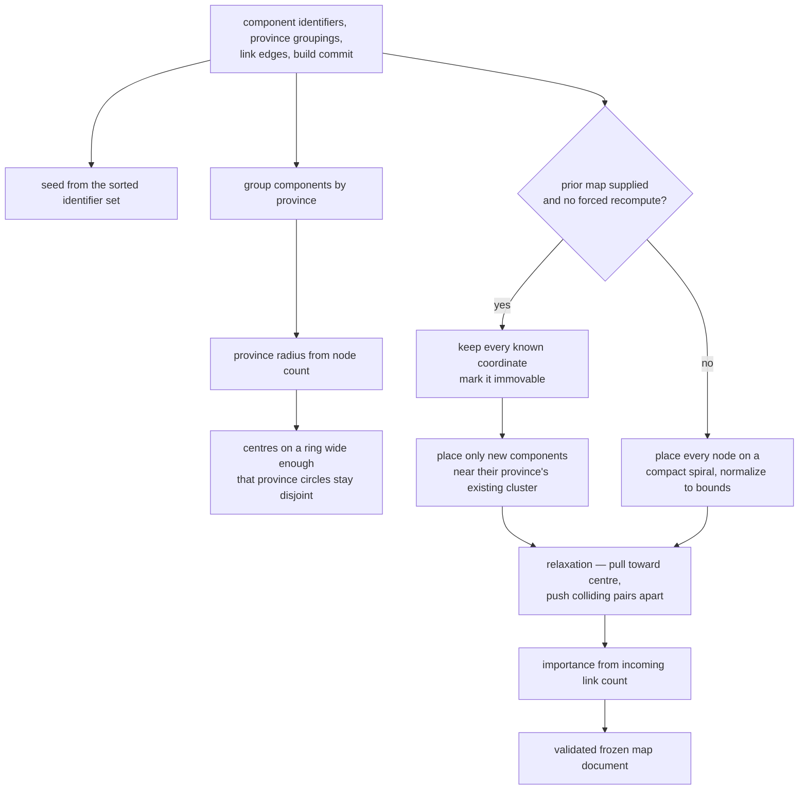

## Summary

This component turns a set of components and their province groupings into fixed positions on a unit-square canvas. It does so without any system randomness, so the same inputs always yield the same map, and it defaults to preserving every position it has already assigned, so an existing map grows rather than reshuffles. It also computes each component's importance weight from the link structure of the papers.

## What it does

Drawing a graph is a solved problem with many good answers, and almost all of them are wrong here. Standard graph layouts optimize for aesthetics computed fresh each time: they start from random positions, run a simulation until it settles, and produce a pleasing arrangement that differs on every run. That is fine for a visualization you look at once and fatal for a map you are supposed to memorize.

The purpose of this map is to give a learner a stable mental geography of a codebase — the sense that a subsystem lives "over on the right, below the big one" and can be found again without reading labels. Every property here follows from protecting that. Determinism means regenerating the map moves nothing. Incremental placement means a growing codebase moves nothing. Geometric province separation means the regions a reader learns to recognize stay recognizable as the component count changes. A second job rides along: the same pass computes each component's importance, because importance depends on the link graph the layout is already holding.

## Related components

The output of this component is exactly the document described in [The Frozen Map Document](../map-schema/), and the layout result is validated against that schema before it is returned, so a geometry bug becomes a loud failure rather than a corrupt artifact. Its input — component identifiers, province groupings, and the link edges — comes from [Loading the Coverage Memory Tree](../../memory/paper-loader/); in particular, the cross-links that become edges are harvested from each doc's Related components section, which is why writing those links carefully is what actually determines node sizes. The rules that make those links and groupings legible in the first place belong to [Paper Format and Frontmatter Contract](../../memory/paper-format/): a province declared inconsistently or a link written with a path this layout cannot recognise does not fail loudly here, it simply produces a smaller node in a lonelier neighbourhood.

The layout is invoked as one of the final steps of [The Mode B Build Protocol](../../memory/memory-builder-skill/), after papers are written and linked, and it is exposed to a human as a subcommand of [The Command Surface](../../platform/cli-surface/), which also owns the choice between the incremental default and the forced full recompute. Downstream, [Drawing the Map from Frozen Geometry](../../viewer/map-canvas/) consumes the positions and sizes literally, and [Scoring: Exponential Averaging, Loyalty, Classification](../../comprehension/coverage-model/) consumes the importance values as weights in the aggregate progress figure — which is why an importance derivation that looked purely cosmetic actually moves a number the learner is judged by. Those weights do not reach the scoring arithmetic by themselves: [Impure Edges: Git Churn, Clock, and Disk](../../comprehension/coverage-materialization/) is the layer that reads this frozen document off disk and passes the roster and its weights into an otherwise pure fold, so a component this computation has not yet placed is one the scoring pass cannot weigh.

## How it works

The computation begins by sorting: provinces by identifier, and component identifiers within each province. Sorting is not tidiness but the precondition for determinism, since every later step consumes these lists in order and must not depend on the order the papers happened to be read from disk. A seed is then derived by hashing the sorted set of component identifiers, and drives a small deterministic generator that supplies a base rotation angle for the whole map and a tiny per-node jitter, replacing system randomness entirely. One subtle detail matters: the generator is advanced the same number of steps for every node whether or not that node already has a position. If the stream advanced only for newly placed nodes, adding a component would shift the values every later node receives, and identical inputs could yield different output depending on build history.

Next, geometry. Each province receives a radius grown from the square root of its node count and clamped between a floor and a ceiling, so a large province is wider than a small one but not unboundedly so. Province centres are then placed evenly around a ring centred on the canvas, and the ring's radius is not chosen by taste: it is derived from the largest province radius, the fixed margin, and the number of provinces, so that the distance between adjacent centres works out to at least twice the largest radius plus twice the margin. Two circles whose centres are further apart than the sum of their radii cannot intersect, so that one line of arithmetic guarantees disjoint provinces for any province count, rather than leaving separation to whatever a simulation happens to settle on. A single province is a degenerate case and simply sits at the canvas centre.

On a full recompute, nodes are laid out inside their province circle on a sunflower spiral — a golden-angle arrangement that packs points evenly without clumping — plus a whisper of jitter. The whole arrangement is then uniformly scaled and translated to fill the permitted coordinate band with a small inset from the canvas edges. The scaling is uniform in both axes so province circles remain circles, and the pull targets and radii are scaled by the same factor so later steps stay consistent.

The incremental path differs in a way worth dwelling on. Which path runs is decided by two things: whether a prior map was handed in at all, and whether the caller asked for a full recompute. That request is the only escape hatch, and it is not something the computation ever chooses for itself — it is an opt-in switch on the layout command, and turning it on is equivalent to pretending no prior map exists. Without it, an existing map is always honoured.

On the incremental path, every component already present is loaded at its exact recorded position and marked immovable. Province centres are recomputed as the mean of that province's surviving nodes rather than taken from the ideal ring, so a new component joins its actual neighbours wherever they ended up; an entirely new province falls back to its ideal ring slot. Only components the prior map has never seen are seeded on the spiral and allowed to move, and there is no global normalization on this path, because rescaling would move existing nodes.

Both paths finish with the same relaxation, whenever there is anything left to relax. Each pass first nudges every movable node a small fraction of the way toward its province centre and clamps it inside the province radius and the canvas bounds, then sweeps every pair of nodes and pushes apart any that are closer than the minimum spacing. Immovable nodes participate as obstacles: a movable node colliding with a frozen one absorbs the entire correction itself. Coincident points are separated along a direction derived from their indices, keeping even that degenerate case deterministic. Pushes target slightly more than the minimum spacing, because corrections applied to later pairs in the same sweep can nibble at the separation achieved for earlier ones, and a final run of push-only passes with the centre pull switched off lets the separation settle. Tests assert both that no two nodes end closer than the minimum and that the large majority of nodes end up nearest their own province centre.

The relaxation is also skipped entirely when no node is movable, and that skip is the strongest form of the stability promise. If an incremental run finds every component already placed — the ordinary case whenever nothing has been added since the last build — the arrangement is never touched, so every position that was read in is written back out unchanged apart from being held inside the permitted coordinate band, which a previously generated map already satisfies. Rebuilding after editing prose or adding links is therefore a true no-op on geometry rather than a small perturbation that happens to be tolerable, and the only thing such a rebuild can change is the importance weights.

Importance is computed separately from geometry, and it is the one field an ordinary rebuild will move. Each component's importance is the number of cross-reference and dependency links pointing at it, divided by the largest such count on the map, so the most-linked component scores one and one nobody links to scores zero; with no such links at all, every importance is zero. Nesting links are pointedly not counted — a component is not made important by having a parent — so importance measures only how often other papers reach sideways to it. This is not the measure the original design called for. The design specified dependency-graph centrality multiplied by code churn; what exists is in-degree over the papers' own prose links. It is a reasonable proxy — a component that many papers must explain themselves in terms of probably is central — but it measures the documentation graph, not the code graph, and a reader should know that.

## Design decisions

Determinism is the decision everything else hangs from. The code states its reasoning directly: spatial stability is the point of the map, so the layout must be byte-identical across runs. Reversing it would make the artifact undiffable — a maintainer could never tell whether a regenerated map changed because components changed or because a simulation wobbled — and it would silently relocate components the learner had already memorized. The cost paid is that the layout is not optimized for edge crossings or aesthetic balance at all: positions come from province membership and packing, and the link graph influences only node size. That trade appears to be accepted knowingly.

Incremental-by-default with an explicit escape hatch is the same principle applied over time. A codebase gains components continuously, and if each addition perturbed its neighbours the map would drift out from under the reader over weeks. Freezing prior coordinates makes growth strictly additive. The escape hatch exists because a map sometimes genuinely should be redrawn — after a large restructuring, or when provinces are reorganized — and forcing that to be an explicit, named act rather than a side effect makes the cost visible to whoever triggers it. If the default were reversed, every routine regeneration would quietly destroy the memory the system is trying to build.

Geometric province separation instead of emergent clustering reflects a requirement the code comments make explicit: the viewer treats a zoomed-out province as one filled region, and a region only reads as a region if it does not interleave with its neighbours. Clustering forces give separation on average; a closed-form ring radius gives it always. The price is a rigid ring arrangement, which sacrifices semantic adjacency between related provinces for guaranteed legibility — apparently a conscious ranking of clarity over expressiveness.

The importance derivation is the weakest link and the code does not hide it. Using incoming link counts is cheap and available, but it measures what the paper authors chose to cross-reference, which means importance is partly a function of how diligently Related components sections were written. Excluding nesting links from the count is the one part of this derivation that is clearly right and worth defending: a parent-to-child link says nothing about whether a component is needed to explain others, and counting it would hand a constant bonus to every nested component purely for where its folder sits. Including it would make importance partly a measure of directory depth, which is the sort of accidental signal a weight that feeds a progress figure should not carry. The wider problem remains, though, and it is not cosmetic: because these values weight the aggregate progress figure, a poorly linked but genuinely central component will be under-weighted in what the learner is told about their own coverage. Restoring the designed measure would require real dependency analysis and a churn scan — work that does not exist here — so for now the honest description is that importance is a documentation-graph proxy for code centrality.

## Where it sits

This component is the reason the map is a map rather than a chart: it assigns positions once, guarantees they never move without an explicit instruction, guarantees provinces stay visually distinct, and hands the result to a schema that refuses anything malformed. It also quietly decides how heavy each component counts, using a proxy that a careful reader should hold at arm's length. The neighbours to understand next are the document format this writes into, the loader that supplies its inputs and its link graph, and the coverage model that turns its importance numbers into a score.
