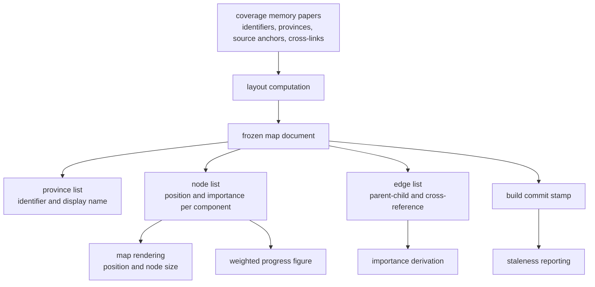

## Summary

The frozen map document is the single artifact that turns a folder of markdown papers into a place. It records, once, where every component sits on a unit-square canvas, how heavy each component is, which components reference which, and which revision of the code the whole picture was drawn from. This component is the schema for that document: the shape every producer must emit and every consumer may rely on.

## What it does

The coverage memory is a tree of prose papers. A tree has no geometry — it has nesting, and nesting alone gives you a file browser, not a map. But the reason for drawing a codebase as a map at all is spatial memory: a person who has visited a place remembers roughly where things were, and can navigate back to them without re-reading an index. That only works if the place stops moving. A layout recomputed on every open is not a map; it is a new city each morning.

So the system computes geometry once and writes it down. The document that holds it needs to be small, boring, and stable enough that half a dozen unrelated readers — the viewer, the progress calculation, the commit gate, the status report — can all depend on it without coordinating with each other. That is what this schema pins down. It also decides, by what it does and does not contain, which questions the rest of the system is allowed to ask cheaply: because importance is stored rather than derived, asking "how heavy is this component" is a field read everywhere, forever.

## Related components

The document is produced by [Deterministic Layout and Incremental Placement](../frozen-layout/), which is the only writer; everything in this schema exists because that computation needs somewhere to put its result. Its input comes from [Loading the Coverage Memory Tree](../../memory/paper-loader/), which walks the papers and yields the component identifiers, province groupings, and the cross-links that become edges. The paths those papers declare feed a different derived artifact entirely, described in [File-to-Component Reverse Index](../file-component-index/), so a reader should not expect this document to say anything about files.

On the consuming side, [Scoring: Exponential Averaging, Loyalty, Classification](../../comprehension/coverage-model/) reads the node list and uses the stored importance as the weight in the overall progress figure, which means a change to how importance is written here changes a number the user watches. [Drawing the Map from Frozen Geometry](../../viewer/map-canvas/) reads positions and importance directly to place and size what it draws. [Pure Materialization of Coverage](../../comprehension/state-engine/) treats the node list as the roster of components that can hold a coverage record at all, so a component absent from this document is one the fold will never produce a score for. Finally, [Source Drift and Staleness Flagging](../drift-detection/) is the component that consumes the build commit stamp, and it is also where you should look to understand how little that stamp currently does.

The document also has to travel. [Serving the Map and Its JSON API](../../viewer/local-server/) reads the committed file off disk and hands it to the browser unchanged over a single endpoint, which is why the shape defined here is effectively a public interface rather than an internal one. On the far side of that call, [Live Data Versus Sample Fallback](../../viewer/viewer-data-layer/) either receives it or substitutes a bundled fictional stand-in built to this same shape, so anything added here has to be mirrored in that sample or the offline development path silently diverges. The definitions themselves reach the browser through [Keeping Platform Builtins Out of the Viewer](../../platform/browser-safe-surface/), which re-exports this schema on an entry point that excludes anything touching the filesystem — the reason viewer and command line can never disagree about what a node is.

## How it works

The document has five top-level parts. A version number marks the document format itself, so a future reader can tell an old file from a new one. A build commit stamp records the revision of the repository the papers were written against. Then three lists: provinces, nodes, and edges.

A province entry is only an identifier and a human display name. Provinces have no geometry of their own in this document — no centre, no radius, no boundary polygon. Whatever region a viewer draws around a province, it must infer from the positions of that province's nodes. This is a deliberate thinness: the province list exists so that names can be displayed and nodes can be grouped, not so that regions can be authored.

A node entry names a component, names the province it belongs to, and carries a horizontal and a vertical coordinate plus an importance value. All three numbers are constrained to the range from zero to one inclusive, and the schema enforces those bounds rather than trusting the producer. The coordinates are normalized: the canvas is the unit square, and any real display maps that square onto its own pixels. Importance is likewise a normalized weight rather than a raw count, so it can be multiplied against a coverage fraction without unit confusion.

An edge entry names a source component, a target component, and a kind drawn from a fixed set of three: parent-child nesting, cross-reference, and direct dependency. Only the first two are produced today — the loader emits nesting edges between papers that contain one another and cross-reference edges from the links in each doc's Related components section. Nothing in the current system emits dependency edges; the value is declared and reserved. A reader should treat it as an empty slot, not as evidence that dependency analysis exists.

The nesting kind deserves a sharper caveat than "produced". A nesting edge is emitted only when one component paper's folder sits inside another component paper's folder. A paper filed directly under a province has no component above it — a province is a grouping, not a component, and gets no node of its own — so it produces no nesting edge. In a memory laid out two levels deep, which is the ordinary arrangement, the nesting kind is therefore declared, implemented, and still entirely unused. Only cross-reference edges actually populate a typical document.

The invariant the schema is really protecting is that this document is the contract, not the code that happens to write it. Layout output is parsed through the schema before it is returned, so a computation that produced an out-of-bounds coordinate or an unknown edge kind fails at the boundary rather than writing a corrupt map that some downstream reader discovers weeks later. The fixture document that ships alongside the schema serves the same purpose from the other direction: it is a hand-written, minimal, valid instance that proves the shape is inhabitable and gives tests something to validate against without running a real build.

There are gaps worth stating plainly. Nothing in the schema constrains referential integrity: an edge may name a component that has no node, a node may claim a province that is not listed, and the schema will accept it. Those consistency properties are maintained by the producer, not enforced here. Nor does the document say anything about coverage. It is deliberately static — geometry and weight only — while everything that changes as a person learns lives in separate per-user state described in the comprehension province. That separation is what allows the map document to be committed to the repository and shared, while comprehension stays private to each reader.

## Design decisions

Normalized coordinates are the load-bearing choice. The code suggests the motivation is display independence: the map has to render on a laptop and a phone, at several zoom levels, without the stored numbers changing. If coordinates were pixels, every one of those situations would either distort the layout or require rewriting the frozen document — and rewriting the frozen document is exactly the failure the whole design is arranged to prevent, because a moved component breaks the reader's memory of where it was. With normalized coordinates the document is written once and every viewer solves its own scaling problem locally.

Storing importance rather than deriving it looks like a consistency decision more than a performance one. Several consumers use importance for different purposes — sizing a drawn node, weighting the aggregate progress figure, ranking which components matter when the commit gate has to choose one. If each derived it independently from the edge list, a change to the derivation in one place would silently disagree with the others, and the user would see a node drawn large while progress counted it small. Persisting one number makes disagreement impossible. The cost is that importance goes stale until the layout is recomputed, which the design appears to accept because importance changes slowly.

The build commit stamp is the weakest of these decisions in practice, and honesty demands saying so. The intent is clearly that the map is anchored to a known revision so that later drift can be judged against it. What is actually implemented is a stamp that gets written and read back for display. The staleness that the system genuinely computes anchors on a different reference — the revision at which each individual component was last confirmed by a comprehension check — not on this document-level stamp. If the stamp were removed today, very little would break; if per-component drift reporting were finished as designed, it would become load-bearing.

Declining to check referential integrity is a decision the schema makes by omission, and it is defensible in one direction only. Shapes and ranges are properties of a single field and can be checked without context; whether an edge's target exists is a property of the whole document, and enforcing it would make the schema a graph validator rather than a shape validator. Keeping it narrow means a consumer can validate a fragment, a fixture can be hand-written without a full node list, and the producer stays the single place responsible for coherence. The cost is real, though: a cross-reference to a component that was renamed or deleted passes validation silently and reaches the viewer as an edge pointing nowhere. If that class of bug becomes common, the honest fix is a separate consistency pass over the assembled document rather than pushing graph rules into a per-field schema.

Reserving a third edge kind that nothing emits is a small forward-compatibility bet. This appears to be because adding an enumerated value later is a breaking change for any reader that validates strictly: documents containing the new kind would be rejected by older readers, requiring every consumer to upgrade in lockstep. Declaring it now costs nothing and means a future dependency-analysis pass can start emitting those edges without a version bump. The risk of the bet is documentation drift — a reader may reasonably assume a declared kind is a produced kind — which is why it is called out explicitly here.

## Where it sits

This document is the map's skeleton: normalized positions, a per-component weight, a grouping into provinces, a link graph, and a provenance stamp. Understanding it means understanding what the rest of the system is permitted to assume — that positions never move on their own, that importance is a fact rather than a calculation, and that coverage lives somewhere else entirely. The two neighbours that matter most next are the layout computation that produces this document and guarantees its stability, and the coverage model that multiplies its importance values into the number a learner watches climb.
