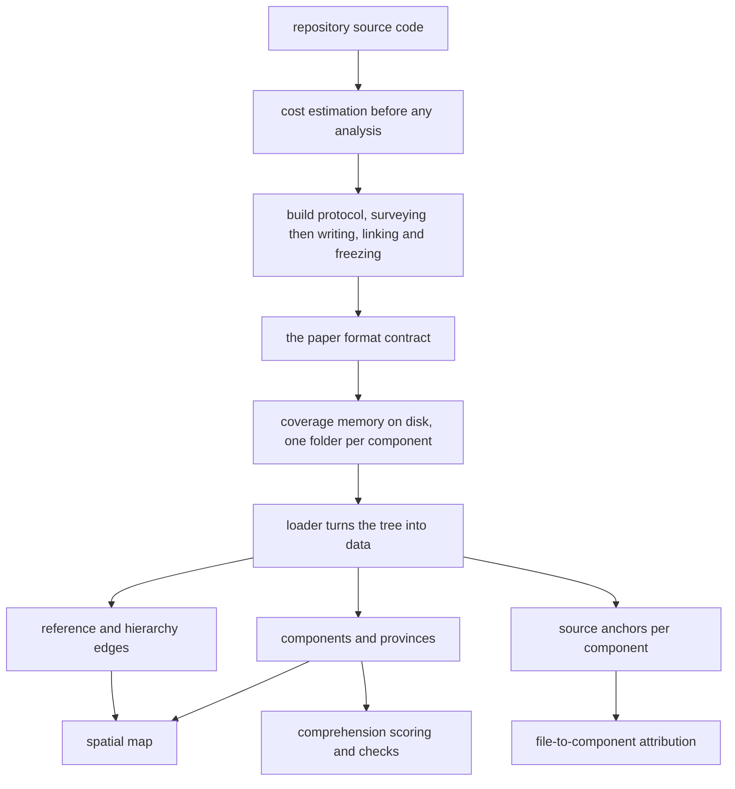

## Summary

This province owns the artifact at the centre of the whole system: a tree of markdown papers, one per component of the target repository, committed alongside the code it describes. It defines what a paper must contain, produces papers by running a capable model over the repository under a strict protocol, tells a person what that build will cost before they authorize it, and reads the finished tree back into the structured form every other part of the system consumes. Everything else — the map, the comprehension scores, the checks, the quests — is downstream of what is written here.

## What it does

A junior engineer working with an agent can ship code faster than they can understand it. The response this system makes is to write the understanding down first: a senior engineer, with a high-capability model, charts the repository once into a set of learnable components, each with an explanation, a set of named ideas a person can be quizzed on, and the reasoning behind its design. That charted set is the coverage memory, and it is the ground truth against which a person's real comprehension is later measured.

Because it is ground truth, the memory has an unusual set of requirements. It must be readable by a person as ordinary documentation, since that is how a junior learns from it. It must be readable by machines with enough structure to hang scores, coordinates and generated questions on. It must survive the code changing underneath it, because it will be built once and used for months. And it must be affordable to produce, because producing it is the most expensive operation the system performs. This province is the four-way answer to those requirements.

## Related components

Within this province, [Paper Format and Frontmatter Contract](./paper-format/) is the specification everything else orbits — it defines the permanent identifier, the file anchors, the quizzable concepts, the reasoning entries with their provenance, and the seven-section prose body. [The Mode B Build Protocol](./memory-builder-skill/) is the procedure that produces papers satisfying that specification, with its two mandatory human stops and its deterministic hand-off for geometry. [Pre-Flight Build Cost Estimation](./build-cost-estimator/) is what fills the first of those stops, projecting cost, time and component count from a repository scan and one measured real build. [Loading the Coverage Memory Tree](./paper-loader/) closes the loop by walking the finished tree and turning it back into components, provinces and edges.

Outside the province, the closest neighbour is [The Frozen Map Document](../map/map-schema/), whose nodes and edges are populated entirely from what the loader extracts, and which is the reason the paper identifier can never be renamed. [File-to-Component Reverse Index](../map/file-component-index/) consumes the file anchors declared in every paper header, and is the join that turns an edited file into evidence about a component. [Quiz and Socratic Protocols](../interventions/tutor-skill/) consumes the other half of the header — the concepts and the rationale — which is why a vaguely written concept becomes a worthless comprehension check downstream.

## How it works

The province divides its responsibility along the natural life of the artifact: define it, price it, build it, read it.

Definition is the contract component. It holds the schema a component paper's header is validated against and the fixtures that demonstrate a conforming paper. Its central claims are that a component's identifier is permanent and independent of both folder name and title, that source anchors are whole files and never finer, that concepts are atomic enough to be examined one at a time, that every piece of design reasoning records where it came from, and that the body of a paper contains no code of any kind. That last rule is the discipline the format inherits from the documentation method it was forked from, and it is what keeps papers explanatory rather than duplicative.

Pricing is the estimator. It is intentionally the cheapest thing in the province — a filesystem scan plus arithmetic, no model call and no network — because it must run before anyone commits to the expensive part. It projects token usage, wall-clock time and component count from source line count using constants fitted from a single instrumented real build, and prices that projection for each of the two build-tier models while pointedly refusing to list the cheap intervention-tier models beside them.

Building is the protocol. It is written as instructions a capable model executes: stop and show the cost, stop and get the partition approved, then write papers in parallel one writer per province, link them, and hand geometry to a deterministic command that the model is explicitly forbidden to do by hand. On later runs it updates only what has drifted rather than rebuilding, and places genuinely new components incrementally so nothing already on the map ever moves. One dependency of that update path is honestly incomplete: the drift detection it is written to call currently reports only commit identifiers rather than per-component churn, so today a person running an update identifies the affected components themselves.

Reading is the loader. It walks the tree of any repository, decides each document's role by its depth, validates component headers strictly while treating orientation papers leniently, derives the province grouping from folder layout, and extracts the graph from the cross-links a writer wrote in prose. It is deliberately forgiving — a missing memory yields nothing rather than an error, and a malformed paper is skipped with a warning — because it sits underneath commands people run while the memory is being edited.

## Design decisions

The seam that defines this province is the artifact itself. Every component here either specifies, produces, prices or parses the same tree of markdown documents; nothing here knows what a comprehension score is, how a map is laid out, or when a person should be interrupted. That is what makes the grouping honest rather than merely convenient: the four components share a data format, and a change to that format touches all four and nothing outside them.

The alternative groupings are worth naming. The estimator could plausibly have been filed with the command surface, since half of it is a subcommand, and the build protocol could have been filed with the other model-facing skills. Both would have scattered the format's dependents across the system, so that a person trying to understand what a paper is would have to visit four provinces to find out. Keeping them together makes the contract legible in one place, which matters disproportionately here because the contract is what the entire rest of the system is built on.

The province also draws one boundary very deliberately: it stops at geometry. The memory defines what components exist and how they relate, but never where they sit. That decision is enforced inside the build protocol by an explicit prohibition and pushed across the seam to the spatial province, because positions must be reproducible in a way that a model's judgment cannot be. Reversing that boundary would let a rebuild silently rearrange the map, and a map that rearranges is no longer a place anyone can remember.

## Where it sits

The coverage memory is the system's foundation and this province is everything that touches it directly: the contract a paper must satisfy, the estimate that makes building one a considered decision, the protocol that builds it, and the loader that turns it back into data. Read the format contract first — it explains why an identifier is permanent and why bodies carry no code. Then follow the artifact outward into the spatial map, which is drawn entirely from what the loader finds, and into the comprehension model, which scores a person against exactly the concepts each paper declares.
