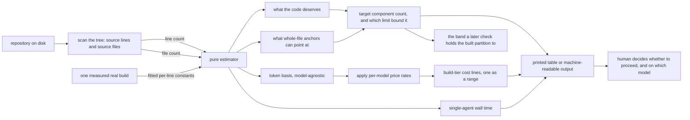

## Abstract

Building the coverage memory is the single most expensive thing this system does, and it happens on the most capable model tier. This component answers the question a person needs answered before agreeing to that spend: roughly how much, roughly how long, and roughly how many components will come out. It does so with no model call and no network access at all — a filesystem scan measures the repository's shape, and pure arithmetic derived from one carefully measured real build turns that shape into a component target, a token basis, a time estimate, and a per-model price table. The cost half is deliberately rough and says so; the component target is not, because it is the number the finished partition is later checked against.

## Introduction

A person asked to authorize an expensive, slow, irreversible-feeling operation needs a number first. Without one they will either refuse a worthwhile spend or agree to an unbounded one, and neither is a good outcome. The build protocol therefore opens with a mandatory stop where the estimate is shown and the model tier is chosen, and this component is what fills that stop with something real.

The difficulty is that the true cost of a build is not knowable in advance. It depends on how the model chooses to read the repository, how much context it accumulates, how many components it settles on, and how verbose the papers turn out. What is knowable is that all of those scale, roughly, with how much source code there is. So the estimator takes the things that can be measured cheaply and exactly — how many source lines the repository has, and how many source files — and projects everything else from a single real build that was instrumented end to end. That is one data point, which is a weak foundation for precision and a perfectly adequate one for an order of magnitude.

The second measurement carries a different kind of weight, and it was added after a build went wrong. How many components a repository deserves is a judgement about content, but how many it can *express* is a hard limit set by how the papers point at code: a paper names whole files. Past one component per file, several components share a file, and everything that turns an edit into a territory — the gate, the credit a junior earns for touching code, the detection that a colleague changed something — can no longer tell them apart. A build that ignored the estimate once produced four and a half components for every source file it anchored, and all three of those mechanisms broke together. So the estimate now reports both limits and which one binds, and the count it prints is a contract rather than a guess.

## Related Work

The direct consumer is [The Mode B Build Protocol](../memory-builder-skill/), whose very first stage is to run this estimate, present its table unaltered, and refuse to read a single source file until the user has confirmed. The model choice made at that stop is stored and read through [Conditions, Budgets, Thresholds, and Model Tiers](../../platform/config-schema/), which is also where the two-tier policy this component enforces in its table is defined. The scan and the rendering live alongside every other subcommand in [The Command Surface](../../platform/cli-surface/), which is why the impure half of this component shares a file with unrelated features. The cheap tier that the table pointedly excludes is the one used by [Selection, Generation, and Offline Fallback](../../quests/quest-generation/), the recurring per-session cost this one-time cost is contrasted against. The component count the estimate produces is the target that [The Mode B Build Protocol](../memory-builder-skill/) proposes a partition against and stops for approval on. The two are no longer independent: the protocol used to carry a fixed range of its own that silently overrode this one, which is how a repository sized for eight components was built with thirty-six. The range is gone, and a partition landing outside the band this component prints is a reason to stop and re-approve rather than a discrepancy to mention afterwards.

## Description

The component is split cleanly in two, along the line between pure and impure.

The pure half lives in the shared engine and is arithmetic over the two measured numbers. It carries three blocks of data. The first is a table of published price rates per model, expressed per million tokens and broken into uncached input, output, cached reads and cache writes, kept as data specifically so that a price change is a one-line edit. The second is the measured build: a real single-agent run over a repository of a little over six thousand source lines that produced twenty-two components in about sixteen minutes for roughly ten dollars, with every token category recorded. The third is the set of per-line constants fitted from that measurement — cached read tokens per line, cache-creation tokens per line, output tokens per line, seconds per line, and source lines per produced component.

Given the line count, the estimator multiplies through those constants to get a token basis and a single-agent time, and divides by the fitted lines-per-component figure — a little under three hundred lines each — to get how many components the code deserves. Separately it reads the file count as a ceiling, because one component per file is the finest partition whole-file anchoring can resolve. The target is the smaller of the two, floored so that a tiny repository still gets a handful, and the result records which limit bound it: when files bind, the honest reading is not that the repository deserves fewer territories but that this anchoring cannot express the ones it deserves.

Around that target the estimator computes an approval band of half again in each direction, and the shape the target implies — how many groups, and how many levels of grouping are needed so that no group holds more than nine children. The band has one further constraint: it is never allowed to reach past what a single flat layer of groups can hold, because authorizing a size the map cannot be drawn at would be authorizing nothing. A repository large enough that its target already exceeds that ceiling is told it needs another level of grouping, which the stored map does not yet support. The token basis is deliberately model-agnostic: the insight recorded in the source is that a build does the same work regardless of which model performs it, so only the price rates differ. Uncached input is omitted from the cost entirely because the measured build showed it to be negligible — barely a hundred tokens against millions of cached reads.

Cost per model is then that token basis priced at that model's rates. Only two models are computed, both from the build tier. One of them is treated specially: because its thinking is always on, it emits noticeably more output for the same work, so its line is returned as a low-to-high range using a stated multiplier on the output tokens alone. Every other model returns an identical low and high, which is how the renderer knows whether to print a single figure or a range.

The impure half lives in the command layer. It walks the working directory counting newline bytes in every file whose extension appears in an allow-list spanning roughly twenty common languages, skipping a fixed set of directories — dependency folders, build output, version-control metadata, the coverage memory itself, and test directories — and skipping any file whose name marks it as a test or specification. Unreadable files are silently ignored. This is not a sophisticated line counter, and its blind spots are worth knowing, and they now matter twice over because the scan sets the partition target and not only the price. A repository written mainly in a language outside the allow-list scans as almost nothing, and will produce a floored target that is badly wrong in a quieter way than before: with no files recognized, the ceiling is zero, the floor wins, and the estimate reports a comfortable handful of components for a repository it cannot see at all. Blank and comment lines are counted like any other. Whatever the scan excludes is excluded from both numbers, so an exclusion rule is now a statement about how big the map should be.

The rendering shows the repository size and the target component count with its band, then says which of the two limits bound that target and in what terms, then the shape it implies in groups and levels, then the two build-tier models with cost and estimated time, then a footer that does three honest things. It states the accuracy band as roughly plus or minus half. It explains that cached reads dominate the cost and grow faster than linearly for large single-agent builds, so that fanning out per province keeps cost roughly linear and divides wall-clock time by the number of provinces — which means the printed time is a single-agent upper bound rather than what a fan-out build will actually take. And it names the cheap intervention tier and its per-session cost range, so a reader understands that the expensive figure above is a one-time charge and not a recurring one. A machine-readable output mode emits the same numbers without the prose.

## Rationale

Splitting the arithmetic from the scan is the structural decision, and the source comment states the intent directly: no filesystem, no version control, no model — the command layer does the scan and feeds a number in. The practical benefit is that the estimate for a given repository shape is exactly reproducible and can be tested without a fixture repository, which matters more now than when it was only a spending decision: the same arithmetic is what a later check re-runs to judge whether the finished partition kept to what was approved. Folding the scan inward would make the estimator depend on disk state, and would make its behaviour on an unusual repository impossible to characterize without building one.

Preserving the measured build as structured data rather than as a comment is a small decision with a clear stated motive: keeping it in the source means that re-calibration, once more real builds are measured, is a data edit rather than code archaeology. It also has an accountability effect the code does not spell out. Anyone who distrusts the estimate can see precisely what it is extrapolated from — one build, one repository, one agent — and calibrate their own trust accordingly. Reducing it to derived constants alone would leave a set of unexplained magic numbers whose provenance would evaporate within a month. The record has one acknowledged gap, and it is recorded as a gap rather than filled in: that build predates the file count being a sizing input, so nobody can now say whether its component count was what its code deserved or what its files allowed, and any future re-fit has to record both.

Excluding the cheap tier from the table is a policy statement dressed as a formatting choice, and the source comment is explicit that it is deliberate. The two tiers are separated because they do different jobs: the build happens once and its quality is inherited by everything a junior later learns, while interventions happen every session and must be cheap enough to repeat. Putting a cheap model on the same table would frame a one-time quality decision as a price comparison, and the predictable outcome — a memory built badly to save a few dollars — would be undetectable at build time and expensive forever after. Naming the cheap tier in the footer keeps the reader informed without offering it as an option.

Presenting a wide band rather than a confident figure is the honesty decision. The source calls the estimate rough by design and an order-of-magnitude decision aid rather than a billing figure. With a single calibration point and a cost driver that is admitted to grow non-linearly, a precise-looking number would be a false claim, and the failure mode of false precision is worse than that of admitted roughness: a person who is told a figure is approximate will check their actual spend, while a person given two decimal places will not.

## Conclusion

This component turns a repository into a decision. A cheap scan, a handful of constants fitted from one real measured build, and a stated error band are enough to tell a person whether the coverage memory is worth building and on which model to build it — before a single source file has been read. It exists to serve the mandatory stop at the front of the build protocol, so read that next, and read the configuration component to see where the model tiers it enforces are actually defined.
