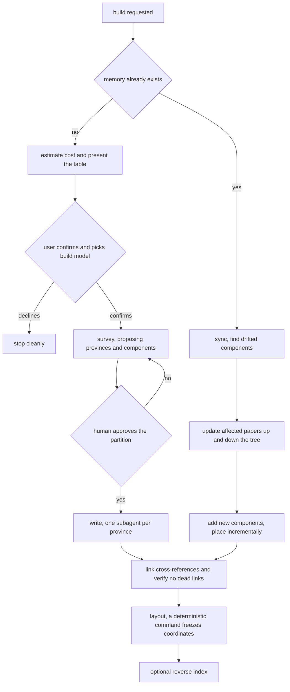

## Abstract

The coverage memory does not appear by itself: a senior engineer runs a high-capability model over the repository once, and it writes every paper. This component is the protocol that run follows — a six-stage procedure with two mandatory human stops, a partition size taken from arithmetic rather than from the protocol itself, parallel writing per province, and a strict separation between what the model decides and what a deterministic command decides. It also defines the far cheaper sync path used on every later run, where only papers whose sources have drifted are revisited. It is documentation-as-program: a skill file the model reads and executes, plus a short command that invokes it.

## Introduction

Building a coverage memory for a real repository means producing dozens of documents, each anchored to real files, each carrying quizzable concepts and inferred design reasoning, all cross-linked into a connected graph. That is far too much work for a person, and it is exactly the kind of work a capable model is good at — provided it is told, precisely, what shape the output must take and where it is allowed to make decisions.

Two forces shape the protocol. The first is cost: a full build is the single most expensive thing the system ever does, and it runs on the most capable model tier, so a person must be able to see the price and decline before any spending starts. The second is that one decision inside the build dominates every downstream outcome — how the repository is partitioned into components. Too coarse and no paper is learnable in one sitting; too fine and the map becomes noise. That decision is made once, is expensive to revisit, and is not one a model should make unsupervised. Both forces are answered the same way: with a hard stop and a human answer.

## Related Work

The output of this protocol is governed by [Paper Format and Frontmatter Contract](../paper-format/), which the skill restates in condensed form as instructions to the writing model. The cost gate that opens the protocol is powered by [Pre-Flight Build Cost Estimation](../build-cost-estimator/), whose table the builder is required to present verbatim. The layout stage hands off entirely to [Deterministic Layout and Incremental Placement](../../map/frozen-layout/), which is the component the protocol explicitly forbids the model to do by hand. Sync mode is meant to be driven by [Source Drift and Staleness Flagging](../../map/drift-detection/), and the honest state of that dependency is discussed below. The optional final stage regenerates [File-to-Component Reverse Index](../../map/file-component-index/), which is what lets the junior-side signal capture attribute an edited file to a component. The build-tier model choice offered at the cost gate is stored and read through [Conditions, Budgets, Thresholds, and Model Tiers](../../platform/config-schema/), and the protocol is reached from chat through [User-Initiated Entry Points](../../interventions/slash-commands/). The artifact that layout stage writes is [The Frozen Map Document](../../map/map-schema/), the committed geometry the protocol declares off-limits to hand editing, so reading it is the quickest way to see what the model is being kept away from. The terminology rule the skill opens with is only intelligible beside [The Single Skin Boundary](../../viewer/terminology-skin/), the one place the presentation vocabulary is permitted to exist — every paper this protocol writes must stay neutral precisely so that translation has a single home. And the skill itself is shipped to a junior's machine as plain instructional content rather than compiled output, which is the arrangement described in [Bundling and Distributing the Plugin](../../platform/plugin-packaging/).

## Description

The protocol is written as a skill: a single instruction document that a capable model loads and follows, framed as a role — the senior cartographer building a memory a junior will learn from. It opens with the terminology rule, because the system has two vocabularies and only the neutral one may appear in a paper; the strategy-game vocabulary belongs to the map's rendering layer alone. It then restates the output tree, the extended header contract and the seven-section body form, before laying out the five stages.

Stage zero is the cost gate, and the skill is emphatic that it comes before reading a single source file. It fixes two things at once, and only one of them is money: the estimate names both the price and the number of components the partition will be held to. The estimate is run in the target repository, its output is presented to the user unaltered, and the model must then ask two questions and stop: whether to proceed at all, and which of the two build-tier models to use, with the configured default offered as the pre-selection. The intervention-tier models are explicitly not offered here — the tiers never mix. If the user declines, the run stops cleanly. This gate is mandatory on every fresh build and is skipped only by sync mode, on the reasoning that sync touches only drifted papers rather than the whole repository.

Stage one is the survey. The model explores the repository — its own readme, entry points, directory layout, build manifests, route tables, schema definitions — and proposes a partition: as many components as stage zero sized the repository for, each with a proposed identifier, title and candidate source anchors, grouped into top-level feature groups of five to nine named after user-facing or architectural seams rather than after directories. A component is described as roughly what a junior could understand in one sitting. The proposal is presented as a table or tree and the run stops for approval.

The size of that partition is not the protocol's own judgement to make, and this is the part of the document that was rewritten after it went wrong. The protocol used to carry a fixed range in both directions and to instruct the model to merge or split until it fitted, whatever the estimate had said. On a small library the range's floor was four times the estimate, the model obeyed the range, and the result put four and a half components on every source file it anchored — enough that the machinery which turns an edit into a territory could no longer tell which one the edit was in.

So the range is gone. The target and the band around it come from the estimate, which computes them from how much code there is and how many files there are to anchor it to. Two constraints survive as absolutes because they are about what the anchoring can express rather than about taste: no component may be finer than a file, and a file claimed by two components is a cost to be justified rather than a way to subdivide a large one. If the model's honest partition falls outside the band, the licensed move is to stop, say which way it differs and why, and get the revised number approved before writing — not to build past it and mention the discrepancy afterwards, which is precisely what happened. Where a repository has few, very large files, the honest fit is the file count, and finer partitioning waits for anchors that can name something smaller than a file.

A final stage re-runs the same arithmetic against what was actually built and fails the run if it no longer holds, so the number the user approved is checked rather than merely intended.

Stage two is writing, and it fans out: one subagent per province, each given its province, its component list with anchors, the paper form and the terminology rule. Each writer produces complete headers with every rationale entry marked as inferred, a hero diagram, and all seven sections, explaining the declared concepts in the description and the declared decisions in the rationale section. The province orientation papers and the root paper are written too, orienting rather than teaching.

Stage three is linking. Every paper's cross-reference section must point at its true neighbours, every link must resolve to a folder that exists, and reciprocal links are added where a relationship is mutual. Zero dead links is required before proceeding, and the reason is mechanical: the loader silently drops any link it cannot resolve, so a dead link is not an error message, it is a missing edge in the map.

Stage four is layout, and it is handed to the deterministic command. The skill states in bold that the model never hand-places nodes and never edits coordinates. The command computes clustered positions, normalizes them, and writes the frozen map document with its provinces, its nodes carrying position and importance, and its two kinds of edges — parent-child from folder nesting and reference from the cross-links. Optionally the reverse index is regenerated; papers and the frozen map are committed, while the index is treated as regenerable and left out of version control.

Stage five is sync, used on every later run. It does not rebuild. It asks which components have drifted since the build, re-reads their anchors, and updates those papers progressively — fixing the description, revising the concepts if the shape of the component changed, and revising the reasoning while keeping provenance honest, since newly inferred reasoning stays inferred. Changes that alter a component's role ripple upward into the province and root papers. Genuinely new components get a full new paper and are placed incrementally by re-running the layout, which never moves an existing node. Links are verified again at the end.

One honest caveat about sync mode: the drift step it depends on is currently a stub. The command it calls reports only commit identifiers — it does not yet compute per-component source churn — so in practice a person running sync today must identify the affected components themselves rather than being handed a list. The protocol is written for the intended behaviour; the machinery underneath it is not finished, and a reader should not assume otherwise.

The skill closes with a self-check list covering whether the deterministic size check passes, header completeness, the seven sections, the prose-only rule, dead links, the untouched frozen map, neutral terminology throughout, and honest provenance marking. The accompanying command file is thin by design: it decides between full build and sync by whether a memory already exists, accepts an optional scope argument or a dry-run that produces only the survey plan, and repeats the instruction to stop for approval after the survey.

## Rationale

The two human stops are the heart of this protocol, and they guard different risks. The cost gate guards money. The build's expense is concentrated in reading the repository, so an estimate delivered after the survey would arrive after a large share of the spend had happened; putting it before any file is read is what makes declining actually free. The insistence that the table be shown verbatim, rather than summarized, reads as a guard against a model softening an uncomfortable number.

The survey gate guards correctness of a kind that cannot be fixed later. The plan document names component granularity as the make-or-break decision, and the skill inherits that framing. Reversing this stop — letting the model partition and proceed — would not produce a visibly broken build; it would produce a plausible-looking memory whose components are the wrong size, a failure discovered only weeks later when a junior finds the papers unlearnable and every identifier is already load-bearing for accumulated comprehension.

Fixing a range at all, rather than leaving the size to judgment, was the right instinct answered in the wrong place. The reasoning behind it still holds: a model asked to partition with no target has no pressure toward any particular resolution and will drift with the shape of the repository, which is precisely the variable this system cannot afford to leave free — too coarse and no paper is learnable in one sitting, too fine and the map stops being memorable. What was wrong was where the range lived. Written into the protocol, it was the same two numbers for every repository, and a repository they did not fit was told to merge or split until it did. So the constraint stayed and its source moved: the target is computed from the repository's own size and from how many files there are to anchor papers to, and it is that computed band the proposal is held to. A deterministic check re-runs the same arithmetic against what was built, which is what converts an open aesthetic question into something a model can be held to and a human can argue with in one glance at a table. The cost of a guessed range being slightly wrong is a partition that is a little lumpy; the cost of having no range is a partition whose size nobody ever decided.

Fanning out per province appears to be chosen for two compounding reasons the estimate's own commentary makes explicit: cost in a single long pass is dominated by repeatedly re-reading accumulated context, which grows faster than linearly, while independent writers each holding one slice keep the total roughly linear and let wall-clock time divide by the number of provinces. The trade is coherence — separate writers cannot see each other's papers — which is exactly why a distinct linking stage exists afterwards.

Forbidding the model to place nodes is the sharpest boundary in the protocol, and the reasoning is stated plainly: spatial stability is the entire point of the map. A person who learns where a component sits should find it in the same place a month later, which is what makes the map a memory aid rather than a diagram. A model asked to place nodes would arrange things differently on each run, and no amount of prompting makes that reliable. Delegating to a deterministic computation, then freezing the result so later builds only add nodes near their neighbours, is what turns a picture into a place.

## Conclusion

This protocol is how the coverage memory comes into existence and how it stays current: a cost stop, an approval stop, parallel writing, a linking pass, and a deterministic freeze — followed thereafter by targeted updates rather than rebuilds. It decides almost nothing about the papers themselves, deferring that to the format contract, and it decides nothing at all about geometry, deferring that to the layout command. Those two are the neighbours to read next, along with the cost estimator whose table opens the whole procedure.
