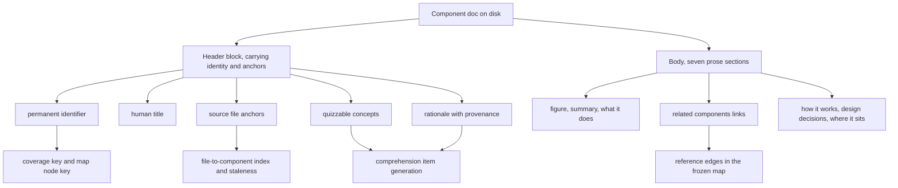

## Summary

A component doc is the unit of the coverage memory: one folder per component, holding one markdown document that a junior engineer is expected to read and be graded on. This component defines the contract that document must satisfy — a structured header carrying identity, source anchors, quizzable concepts and design rationale, followed by a body of exactly seven prose sections containing no code. The contract is enforced by a schema that every component doc is validated against, and it is what makes the rest of the system possible: the header supplies the keys that comprehension scores and map coordinates hang from, and the body's cross-links form the graph the map is drawn from.

## What it does

Documentation usually fails in one of two ways. Either it duplicates the code, in which case it silently rots the moment the code changes and nobody notices; or it is so free-form that nothing downstream can be built on it. The coverage memory needs documentation that survives drift and that machines can read structurally, because a great deal is built on top of it: comprehension is scored per component and per dimension, a spatial map places each component at fixed coordinates, checks are generated from named ideas rather than from whole documents, and staleness is detected by comparing anchored files against the repository's history.

All of that requires a contract. The contract has two halves with deliberately opposite characters. The header is for machines: small, typed, validated, and stable. The body is for people: explanatory prose written for a newcomer, with a fixed shape so that a reader who has read one doc knows how to read every other. Everything that would tie the prose to a particular line of code is banished into the header, where it can be checked and updated mechanically.

## Related components

The reader of this contract at runtime is [Loading the Coverage Memory Tree](../paper-loader/), which walks the memory folder, validates each header against the schema, and quietly skips anything that fails. Its writer is [The Mode B Build Protocol](../memory-builder-skill/), the senior-side procedure that produces docs conforming to this form in the first place, and which restates much of this contract as instructions to a model. The permanent identifier defined here is the key used by [Coverage States and the Three Dimensions](../../comprehension/coverage-schema/), so the two must agree on what a component is. The declared concepts and rationale entries are the raw material for [Quiz and Socratic Protocols](../../interventions/tutor-skill/), which is why vagueness in a concept becomes a worthless comprehension item downstream. The source anchors feed [File-to-Component Reverse Index](../../map/file-component-index/), which is how an edited file becomes evidence about a component. Finally the cross-links in the Related components section of every doc become reference edges in [The Frozen Map Document](../../map/map-schema/), so this section is not decoration — it is the graph. The place a junior most often meets this shape is [Reading a Doc In-App](../../viewer/component-panel/), which renders the seven sections and the header's declared concepts in the browser; that renderer is why the section order is a fixed contract rather than a stylistic habit, since it presents each part in a place a reader learns to expect.

## How it works

The header block of a component doc carries exactly five things, and the schema for it is small enough to hold in your head. There is a permanent identifier, a human-readable title, a list of source file paths relative to the repository root, a list of concepts, and a list of rationale entries.

The identifier is the load-bearing one. It is a lowercase hyphenated slug, unique across the whole memory, chosen once and never changed. It is not derived from the folder it sits in and not derived from the title, even though in practice a well-built memory keeps all three aligned. The independence matters because it is the key under which a particular person's accumulated comprehension is filed, and also the key for that component's frozen position on the map. A rename is not a rename; it is an erasure followed by the appearance of an unknown, unexplored component.

It is worth being precise about what is actually checked. The validation the schema performs is only a shape check: the identifier must be present and must be text. Neither the slug convention nor the uniqueness requirement is enforced by any code — both are disciplines the build protocol imposes on the writer, and both fail silently if broken. Two components sharing an identifier would each load successfully and then collide, one position and one coverage record serving two different components, with no error anywhere to say so. The contract is therefore stronger than its enforcement, which is exactly why it is written down here rather than left implicit in the schema.

Source anchors are file paths and nothing finer — no line numbers, no symbol names. A file may legitimately appear in more than one component's anchors when it genuinely spans concerns, though a clean partition is preferred, because the reverse index built from these anchors is what turns "this file was edited" into "this component was touched".

Concepts are the quizzable atoms. Each has its own stable slug and a one-line name, and the target is two to six per component — enough to cover it, few enough that each is genuinely separable. The discipline here is specificity: a concept phrased as a claim about the system, such as the fact that a cookie carries only an opaque identifier, produces a check that can be right or wrong, whereas a concept phrased as a topic, such as the observation that sessions work, produces nothing usable. A concept must also be answered somewhere in the how-it-works section of the same doc, since that section is the only material a reader is given before being asked about it; a concept declared in the header but never explained in the body is a question with no published answer.

Rationale entries are the other structured half, one to four per component. Each records a decision that was actually made, the force that made it right, the alternatives considered and rejected, and a provenance marker. Only the decision and the provenance are strictly required; the other two are optional, which accommodates a decision whose alternatives are genuinely unknown. Provenance is modelled as an open string rather than a closed set, because the intended values are a fixed word for reasoning the builder inferred from reading code, plus two reference-carrying forms for reasoning traced to a captured interaction or to a recorded interview with the person who made the decision. A fresh build marks everything inferred, honestly, so a later pass can find and upgrade exactly those entries.

The body has seven sections in a fixed order: a single diagram acting as figure one, then summary, what it does, related components, how it works, design decisions, and where it sits. The loader also accepts the legacy academic headings — abstract, introduction, related work, description, rationale, and conclusion — as aliases for those six. The design decisions section is the one addition to the older six-section form this format was forked from, and it exists so that the rationale comprehension dimension has gradable material. The prose-only rule applies to all of it: no paths, no symbols, no snippets, no invocations. The one exception is the opening diagram, a figure rather than prose, whose labels are themselves kept in plain English.

Docs at other depths in the tree are treated differently. A province doc and the root doc orient rather than teach; they carry an identifier, a title and a representative anchor list, but no concepts and no rationale, because nobody is graded on them. The loader reflects this asymmetry: it validates component docs strictly and refuses to admit one whose header does not parse, while it reads a province doc only for its title. The root doc sits awkwardly between the two — it is validated against the full component schema, so the sample root doc in the fixtures carries empty concept and rationale lists purely to satisfy validation, and a root doc that fails is silently ignored rather than reported as an error.

## Design decisions

The strongest decision here is making the identifier permanent and independent. The code says so directly, in a comment on the schema field itself: renaming it would orphan a user's coverage for that component. The consequence of reversing this is easy to picture. If the key were the folder path, then moving a component into a better province — a normal act of curation — would silently reset every person's accumulated comprehension of it and shift its position on the map, destroying exactly the spatial stability the map exists to provide. Keeping the key separate makes reorganization cheap and renaming impossible, which is the right trade in a system whose value accumulates over months.

The gap between that contract and what validation actually checks looks like a deliberate omission rather than an oversight, though the code does not say so and this reading is inferred. A uniqueness check is only possible once the whole tree has been read, which would push it out of the per-doc schema and into the loader — and the loader's entire posture is to degrade rather than reject, so the natural place to raise the alarm is the place least willing to raise one. The cost of leaving it unenforced is a silent collision; the cost of enforcing it in the loader would be a whole-memory failure triggered by one duplicated slug. Given that the identifiers are assigned once, by a supervised procedure, and reviewed by a human before any doc is written, betting on the procedure rather than on a runtime check is defensible — but it is a bet, and a reader should know it is being made.

File-granularity anchoring appears to be chosen for durability. Finer anchors would be more precise on the day they were written and wrong within a week, and they would make staleness detection incoherent, since that signal is expressed as churn in the anchored files. Coarser anchoring — a directory, say — would be more durable still but would blur the file-to-component join badly, since one directory routinely holds several components.

The prose-only rule is the inherited discipline of the documentation method this format was forked from, and the source states its purpose plainly: it forces genuine explanation rather than paraphrased code, and it keeps docs robust when the code drifts. There is a second effect the design suggests but does not state: because a doc cannot quote the code, a check generated from it cannot be answered by pattern-matching that quote, so the check measures understanding rather than recall. Reversing the rule would degrade docs into a second copy of the source — the most common documentation failure, and the one this system can least afford, since its docs are the ground truth for grading a human.

Making rationale structured with per-entry provenance, rather than leaving it as narrative, is what makes the third comprehension dimension possible at all. The design intends a later pass in which a senior engineer is interviewed and inferred reasoning is replaced by attributed reasoning; because provenance already exists on every entry, that upgrade is a data edit rather than a migration. The honest marking matters more than it looks: without it, a guess a model made while reading code would be indistinguishable from a fact stated by the engineer who wrote it, and a junior would be graded on the guess.

## Where it sits

The component doc format is a small contract with outsized consequences. Its header defines the identity, anchoring, quizzable content and reasoning of a component; its body is a fixed seven-section explanation deliberately stripped of every code symbol; and its cross-links are the edges of the map. Almost every other part of the system consumes one of those pieces, so the two neighbours worth reading next are the loader that parses and enforces this contract at runtime, and the build protocol that produces docs satisfying it. After those, the coverage schema is what shows you why the permanent identifier is treated with such care.
