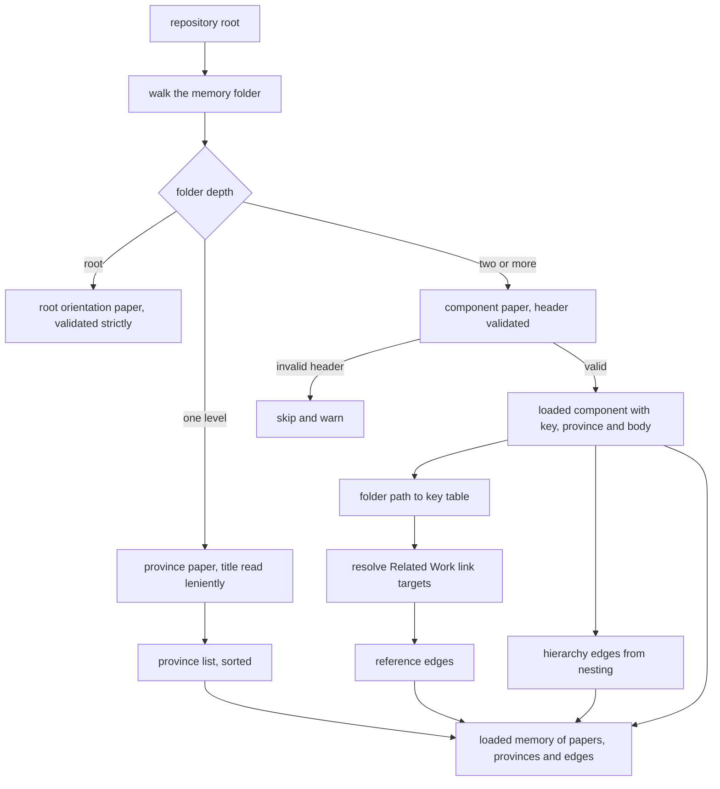

## Abstract

The coverage memory lives on disk as a nested tree of markdown documents, but every other part of the system wants it as data: a list of components, a list of provinces, and a graph of edges between them. This component performs that translation. It walks the memory folder of any repository, splits each document into header and body, validates component headers against the paper contract, derives the province grouping from the folder layout, and turns the cross-links written in prose into graph edges. It is deliberately forgiving — a missing memory or a malformed paper produces less data, never an error.

## Introduction

Two facts about the memory shape this component. The first is that the tree is authored by hand and by model, committed to version control, and read by humans as ordinary markdown; it is not a database export. The second is that everything downstream needs it in structured form — the layout stage needs nodes and edges, the reverse index needs each component's file anchors, the local server needs to look up one paper by key, and the status report needs to know which provinces exist.

So there has to be exactly one place that reads the tree and produces that structure, and it has to be tolerant. The memory is edited constantly during a build; at any given moment some paper is half-written. If reading the tree were all-or-nothing, a single unfinished document would break the map, the status report and the server simultaneously, at precisely the moment a person is most likely to want to look at them.

## Related Work

The contract this component enforces is defined by [Paper Format and Frontmatter Contract](../paper-format/); the loader is the code that decides, in practice, what counts as a conforming paper. Its output feeds [The Frozen Map Document](../../map/map-schema/), whose province, node and edge shapes it constructs directly, and [Deterministic Layout and Incremental Placement](../../map/frozen-layout/), which consumes those nodes and edges to compute coordinates. A projection of each paper's file anchors is handed to [File-to-Component Reverse Index](../../map/file-component-index/), which is how an edited file becomes attributable to a component. On the viewing side, [Serving the Map and Its JSON API](../../viewer/local-server/) uses the lookup-by-key path to answer requests for a single paper, and [Reading a Paper In-App](../../viewer/component-panel/) renders the body text the loader separated from the header. The build procedure in [The Mode B Build Protocol](../memory-builder-skill/) is what produces a tree this loader can read, and its dead-link check exists precisely because links the loader cannot resolve become silently missing edges.

Beyond the map, the loaded tree is what [Impure Edges: Git Churn, Clock, and Disk](../../comprehension/coverage-materialization/) reads to discover which components exist and which files each of them claims, so a paper this loader skips is a component that quietly stops accumulating drift. Every entry point that triggers a load is catalogued in [The Command Surface](../../platform/cli-surface/), whose latency expectations are the reason this walk stays plain filesystem work with no version control consulted. The loader is also the single shared module deliberately withheld from the browser bundle described in [Keeping Platform Builtins Out of the Viewer](../../platform/browser-safe-surface/), because walking directories and parsing headers is exactly what a browser cannot do — and that exclusion is why [Live Data Versus Sample Fallback](../../viewer/viewer-data-layer/) receives this component's output as a served response, or falls back to a bundled sample tree, rather than reading the memory itself.

## Description

The walk starts at a fixed memory folder under a supplied repository root. It recursively collects every folder that contains a readme document, recording the folder's path segments relative to the memory root and therefore its depth. Each document is split into two parts by a pattern that matches a delimited header block at the very top; if there is no such block, the whole text is treated as body and the header is absent. The split tolerates a byte-order mark and both line-ending conventions, which matters because these files are edited on different platforms.

Depth then decides role. A document at the memory root is the root orientation paper. It is parsed against the full component contract, and only becomes the root paper if it fully validates — a failure is swallowed, on the reasoning that the root need not validate. A document one level down is a province orientation paper, and the loader reads only one thing from it, leniently: its title, if the header happens to contain one. Anything two or more levels deep is a component paper. Component papers are the only documents that become map nodes, and they are the only ones held to the contract: a component paper with no header, or with a header that fails validation, is skipped and a warning naming the file and the first line of the validation error is printed.

For each accepted component the loader records the header identifier as the key, the absolute folder path, the province — which is simply the first path segment under the memory root — and the body text. The identifier from the header is the key, explicitly and always, never the folder slug, even though in a well-built memory they match. In parallel it maintains a table from normalized relative folder path to identifier, and that table is what makes both remaining derivations possible.

Parent relationships come from nesting. For each component the loader takes its folder path, drops the last segment, and looks the result up in the folder table; if a component paper lives there, that component is the parent, and a hierarchy edge is emitted from parent to child. In a flat memory where every component sits directly under a province, no hierarchy edges exist at all, because a province folder has no identifier in the table.

Provinces are derived rather than declared. The loader collects every distinct first path segment that either has a province paper or has at least one component underneath, sorts them for stability, and gives each a name taken from its province paper's title if there is one, or otherwise from a slug that is split on separators and capitalized word by word. Sorting matters because the province order is not merely cosmetic — it feeds the layout, and an unstable order would move things on the map.

Reference edges come from the prose. For each component the loader isolates the Related Work section by finding its heading and reading forward until it meets a heading of the same or shallower level, or the end of the document if none follows. If the paper has no Related Work heading at all, the scope falls back to the entire body, which means a paper that omitted the section still contributes whatever links it happens to contain — a quiet generosity that keeps a malformed paper connected to the graph instead of stranding it. Within that scope it extracts the target of every markdown link, strips any fragment, resolves the target against the paper's own folder path, normalizes the result — collapsing empty segments, dropping current-directory markers, and popping a segment for each parent marker — and looks the result up in the folder table. A hit that is not the paper itself becomes a reference edge. A miss produces nothing at all: a dead link is not an error here, it is simply an edge that never appears, which is exactly why the build protocol verifies links separately. Self-links and duplicates are dropped by an identity check and a set of already-seen edges.

The final result is a bundle of components, provinces, edges and the optional root paper, plus two small helpers: a lookup that finds a paper by key, checking the root paper first and then the component list, and a projection that reduces each component to its key and its file anchors for the reverse index to consume. Every filesystem operation in the walk is wrapped so that an unreadable directory or file yields nothing rather than an exception.

## Rationale

The pervasive tolerance is the defining choice, and the code shows it in three separate places: a missing memory folder yields empty results without throwing, unreadable directories and files are skipped silently, and invalid component headers are skipped with a warning. The design appears to weigh two failure modes against each other. A strict loader would catch authoring mistakes early, but it would do so by making every consumer fail at once, including the ones a person uses to diagnose the problem. A tolerant loader risks a component quietly vanishing from the map, which is why the skip is accompanied by a warning naming the offending file. The warning is what makes tolerance defensible; without it the failure would be genuinely invisible.

Deriving the graph from prose links rather than from a declared list is a strong statement about where the truth lives. The comment in the build protocol puts it bluntly — the links are the graph. What this buys is that a relationship cannot exist in the map without a sentence in some paper explaining it, and cannot be explained in a paper without appearing in the map. Reversing it, by adding a neighbour list to the header, would immediately create two versions of the same fact that drift apart, and would let the map fill with edges no reader can account for.

The split between header identity and folder-path link resolution seems to be a deliberate compromise between two audiences. Links must be folder-relative because a person browsing these documents in a repository viewer needs them to work as ordinary links; keys must come from the header because folders move. The loader bridges the two with a lookup table built during the same pass, which costs one extra map and keeps both properties.

Finally, taking the repository root as an argument rather than reading it from the environment is what allows the same code to serve the command line, the local server, and a fixture directory used in tests. The header comment calls the loader repo-agnostic explicitly. If it were bound to the working directory instead, the sample memory used for testing and for the viewer's fallback data would need a parallel implementation, and the two would diverge.

## Conclusion

This component is the single door between the coverage memory as text and the coverage memory as data. It decides what a component is, what province it belongs to, and which components are connected — and it makes all three decisions from nothing but folder structure, a validated header, and the links a human wrote in prose. Read [Paper Format and Frontmatter Contract](../paper-format/) for the contract it enforces, then [Deterministic Layout and Incremental Placement](../../map/frozen-layout/) to see what is done with the nodes and edges it produces.
