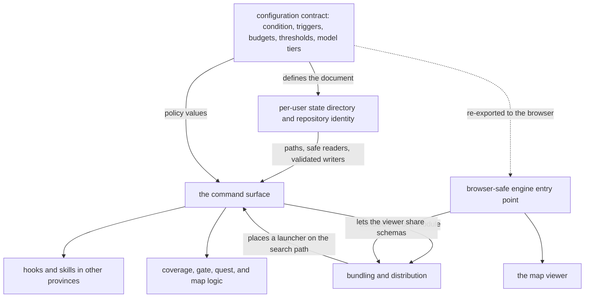

## Summary

This province holds the parts of SCALE that are about running the system rather than about comprehension itself: what may be configured, where a user's private state lives, what commands exist and under what latency contract they run, which parts of the shared engine a browser is allowed to see, and how the whole thing is bundled into an installable plugin. None of these components model learning. All of them determine whether the components that do model learning can run at all — reliably, on a stranger's machine, inside someone else's editing session.

## What it does

Everything else in SCALE assumes a working environment: that policy constants can be read, that a private place to write evidence exists and is the same place tomorrow, that a hook can invoke a command in under a fifth of a second, that the viewer's bundle builds, that the plugin installs in one step. Those assumptions are not free, and this province is where they are paid for.

Two forces shape the whole grouping. The first is that SCALE has two runtimes with incompatible capabilities — a command-line process with a filesystem and a browser without one — and one shared engine that both must agree with. The second is that SCALE is a research instrument: its intervention policy is the thing being studied, so that policy has to be data a person can flip, and its installation has to be simple enough that setup does not become a confound. Every component here is a response to one or both of those forces.

## Related components

Within this province, [Conditions, Budgets, Thresholds, and Model Tiers](config-schema/) declares the shape of everything that can be tuned, from the manipulated two-by-two condition down to the ceilings that stop passive signals from ever counting as validation. [Per-User State Layout and Repository Identity](state-directory/) decides which directory belongs to which repository and owns every read and write into it, with a deliberate split between forgiving accessors for the hook path and strict ones for direct commands. [The Command Surface](cli-surface/) is the single program both people and hooks invoke, organized around the contract that fast commands only touch local files and git while heavy commands run detached. [Keeping Platform Builtins Out of the Viewer](browser-safe-surface/) is the two-entry-point arrangement that lets the browser share the engine's schemas and pure functions without its file-reading module. [Bundling and Distributing the Plugin](plugin-packaging/) turns all of that into a folder that runs with no installation, no toolchain, and no dependence on the workspace.

Three components in other provinces are the closest neighbours. [Hook Wiring and the Fail-Open Rule](../capture/plugin-hooks/) is the caller that makes the command surface's latency and failure rules non-negotiable, and it ships inside the packaged plugin folder. [Serving the Map and Its JSON API](../viewer/local-server/) sits on both sides of this province at once: it is started by a command, it uses the full engine entry point, and it serves the viewer assets the packaging step placed beside it. [Impure Edges: Git Churn, Clock, and Disk](../comprehension/coverage-materialization/) is the busiest consumer of the state layer, reading the evidence log and writing the coverage view through the helpers defined here.

## How it works

The province divides its responsibility along a clean line: two components define contracts, one defines the surface, and two define boundaries.

The contracts come first. The configuration schema says what a user's settings may contain and, just as importantly, what happens when a field is missing — every field but the user label has a default, so a nearly empty document parses into a complete one, and commands running before any setup still behave. The state layer says where that document and its four companions live: the coverage view, the append-only evidence log, the quest list, and a small session record used only for interruption budgeting. It also answers the question that makes a per-user directory possible at all, deriving a stable identifier for a repository from its origin remote and falling back through folder names when there is none.

The command surface sits on both contracts and exposes them as subcommands. Its organizing principle is not a feature taxonomy but a latency and failure contract inherited from its unusual second caller. Commands invoked by hooks perform only local file and git work, never call a model, and cannot fail in a way that disrupts a session — most visibly in the pre-commit decision, which prints a verdict and always exits successfully so that the hook, not the program, decides whether to block. Commands invoked by people may be slower, and the one command that may call a model runs detached from session exit and swallows its own errors.

The boundaries come last and point in opposite directions. One faces inward at the engine: the browser entry point re-exports the schemas and pure logic while withholding the module that reads the filesystem, so the viewer shares definitions with the command line rather than duplicating them. The other faces outward at the world: the packaging step compiles everything, inlines the command-line program and all its dependencies into a single self-contained module, keeps a small launcher beside it for the host to put on the executable search path, copies the built viewer assets in alongside, and describes the result with two manifests — one for the host, one advertising the repository as an install source.

Two honest limits are worth carrying at the province level. The packaged bundle and viewer assets are committed build products, so they lag their sources until the packaging script is re-run. And the purity guarantee behind the browser entry point is a reviewed assertion rather than an automated check.

## Design decisions

The grouping earns its seam by what it excludes rather than by what it contains. Nothing here decides what a person understands, how a score moves, when an interruption is justified, or what a quest asks. Those judgements live in the comprehension, interventions, and quests provinces, and they are expressed as pure functions precisely so they can be reasoned about without an environment. What is left over — the environment itself — is what this province collects.

That division appears deliberate rather than incidental, and the code suggests it in a consistent pattern: policy constants arrive as injected configuration rather than as constants beside the logic; the pure decision functions receive the clock, the git state, and the disk contents as arguments; and the impure edges are pushed out to a small number of named places. The result is that a change to how interruptions are budgeted is a change to a value in a document, a change to where state lives is a change in one module, and a change to how the plugin ships touches no logic at all. Had these concerns been distributed — each command owning its own paths, each consumer holding its own defaults, the viewer keeping its own copy of the schemas — every one of those changes would have become a survey of the whole codebase.

The second reason this seam is right is that its components share a failure philosophy the learning components do not. Everything here is built to degrade rather than to complain: absent files read as nothing, unreadable session records reset a budget instead of raising, detached work logs its failures, unfinished commands announce themselves and exit successfully. That philosophy makes sense only for infrastructure sitting under someone's live editing session, and grouping the components that must obey it makes the rule reviewable in one place.

## Where it sits

Read this province to learn how SCALE runs rather than what it believes. The path through it is short: the configuration contract tells you every lever the system has, the state layer tells you where a person's private history lives and how it is touched safely, the command surface tells you what can be invoked and under what constraints, and the two boundary components explain how the engine reaches a browser and how the whole system reaches a stranger's machine. From here, the most instructive next step is outward — to [Hook Wiring and the Fail-Open Rule](../capture/plugin-hooks/), the caller whose demands explain most of the choices made here, and to [Impure Edges: Git Churn, Clock, and Disk](../comprehension/coverage-materialization/), which shows what all this infrastructure exists to support.
