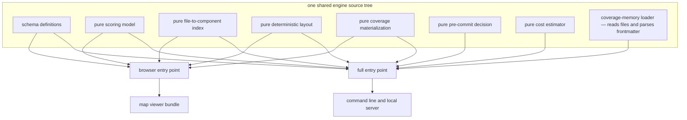

## Summary

The engine package that holds SCALE's schemas and pure logic is consumed by two very different runtimes: a command-line program running on a machine with a filesystem, and a single-page map viewer running in a browser where no such thing exists. This component is the pair of entry points that keeps those runtimes honest. One entry point exposes everything; the other re-exports the same modules minus the ones that reach for platform facilities, so the viewer can share the project's schemas and pure functions without dragging file and path handling into its bundle.

## What it does

Sharing types between a server and a browser client is normally uncontroversial — until the shared package contains something that only works on one side. SCALE's engine package genuinely does. Most of it is pure: schema definitions, the scoring model, the reverse index, the deterministic layout, the materialization fold. But one module, the loader that walks a repository's coverage-memory tree and parses each paper's frontmatter, exists precisely to read files. It is the only part of the engine whose whole purpose is a platform capability.

That single module poses a problem out of proportion to its size. A browser bundler asked to include it will either fail outright on the unresolvable platform imports or, worse, silently substitute shims and ship a large chunk of dead code into the viewer. The viewer, meanwhile, has no need for it at all: it never touches the repository directly, because the local server reads the papers and hands them over already parsed. The fix is not to make the loader work in a browser; it is to make it unreachable from browser code by construction.

## Related components

The module deliberately excluded is [Loading the Coverage Memory Tree](../../memory/paper-loader/) — understanding why it is the odd one out requires knowing that it walks directories and parses YAML frontmatter, which is exactly what a browser cannot do. The viewer-side consumer of the narrower entry point is [Live Data Versus Sample Fallback](../../viewer/viewer-data-layer/), which imports shapes and a pure progress calculation and nothing else.

Two of the modules re-exported to the browser matter because the viewer actually executes them rather than merely typing against them: [Pure Materialization of Coverage](../../comprehension/state-engine/) and [Scoring: Exponential Averaging, Loyalty, Classification](../../comprehension/coverage-model/) are pure by design, which is what makes them safe to run on either side and lets the viewer compute weighted progress client-side instead of asking the server for it. The schema block re-exported here includes [Conditions, Budgets, Thresholds, and Model Tiers](../config-schema/), which is why the viewer can display the active condition and model tiers without its own copy of those definitions. It also carries [The Frozen Map Document](../../map/map-schema/), the largest shape to cross this boundary and the one the viewer draws its entire canvas from, and the placement routine described in [Deterministic Layout and Incremental Placement](../../map/frozen-layout/) rides along for the same reason the scoring model does — it is pure, so it costs nothing to make it reachable from either side.

Two viewer-side neighbours show what the narrow surface is actually worth at runtime. The single re-exported function that survives into the shipped bundle as executing code is called by [Composition and the Unification Header](../../viewer/app-shell/), which computes importance-weighted progress in the browser rather than asking the server for it. What the boundary deliberately does not carry across is vocabulary: the names exported here stay engine names, and [The Single Skin Boundary](../../viewer/terminology-skin/) is the one place they are turned into the words a reader actually sees.

The counterpart that keeps the file-reading work on the correct side of the boundary is [Serving the Map and Its JSON API](../../viewer/local-server/): it uses the full entry point, reads the coverage memory itself, and exposes the results over a local interface. And the build that turns the viewer into shipped static assets, where a stray platform import would surface as a broken bundle, is described in [Bundling and Distributing the Plugin](../plugin-packaging/).

## How it works

The mechanism is deliberately unclever. The package declares two named entry points that resolve to two small modules in the same source tree. Each of those modules is nothing but a list of re-exports; neither contains logic. The full entry point re-exports every schema group — papers, the map document, coverage, evidence, quests, and configuration — plus the scoring model, the reverse index, the loader, the layout, the materialization layer, the pre-commit decision, and the build-cost estimator. The browser entry point re-exports the same schema groups, the scoring model, the reverse index, the layout, and the materialization layer, and stops there.

The comment at the top of the browser entry describes it as identical to the full one minus the loader, and explains that the loader pulls in file and path handling and must never be bundled into the viewer. Read carefully, the browser entry is narrower than that description: it also withholds the pre-commit decision function and the cost estimator, both of which are pure and could safely be included. Nothing in the viewer needs them — the gate runs inside a hook and the estimator inside a terminal — so their absence costs nothing, but a reader should not expect the two lists to differ only by the loader.

What the boundary buys, in practice, is visible in how the viewer imports, and the proportion is striking. Every viewer module that needs a shape — a coverage record, a dimension set, a quest, a map document and its nodes, a paper's frontmatter — takes it from the browser entry, and every one of those is a type-only import that vanishes at compile time. Across the whole viewer there is exactly one import that survives into the shipped bundle as running code: the pure function that computes importance-weighted progress. So the narrow entry point is carrying almost nothing at runtime and almost everything at review time. Because those definitions come from the same source tree the command line compiles against, there is exactly one definition of each shape in the system. When a schema changes, both sides change together or both sides fail to compile together; there is no second copy to fall out of step.

The enforcement is worth being precise about, because it is easy to overstate. The boundary is not checked by a test or a lint rule. It is enforced in two softer ways. First, by the entry point itself: browser code that imports only from the browser entry cannot reach the loader, because the browser entry never mentions it. Second, by a note in the comment stating that the re-exported modules were verified to import only the schema-validation library and each other. That verification was performed by a person at a point in time. If someone later adds a filesystem import to the scoring model, nothing will flag it — the failure will appear as a broken or bloated viewer build, which is a real signal, but a late and indirect one.

## Design decisions

Splitting by entry point rather than by package appears to be a deliberate weighing of two costs. A separate browser-only package would have made the boundary physical and unmistakable, but it would have meant two packages to version, publish, and keep aligned, and would have tempted someone to copy a schema across rather than restructure. Keeping one source tree with two lists means the shared definitions are literally the same file, and the split is a few lines of re-export that anyone can read in full. The evidence for this reading is that the two entry modules contain nothing but re-exports; the design puts all the weight on which names are listed and none on any wrapper logic.

Excluding the loader outright, rather than making its import conditional or lazily loaded, seems to follow from the viewer's actual data flow. The viewer never needs to read a repository, because the local server does that and serves parsed results, so there is no scenario in which a browser would want a lazily loaded filesystem walker. A runtime-guarded dynamic import would have preserved a capability nobody wants while leaving the bundler with a code path it must still analyze. The rejected alternative most people reach for first — telling the bundler to stub out platform builtins — is worse still: it makes the build succeed while shipping code that would throw if it were ever reached, converting a compile-time certainty into a runtime surprise.

Relying on a reviewed comment rather than an automated purity check looks like a prototype-scale trade. A lint rule or a build test asserting that no browser-reachable module imports a platform builtin would make the guarantee durable, and the code suggests the author was aware of the gap since the comment explicitly records that the check was performed and what was checked. What would break if this were left unaddressed as the codebase grows is concrete: a future edit that adds a filesystem read to any module on the browser list breaks the viewer build with an error pointing at a bundler, not at the offending import, and the person debugging it will not know that a boundary was ever intended.

## Where it sits

This component is a boundary made of two lists. It lets a browser and a command-line program share one set of schemas and one set of pure functions while keeping the single file-reading module out of the browser's reach, and it does so with no adapter layer, no duplicated types, and no bundler configuration. The properties that make the arrangement work are the purity of the shared modules and the discipline of importing from the right entry point. To see both ends of the boundary, read [Loading the Coverage Memory Tree](../../memory/paper-loader/) for what is being kept out and why, and [Live Data Versus Sample Fallback](../../viewer/viewer-data-layer/) for the code on the other side that lives comfortably within the narrower surface.
