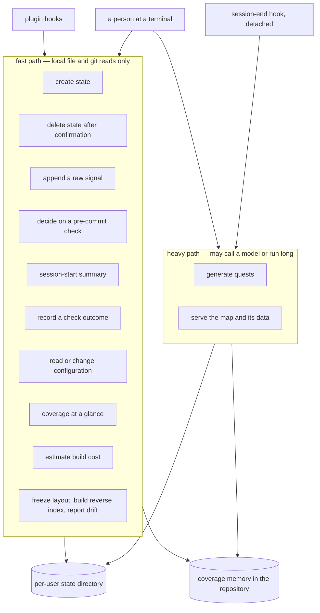

## Abstract

This component is the single command-line program through which everything in SCALE is driven — initialization, signal logging, the pre-commit decision, recording a comprehension check, recomputing coverage, generating and completing quests, freezing the map, estimating build cost, serving the viewer, reading or changing configuration, and clearing a person's state back to nothing. It matters because it has two callers with very different tolerances: a person typing at a terminal, and automated hooks running inside someone's editing session. The surface is therefore organized around a latency contract rather than around features, splitting commands into those that may only do fast local file and git work and those that are allowed to be slow because they never run in the way of a keystroke.

## Introduction

SCALE could have exposed its engine as a library and let each caller wire it up. It does not, and the reason is that its most timing-sensitive caller is not a program a developer writes — it is a set of hooks that fire while a person is in the middle of thinking. Those hooks need something they can invoke as a plain command, that starts fast, that never hangs on a network, and that fails in a way which cannot damage the session. Meanwhile a senior building the coverage memory and a junior checking their progress need a comfortable human interface over the same engine.

Rather than maintain two surfaces, this component makes one program serve both, and pushes the difference into a documented contract stated at the top of the file: the hook-path commands must remain pure fast reads and appends, under a fifth of a second, with no model calls and no network, while anything heavy runs detached and out of the way. Every command in the program can be placed on one side or the other of that line, and knowing which side a command is on tells you most of what you need to know about it.

## Related Work

Almost every command here is a thin shell around another component. The state helpers that resolve which directory to operate on and how to read and write each file are described in [Per-User State Layout and Repository Identity](../state-directory/); the configuration keys the read-and-change commands manipulate are defined in [Conditions, Budgets, Thresholds, and Model Tiers](../config-schema/).

Two callers explain the shape of the surface. [Hook Wiring and the Fail-Open Rule](../../capture/plugin-hooks/) is the set of scripts that invoke the fast commands from inside a session, and [Bundling and Distributing the Plugin](../plugin-packaging/) is what makes those invocations possible at all by shipping this whole program as one self-contained file on the executable search path.

Three components own the substance behind the busiest commands. [Deny, Retry, and Defer-as-Drop](../../interventions/gate-enforcement/) is the mechanism the gate and defer commands implement — the reason the gate emits a decision instead of enforcing one. [Impure Edges: Git Churn, Clock, and Disk](../../comprehension/coverage-materialization/) is what the recompute, status, session-context, and record commands all call to turn the evidence log into a coverage view. [The Shared Completion Path](../../quests/quest-completion/) is the function the quest-completion command shares with the browser, so a quest finishes identically in either place. The one command that starts a long-lived process rather than exiting is described in [Serving the Map and Its JSON API](../../viewer/local-server/).

The map group has three neighbours of its own. The freeze command is the entry point to [Deterministic Layout and Incremental Placement](../../map/frozen-layout/), and the document it writes — the same one the gate reads to learn how important each component is — is [The Frozen Map Document](../../map/map-schema/). The drift command is the honest placeholder standing where [Source Drift and Staleness Flagging](../../map/drift-detection/) belongs, which is the best account of what per-component churn detection would have to do for that command to become real.

Three further neighbours sit on the calling side, or just behind a single command. The three logging leaves exist because of [Capturing Touches, Prompts, and Review Latency](../../capture/edit-and-prompt-hooks/), which is both what invokes them and what fixes the budget their cheap substring-and-lookup resolution has to fit inside. The session-context command and the detached generation call are the two ends of [Session Start and Session End](../../capture/session-lifecycle-hooks/), which is why beginning a session is the act that refills the interruption budget the gate later spends. And the grading vocabulary the record command accepts, along with the reason a validation is stamped with a commit identifier, belongs to [Recording a Validation Outcome](../../interventions/validation-recording/).

## Description

The program is built from a command framework as a tree of subcommands, several of them grouped: signal logging has three leaves for prompts, file touches, and review latency; the gate has a decision leaf and a skip leaf; coverage, quests, map operations, and configuration each form their own small group, and a handful of commands sit at the top level on their own. Every command resolves the current working directory as the repository under study and asks the state layer for the matching per-user directory. There is no global installation-wide state and no notion of a "current project" other than where you are standing.

The fast side is the larger half. Initialization creates the state directory and writes a configuration containing only a user label, letting the schema supply everything else; it refuses to clobber an existing configuration without an explicit override. Its mirror image is the reset command, which deletes the whole state directory for the current repository and, unless told otherwise, asks for typed confirmation first — the one place on this surface that stops and waits for a person, which is also why no hook may ever call it. The logging commands validate one entry and append it, and they do the small amount of local resolution needed to make that entry useful: the prompt logger matches free text case-insensitively against every component's identifier, its title, and both the identifier and the human-readable name of each of its concepts, treating dashes and spaces alike and ignoring candidates shorter than three characters so that tiny tokens cannot match everything. The touch logger maps each edited file through the reverse index with a nearest-directory fallback. Both of these resolutions are deliberately cheap substring and lookup work — no model is consulted — precisely so they fit inside the append budget.

The gate command is the most carefully constrained thing here, and its constraint is worth stating precisely: it decides, it does not enforce. If the repository has no coverage memory at all it allows immediately, because there is nothing it could sensibly ask about. Otherwise it gathers the staged file list and the total changed-line count from git, maps those files to components, materializes coverage, reads the frozen map for each component's importance, reads the session budget record, and walks the evidence log keeping every entry stamped within the last ten minutes that shows a component either freshly validated or explicitly deferred. All of that is handed to a pure decision function, and the result is printed as exactly one line of machine-readable output — whether to allow, which component is at issue, and why — after which the program always exits successfully. When the decision is to deny, the command also records that an intervention was shown and then spends a budget slot by bumping the session counter, stamping the time, and remembering the component. The recording of the shown intervention is wrapped so that a failed write cannot turn a clean denial into noise; the budget update is not, on the reasoning that if the session record cannot be written the budget is already unreliable. The companion skip command writes the marker that makes a deferral final and clears the pending flag, so the very next commit attempt passes.

Recording an outcome takes either a single dimension and score or a set of per-dimension rubric scores, stamps it with the current short commit identifier so the validation stays anchored even after later recomputation, appends it, re-materializes coverage, and then prints not just the new state but how far the component now sits from the validation bar — a deliberate affordance, since the averaging behaviour means one strong answer rarely finishes the job.

Reporting is built the same way twice. The session-context command does one thing before it reports: it writes a brand-new session record with a fresh identifier and a zeroed interruption count, so beginning a session is what refills the budget the gate later spends. Only then does it recompute coverage and produce at most three terse lines for injection into an agent's context: overall progress, the weakest components not yet validated, and anything needing re-validation. If coverage cannot be computed it says so in one line and returns without failing. The status command assembles a fuller structured view — repository identity, user, active condition, model tiers, weighted progress, state counts, a per-province rollup, the stale list, and the pending quest count — and then either serializes that view for a machine or renders it as a padded human table. The important property is that both outputs come from the same assembled structure, so the two can never disagree.

The heavy side is small and explicitly fenced. Quest generation is invoked detached from the session-end hook; it catches its own errors and reports them without failing, because a detached failure must never surface as a broken session exit, and it degrades to deterministic synthesis when no key is available. Serving the viewer validates its port and then hands off to a long-lived server.

Three honesty notes belong here. The drift command is a documented minimal placeholder and is the only one left: it reports the commit the map was built from and the current one, and then says plainly that per-component source-churn detection is not implemented. It is easy to mistake for a finished feature because it prints a plausible-looking pair of commit identifiers, so anyone reading its output should treat it as reporting a reference point rather than reporting drift. The file also still carries a small helper for announcing placeholders — print what is missing, exit successfully — expressing the rule that a stub which fails is worse than a stub that is honest, because hooks and scripts calling it would break; that helper now has no callers, since every other command has been filled in and the drift command prints its own message directly. Finally, the explanatory comment at the top of the file describes an earlier state of the program in which most commands were stubs, and it has not been refreshed; the command list below it is the reliable account.

## Rationale

Making one program serve both humans and hooks appears to be a direct consequence of the ecological-validity goal: the junior uses unmodified tooling, so the integration point has to be something a hook can shell out to. The rejected alternatives are visible in the shape of what exists. A long-running daemon would have given lower per-call latency but introduces lifecycle, staleness, and cleanup problems on a machine the study does not control. A separate hook-only binary would have duplicated the state layer and invited the two copies to drift. One program with a stated per-command latency contract keeps a single implementation and makes the contract reviewable in one place.

Having the gate emit a decision and always exit successfully — rather than signalling refusal through a failure exit code — looks like the most consequential design choice on this surface. The comment on the command says the hook, not the program, blocks the commit. The benefit is twofold: the decision becomes a pure, testable value rather than a side effect, and an exit code stops carrying any policy meaning at all. Reverse it, and every transient problem — a corrupt evidence line, a git invocation failing under an odd shell — would become a blocked commit the user cannot explain, which is exactly the interruption the whole budget policy exists to prevent.

That said, the "never disrupts a session" property is only half owned here, and it is worth being precise about the seam. The gate does not defend itself against everything: loading the coverage memory and materializing coverage are both allowed to throw, and if one of them does, the top-level error handler prints a message and exits with a failure code without ever emitting a decision line. What converts that into a harmless outcome is the hook on the other side, which treats a missing or unparseable decision as permission to proceed. So the guarantee is a two-part contract — this program promises never to say "deny" by accident, and the hook promises to read silence as "allow" — and neither half is sufficient alone.

Running quest generation detached and catching its own failures seems to follow from the same instinct applied to the other end of the session. Generation may call a model and can take real time; blocking session exit on it would make ending a session feel slow and could surface a network error as a failure at the worst possible moment. The trade is that a generation failure is easy to miss, which the code accepts by logging it rather than raising it.

Re-validating the entire configuration after a single-key change, instead of validating just the changed key, appears to be about catching combinations rather than values. A value can be individually plausible and still produce a document the schema rejects, and the write helper refuses to persist anything that does not parse. The cost is that an unrelated pre-existing problem in the document will surface on an unrelated edit; the benefit is that no invalid configuration ever reaches disk to be discovered later by a hook that cannot report it.

## Conclusion

This component is the seam where SCALE's engine becomes usable — by a person, and, more importantly, by the automation running silently inside someone's session. Its organizing idea is not a feature list but a latency and failure contract: fast commands read local files and git and are built never to fail in a way the user must act on, heavy commands run detached and swallow their own errors, and the pre-commit decision is a printed value rather than an enforced verdict — with the caller's fail-open rule supplying the half of that promise this program cannot keep alone. To go deeper, read [Hook Wiring and the Fail-Open Rule](../../capture/plugin-hooks/) for the caller that makes those constraints necessary, [Deny, Retry, and Defer-as-Drop](../../interventions/gate-enforcement/) for what happens to the decision this surface prints, and [Per-User State Layout and Repository Identity](../state-directory/) for the layer every one of these commands stands on.
