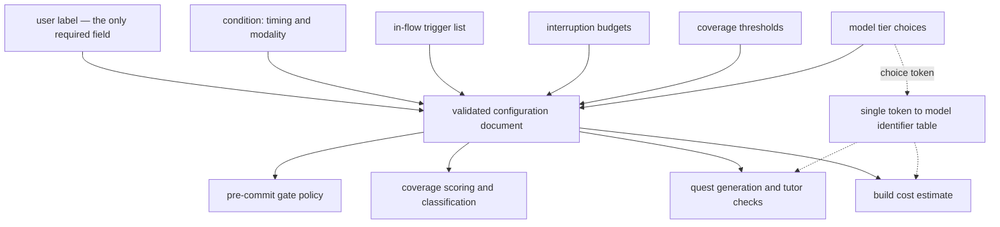

## Abstract

This component is the schema that defines what a SCALE user's configuration document may contain and what it means when a field is left out. It carries four kinds of knob in one validated shape: the manipulated study condition, the list of in-flow trigger points, the interruption budget and coverage thresholds, and the two-tier model choice. Because every consumer — the commit gate, the coverage model, quest generation, the cost estimator — reads its policy constants from this one document rather than from constants baked into code, the whole system's behaviour can be retuned or switched between study conditions by editing a single file.

## Introduction

A research prototype has an awkward requirement: the thing being studied is the intervention policy itself, so that policy has to be changeable without a rebuild. SCALE's design describes a two-by-two of interventions — checks that fire in the middle of the coding flow versus checks that wait until after the session, delivered either as a short quiz or as a capped Socratic dialogue — and all four cells must be fully functional and switchable. Alongside that sits a second family of tunables: how often the system is allowed to interrupt, how good a score has to be before a component counts as understood, how fast a new score displaces an old one.

If any of those numbers lived in the source, switching conditions would mean editing and rebuilding, and an interruption audit would mean recompiling to try a different cooldown. So they live in a per-user configuration document instead, and this component is the contract that document must satisfy. It is a schema-only component: it declares shape, defaults, and one small lookup table, and it performs no I/O of its own. The reading and writing of the document on disk belongs to a neighbour.

## Related Work

The configuration document has a home on disk, and that home — along with the read, validate, and write helpers that touch it — is described in [Per-User State Layout and Repository Identity](../state-directory/). The commands that let a user inspect and change individual keys, and the commands whose behaviour those keys govern, are catalogued in [The Command Surface](../cli-surface/).

Three consumers matter most. [The Pure Pre-Commit Decision](../../interventions/commit-gate/) reads the trigger list and the entire budget block; it is the component that makes interruption limits provable, and it can only do so because those limits arrive as injected data. [Scoring: Exponential Averaging, Loyalty, Classification](../../comprehension/coverage-model/) reads the thresholds — the blending weight for new scores, the bar for calling a component understood, the staleness cut-off, and the caps that stop passive signals from ever counting as validation. [Selection, Generation, and Offline Fallback](../../quests/quest-generation/) reads both the modality half of the condition and the intervention-tier model choice. The five threshold numbers only mean anything against the vocabulary they are thresholds on, which is set out in [Coverage States and the Three Dimensions](../../comprehension/coverage-schema/): the weighted bar for calling a component validated, the loyalty level at which one is re-flagged as stale, and the two ceilings on passive credit are all limits expressed in exactly those states and dimensions.

The build-tier model choice is consumed by [Pre-Flight Build Cost Estimation](../../memory/build-cost-estimator/), which prices the one-time coverage-memory build per model before anyone commits to running it. Finally, this schema is one of the modules deliberately re-exported to the browser bundle described in [Keeping Platform Builtins Out of the Viewer](../browser-safe-surface/), because the viewer displays the active condition and model tiers in its header.

## Description

The document has six top-level areas. A user label identifies whose state this is; it is the only field with no default, so a configuration is never anonymous. The condition holds two closed choices: whether interventions fire in flow or after the session, and whether they take the form of a quiz or a Socratic dialogue. Those two axes multiply into the four experimental cells, and flipping either one is a one-key edit.

The in-flow area holds a list of trigger points. Exactly two kinds are defined — a pre-commit trigger and a post-task trigger — and the default list contains only the pre-commit one, which means the second is declared but switched off until someone turns it on. The list is deliberately a list rather than a boolean pair: interruption tolerance differs from person to person, so which triggers are live is a per-participant setting rather than a build-time fact. It is worth reading this area more literally than its own comment invites. The comment beside the trigger kinds says the gate accepts new kinds without a schema change, but the kinds are a closed set of two, so enabling the second is indeed only a configuration edit while inventing a third would require extending that set. What the list shape genuinely buys is cheap enabling and disabling of the kinds that already exist, not open extensibility.

The budget area holds four numbers that together bound how intrusive the system can be: how many interventions may fire per commit, how many per session, how many minutes must elapse between them, and how many changed lines a diff must contain before it is considered substantial enough to gate at all. Their defaults are one per commit, two per session, a fifteen-minute cooldown, and a twenty-line floor.

The threshold area holds five numbers that shape the comprehension model. One is the weight given to the newest active score when it is blended into a running average — raising it makes the map move faster and more visibly, lowering it makes coverage more conservative. One is the weighted bar a component's dimensions must clear to count as validated. One is the loyalty level below which a previously validated component is re-flagged as stale. The last two are ceilings: the most structural credit that file touches and prompt mentions alone may ever earn, and the separate ceiling for having merely read a paper. Those two caps are the mechanical expression of a core principle — passive signals move a component out of fog, but they can never carry it to validated on their own.

The model area encodes a fixed two-tier policy. The expensive one-time memory build may run only on the two high-capability choices; the recurring interventions — tutor checks, quest generation, the Socratic proxy — may run only on the two cheap, fast choices. These are two separate closed sets, so it is impossible to express a configuration that runs interventions on a build-tier model or vice versa. Crucially, what the document stores is a neutral choice token, not a model identifier. A single table maps each token to a concrete model identifier, and a small resolver function is the only path from one to the other, so a model generation bump is a one-line edit in one place and every existing user configuration remains valid.

Two invariants hold the whole thing together. First, defaults are exhaustive: every field except the user label carries one, and the nested blocks default as wholes, so a document containing nothing but a user label parses into a complete, usable configuration. The checked-in test fixture demonstrates this directly — it omits the model block entirely and omits the blending weight from its thresholds, and still parses to a full configuration with the build tier set to the high-capability default and the intervention tier to the cheap default. Second, validation is total rather than incremental: when a single dotted key is changed, the resulting document is re-parsed against the whole schema before it is written back, so an edit that puts a value out of range or an unknown token in a closed set is rejected at the moment of the edit rather than at the moment some hook tries to use it.

## Rationale

Storing a neutral choice token instead of a raw model identifier appears to be a hedge against churn. The comment on the model block says as much: the concrete identifiers live in one table so a bump is a one-line change. The rejected alternative — writing the identifier straight into each user's document — would mean that every existing configuration silently pins a retired model the day a new generation ships, and it would also dissolve the tier boundary, because nothing would stop someone naming a build-tier model in the intervention slot. The indirection buys both a cheap upgrade path and an enforced policy.

Making defaults exhaustive looks like it exists to protect the hook path. Several commands run inside Claude Code hooks and must behave sanely even before a user has ever initialized their state — the code suggests this, since the gate and the defer path both fall back to parsing a synthetic document containing only a user label when no file is found. Had the schema required the full document, those paths would have had to either fail or carry a duplicate set of hard-coded defaults, and a duplicate set is exactly the kind of thing that drifts out of sync with the real one.

Keeping budgets and thresholds as data rather than as constants in code is the decision that makes the interruption policy auditable. Because the gate receives its limits as injected values, a test can assert the limits are honoured for any set of limits, and a study can retune them per participant without a build. Hard-coding them would have been simpler to read but would have made every policy question a code change, and would have made the promised interruption audit an exercise in recompiling.

Expressing the in-flow triggers as a list when only one kind is switched on by default is a smaller decision, and its reasoning is easy to misread. The obvious alternative — a pair of booleans, one per trigger kind — would have been equally expressive today and slightly simpler to read. The list wins because enabling and disabling a trigger becomes the same operation regardless of how many kinds exist, and because the empty list is a meaningful, easily written value: it turns off in-flow interruption entirely without introducing a separate switch for that. What the list does not buy, despite the comment beside it, is the ability to add a trigger kind without touching the schema; the set of kinds is closed and would have to be widened. Treating the list as an extensibility mechanism would therefore be an over-reading, and a reviewer who assumed it would find the schema rejecting their new value.

Placing the manipulated condition in the same document as the tunables — rather than in a separate experiment file or an environment variable — seems to follow from the goal of switching a whole cell of the study end to end with one edit. The cost is that the experimental variable and the ordinary preferences are not visibly separated, which a later study-infrastructure layer might want. The benefit is that there is exactly one place to look when asking what mode the system is in, and one place a command has to write to change it.

## Conclusion

This component is small in code and large in reach: it is the single declaration of what SCALE's behaviour is allowed to be. Read it and you know the full set of levers — which of four intervention cells is active, where interruptions are permitted to fire, how tightly they are budgeted, how forgiving the comprehension model is, and which two model tiers are in play. From here, the natural next reads are the component that stores and validates this document on disk, [Per-User State Layout and Repository Identity](../state-directory/), and the two components that turn these numbers into behaviour: [The Pure Pre-Commit Decision](../../interventions/commit-gate/) and [Scoring: Exponential Averaging, Loyalty, Classification](../../comprehension/coverage-model/).
