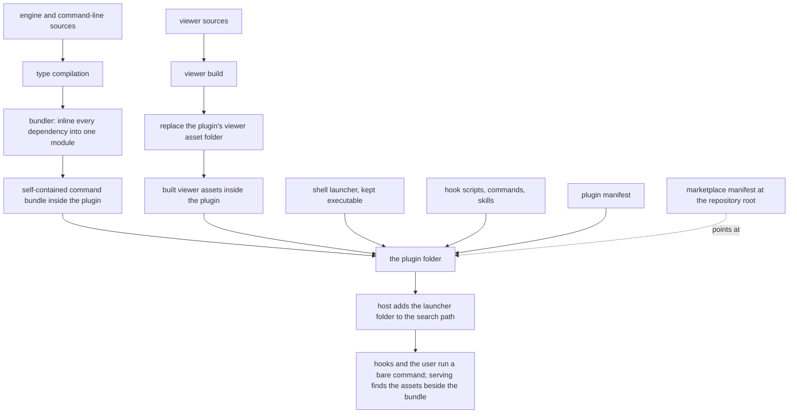

## Abstract

This component is how SCALE stops being a monorepo and becomes something a person can install. A build script compiles the engine, the command-line program, and the map viewer, then bundles the entire command-line program into one self-contained module with every dependency inlined, keeps a small shell launcher beside it, and copies the built viewer assets into the plugin folder. Two manifests complete the picture: one describes the plugin to its host, and one at the repository root advertises that plugin so the repository itself can be used as an install source. The result is a plugin folder that runs with no package installation, no build toolchain, and no dependence on the surrounding workspace.

## Introduction

SCALE's hooks fire inside someone else's editing session, in someone else's repository, on someone else's machine. They need to invoke the command-line program, and they need to do it reliably enough that a study participant's setup does not become a research variable. Every ordinary way of arranging that has a defect: asking the participant to install dependencies adds a step that can fail; linking the program globally pollutes their environment and breaks if the workspace moves; invoking it through the workspace's own tooling means the plugin only works when the monorepo is checked out next to the repository being studied.

The chosen answer is to make the plugin folder self-sufficient. If the command-line program is one file that needs nothing beside it, and the viewer's assets are already built and sitting in the same folder, then enabling the plugin is the whole installation. This component is the machinery that produces that folder, plus the small amount of metadata that tells a host what it is looking at.

## Related Work

The program being bundled is [The Command Surface](../cli-surface/), and the reason it must be invocable as a bare command is [Hook Wiring and the Fail-Open Rule](../../capture/plugin-hooks/) — the hook scripts shipped in the same folder call it by name, relying on the host to put the launcher on the search path.

The viewer half of the payload exists for [Serving the Map and Its JSON API](../../viewer/local-server/), which locates the built assets by trying several candidate locations in turn, so the same server works whether it is running from inside the plugin folder or from the workspace. The application those assets are compiled from is [Composition and the Unification Header](../../viewer/app-shell/), which is built exactly once here and never again on a participant's machine. What makes those assets buildable at all — a viewer bundle that contains no platform-only code — is the boundary described in [Keeping Platform Builtins Out of the Viewer](../browser-safe-surface/).

The rest of the plugin folder is content rather than build output: the entry points a user types are [User-Initiated Entry Points](../../interventions/slash-commands/), and the two instruction documents that do the system's model-driven work are [The Mode B Build Protocol](../../memory/memory-builder-skill/) on the senior side and [Quiz and Socratic Protocols](../../interventions/tutor-skill/) on the junior side. None of those need compiling — they ship as they are written, which is part of why the packaging step only has to worry about two artifacts.

## Description

The build script runs in four movements. First it compiles: the engine and command-line packages are type-compiled so the bundler can resolve the engine's compiled entry, and the viewer is built so there is a distribution folder to copy. Second it bundles the command-line program from its source entry into a single module inside the plugin's launcher folder, targeting the runtime platform, emitting modern module syntax, and inlining every dependency — the shared engine, the argument parser, the schema library, the YAML parser, the model client — so that nothing but platform builtins remains external. Because some of those inlined dependencies were written for the older module system and expect a synchronous require and directory globals, the bundle is prefixed with a short preamble that reconstructs those from the module's own address. That preamble is the one piece of the build that repays careful reading: without it, a dependency doing a dynamic require of a platform builtin at load time would fail in the bundled form even though it works when installed normally.

Third, the script makes sure the shell launcher beside the bundle is executable. The launcher is three lines of shell wrapped in a longer explanatory comment: one naming the interpreter, one that works out the launcher's own absolute directory by stepping into it and asking where it landed — with the shell's directory-search variable blanked first, so a stray setting in the user's environment cannot silently send that step somewhere else — and one that replaces the shell process with the runtime, pointing it at the bundle next door and forwarding every original argument untouched. Replacing the process rather than spawning a child matters more than its brevity suggests: the exit status and the signal behaviour the caller observes are the runtime's own, which is what lets a hook treat the launcher as though it were the program itself. Its comment explains the whole distribution strategy — the folder it lives in is added to the executable search path by the host when the plugin is enabled, so a bare command name resolves to this launcher, which resolves to the bundle next to it, which needs no installed packages. The script re-applies the executable bit explicitly because that bit is regenerated infrastructure and cannot be assumed to survive every checkout.

Fourth, it replaces the plugin's viewer asset folder wholesale — removing the old one before copying the fresh build — so stale files from a previous build can never linger alongside new ones.

The plugin manifest is small and purely descriptive: a name, a version, a description of what the plugin contains, an author, a license, and keywords. It is the file the host reads to know what it has. The marketplace manifest at the repository root wraps that one level higher: it names a marketplace, names an owner, carries a description and version, and lists a single plugin entry whose source is the plugin folder inside the repository. That indirection is what lets the repository be handed to someone as an install source directly, rather than requiring a separate published artifact.

The viewer's build configuration contributes one idea that outlives development. In development the viewer runs on its own server and forwards every data request — reads and the quest-completion and dialogue posts alike — to the local server on its default port, which avoids cross-origin problems without any code in the viewer knowing about it. In the shipped build there is no proxy and no need for one, because the local server serves the viewer's assets and its data from the same origin, so plain relative requests resolve correctly. The consequence for anyone reading viewer code is that there is no configurable base address anywhere; that absence is intentional and is the whole point of the arrangement.

One honest caveat belongs in any account of this component: the bundle and the copied viewer assets are generated files that are committed to the repository. That is what makes the plugin folder usable straight from a checkout, but it also means those artifacts reflect whatever the sources looked like the last time the build script was run. They are not regenerated automatically by an ordinary build, and a source change is not visible to the plugin until the packaging script runs again.

## Rationale

Inlining every dependency into one module, rather than shipping a dependency list, appears to follow directly from the project's stated goal of a one-step install with ecological validity. A participant enabling a plugin should not encounter an install step that can fail behind a proxy, on an old runtime, or in an offline room. The rejected alternatives each preserve a failure mode the bundle removes: requiring a package install adds a network dependency at setup time, and linking the program globally makes correctness depend on where the workspace happens to live and on the participant not having a conflicting command of the same name installed. The cost paid is bundle size and the loss of independent dependency updates, which for a research prototype with a pinned dependency set is a cheap price.

Shipping pre-built viewer assets inside the plugin, rather than building them on first use, seems to follow the same reasoning applied to a second toolchain. Building the viewer requires a bundler and its plugins; requiring those at serve time would put a second install step in front of the map, and the map is meant to be something you glance at, not something you provision. The alternative of not shipping the viewer at all and serving only data would have made the spatial map — the core of the design — unavailable in the packaged form, which defeats the purpose.

Relying on the host to place the launcher folder on the search path is the decision that makes the hook scripts simple, and it is worth understanding what it buys. Because the folder is on the path, hooks and the user both invoke a bare command name; no script needs to compute a path to the bundle, and nothing breaks when the plugin folder moves. If this were reversed and each hook resolved the bundle by path, every hook would carry duplicate resolution logic and each would be a separate opportunity for the packaged and workspace layouts to diverge. The server's own multi-candidate search for the viewer assets is the visible remnant of the one place where such resolution genuinely cannot be avoided.

Using a development-only proxy instead of a configurable data address looks like an attempt to keep a whole class of configuration out of existence. A base address setting would need a default, a way to override it, and a mechanism to make sure the development value never ships. By making the production case same-origin and the development case a proxy handled outside application code, the viewer has no address to get wrong. The tradeoff is that the development port and the server's default port are agreed by convention in a configuration comment rather than derived from a shared source, so changing the server's default port requires remembering to change the proxy target too.

## Conclusion

This component is the difference between a workspace and a product. It compiles three things, folds one of them into a single self-contained module, drops the other beside it as static assets, and describes the result twice — once for the host that will enable it and once for anyone who wants to install it from the repository. Understanding it explains why hooks can call a bare command with no setup, why the map is available immediately, and why the viewer contains no notion of a server address. The natural neighbours to read next are [The Command Surface](../cli-surface/) for what is inside the bundle, [Hook Wiring and the Fail-Open Rule](../../capture/plugin-hooks/) for who calls it, and [Serving the Map and Its JSON API](../../viewer/local-server/) for the half that consumes the shipped assets.
