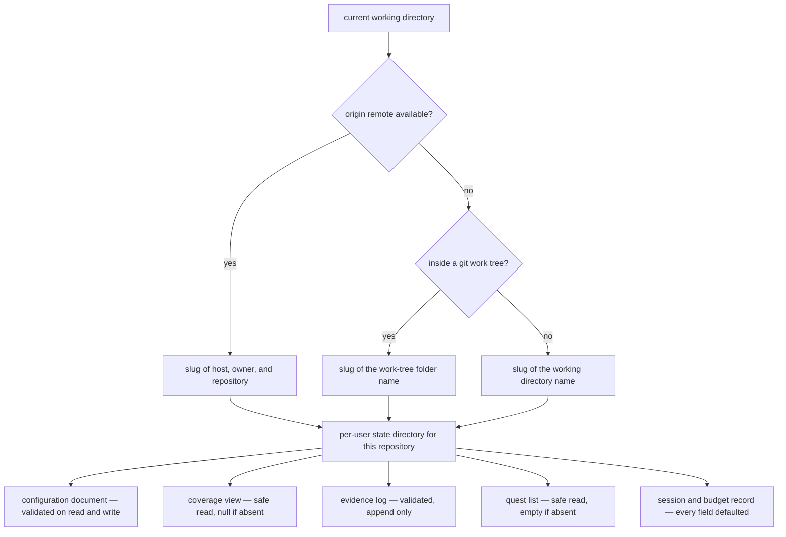

## Abstract

This component decides where a user's SCALE state lives and provides the only sanctioned way to read and write it. It derives a stable identifier for the repository being worked on, resolves that identifier to a directory under the user's home, and exposes narrow helpers for each file inside: the configuration document, the materialized coverage view, the append-only evidence log, the pending quest list, and a small per-session budget record. Its defining discipline is that hook-path callers get fast, non-throwing accessors, so a missing or damaged file degrades into a harmless no-op instead of breaking the user's editing flow.

## Introduction

SCALE splits its persistent data along a sharp line. The coverage memory — the papers, the frozen map, the reverse index — belongs to the repository and is committed with it, because it describes the code and is shared by everyone who works on that code. Everything about a particular person's comprehension is the opposite: it is private, it changes constantly, and it must never end up in a commit. So it lives outside the repository entirely, under the user's home directory, in one subdirectory per repository.

That split immediately raises a question this component has to answer: what identifies "this repository" reliably enough to be a directory name? A path is not good enough, because the same repository can be cloned to different locations and a person's comprehension of it should follow them. A hand-configured name is not good enough either, because it would have to be set before any hook could run.

Once the directory is chosen, a second concern takes over. Several commands run inside Claude Code hooks, on a strict latency budget, at moments when the user is mid-thought. Those commands must never block, never wait on the network, and never fail loudly because a file happened to be absent. This component is where that discipline is enforced, one accessor at a time.

## Related Work

The shape of the configuration document this module reads and writes — its defaults, its closed choice sets, its budget and threshold blocks — is defined by [Conditions, Budgets, Thresholds, and Model Tiers](../config-schema/). Every command that touches per-user state goes through the helpers here; the catalogue of those commands is [The Command Surface](../cli-surface/).

Three data-owning components sit directly on top of this layer. [The Append-Only Evidence Log](../../comprehension/evidence-log/) defines what a raw signal entry looks like and why the log is never rewritten; this module supplies the validated single-append write that upholds that. [Impure Edges: Git Churn, Clock, and Disk](../../comprehension/coverage-materialization/) is the component that reads the evidence log through here, folds it, and writes the coverage view back. [The Fast-Append Path](../../capture/evidence-append/) is the hook-side caller whose latency budget dictates why the append helper is shaped the way it is. Two more of the five files have their meaning defined elsewhere: the coverage view, which the safe reader returns as nothing until it has been materialized, is shaped by [Coverage States and the Three Dimensions](../../comprehension/coverage-schema/), and the pending work list, whose reader collapses absence, unparsable content, and a wrong top-level type into one empty answer, is shaped by [Quest Documents and Item Shapes](../../quests/quest-schema/).

Two further neighbours depend on parts of this module that are easy to overlook. [Deny, Retry, and Defer-as-Drop](../../interventions/gate-enforcement/) is the sole consumer of the session record — the small file that counts how many interventions have fired and remembers which component the last denial was waiting on. And [File-to-Component Reverse Index](../../map/file-component-index/) is fed by the deliberately minimal frontmatter scanner that also lives here, which extracts just enough from each paper to build the reverse index without pulling in a full parser. The frontmatter contract those two regular expressions are matching against — which guarantees that a stable identifier and a source list are always present and always in the same place — is [Paper Format and Frontmatter Contract](../../memory/paper-format/), and it is what makes so minimal a scanner safe.

## Description

Repository identity is resolved by a short cascade of best-effort git queries, each of which swallows its own failure. The first attempt asks for the origin remote's URL; if one exists it is normalized — a shorthand secure-shell form is rewritten into a host-plus-path form — and then reduced to a filesystem-safe slug by lowercasing, stripping any protocol prefix and trailing repository suffix, collapsing everything that is not alphanumeric into single dashes, and trimming dashes from both ends. That gives a name derived from host, owner, and repository, so the same project cloned twice on the same machine resolves to the same state. If there is no remote, the second attempt asks git for the top of the working tree and slugs its folder name. If that fails too — the directory is not a repository at all — the working directory's own folder name is slugged. The slugging function guarantees a non-empty result, so this cascade always terminates in a usable name.

That name is joined to a fixed dot-prefixed folder under the user's home directory to give the state directory. Five files live there. Four of them are shared, schema-backed artifacts: the configuration document, the coverage view, the append-only evidence log, and the quest list. The fifth is local bookkeeping. Every one of their paths is produced by a small function in this module, which is the mechanism behind an important property — no other file in the system builds a state path by hand, so the on-disk layout has exactly one definition and can be changed in one place.

The accessors come in two flavours, and the difference is the heart of the component. The strict flavour parses the file and throws if it is missing or invalid, and exactly one reader has it: the configuration reader, on the reasoning that a command which explicitly asks to read or edit configuration should say clearly when there is none. Every other reader is safe, and the safe configuration reader is simply the strict one wrapped in a swallow: it returns nothing at all rather than throwing. The coverage reader returns nothing when the view has not been materialized yet. The quest reader returns an empty list when the file is absent, unparsable, or not even an array — three quite different problems collapsed into one harmless answer. Hook-path commands use only the safe readers. The consequence is that a user who has never run initialization, or whose state directory was deleted mid-session, sees hooks quietly do nothing rather than errors interrupting their work.

Writing follows the same split. The configuration writer validates the candidate document against the schema first, creates the directory if needed, and only then writes it out pretty-printed — so an invalid configuration can never reach disk, and a partially written one can never be produced by a validation failure halfway through. The evidence writer validates a single entry, ensures the directory exists, and performs one asynchronous append. It is deliberately the only mutation offered for the evidence log: there is no update, no rewrite, no compaction. The log grows monotonically, which is what makes the coverage model re-fittable later without data loss, and a single append is cheap enough to sit on the hook latency budget.

The session record is the one piece of state with no shared schema, and its comments explain why: it is purely local accounting that never travels into the repository or the viewer. It holds a session identifier, a start timestamp, a count of interventions already fired this session, the timestamp of the most recent one, and the identifier of the component a pending denial is waiting on. Because it has no schema, its reader defends itself differently — it type-checks each field individually and substitutes a default for anything missing or of the wrong type, so a record written by an older version, or truncated, still yields a complete usable object. If the file cannot be read at all the reader reports nothing, and the caller synthesizes a fresh record with a full budget. That failure mode is worth understanding precisely: losing the session record does not break the gate, it resets the budget.

Finally, this module carries a lightweight frontmatter scanner used when building the file-to-component reverse index. It walks the coverage-memory tree, finds every paper, and extracts only two fields with regular expressions — the stable identifier and the list of source paths — deliberately avoiding a YAML dependency. Its own comment is explicit that the authoritative paper parser lives elsewhere and that this one is meant to stay minimal.

## Rationale

Deriving repository identity from the origin remote first, and only then from folder names, looks like a deliberate ordering by stability. A remote is the closest thing a repository has to a global name: it survives re-cloning, moving, and renaming the local folder, so a person's accumulated comprehension follows the project rather than the path. The folder-name fallbacks exist because the remote is not always there — a fresh local repository, a detached export, a directory that is not under version control at all — and the alternative of refusing to run in those cases would have made the tool unusable during exactly the early exploration it is meant to support. The cost of the fallback is real and worth stating: two unrelated local projects with the same folder name and no remotes will share one state directory.

Keeping per-user state outside the repository appears to be a privacy and hygiene decision rather than a technical one. Comprehension scores are personal; putting them in a working tree invites them into a commit and into a code review. The rejected alternative — a hidden directory inside the repository — would have made setup marginally simpler and identity resolution unnecessary, at the cost of leaking one person's assessment history into a shared history that could never be cleanly rewritten.

The strict-versus-safe reader split is the code's own stated concession to the latency and reliability contract. The header comment says plainly that hook-path callers use only the fast, non-throwing helpers. Reversing this — letting readers throw everywhere — would turn every ordinary absence into a visible failure during someone's editing session, which directly violates the principle that the junior's flow is not to be disturbed. The price of the safe readers is that a genuinely corrupt file is indistinguishable from a missing one on the hook path, so problems can go unnoticed; the explicit commands that a user runs on purpose therefore keep the strict behaviour, which is where the error is actually actionable.

Leaving the session record unvalidated by a shared schema, while every other file is validated, seems to follow from where each file travels. The four schema-backed files are read by the CLI, the local server, and in some cases the viewer, so they need one agreed definition. The session record is written and read by exactly one process for one purpose. The code suggests the field-by-field defaulting reader was judged both cheaper and more forgiving than a schema here, since a partial or stale record should degrade rather than be rejected. If this were reversed and the record were strictly validated, a schema change would make old records unreadable and silently reset live budgets — a worse failure than the one being avoided.

## Conclusion

This is the component that answers "where does my state live, and how do I touch it safely". It converts a working directory into a stable repository identity, owns every path under that identity, and hands out accessors whose error behaviour is chosen per caller: forgiving on the hook path, strict where the user asked a direct question. Everything the comprehension model persists passes through here. From this point the two most useful directions are [Conditions, Budgets, Thresholds, and Model Tiers](../config-schema/), which defines the one document this module validates most carefully, and [The Append-Only Evidence Log](../../comprehension/evidence-log/), which explains why the single append helper here is the only mutation the system's most important file will ever accept.
