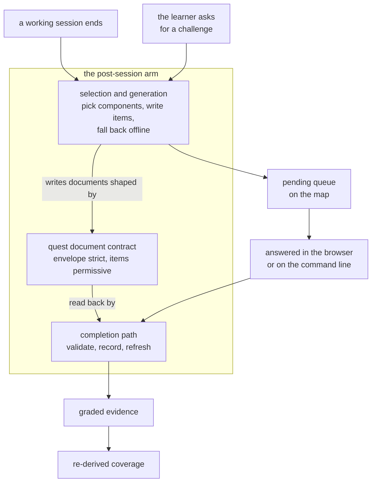

## Abstract

This province is the post-session arm of the intervention design: the part of the
system that does not interrupt a learner while they work, but instead leaves a small
queue of comprehension checks waiting for them afterward. It owns three
responsibilities — the shape of a pending check, the decision about which components
deserve one and what its questions should be, and the path a graded answer takes
back into the comprehension record.

## Introduction

The system offers interventions in two timings, and they are deliberately kept
independent. Under the in-flow timing, a check happens at a natural boundary during
work, in chat, and if it is declined it is simply dropped. Under the post-session
timing, nothing interrupts at all; instead, when the session ends, the system looks
at what was touched and how well it is understood, and queues up work to be done
later — on the map, on a phone, or from a terminal.

That second timing is what this province implements. The defining constraint is that
its work happens at the wrong moment in two senses. Generation runs during session
shutdown, detached, where nobody is watching and nothing can report an error.
Completion runs much later, possibly on a different surface entirely, long after the
context that motivated the check is gone. Everything in the province follows from
those two facts: the offer must be written down rather than held in memory, it must
be produced without any assumption that a network is available, and it must be
gradable identically wherever it is eventually answered.

## Related Work

Within this province, [Quest Documents and Item Shapes](./quest-schema/) defines the
persisted contract — what a pending check is made of, and why its items are validated
loosely while its envelope is validated strictly.
[Selection, Generation, and Offline Fallback](./quest-generation/) is the producer:
it decides which components to ask about, grounds items in those components' papers,
prefers a language model, and synthesizes items deterministically when there is
none. [The Shared Completion Path](./quest-completion/) is the consumer: the single
sequence that turns graded answers into evidence and refreshes the coverage view.

Three neighbours outside the province matter most. [The Append-Only Evidence Log](../comprehension/evidence-log/)
is where every completed quest ultimately lands, and it also supplies the dimension
vocabulary that quest items are tagged with — quests write into it and never write
coverage directly. [Running a Quest in the Browser](../viewer/quest-runner-ui/) is
the surface a learner actually touches, and the reason the item contract has to
tolerate content it did not author. [Conditions, Budgets, Thresholds, and Model Tiers](../platform/config-schema/)
is the switch that turns this whole province on or off: the configured timing
decides whether quests are ever generated, and the configured modality decides
whether they are question cards or a dialogue.

Worth reading alongside is [Quiz and Socratic Protocols](../interventions/tutor-skill/),
the in-flow counterpart. It asks the same kinds of questions, grounded in the same
paper material, and grades on the same three dimensions — but in chat, immediately,
with no persisted document in between. The contrast is the clearest way to see what
this province is actually for.

## Description

The three components divide the work along a producer, contract, consumer seam.

The contract component is the smallest and the most load-bearing. It says a pending
check names exactly one component, one modality, one origin, and one status, and
carries an ordered list of items of which only the prompt text is guaranteed. That
asymmetry — strict outside, loose inside — is the accommodation that lets
model-written content be persisted at all, and it also explains why the runner and
the completion path treat items so differently from each other.

The producer component holds all the judgement. It decides whether to run at all,
based on the configured timing. It decides which components are worth asking about,
by intersecting what the learner touched during the session with what they do not yet
understand and ranking by structural importance and comprehension gap, with a
lowest-coverage fallback when session signal is thin. It grounds every item strictly
in a component's declared concepts and rationale rather than in its source code, and
it treats the language model as an optimization rather than a dependency, degrading
to deterministic synthesis from the same material. It also serves the learner's own
initiative, generating a single check on demand for any component regardless of the
configured condition.

The consumer component holds all the discipline. It takes graded results from either
surface, validates them entry by entry, writes them as evidence stamped with the
component from the stored quest and the current commit, marks the quest finished,
and re-derives coverage from the whole log rather than adjusting a score in place.
Its value is being the only such sequence for the card path, so a quest answered in a
browser and one answered at a terminal cannot produce different comprehension.

Two gaps in the province are real and should not be mistaken for behaviour. Quests
raised from source drift are described in the design and admitted by the contract,
but nothing generates them. The subtlety is that staleness itself is computed
elsewhere and does work — a component whose sources have moved far enough since it
was last validated does flip to stale, and the generator's ranking rewards that. What
is missing is the step that turns a stale component into a check of its own, so drift
influences the queue only by nudging an ordering, never by raising an offer. And
without model access the offline items still work but are recognition-level —
matching a concept name to a component title, matching a recorded reason to a
decision — which keeps the loop alive without being equivalent to a real
comprehension check.

## Rationale

The seam that defines this province is timing, not mechanism. Item generation,
paper grounding, dimension tagging, and per-dimension grading are all shared with the
in-flow arm; what is unique here is that the check outlives the moment that motivated
it. That is exactly what forces a persisted document, a queue with merge semantics, a
completion path callable from more than one program, and a generator that must
survive running detached with nobody watching. Grouping these three components
together keeps all of the consequences of deferral in one place.

The alternative grouping would have been by artifact — putting the quest contract
with the other schemas, the generator with the other command implementations, and
the completion path with the coverage machinery. The code suggests that was rejected
because the three make almost no sense apart: the contract's looseness is only
explicable by how the generator produces items, and the completion path's strictness
is only explicable by the contract's looseness. Read separately, each of the three
looks like an arbitrary choice; read together, each explains the next.

The province boundary also draws a clean line the rest of the system depends on:
everything inside it produces and consumes offers, and nothing inside it decides
what an offer is worth. Scoring, thresholds, and state transitions belong to the
comprehension model, and this province touches them only by appending evidence and
asking for a refresh. Reversing that — letting a quest completion write a coverage
score directly, since it knows exactly what moved — would make the evidence log
stop being the authority, and would quietly break the ability to re-score history
under different constants.

## Conclusion

Read this province as one loop with three stations: a contract that says what a
deferred check is, a producer that decides which checks are worth deferring and
writes them safely under bad conditions, and a consumer that folds the answers back
into the record without ever bypassing the evidence log. Start with the contract,
which is short; then the generator, where every interesting judgement lives; then
the completion path, which shows what a graded answer is actually worth. From there,
the evidence log and the comprehension model explain what happens to that answer
next, and the in-flow tutor shows what the same idea looks like without the delay.
