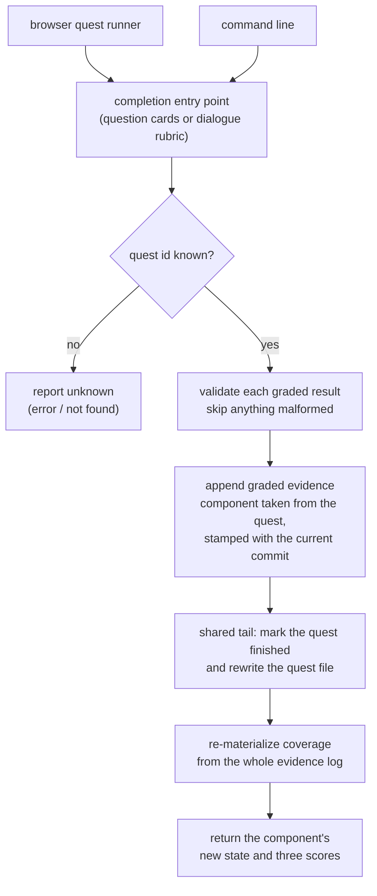

## Abstract

This component is the single place where a quest stops being a pending offer and
becomes a change in the learner's recorded comprehension. It validates the graded
results, appends them to the evidence log, marks the quest finished, re-derives
coverage from the full log, and hands back the component's new state. Both grading
surfaces — the map viewer in the browser and the command line — call exactly these
functions, which is what guarantees a quest completes identically no matter where it
was answered.

## Introduction

A quest can be answered in two very different places. A learner might sit at the map
on a phone, tap through question cards, and submit; or they might close out a quest
from a terminal after running the check in chat. Those are different programs with
different input formats, and the naive implementation gives each one its own
completion logic. That is precisely the failure this component exists to prevent.

Completion is not a single write. It is four ordered steps — validate, append
evidence, flip status, re-derive coverage — and each has a subtlety. Evidence must
carry the current commit identifier so a later drift check knows what the learner
was validated against. The status flip must preserve every other quest in the file.
The refresh must read the entire log, not just the new entry, because the scoring
model blends history. A surface that got three of the four right would yield
different comprehension for the same answers depending on where they were typed,
with no error to explain it. Centralizing the sequence makes that unrepresentable.

## Related Work

The document being completed is defined by [Quest Documents and Item Shapes](../quest-schema/) —
notably its status field, which this path is the only writer of, and its component
reference, which this path treats as authoritative. Those documents are produced by
[Selection, Generation, and Offline Fallback](../quest-generation/), which lives
alongside this code and shares its quest-file read and merge helpers.

Everything this component writes lands in [The Append-Only Evidence Log](../../comprehension/evidence-log/),
whose graded entry types and origin field define the exact record shape produced
here. The mechanics of getting a record onto the end of that log — one guarded line
at a time, so a single failed write costs only its own entry — belong to
[The Fast-Append Path](../../capture/evidence-append/), which this path reuses rather
than reimplements. The refresh that follows is [Impure Edges: Git Churn, Clock, and Disk](../../comprehension/coverage-materialization/),
which reads the log from disk and folds it into a coverage view; this component
depends on that being cheap enough to run inline after every completion. The fold at
the centre of that refresh is [Pure Materialization of Coverage](../../comprehension/state-engine/),
and the arithmetic it applies to each graded record is
[Scoring: Exponential Averaging, Loyalty, Classification](../../comprehension/coverage-model/).
Together those two are the reason this path can append evidence and still never write
a score: the score is something the log is folded into, not something anyone edits.

Three callers matter. [Serving the Map and Its JSON API](../../viewer/local-server/)
exposes the completion endpoint over the local network and maps an unknown quest to
a not-found response, and it is also where the browser dialogue runner keeps its own
copy of the completion tail. The interface a learner actually touches is
[Running a Quest in the Browser](../../viewer/quest-runner-ui/), which is
responsible for turning answered cards into the per-dimension results this path
consumes. The third caller is the terminal itself, catalogued in
[The Command Surface](../../platform/cli-surface/), which exposes completion as a
subcommand and is where a learner closing out a check without a browser ends up.

Two contrasts finish the picture. [Recording a Validation Outcome](../../interventions/validation-recording/)
writes the same evidence entries without any quest to close out, from a check that
happened in chat — it is the clearest way to see what the quest document is actually
adding. And the dialogue entry point here exists mainly to conclude an exchange run
under [Quiz and Socratic Protocols](../../interventions/tutor-skill/), which is where
the rubric this path consumes is produced and which grades on the same three
dimensions this path records.

## Description

Two entry points exist, one per modality, and they share a tail.

The question-card entry point takes a quest identifier and a raw results payload.
It reads the quest file, finds the quest by identifier, and returns nothing at all
if there is no match — callers translate that into a not-found response or a
command-line error. Note what it does not do: it does not ask the caller which
component to credit. The component identifier comes from the stored quest. A caller
supplies only grades.

The payload is expected to be a list of per-dimension results, each validated on its
own terms: the dimension must be one of the three recognized names, and the score
must be a real number between zero and one inclusive. Anything failing either test
is skipped without comment, and anything that is not a list is treated as empty.
Surviving entries each become one graded evidence record, stamped with the current
time, the configured user label, the component taken from the quest, the dimension,
the score, and the repository's current short commit identifier — obtained
best-effort and left empty outside a repository. Each append is individually
guarded, so one failing write does not abandon the ones after it, and the count of
successfully recorded results is carried forward.

The dialogue entry point differs in shape but not in spirit. Instead of a list, it
takes a mapping from dimension name to score — the rubric produced at the end of a
Socratic exchange. It keeps only real dimension names carrying a finite number in
range, and if anything survives it writes a single evidence record carrying all the
graded dimensions together rather than one record per dimension. That single write
is best-effort in a stronger sense: if it throws, the quest still concludes, on the
reasoning that a concluded dialogue should not be re-offered just because its
bookkeeping failed.

Both paths then hand off to the shared tail. First the list of quests is rewritten
with the target quest's status flipped to finished and the whole file written back,
every other quest preserved unchanged. Only then is coverage re-materialized from
disk and the target component's fresh record extracted; if that recomputation
throws, an empty record is returned rather than an error, so the caller always gets
a well-formed answer. What comes back is the component identifier, how many results
were actually recorded, and the component's post-completion state with its three
dimension scores — enough for the command line to print a verdict and for the
browser to animate the map without a second request.

Several properties follow from this design and are worth stating as invariants. No
coverage score is ever written by this path; scores exist only as a function of the
evidence log, so the log remains the sole authority and can be re-scored later under
a different model. Credit cannot be redirected by a caller. And a completion is
observable in the returned record immediately, because the refresh happens before
the response is built rather than on the next read.

Three honest gaps belong here. The path is not idempotent: completing an
already-finished quest again appends another round of evidence and flips an already
flipped status, because nothing checks the current status first. The quest file is
rewritten wholesale with no locking, so two completions racing in different
processes can lose one another's status change — unlikely for a single local user,
but real. And the origin field stamped on every record written here is fixed to the
session value, even when the quest was one the learner raised themselves; the
separate in-chat recording command lets its caller choose between session and
voluntary, so completions coming through quests are accounted as system-initiated
regardless of who actually started them. Because the scoring model treats both
origins identically, this does not distort comprehension scores — it distorts the
accounting that distinguishes imposed checks from self-directed ones.

One more asymmetry is worth knowing before reading the server code. The
question-card completion genuinely runs through this shared path from both surfaces.
The browser's Socratic dialogue does not: because it grades incrementally as the
conversation reaches its exchange cap, it writes its own copy of the same tail —
append the rubric, flip the status, rewrite the file, recompute — inside the server.
The command-line dialogue entry point described here exists for closing out a
dialogue that happened elsewhere, such as in chat. The "single source of truth"
claim in the code comments is accurate for the card path and aspirational for the
dialogue path.

## Rationale

Centralizing completion is the decision the source comments argue for most directly,
and the stated reason is the absence of divergence between browser and command line.
The deeper argument is about the failure mode rather than the duplication: a
divergent second implementation would not crash, it would silently produce different
coverage for identical answers, and there would be no artifact anywhere pointing at
the cause. Duplication that fails loudly is tolerable; duplication that fails
quietly in a measurement system is not, and comprehension scores are the measurement
this whole project exists to produce.

Taking the component identifier from the stored quest rather than the request looks
like a direct consequence of the server being reachable over the local network — the
map is meant to be usable from a phone. Once the endpoint is reachable by any
client, accepting a component identifier in the body would let any client mark any
component as understood. Reading it from the quest closes that entirely: the only
components that can gain credit are ones the system already decided to ask about.
Reversing this would turn a local convenience into a way to fabricate a
comprehension record, which for a research prototype means fabricated data.

Refreshing coverage by re-deriving it instead of mutating it is the discipline that
governs the whole comprehension model, applied here at its most tempting point of
violation — this code knows exactly which dimension moved and by how much, and could
adjust one number. The code suggests it does not because the evidence log is meant
to be re-fittable: blending weights and thresholds are tunable, and a score computed
under old constants cannot be recovered, while a log can always be replayed. In-place
mutation would also let the view and the log disagree with no tiebreaker.

Skipping malformed results individually reflects where those results come from.
Grades are produced by a model's rubric or typed by hand at a terminal, and the
realistic error is one misspelled dimension name among three. Failing the whole
submission would discard work the learner genuinely did and leave the quest
outstanding, which reads to them as the system losing their answers. The cost is
that a systematically wrong payload completes a quest while recording nothing —
which is why the number actually recorded is returned to the caller and printed
rather than swallowed.

## Conclusion

This is the narrow gate through which every graded quest passes on its way into the
comprehension record, and its value is entirely in being the only such gate for the
card path. Understand it as a fixed four-step sequence — validate, append, flip,
re-derive — with the component identity pinned by the stored quest and coverage
never written directly. The neighbours that make it make sense are the evidence log,
which defines what gets written, the coverage materialization step, which decides
what those writes mean, and the generation path, which explains where the quest
being completed came from in the first place.
