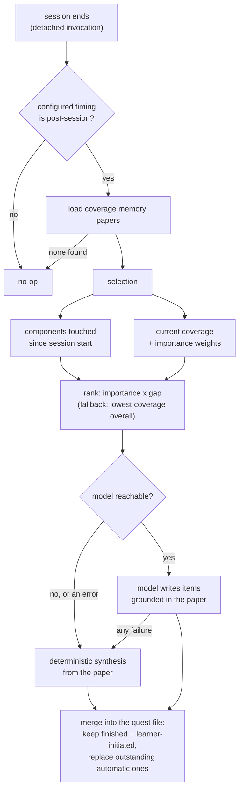

## Summary

This component decides which components a learner should be checked on after a
working session, turns each of them into a runnable set of items, and writes the
result where the runner will find it. It runs detached from session shutdown, so it
is written to never fail fatally: when there is no model available, it synthesizes
items directly from the component's paper instead of producing nothing. It also
serves the learner-initiated path, generating a single quest on demand for any
component regardless of the configured condition.

## What it does

At the end of a session the system knows two things it will never know as precisely
again: which components the learner actually touched, and how well they currently
understand them. The post-session arm exists to convert that momentary knowledge
into something durable — a small queue of checks waiting on the map. But the moment
it can act is the worst possible moment to be slow or fragile. The process is
launched as the session is winding down, detached, with no terminal to print to and
no user watching. Anything it throws vanishes.

That constraint shapes everything here. Selection has to be cheap and deterministic.
Item generation may call a language model, but must treat that call as optional
rather than required. The writing step has to merge into a file that may already
contain quests the learner started themselves. And the whole arm is conditional: the
study design also has an in-flow timing, where interventions happen at a commit
boundary instead, and under that timing this component deliberately does nothing.

## Related components

The documents produced here are shaped by [Quest Documents and Item Shapes](../quest-schema/),
whose permissive item validation is what allows generated content of varying shape to
be written at all. What happens to those documents afterward is
[The Shared Completion Path](../quest-completion/), which lives in the same file and
closes the loop back into coverage.

Three inputs govern behaviour. The configured timing, modality, model tier, and
validation threshold all come from [Conditions, Budgets, Thresholds, and Model Tiers](../../platform/config-schema/) —
this component reads configuration and never argues with it. The papers that ground
every item are supplied by [Loading the Coverage Memory Tree](../../memory/paper-loader/),
and both the model prompts and the offline synthesizer draw exclusively on a paper's
declared concepts and rationale, never on its prose. Which declarations a paper is
obliged to carry, and what a well-formed concept or reasoned decision looks like, is
settled by [Paper Format and Frontmatter Contract](../../memory/paper-format/) — the
thin-paper case that forces the weakest item this component can produce is a property
of that contract rather than of anything decided here. Current comprehension and the
per-component importance weights come from re-materializing coverage, described in
[Impure Edges: Git Churn, Clock, and Disk](../../comprehension/coverage-materialization/),
with the candidate set and the importance values themselves defined by
[The Frozen Map Document](../../map/map-schema/). The rule that decides whether a
component counts as low-coverage at all — the state labels and the averaging behind
each dimension score — is not restated here but taken whole from
[Scoring: Exponential Averaging, Loyalty, Classification](../../comprehension/coverage-model/),
so a change in how comprehension is scored changes what this component selects
without a line of selection code moving.

The staleness bonus in the ranking has a source of its own:
[Source Drift and Staleness Flagging](../../map/drift-detection/) is what flips a
previously validated component to stale when its sources move away from the commit it
was validated at. Reading it explains the gap described below, where staleness reaches
this component as a thumb on the ranking scale and never as a check of its own.

Finally, the triggers. Nothing in this component decides when the automatic run
happens; that is [Session Start and Session End](../../capture/session-lifecycle-hooks/),
which launches it detached at session end and which also records the session start
time this component uses as the cutoff for "touched during this session". The
learner-initiated variant is triggered from somewhere else entirely —
[User-Initiated Entry Points](../../interventions/slash-commands/), the small set of
commands by which someone asks for a challenge on a component of their own choosing,
which is why that path ignores the configured timing.

## How it works

Generation begins with two cheap refusals. If the configured timing is not
post-session, it returns immediately, reporting that it skipped; in-flow conditions
never accumulate a queue, by design. If the repository has no coverage memory papers
at all, it skips for the same reason — there is nothing to ground an item in.

Selection then runs in two stages. First it needs the set of components the learner
touched during the session just ended. It gets this by reading the raw evidence log
directly, line by line, keeping only file-touch and prompt entries stamped at or
after the recorded session start, and collecting the component identifiers those
entries carry. Malformed lines are skipped silently rather than aborting the scan,
and a missing or unparseable session start yields an empty set instead of an error.
This read deliberately bypasses the coverage model: it wants the raw record of what
happened in a time window, not a score.

Second, every component in the frozen map is scored. A component counts as
low-coverage if its state is anything other than validated, or if its mean
comprehension sits below the configured validation threshold. The primary candidate
set is the intersection of touched and low-coverage, ranked by importance multiplied
by a comprehension gap — the distance from full comprehension, plus a fixed bonus for
a component flagged stale. An important component you barely understand therefore
outranks a peripheral one you almost understand. If that intersection is empty — a
short session, thin evidence, a first run — selection falls back to the
lowest-coverage components overall, importance breaking ties. That fallback
guarantees the queue is never empty merely because signal capture was thin. Either
way only the top few survive: the run takes a small fixed number of components,
three unless a caller asks for a different count, so a long session does not turn
into a wall of pending checks.

Before any item is written, the model to write it with is settled, and the choice is
not open. The system distributes its language-model work across two tiers — an
expensive tier reserved for building the coverage memory in the first place, and a
cheap tier for the small recurring interventions — and this component resolves its
model identifier from the cheap tier unconditionally. There is no parameter, no
override, and no fall-through by which a build-tier model could be reached from
here; the source comment states the prohibition in absolute terms. The identifier
that comes back is resolved once at the start of the run and reused for every
component in it, and it is reported in the result even when no call was ultimately
made, so a reader of the run's output can tell which model would have been used.

For each selected component the paper is fetched and condensed into a grounding
block: the title and identifier, the named concepts, and the rationale entries with
their decisions, reasons, and rejected alternatives. That block, and only that
block, is what an item is written from. Under the question-card modality the model
is asked for exactly two multiple-choice items, each with four options, a correct
index, and a dimension tag, preferring one concepts item and one rationale item.
Under the dialogue modality it is asked for a single opening question plus a
one-line statement of what to probe, and instructed not to reveal answers.

The response is parsed defensively: any surrounding code fencing is stripped before
parsing, both a bare list and a wrapper object are accepted, items missing a question
stem or not carrying exactly four options are dropped, a correct-answer position
outside the four available slots is reset to the first slot rather than trimmed
toward the nearest legal one, and an unrecognized dimension tag falls back to the
concepts dimension. At most the first two surviving items are kept. If nothing
survives, that component is treated as a failure — and the failure latches,
disabling the model for every remaining component in the run, because the realistic
cause is structural rather than per-item.

The offline synthesizer is not a placeholder; it produces valid, paper-grounded
items. Its central trick is where it finds wrong answers. For a concepts item it
asks which idea belongs to this component, uses the component's own first concept as
the correct option, and draws distractors from the concepts of other components in
the same coverage memory — plausible-sounding, genuinely wrong here. For a rationale
item it quotes one of the component's decisions and asks why it was made, with the
recorded reason as the correct option and other components' reasons as distractors.
Short pools are padded with generic fillers, and the option order is rotated by an
amount derived from the question's length, so the correct answer is not always in
the same position while the same paper always yields the same arrangement.

Two items are guaranteed even for a thin paper, and the way that guarantee is met is
worth knowing. A paper with no rationale entries carrying a stated reason yields only
the concepts item, so a top-up loop runs: it takes the next declared concept if the
paper has one, and if it has run out of concepts it builds a structure item instead,
asking which area of the codebase this component owns, with the first source region
the paper declares as the correct option and three obviously generic wrong regions
alongside it. That last case is the weakest item the system can produce, and it only
appears for a paper that declares a single concept and no reasoned decisions.

The dialogue fallback is a single opening question that invites the learner to
explain how the component works and why it is designed that way, and that names the
component's first concept as the starting point. The first decision, when the paper
records one, does not appear in the question at all — it goes into a separate
one-line focus note carried alongside the item, which is guidance for whatever runs
the dialogue rather than text the learner reads.

It is worth being blunt about the quality difference. The offline items are
recognition tasks — matching a name to a title, matching a reason to a decision —
and a learner who has skimmed the paper can pass them without understanding the
code. They keep the loop running; they are not equivalent to model-written items.

Writing is a merge, not an overwrite. Existing quests are read back and filtered:
anything already finished is kept, anything the learner raised themselves is kept,
and only outstanding automatically-generated quests are dropped before the new batch
is appended. The run reports whether any component actually used the model, which
model identifier was resolved, how many quests were written, and which components
they target.

The learner-initiated path is a deliberate variant of the same machinery. It
generates one quest for one named component, and it is explicitly not gated on the
post-session timing, because voluntary learning is available under every condition
and spends no interruption budget. It tries the model first and falls back to the
same synthesizer, so the entry point works offline. It returns nothing at all when
the named component has no paper. When it writes, it replaces any earlier
outstanding learner-initiated quest for that same component, so repeatedly asking
for a challenge does not pile up duplicates.

One gap deserves naming, and it needs stating carefully because a nearby mechanism
does work. Components genuinely can go stale: when coverage is re-materialized, the
churn in a component's sources since the commit it was last validated at is measured,
and a previously-validated component whose sources have moved far enough flips to
stale. That is why the ranking above can award a staleness bonus at all. What does
not exist is anything that turns a stale component into a check of its own. The
contract admits an origin meaning "raised because the sources drifted", and no code
in this repository ever writes it; the standalone command for reporting drift is an
acknowledged stub that prints the two commits being compared and says outright that
per-component churn reporting is not implemented. So staleness reaches this component
only indirectly, as a thumb on the ranking scale, and every quest that exists today
was raised either by a session ending or by the learner asking.

## Design decisions

The dominant decision is that failure degrades rather than propagates, and the
source comment says so explicitly: a bad paper, a missing credential, or a failed
call to the model service must still produce a valid quest file. The reason is
situational. This code runs detached
during session shutdown, where an exception is not reported to anyone — the learner
would simply open the map later and find nothing, with no way to distinguish
"nothing was needed" from "it crashed". Building a real synthesizer instead of an
empty-result path costs perhaps a hundred lines and removes an entire class of
invisible failure. Reverse this decision and the post-session arm becomes silently
dependent on network access.

Pinning the model tier appears to be a cost-shape argument rather than a quality
one. The build of the coverage memory happens once per repository and is priced
accordingly; generation happens after every session, forever. Allowing a caller to
choose freely would let one wrong configuration value turn a recurring
cents-per-session job into a dollars-per-session one, and the comment states the
prohibition in absolute terms. The cost is real — a cheaper model writes weaker
items — and the design compensates by grounding items tightly in already-written
paper material rather than asking the model to reason about code.

Latching after the first failure is a latency argument. Each failed call costs a
timeout, and the likely causes — no credentials, no network — are identical for
every remaining component. Retrying per component would multiply that timeout by the
batch size at exactly the moment the process should be finishing quietly. The
trade-off is that a genuinely transient failure downgrades the rest of the batch
unnecessarily; the comment's phrasing suggests that was accepted knowingly.

The merge policy encodes a small hierarchy. Finished quests are history and feed the
coverage record, so they are never touched. Learner-initiated quests represent
someone's own decision to study something, and an unrelated session ending has no
business deleting them. Outstanding automatic quests, by contrast, are stale guesses
superseded by a newer, better-informed guess. Without this filtering, either history
would be lost or unanswered offers would accumulate until the queue meant nothing.

## Where it sits

This is the component that decides what the learner will be asked and makes sure
something is always askable. Its two halves are worth remembering separately: a
deterministic selection stage that combines recent activity, current comprehension,
and structural importance, and a generation stage that prefers a model but never
depends on one. From here, the natural next reads are the completion path, which
shows what a graded answer does to coverage, and the quest document contract, which
explains why generated items of uncertain shape can be persisted safely at all.
