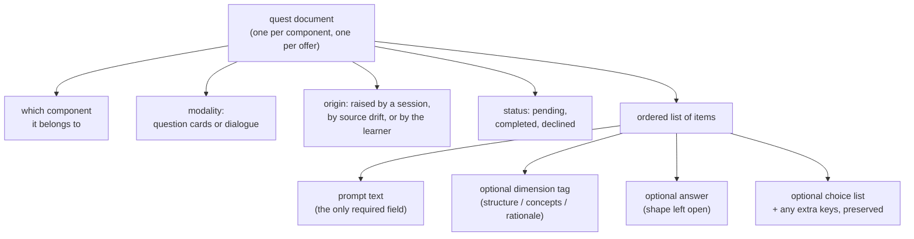

## Summary

This component is the data contract for a quest: the small document that carries a
pending comprehension check from the moment it is generated to the moment it is
graded. It defines what a quest is made of — the component it targets, the modality
it will be run in, why it exists, whether it is still outstanding, and the ordered
list of items a learner will actually answer. Its defining choice is asymmetry: the
outer envelope is strict and fully enumerated, while the items inside are validated
permissively, because those items are written by a language model whose exact output
shape cannot be pinned down in advance.

## What it does

The post-session arm of this system produces work for the learner to do later:
after a coding session ends, a few components are selected and turned into checks
that will be answered in the browser or on the command line, possibly hours later,
possibly on a different device on the same network. That gap in time and place is
what forces a persisted document rather than an in-memory object. Something has to
be written down, survive process exit, be re-read by an unrelated program, and still
be trustworthy enough to grade against.

A newcomer should hold two facts before reading further. First, the whole system's
comprehension model is expressed in three dimensions — structure, concepts, and
rationale — and every graded outcome must name which of the three it moved. Second,
quest items are not hand-authored; they are produced either by a language model or,
when no model can be reached, by a deterministic synthesizer that reads the
component's paper. A schema written for hand-authored content would have been much
stricter than this one, and would have broken constantly. The shape described here
is the compromise that lets generated content flow through unharmed while still
guaranteeing enough structure for the grading path to rely on.

## Related components

The producer side is [Selection, Generation, and Offline Fallback](../quest-generation/),
which is the only code that ever constructs one of these documents; every field
described here has a corresponding decision made there. The consumer side is
[The Shared Completion Path](../quest-completion/), which reads the envelope,
ignores most of the item fields, and turns graded results into evidence.

The dimension tag carried on an item is not defined here — it is borrowed from
[The Append-Only Evidence Log](../../comprehension/evidence-log/), which is the
schema that defines what a graded signal looks like once it has been recorded. The
three dimensions themselves, and the coverage states a completed quest ultimately
moves, are described in [Coverage States and the Three Dimensions](../../comprehension/coverage-schema/).

Physically, quest documents live in the per-user state area laid out by
[Per-User State Layout and Repository Identity](../../platform/state-directory/),
which owns the read helper that validates each stored quest on the way back in.
The most demanding reader of the item shape is
[Running a Quest in the Browser](../../viewer/quest-runner-ui/), which has to render
choice lists it did not create and cope with items that carry nothing but a prompt.

One field here points at a neighbour that has not yet been wired to it. The origin
value meaning "raised because the sources drifted" is declared in this schema and
written by nothing; the machinery that would eventually justify writing it is
[Source Drift and Staleness Flagging](../../map/drift-detection/), which is what
decides that a validated component's sources have moved far enough for its
comprehension record to be doubted. Reading that component is the fastest way to see
why the value was reserved and what would have to exist before it appears.

## How it works

A quest document has six fields and no nesting beyond its item list. It carries its
own identifier, generated fresh for each offer, so a component can be quizzed many
times over its life without any of those attempts colliding. It names exactly one
component — quests are never about a group, a province, or a file, always about a
single unit of the coverage memory, because a graded outcome has to credit exactly
one coverage record. It names a modality, which is either a set of question cards or
a dialogue, and this is fixed at generation time rather than chosen at run time, so
a quest generated under one configured condition stays what it was even if the
configuration changes afterward.

It also names an origin: who or what raised this check. Three values are admitted —
one for quests produced automatically at the end of a working session, one for
quests raised because a component's sources have drifted away from the state in
which it was last validated, and one for quests the learner started themselves.
Origin is bookkeeping, not policy; nothing in the grading path treats one as worth
more than another. It matters in two other places: the generator uses it to decide
which existing quests may be replaced when it writes a new batch, and the study
design needs to distinguish a check the system imposed from a check the learner
chose. Worth stating plainly, and precisely: the drift-driven value is declared here
but written nowhere. This is not because the system cannot detect drift — it can, and
components do flip to a stale state when their sources move far enough from the
commit they were last validated at. It is because nothing has been built that
converts a stale component into a quest. The value is a name waiting for a producer.

Status is similarly three-valued: outstanding, finished, and declined. Only the
first two are ever written. The declined value is reserved for a learner explicitly
turning a quest down, which no current path implements, and it is honest to read it
as room left for a future decision rather than as behaviour you could observe today.

The item list is where the design becomes deliberately loose. An item must have a
prompt — the text the learner actually reads — and that is the only guaranteed
field. Three optional fields are named: the comprehension dimension the item probes,
an answer, and a list of choices. Anything else a generator attaches is preserved
rather than discarded, which is how generated items manage to carry, for example, a
numeric index alongside a spelled-out answer, or a one-line statement of what a
dialogue is meant to probe, without any of that appearing in the schema at all.

The dimension field deserves a note of its own, because it is the one field this
component does not define. Rather than listing structure, concepts, and rationale
here, the schema imports the very same enumeration that the evidence log declares
for its graded records, and reuses it unchanged. There is exactly one definition of
the three dimension names in the system, and this file borrows it. That is why an
item's tag can be copied straight onto an evidence record with no translation step
and no possibility of a name that is legal in one place and illegal in the other.

The answer field is the sharpest expression of this looseness: its type is left
open. The stored example answers a multiple-choice item with the numeric position of
the correct option, while the generator writes the option's text and attaches the
position as an extra field. Both validate, and nothing in the schema adjudicates
between them — because grading is not performed by comparing a stored answer to a
learner's answer inside this system. Whatever runs the quest does the grading, and
only the resulting per-dimension scores come back. The stored answer exists so a
runner can show a correct response after an attempt, not as an authority.

The invariant this component maintains is therefore narrow: any document that
validates names a real component, a real modality, a real origin, a real status, and
a list of items each with readable prompt text. Everything richer is best-effort.

It is worth being precise about what happens when that guarantee is not met, because
the reading helper is less forgiving than it first appears. Every stored document is
re-checked against this schema on the way back in, but the check is not per-document
in its consequences: the whole file is read, parsed, and validated inside a single
guard, and if any one document fails, the reader returns an empty list rather than
the documents that were fine. It also returns that empty list silently, with no
error surfaced anywhere. So a hand-edited or half-written file does not present as a
validation complaint — it presents as a learner who suddenly has no pending checks
at all. A junior debugging a queue that has mysteriously emptied should suspect a
single malformed document before suspecting the generator.

## Design decisions

The permissive item shape is the decision that defines this component, and the
source comment states the reason directly: item shape varies by modality, and the
consuming machinery only relies on the prompt. The alternative — a strict union with
one branch per modality — is what most schema authors would reach for first, and the
code suggests it was rejected because it would convert every imperfect model output
into a hard failure. Under that alternative, a model that returned five choices
instead of four, or attached a confidence score, or phrased a dialogue seed with an
extra field, would produce a quest that could not be written at all; the learner
would end their session and find nothing waiting. With the permissive shape, the
generator's own filtering decides what is usable and the schema never gets in the
way. Reversing this decision would push validation failure from a place that can
degrade gracefully into a place that cannot.

Reusing the evidence vocabulary for the dimension tag rather than declaring a local
one appears to be about preventing a silent class of bug. An item's tag is copied
into a graded record, and that record's dimension determines which of three
comprehension scores moves. If the two enumerations were declared separately and one
gained a value the other lacked, the mismatch would not throw — it would quietly
credit the wrong dimension or drop the credit entirely, and coverage would drift
away from reality with no error anywhere to explain it. Sharing one definition makes
that failure impossible to express.

The reserved declined status and the unwritten drift origin are best read as
deliberate forward room, and the code gives no evidence they were ever exercised. It
is cheap to enumerate a value now and expensive to migrate every stored quest later,
and both values correspond to behaviour the design describes but the implementation
has not reached. A junior should treat them as declarations of intent, not as
features, and should not write code that assumes either one can appear.

## Where it sits

This component is small, and that is its point: it is the narrow, stable contract
across which generated content passes on its way to being graded. Read it as two
layers — an envelope that is strict because the rest of the system genuinely depends
on every field of it, and an item list that is loose because the thing filling it is
a language model. Two neighbours complete the picture: the generator, which decides
what goes into these documents and how it degrades when there is no model available,
and the completion path, which shows exactly how little of an item actually matters
once a learner has answered it.
