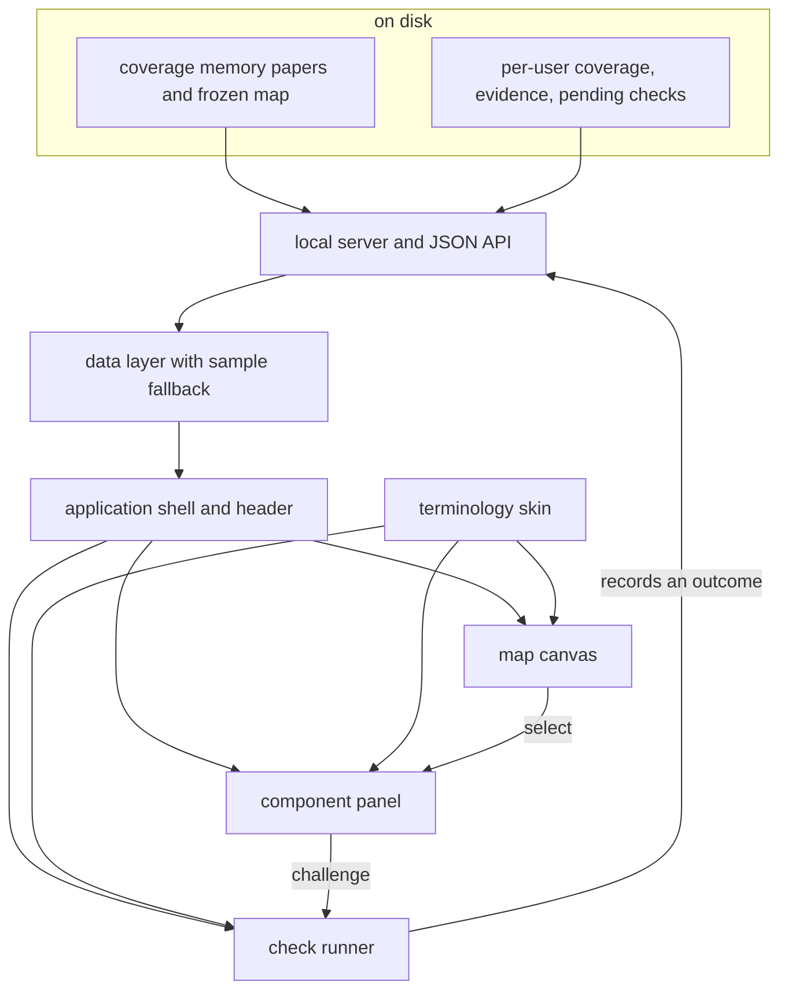

## Summary

This province is the visual surface of the whole system: a local server that exposes a repository's
coverage memory and a learner's comprehension state over a small JSON interface, and a single-page
application that renders them as a stable spatial map. It is where a learner sees which parts of the
codebase they have genuinely understood, reads the paper for any of them, and completes a
comprehension check that moves the picture. Nothing here decides what coverage means — it reads,
draws, and hands outcomes back to the engine that does.

## What it does

Every other province in this system produces data: papers describing components, a frozen layout
giving them positions, an evidence log of what a learner touched and answered, and a coverage view
derived from it. None of that is visible. A learner working inside their coding assistant
experiences the system as occasional prompts and a commit that sometimes pauses; the accumulated
picture of what they do and do not understand exists only as files.

This province turns that picture into a place. The design bets that a spatial, persistent
representation — the same component in the same position every visit, coloured by how well it is
actually understood — will do something a list of percentages cannot: make a gap feel like somewhere
you have not been, and make closing it feel like arriving. That bet imposes hard constraints on the
implementation. The layout must never move. The state shown must never be stale relative to the
evidence that produced it. And the game vocabulary that carries the metaphor must stay quarantined,
because everything the system stores and analyses is deliberately neutral.

It also imposes an unusual deployment shape. There is no hosted service and no account. The server
is a process the learner starts inside the repository they are working in; it reads files, serves a
bundle, and exits when they close it.

## Related components

Seven components divide this province. [Serving the Map and Its JSON API](./local-server/) is the
process behind everything else: it resolves which repository and which learner are in play, serves
the built application, and answers reads and writes. [Live Data Versus Sample Fallback](./viewer-data-layer/)
is the browser's only contact with it, and the only place a fallback to bundled fictional data can
occur. [Composition and the Unification Header](./app-shell/) owns all shared state and composes the
three visible surfaces. [Drawing the Map from Frozen Geometry](./map-canvas/) draws the map itself
from stored coordinates, with continuous semantic zoom.
[Reading a Doc In-App](./component-panel/) is the reading and score-reading surface for a single component, including a deliberately partial markdown
renderer. [Running a Quest in the Browser](./quest-runner-ui/) delivers both comprehension-check
modalities. [The Single Skin Boundary](./terminology-skin/) is the one file allowed to translate
neutral coverage states into the map's presentation vocabulary.

Outside this province, three components matter most. [The Frozen Map Document](../map/map-schema/)
defines the geometry and connectivity everything here draws — provinces, node positions, importance
weights, and typed links. [Coverage States and the Three Dimensions](../comprehension/coverage-schema/)
defines what a colour on a node actually asserts about a learner, and is the vocabulary the skin
translates from. [The Shared Completion Path](../quests/quest-completion/) is where an attempt
finished in the browser becomes recorded evidence — the same routine the command line uses, which is
what keeps the two surfaces from producing different results for the same answers.

## How it works

The province's responsibility divides along two clean seams: process versus browser, and data versus
presentation.

The first seam separates the local server from everything else. The server is the only part with
access to the file system, git, and the model API. It resolves the repository's coverage memory and
the learner's state directory, keeps the coverage view honest by re-deriving it whenever the
evidence log is newer, routes writes through logic shared with the command line, and hosts the one
genuinely stateful thing in the province — a capped dialogue held in process memory, which is also
the only feature here with a hard dependency on a model. Everything on the browser side is
downstream of a small, stable set of endpoints.

The second seam runs inside the browser. The data layer owns the network contract and, crucially,
owns the decision about what to do when it cannot be honoured — every read and write degrades to
bundled sample data rather than failing. The shell owns state and composition. Three presentation
components own rendering, each with a narrow remit: the canvas draws geometry and handles pan and
zoom but never computes a layout or interprets a state name; the panel reads and displays a single
component's paper and scores; the runner delivers a check and reduces the attempt into the shape the
engine consumes.

Cutting across both is the skin, which is not a layer so much as a chokepoint. Each presentation
component asks it for a colour, a treatment category, and wording, and none of them branches on a
state name directly. That arrangement is what allows the metaphor to be changed, translated, or
removed without touching anything that renders or records.

Parts of this province are honestly incomplete, and a reader should expect to meet the gaps. The
in-app markdown renderer handles headings, paragraphs, and inline emphasis but not lists or links,
and it shows diagram sources rather than rendering diagrams. The browser dialogue path is the only
feature here that cannot degrade offline, because it depends on a live model. Loaded data is not
refreshed while the page is open except after a completed check. And the header does not yet carry
the session recap the design describes.

## Design decisions

The seam that defines this province is read-and-render versus decide-and-record. Nothing in here
computes what coverage should be. The canvas asks for coordinates it did not choose; the shell asks
for a weighted total using the engine's own function rather than its own arithmetic; the runner
reduces an attempt but hands the reduction to shared completion logic rather than writing anything.
That discipline appears to be deliberate and it is what makes the province safe to change: an
interface that only presents cannot corrupt the record it presents.

Grouping the server with the browser application, rather than filing it with the command line it
technically ships inside, seems right for the same reason. The server exists only to serve this
application; its endpoints are shaped by what the map needs, its static-file handling exists because
the map is a bundle, and its one piece of process state exists because the runner has a dialogue
mode. Reading the server and the data layer as one contract — two halves of the same conversation —
explains far more than reading the server alongside the other commands would.

The alternative grouping worth naming is splitting presentation from transport entirely, putting the
server in the platform province and leaving only the browser code here. The code suggests why that
would be worse: the freshness rule the coverage endpoint implements, the shared-completion
delegation, and the fallback behaviour in the data layer are a single design conversation about
staying truthful to the stored record, and separating the participants would obscure it.

## Where it sits

The Map Viewer is where the system's work becomes visible: a frozen spatial layout coloured by
genuine comprehension, a paper always one click away, and a check that moves the picture when it is
passed. Its components split cleanly into a file-reading process, a network contract with a
deliberate fiction behind it, a state-owning shell, three rendering surfaces, and one chokepoint for
vocabulary. Start with [Serving the Map and Its JSON API](./local-server/) to see where the data
comes from, then [Drawing the Map from Frozen Geometry](./map-canvas/) for the idea the whole
province exists to serve — that a codebase can be a place you learn your way around.
