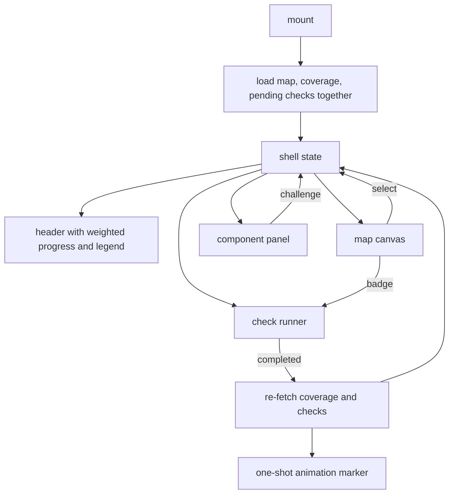

## Abstract

This component is the application's root: it loads the data, owns every piece of state the other
three surfaces share, and composes them into one screen with a header showing weighted total
coverage and an interactive legend. Its most consequential behaviour is what happens after a
comprehension check completes — it re-fetches from the server rather than trusting the response,
then flags the affected component for a one-shot animation on the map. It also carries the
application's entry point and its single global stylesheet.

## Introduction

Everything else in this province does one thing: draw the map, render a paper, run a check, or fetch
data. None of them knows about the others. Something has to hold the wiring, and the wiring is
genuinely non-trivial because the surfaces are interdependent in ways that are not hierarchical — a
badge on a node opens a runner that lives beside the panel; the panel can create work that the map's
badges should immediately reflect; a completed check should change the header, the node's colour,
and the panel's score bars at once.

The chosen answer is the plainest one available: one component owns all of it, and every child is
fully controlled. There is no store, no context, no event bus. That works because the screen is
singular — one map, one optional panel, one optional modal — and because the amount of shared state
is small enough to list: the map document, the coverage view, the list of checks, which component is
selected, which check is open, which component just moved, and which state the legend is
highlighting.

## Related Work

The three surfaces this shell composes are [Drawing the Map from Frozen Geometry](../map-canvas/), which receives
the map, the coverage view, the selection, the grouped pending checks, the just-moved marker, and
the highlighted state, and reports back hover-independent selections and badge activations;
[Reading a Paper In-App](../component-panel/), which is mounted only when something is selected; and
[Running a Quest in the Browser](../quest-runner-ui/), which is mounted only when a check is open.
All data comes through [Live Data Versus Sample Fallback](../viewer-data-layer/), so the shell never
touches the network directly and inherits that layer's fallback behaviour without knowing about it.

The state labels and colours in the header come from [The Single Skin Boundary](../terminology-skin/),
along with the name given to weighted total coverage; the ordering of the legend and the product
name and tagline in the brand block are written inline here instead, the tagline being one more
small escape of presentation vocabulary from the module that claims it. That number is
produced by [Scoring: Exponential Averaging, Loyalty, Classification](../../comprehension/coverage-model/) —
the shell calls the engine's own weighting function in the browser, which is only possible because
of [Keeping Platform Builtins Out of the Viewer](../../platform/browser-safe-surface/), the narrowed
export surface that omits everything touching file-system builtins so engine logic can be bundled
into a web page at all.

## Description

The entry point is minimal: it finds the root element, throws if it is missing, and renders the
shell inside the framework's strict development mode, after importing the global stylesheet. Strict
mode is worth noticing, because it double-invokes effects in development — which is precisely why
the shell's loading effect carries a cancellation guard.

The shell itself declares seven pieces of state and no others exist anywhere above the surfaces it
composes: the map document, the coverage view, the full list of checks, the identifier of the
selected component, the check currently open in the runner, the component whose coverage just moved,
and the coverage state the legend is currently highlighting. Every child receives what it needs as a
value plus a callback to change it, and none of them holds a private copy — the canvas keeps only
its own hover target and view transform, the panel keeps only the paper it fetched, and the runner
keeps only the attempt in progress. Because there is exactly one writer for each of these values,
there is no reconciliation problem to solve and no library doing the solving.

On mount the shell issues its three reads together and waits for all of them, then sets the map,
the coverage view, and the list of checks in one pass. A flag set in the effect's cleanup causes a
late response to be dropped rather than applied. There is no polling and no refresh on window focus:
the data is read once, and thereafter only when a check completes. That is a real limitation worth
holding — evidence appended in the background by the coding assistant while the map is open will not
appear until the page is reloaded.

Three derived values are memoised. Pending checks are grouped into a map keyed by component,
skipping anything not pending; both the node badges and the panel's list read this same grouping, so
they cannot disagree. Weighted total coverage is computed from the map's nodes and the coverage view
by the engine's own function, returning zero until both have loaded. And a per-state count is
tallied across the map's nodes, treating an absent record as unexplored — these are the numbers the
legend shows.

Two callbacks carry the interesting logic. Starting a check selects its component, folds the check
into the list if it is not already there — necessary because a check created on demand by the panel
does not yet exist in the loaded list, and without this the map badge and panel list would not see
it — and opens the runner. Completing a check re-fetches coverage and the check list together,
applies both, sets the just-moved marker to the affected component, and schedules a timer that
clears the marker only if it still refers to the same component. That last condition matters: two
completions in quick succession must not have the earlier timer cancel the later animation.

The header has three regions. A brand block, then weighted progress rendered as a bilingual label,
a whole-number percentage, and a filled bar. Then the legend: one button per coverage state in a
fixed order, each showing a dot in the state's colour, the state's short label, and how many
components are currently in it. The other language's label is offered as a hover tooltip rather than
printed inline, which is what keeps four buttons fitting across the header. Pointer entry and
keyboard focus set the highlighted state; leaving or blurring clears it, again only if it still
refers to the same state. Making these buttons rather than static swatches is what gives the
highlight interaction to keyboard users as well as pointer users, and the pressed state is announced accordingly.

The main region shows a loading placeholder until both the map and the coverage view exist, then the
canvas, plus the panel and runner when their state is set. The runner is given a close handler, a
completion handler, and a handler for the read-the-paper escape that selects the component and
closes the modal.

The stylesheet is a single global file for the whole application — no scoped or generated styles.
It defines a dark theme through custom properties and is organised by surface with comment banners:
header, map, panel, markdown, badges, and runner. Two things there are worth a reader's attention.
The four coverage-state colours are declared as custom properties here and also declared in the skin
module, so the same values live in two places with nothing keeping them in step. And several
animation and highlight behaviours the canvas relies on — the pulse when coverage moves, the ring
around highlighted nodes — are defined in this stylesheet rather than in the component that triggers
them.

Two honest gaps. The plan describes a header that also shows a session recap of what the learner
visited; only the progress bar and legend exist. And the shell's own leading comment still describes
the application as a read-only shell awaiting a check runner and a live engine, which is no longer
true — both are present and wired.

## Rationale

Owning all shared state in one place appears to be a considered rejection of machinery rather than
an absence of design. Every piece of state here is read by at least two surfaces, which is normally
the argument for a store; but there is exactly one screen and no routing, so the alternative would
add indirection without removing any coordination. The cost is a component that passes a lot of
values down, which is visible and easy to follow. What would break under growth is legibility, not
correctness — a second screen would be the point at which this decision should be revisited.

Re-fetching after a completion instead of applying the response is the shell's sharpest choice. The
runner already receives the updated component record and could set it locally, which would be faster
and would avoid a round trip. The code suggests the reason it does not is authority: completion
writes evidence to disk and re-derives coverage, and other things — a component's state
classification, its validation marker, and the weighted progress computed across every node — depend
on the whole view rather than on one record. Patching locally would leave the header computing
progress from a coverage view that is one component out of date, and any subsequent action would
compound the divergence. Paying one extra read to stay exactly in step with the stored view is a
good trade.

Computing weighted progress in the browser rather than asking for it seems to be about having one
definition. The weighting function is pure and already shared with the command line, so calling it
directly means the percentage in the header and the figure a status command prints cannot disagree.
An endpoint would be a second place the same number is produced, which is precisely the kind of
duplication the rest of the system works to avoid.

Making the legend interactive is a small idea with a large payoff. The question a learner most
naturally asks of a whole map — which components are still unexplored, which have drifted — has no
other affordance in the interface, and the legend is already where the eye goes to interpret colour.
Wiring highlight to both hover and focus, on real buttons, means the same question is answerable
without a pointer.

## Conclusion

The shell is the province's assembly point: it loads once, owns everything shared, composes three
surfaces, and enforces the rule that the server is the authority on coverage by re-reading after
every change. Its header turns the whole coverage view into two summaries — one number and one
interactive key. To follow the data inward, read [Live Data Versus Sample Fallback](../viewer-data-layer/);
to follow it outward onto the screen, read [Drawing the Map from Frozen Geometry](../map-canvas/) and
[The Single Skin Boundary](../terminology-skin/).
