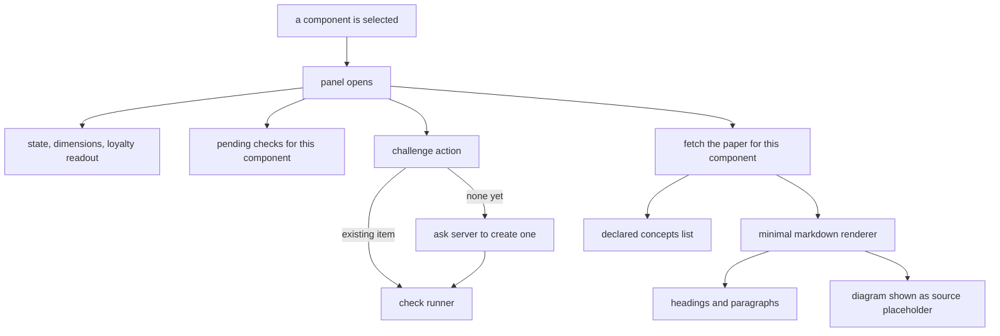

## Abstract

This is the side panel that opens when a component is selected on the map. It is the learner's
reading surface: current coverage state, the three dimension scores, the declared concepts, and the
paper itself, plus the action that starts a voluntary comprehension check on this component. The
paper is rendered by a hand-written markdown subset that covers headings, paragraphs, and inline
emphasis, and that deliberately does not render diagrams — it shows their source with a placeholder
caption instead, which is documented in the code as unfinished work.

## Introduction

The whole system rests on the papers being read. Coverage is scored against what a paper says a
component's concepts and rationale are; a check is generated from those same entries. If reading a
paper meant leaving the map and opening a file, the loop would break at its most important step, so
the panel brings the paper to the reader.

It also has to answer, in the same glance, the question the map raises: *where do I stand on this
one?* That is why the reading surface and the score readout are the same surface. A learner looks
at a node, sees that its rationale dimension is low, scrolls down to the reasoning section of the
paper, and can start a check without navigating anywhere. The panel is small, but it is the place
the two halves of the system — documentation and assessment — meet.

## Related Work

The structure the panel renders is defined by [Paper Format and Frontmatter Contract](../../memory/paper-format/):
the stable identifier, the human title, the declared concepts, and the rationale entries all come
from that contract, and the prose-only rule it imposes is precisely why a partial markdown renderer
is survivable here. The split this panel depends on — a structured header on one side and an
untouched body on the other — is performed once by
[Loading the Coverage Memory Tree](../../memory/paper-loader/), and its tolerance for a half-written
document is what lets a paper open at all during a build. The paper and the on-demand check both arrive through
[Live Data Versus Sample Fallback](../viewer-data-layer/), which means an opened panel may be
showing a bundled fiction if no server is running. Every label, colour, and one-line description of
a coverage state comes from [The Single Skin Boundary](../terminology-skin/); the panel asks for a
treatment and never interprets a state itself.

The panel is opened by [Drawing the Map from Frozen Geometry](../map-canvas/), which owns selection, and it hands
work to [Running a Quest in the Browser](../quest-runner-ui/) — either an existing pending item or
one it has just had created. That creation goes through
[Selection, Generation, and Offline Fallback](../../quests/quest-generation/), which is what makes
the action reliable: generation degrades to items synthesized from the paper when no model is
reachable, so the button is never dead for lack of an API key. The numbers in the readout are
defined by [Coverage States and the Three Dimensions](../../comprehension/coverage-schema/), which
is where a reader should go to learn what a loyalty value or a validation marker actually means.

## Description

The panel takes a component identifier, that component's coverage record if one exists, and the
list of pending checks attached to it. When the identifier changes it clears the displayed paper,
enters a loading state, and requests the new one; a cancellation flag captured in the effect's
cleanup ensures that a response arriving after the learner has already selected something else is
discarded rather than painted over the newer selection. This is the only asynchronous read the
panel performs.

The header shows the paper's title with the stable identifier beneath it, falling back to the
identifier alone while the paper is still loading or if none exists. Below that, a state chip and a
one-line description are drawn entirely from the skin module — both the label and the accent colour
that the dimension bars then reuse, which is what makes the panel feel visually bound to the node
that was clicked.

The score readout is three labelled bars, one per dimension, each showing a whole-number percentage
and a fill proportional to it. Missing coverage is treated as all zeroes rather than as an error, so
an unexplored component renders cleanly. Two further facts sit underneath as a small definition
list: the loyalty value as a percentage, and the identifier of the commit at which this component
was last validated, or a dash when it never has been.

If pending checks exist for this component they are listed with their modality and their origin —
where the item came from — each with its own start action. Beneath that sits the challenge action,
which is the learner-initiated path. Its logic is deliberately ordered: if a pending item already
exists, it opens that rather than creating a duplicate; otherwise it sets a preparing flag, asks for
one to be created, clears the flag, and either opens the result or shows a short failure message.
The comment in the code makes the reasoning explicit — a slow button is acceptable, an unresponsive
one is not.

Once the paper has loaded, two sections appear. The concepts section lists each declared concept as
its stable sub-identifier followed by its one-line name; this is the honest disclosure of what a
check on this component could ask about. Then the body is passed to the markdown renderer.

That renderer is a small line-oriented parser producing a flat list of blocks. It recognises fenced
blocks, capturing everything up to a closing fence and tagging the block by the fence's language;
two heading levels, distinguished by their marker prefix; blank lines, which end a paragraph; and
anything else, which accumulates into the current paragraph with lines joined by spaces. Within a
paragraph a single regular expression pass finds inline code spans, bold runs, and italic runs and
splits the text around them, emitting the appropriate elements.

What it does not handle is worth stating plainly, because the gap is real and a reader will meet
it. There is no support for lists, links, block quotes, tables, images, nested emphasis, or
top-level headings — a list line renders as an ordinary paragraph with its marker character intact,
and a markdown link renders with its bracket-and-parenthesis syntax visible as literal text. Since
the cross-links in a paper's related-work section are exactly that construct, they appear as inert
text: the graph edges those links define are real in the frozen map, but they are not clickable
here. Diagram fences are recognised specifically and rendered as a bordered figure containing a
badge, the raw diagram source in a preformatted block, and a caption stating that rendering the
diagram is deferred to a later phase. Non-diagram fences render as plain preformatted code.

One small inconsistency deserves flagging. Most learner-facing copy in the panel is drawn from the
vocabulary module as intended, but three pieces are not: the challenge action's own label, the
message shown when preparing a check fails, and the heading over the pending list, which is chosen
by a comparison against a literal string rather than looked up. All three carry the map's
presentation flavour inline — a minor leak across a boundary the vocabulary module explicitly
claims for itself.

## Rationale

Lazy per-selection fetching appears to be a straightforward payload decision. A built coverage
memory is intended to run to dozens of components, each with a paper of a thousand words or more,
and a given visit opens a handful; loading all of them up front would make the map slow to appear
in exchange for content that is usually never read. The cancellation flag is the necessary
companion — without it, clicking quickly across several nodes could leave the panel showing a paper
for a component that is no longer selected, which is the sort of bug that quietly destroys trust in
everything else on screen. There is no cache today, so re-selecting a component re-fetches it; that
looks like an accepted cost rather than an oversight, since the request is same-origin and local.

The hand-written renderer is the component's honest weak point, and the code says so itself. The
code suggests it exists because the panel needed to display prose before a full parsing and
diagramming stack was worth adding to the bundle, and because the paper format's own prose-only
discipline keeps bodies simple — no tables, no images, minimal inline markup. That discipline is
what makes a partial renderer survivable rather than broken. Where it visibly falls short is
exactly where papers depart from plain prose: the cross-links, and the hero diagram that every paper
is required to open with. A reader of the panel therefore sees the diagram's source rather than the
diagram, which weakens precisely the spatial anchoring the diagram was included to provide.
Reversing this decision — adopting a real parser and diagram renderer — would cost bundle size and
gain the two things the format most cares about.

Giving the challenge action its own in-flight state reflects an asymmetry in how it can fail. It
may hit a model call that takes seconds, and it may fail entirely if the component has no paper.
Both need to be visible, and both are, through a preparing label and a short error line. What breaks
if this is reversed is trust in the action: a learner who clicks and sees nothing concludes the
feature is broken and stops using the voluntary path — which the design treats as the most valuable
path, because it is the one the learner chose.

Listing the declared concepts above the paper rather than leaving them implicit looks like a
transparency choice. Those entries drive item generation, so showing them tells the learner what
they are accountable for before they are asked. This appears to be about making the assessment feel
fair rather than adversarial.

## Conclusion

The panel is where a component stops being a coloured circle and becomes something with an
explanation, a score, and an invitation. It reads its structure from the paper format, its
vocabulary from the skin, its data from the viewer's data layer, and it hands off to the check
runner. Its renderer is genuinely partial in ways a reader will notice — no clickable cross-links,
and diagrams shown as source. Read [Paper Format and Frontmatter Contract](../../memory/paper-format/)
to understand what it is displaying, and [Running a Quest in the Browser](../quest-runner-ui/) to
follow what happens after the challenge action fires.
