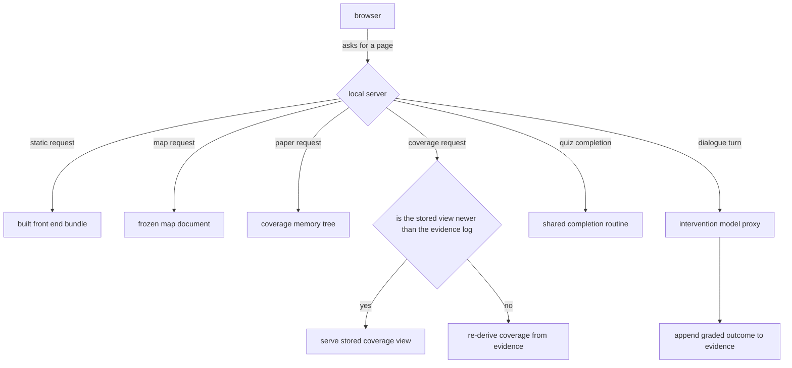

## Summary

This component is the small local web server that turns a repository's coverage memory and a
learner's per-user state into something a browser can render. It is plain Node with no web
framework: it serves the built map application as static files and exposes a handful of JSON
endpoints for the frozen map, the coverage view, individual component papers, and the pending
work items. It also carries the only path in the whole viewer that cannot function without model
access — a server-side proxy that runs a short Socratic dialogue against the configured
intervention model and records the resulting grades.

## What it does

The coverage memory lives as markdown in the repository, and the learner's comprehension state
lives as files under a per-user directory in their home folder. Neither is reachable from a
browser. Something has to stand between the file system and the map application, and the design
constraint is unusually strict: there is no hosted service in this system, no database, and no
account. The server is a process the learner starts in the repository they are working in, it
exits when they close it, and everything it reports is derived from files that were already on
disk.

That framing explains almost every choice inside it: it is scoped to the working directory it was
started in rather than configured with a repository path, it has no authentication because it binds
locally and speaks only to whoever launched it, and it keeps no persistent state beyond the files it
reads and writes — with one exception, an in-flight dialogue, which is deliberately allowed to
vanish on restart.

## Related components

The browser side of this boundary is [Live Data Versus Sample Fallback](../viewer-data-layer/),
which calls every endpoint described here through same-origin relative paths and quietly
substitutes bundled demonstration data whenever a call fails. The paper endpoint reads through
[Loading the Coverage Memory Tree](../../memory/paper-loader/), which parses the markdown papers
and their frontmatter into structured records; this server returns the frontmatter and the raw
body untouched and leaves all rendering to the client. The map endpoint simply relays [The Frozen
Map Document](../../map/map-schema/) from the repository, and returns a helpful failure when that
document has not been generated yet.

The coverage endpoint is a consumer of [Impure Edges: Git Churn, Clock, and Disk](../../comprehension/coverage-materialization/):
when the stored coverage view looks older than the evidence that feeds it, this server calls the
same re-materialization routine the command line offers, rather than computing anything of its
own. Its quiz write endpoint delegates wholly to [The Shared Completion Path](../../quests/quest-completion/),
which is the single place a quest outcome becomes recorded evidence. Its on-demand quest endpoint
calls into [Selection, Generation, and Offline Fallback](../../quests/quest-generation/), so a
learner-initiated check can be prepared even with no model access. Where all of these files live
on disk is settled by [Per-User State Layout and Repository Identity](../../platform/state-directory/),
which the server uses to resolve which learner's state belongs to which repository.

Three platform components explain how this process comes to exist at all. It is one subcommand of
[The Command Surface](../../platform/cli-surface/) — the only one that starts a long-lived process
instead of doing its work and exiting, which is why it is described here rather than there.
The built application it hands to the browser is produced and placed by
[Bundling and Distributing the Plugin](../../platform/plugin-packaging/), and the several candidate
locations this server tries when looking for those assets exist so that it works identically whether
it was launched from an installed plugin folder or from the workspace. Finally, this server is the
privileged side of the line drawn by
[Keeping Platform Builtins Out of the Viewer](../../platform/browser-safe-surface/): it is allowed
to read directories and parse files precisely so that the code it serves never has to, which is why
the browser receives papers already parsed.

## How it works

Before any route is considered, one thing is already settled: the directory. The server captures the
directory it was launched in when it starts and answers every subsequent request against that single
directory — the coverage memory is read from it, the learner's state folder is resolved from its
repository identity, and no request can name a different repository. There is no repository
parameter anywhere in the interface, which is why running the server in the wrong folder produces a
coherent map of the wrong project rather than an error.

The server answers three broad classes of request. Reads come first: a request for the map relays
the frozen map document verbatim, and returns a not-found response carrying a hint about which
command produces it when the document is absent — a deliberate choice to make a missing build step
diagnosable from the browser rather than mysterious. A request for a named component's paper loads
the whole coverage memory tree, looks the component up by its stable identifier, and returns the
frontmatter and the markdown body as two fields. A request for pending work items reads the stored
list and returns it as-is.

The coverage read is the interesting one. Coverage is a materialized view: it is derived from an
append-only evidence log, and the derived file can fall behind whenever hooks or the command line
append new signals. So the endpoint checks whether the evidence log exists and is non-empty, then
compares its modification time against the stored coverage view. If the view is older, the server
recomputes from the log and returns the fresh result; if recomputation throws, it falls through
rather than failing the request. If there is no evidence at all and no stored view, it synthesizes
a coverage record in which every component named by the map is in the initial unexplored state —
this is what lets the map render meaningfully the very first time it is opened, before the learner
has generated any signal at all.

Static serving is small but careful. The built front end is located by walking an ordered list of
candidate directories: an explicit environment override first, then two positions relative to the
running module, then two relative to the launched script, and finally the monorepo layout. This
exists because the same code is expected to run three different ways — from source during
development, from a compiled build, and from a self-contained plugin bundle where the front end is
copied alongside the executable. The first candidate that contains a page document wins. If none
does, the server still starts and serves an explanatory page telling the reader to build the front
end, while all the JSON endpoints keep working — the API is useful without the UI.

Path resolution guards against traversal by resolving each request inside the bundle directory and
checking that the result is still under it; anything that escapes, and anything that names a
missing file or a directory, is rewritten to the single page document. That single rule
simultaneously provides the traversal guard and the client-side routing fallback, which is why
there is no separate router.

Two smaller precautions run across every route. Request bodies are read with a size ceiling of about
a megabyte and the connection is destroyed if it is exceeded, so a runaway upload cannot exhaust
memory. And every response carries permissive cross-origin headers, with a dedicated handler for the
preflight request browsers send before a cross-origin write — that exists purely so the front-end
development server, which runs on a different port, can reach the write endpoints during interface
work.

Writes are three endpoints. Recording a completed quiz reads a body of per-dimension scores and
hands them straight to the shared completion routine, then returns the updated component coverage
so the client can animate immediately without a second round trip. Creating a work item on demand
takes a component identifier and asks the generation layer for one; this is the path behind the
learner-initiated challenge, it spends no interruption budget, and it works without model access
because generation degrades to items synthesized from the paper itself.

The dialogue endpoint is the only one that cannot do its job without reaching the model. Creating a
work item may call the model too, but it has a deterministic fallback and so always succeeds; a
probing follow-up question has no such fallback, which makes this the single hard dependency in the
province. The endpoint holds a per-quest history in a
process-local map along with a count of learner turns, appends the incoming message, and decides
whether this is the final exchange based on a fixed cap of three. Before the cap it asks the
intervention model for a single probing follow-up, grounded in a system prompt that carries the
component's concepts and rationale and explicitly forbids revealing answers. On the final exchange
it asks for closing feedback plus per-dimension grades as structured output, defends against a
malformed reply by clamping each grade into range and defaulting to a neutral middle score,
appends a graded outcome to the evidence log, marks the work item completed, recomputes coverage,
and returns everything the client needs to show the result.

Two failure modes are handled explicitly and worth internalizing. If no credentials are available,
the server rolls back the learner turn it had already recorded — decrementing the turn count and
popping the message — and returns a successful response carrying a described error instead of an
exception; a retry after supplying a key therefore starts from a consistent history rather than a
history containing a turn that was never answered. The same rollback runs when the model call
itself fails mid-dialogue. Recording the graded outcome is best effort: if the append fails, the
dialogue still concludes and the learner still sees their result.

One honest asymmetry: the quiz path routes through the shared completion routine, but the dialogue
path performs its own evidence append, its own work-item update, and its own recomputation inline
rather than calling the equivalent shared routine. The behaviour matches today, but the
single-source-of-truth property that protects the quiz path does not currently protect this one.

## Design decisions

The absence of a web framework is the loudest decision. The code suggests it was made because the
route surface is tiny and fixed while the installation cost of a framework is paid by every
learner on every machine; a dozen handlers expressed as string comparisons and two small regular
expressions cost less to read than the framework's own conventions would. Reversing it would not
change behaviour, but it would add a dependency to a tool whose entire premise is that it is files
and one local process.

Re-materializing coverage on demand rather than serving whatever is on disk appears to be driven by
the fact that the viewer and the capture path run concurrently. A learner keeps the map open while
Claude Code appends touch and prompt signals in the background; if the endpoint trusted the stored
view, refreshing the page after a working session would show nothing new until some other command
happened to recompute. Comparing modification times gets freshness at the cost of one file stat per
request. Recomputing unconditionally would be correct but wasteful; trusting the file unconditionally
would make the map a liar, which is the one thing this system cannot afford.

Delegating quiz completion to the shared routine is a direct guard against divergence. The same
answers submitted from the browser and from the command line must produce the same evidence and the
same coverage movement, because the study design treats those as the same intervention delivered
through different surfaces. If the server reimplemented the transition, a subtle difference — a
different origin label, a different rounding — would silently split the data.

Keeping dialogue state in memory looks like a deliberate scope limit rather than an oversight. The
dialogue is bounded at three exchanges and completed in a single sitting; persisting it would
require a storage format, a cleanup policy, and a resumption story for something a learner would
simply restart. What breaks if you reverse the reasoning is nothing important: a server restart
mid-dialogue loses two questions.

Finally, rolling back the speculative turn on failure is a small but load-bearing correctness
choice. The turn counter drives the cap, so an unrolled failed turn would consume one of the three
exchanges without producing a question, and a learner who supplied a key and retried would get a
shortened, incoherent dialogue.

## Where it sits

This is the seam where files become a web application. It is intentionally thin: it relays the
frozen map, reads papers through the memory loader, keeps the coverage view honest by comparing it
against the evidence that produces it, and routes every write through logic that is shared with the
command line so the two surfaces cannot disagree. Its one genuinely stateful responsibility, and the
only one that hard-depends on a model — the capped Socratic dialogue — is bounded, grounded in the
component's own paper,
and built to degrade into a clear message rather than a crash when there is no model to call. Read
[Live Data Versus Sample Fallback](../viewer-data-layer/) next to see the other half of this
contract, then [The Shared Completion Path](../../quests/quest-completion/) to see where a graded
outcome actually lands.
