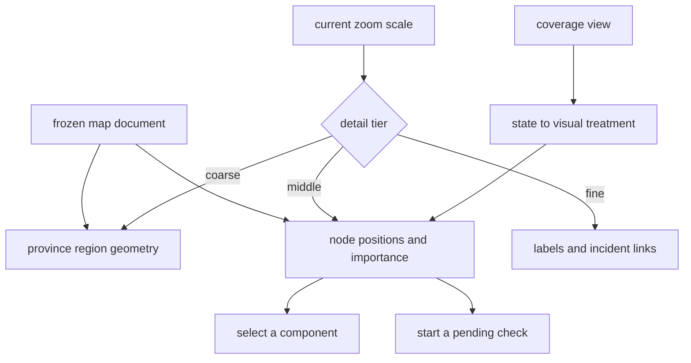

## Summary

This component draws the map: province regions as filled, smoothed outlines, and components as
circular nodes sized by importance and coloured by their coverage state. It reads positions from
the frozen map document and never computes a layout of its own, because the entire value of the map
is that a component stays where the learner last saw it. Zoom is semantic — what is drawn changes
continuously with scale, from coarse regions through nodes to labels and links — and pan, zoom, and
pinch are handled directly so the browser never intercepts them.

## What it does

A codebase has no natural geography. The map invents one, and then commits to it. That commitment
is the point: people build survey knowledge of a space by returning to it, and that only works when
the space is stable. A layout that reshuffled when a component was added would hand the learner a
fresh, unfamiliar picture every visit — pretty, and useless. So the drawing surface is deliberately
not a graph visualisation library and not a simulation; it is a renderer over precomputed geometry,
and everything it derives is a pure function of stored positions, the current coverage view, and the
current zoom, with no feedback into position.

The second problem it solves is density. Even a modest repository produces dozens of components, and
drawing all of them with names and links at once is unreadable. The answer is semantic zoom: at a
distance the reader sees only coloured regions and their names; moving closer brings nodes in;
closer still brings names and the links incident to whatever is under the pointer. Each transition
is a smooth ramp rather than a switch.

## Related components

Everything drawn here comes from [The Frozen Map Document](../../map/map-schema/) — provinces,
node positions in normalized coordinates, importance weights, and typed links between components.
Those coordinates are produced once by [Deterministic Layout and Incremental Placement](../../map/frozen-layout/),
which is the reason this component can be a pure renderer: the hard problem was solved offline, and
new components are placed near their neighbours without disturbing anyone else's position. The
colour and treatment of every node come from [The Single Skin Boundary](../terminology-skin/),
which is the only module permitted to translate a coverage state into a visual and verbal
presentation; this canvas asks that module for a treatment and never branches on a state name
itself.

The states being translated are defined by [Coverage States and the Three Dimensions](../../comprehension/coverage-schema/),
so a reader who wants to know what a filled node actually asserts about a learner should read that
paper rather than this one. [Composition and the Unification Header](../app-shell/) owns every
piece of state this canvas does not own itself — which component is selected, which pending checks
exist, which state the legend is highlighting — and passes them down; the canvas owns only hover
and the view transform. Selecting a node opens [Reading a Doc In-App](../component-panel/), and
clicking the small badge on a node with pending work hands that item straight to
[Running a Quest in the Browser](../quest-runner-ui/) without going through the panel at all.

## How it works

The drawing space is a fixed coordinate box with an inset margin, and stored coordinates in the
zero-to-one range are mapped into it. A single transform group carries a scale and a translation;
panning changes the translation, zooming changes both so that the point under the cursor stays put.
Zoom is clamped to a floor and a ceiling, and the opening view is computed by framing all node
positions with generous padding and then clamping the resulting scale below the threshold at which
nodes begin to appear — so the map always opens showing regions, never a crowd.

Province regions are computed geometrically rather than authored. For each province the member node
positions are collected; three or more points produce a convex hull, computed with a monotone-chain
algorithm, whose vertices are then pushed outward from the centroid by a fixed padding. A province
with only one or two members has no meaningful hull, so an eight-sided ring around the centroid is
substituted, sized to enclose the members plus padding — this is what keeps a sparse province
reading as a region rather than a sliver. Either polygon is then converted into a smooth closed
path by drawing quadratic curves from edge midpoint to edge midpoint using each vertex as the
control point, which rounds every corner and gives the regions an organic outline. The province name
is placed at the centroid.

Level of detail is expressed as a set of opacity values, each a smooth ramp between two zoom
thresholds. The ramp is a Hermite curve, so a transition eases in and out rather than moving
linearly, and nothing appears abruptly. Region fill is strongest when zoomed out and fades as the
reader moves in, so it never competes with node labels; node opacity ramps up across the middle of
the range; label opacity and the links incident to the active node ramp up later; and a very faint
hint of the entire link graph appears only at the deepest zoom. Interactivity is tied to these
values — nodes stop receiving pointer events when they are too faint to aim at, which prevents
invisible click targets.

Nodes are drawn inside a group that is translated to the node's position and then scaled by the
inverse of the current zoom. The practical effect is that a node's radius on screen depends only on
its importance weight, never on how far the reader has zoomed. Radius is a fixed base plus a
proportional term, so importance is legible as size across the whole map.

Labels are decluttered greedily in screen space. Each candidate label gets an approximate bounding
box derived from the identifier's character count; the hovered and selected nodes reserve their
boxes first so they always win, then the remaining nodes are considered in descending importance
order and each is shown only if its box misses everything already placed. A node whose label was
suppressed still shows it on hover or selection. Worth noting honestly: the label text is the
component's stable identifier, not its human title, because the map document carries identifiers
and coordinates but no titles.

Links are drawn in two passes with different meanings. The faint whole-graph hint appears only at
deep zoom and exists to suggest overall connectivity. The stronger pass draws only links incident
to the hovered or selected node, which is how a reader asks "what does this connect to". Both
passes skip any link whose endpoints are not both nodes — which silently drops the hierarchy links
that run from a province to a component, since a province is not a node in the position table.

Two overlays sit on top of this. When the legend highlights a coverage state, every node in that
state renders at full opacity with a ring even at zoom levels where nodes are otherwise invisible,
while everything else — regions, names, other nodes — dims heavily; this makes "show me everything
in this state" a single gesture. And when a component's coverage has just moved, a one-shot pulse
ring is drawn on it, which is how a completed check becomes visible on the map.

Input handling is more involved than it looks. The framework's own wheel handling attaches
passively, which means preventing the browser default from inside it does nothing, so a native
non-passive listener is attached to the drawing surface instead. A trackpad pinch arrives as a
wheel event carrying a modifier flag, and without an explicit default-prevention the browser
page-zooms; a capture-phase listener on the document provides a second line of defence for events
that land on nested children. Three further listeners handle the start, change, and end of the
pinch gestures one browser family reports separately, using the gesture's cumulative ratio to drive
zoom about the element centre. Pointer events cover the rest: one pointer pans, two pointers pinch
about their midpoint, and a click is suppressed if the pointer moved more than a few pixels — so
ending a pan never accidentally selects a component.

Alongside the gestural controls there is a plain fallback: three buttons in the corner zoom in,
zoom out, and reset the view to the opening framing, and every node is focusable and activated by
the enter or space key when it is bright enough to be interactive. Neither path is decorative — a
map that could only be navigated by trackpad would exclude the reader who navigates by keyboard.

## Design decisions

Refusing to compute a layout is the decision this component exists to enforce, and it is the one
whose reversal would do the most damage. The plan states plainly that spatial stability is the
mechanism, and the code follows: coordinates arrive already fixed and are only mapped into the
drawing box. If the browser ran its own force simulation, positions would depend on window size,
node count, and random seeding, and the learner would face a subtly different arrangement on every
visit. The map would still be a picture of the codebase; it would no longer be a place.

Smooth cross-fades instead of thresholds appear to be about perceived continuity. Discrete
visibility toggles make zoom feel like flipping between three unrelated diagrams, which breaks the
sense that the reader is moving through one continuous space; a Hermite ramp makes the same
information change without a seam. Clamping the opening view below the node tier is the same
argument applied to first impressions: the code suggests the intent is that the first thing a
learner sees is a handful of named regions they can actually hold in mind, not a field of dozens of
circles.

Counter-scaling nodes trades geometric fidelity for legibility, and the trade seems clearly
correct here because size carries meaning. If nodes scaled with the view, the encoding would become
unreadable at both extremes and, worse, two nodes could not be compared by eye unless they were on
screen simultaneously at the same zoom. The cost is that at deep zoom the nodes are visibly not
part of the same coordinate system as the regions, which is a small price.

The elaborate input interception looks like hard-won practical necessity rather than design
preference. The comments describe layered defences — a non-passive listener, a capture-phase
document guard, and browser-specific gesture handlers — which is the signature of a problem
discovered empirically. What breaks if any layer is removed is specific and bad: a learner pinching
to zoom into a province zooms the entire browser page instead, and the map stops behaving like a
map.

One consequence of these choices worth naming: because labels show identifiers rather than titles,
the map is readable to someone who knows the component identifiers and slightly cryptic to someone
who does not. That appears to be a consequence of what the map document carries rather than a
considered decision, and it is the kind of thing an interview pass should confirm.

## Where it sits

The canvas is a pure renderer over frozen geometry, and its discipline about that is what makes the
map worth returning to. It contributes three things of its own — computed province outlines,
continuous semantic zoom, and input handling robust enough that the map owns the whole surface —
and delegates everything about meaning elsewhere. To understand what it is drawing, read
[The Frozen Map Document](../../map/map-schema/) for the geometry and [The Single Skin Boundary](../terminology-skin/)
for the visual vocabulary; to understand what happens when a node is clicked, read
[Reading a Doc In-App](../component-panel/).
