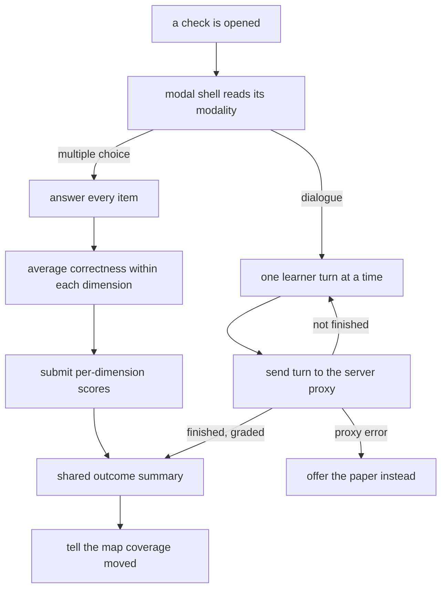

## Summary

This component runs a comprehension check inside the map application. It is one modal shell that
branches on modality: a card-based multiple-choice runner that withholds all feedback until
submission and then reports one averaged score per dimension, or a chat-style dialogue runner that
sends one learner turn at a time to a server-side proxy and finishes when that proxy reports a
graded conclusion. Both end in the same outcome summary, and both notify the surrounding
application so the map can refresh and animate the component whose coverage just moved.

## What it does

The system's central claim is that comprehension has to be actively demonstrated, not inferred from
activity. Passive signals move a component out of the unexplored state and no further; only an
active check can raise a dimension meaningfully or mark a component validated. This component is one
of the two places that check happens — the other being a conversation inside the coding assistant
itself.

That parallel matters for reading this code. The two surfaces implement the same two modalities and
must produce the same kind of evidence, because the study treats timing and modality as independent
variables. What differs here is that the browser runner is used after the fact rather than in the
middle of work, and that it is entirely self-contained: the learner is not being interrupted, they
chose to open it.

The runner therefore has two jobs. Deliver the check honestly — no leaked answers, no coaching
before the attempt — and reduce whatever happened into the small numeric shape the coverage engine
consumes.

## Related components

The item sets this component renders are defined by [Quest Documents and Item Shapes](../../quests/quest-schema/),
which is also the reason the code reads most item fields through a loose accessor: the item shape
permits fields beyond the common ones, and different generation paths populate different subsets.
When a multiple-choice attempt is submitted it lands, through the viewer's transport, in
[The Shared Completion Path](../../quests/quest-completion/) — the same routine the command line
uses, so an attempt completed in the browser and one completed in a terminal produce identical
evidence. The dialogue path instead talks to the proxy inside
[Serving the Map and Its JSON API](../local-server/), which holds the conversation history, enforces
the exchange cap, and grades at the end.

Both paths reach their destination through [Live Data Versus Sample Fallback](../viewer-data-layer/),
which is also where the offline synthesis lives — the fabricated grades a learner sees when no
server is running come from there, not from here. The modality names, the badge glyph, the
call to action, the completion wording, and the state colours in the outcome summary all come from
[The Single Skin Boundary](../terminology-skin/); a handful of smaller labels — the send and submit
buttons, the two speaker names on the dialogue transcript, and the offer to read the paper instead —
are written inline in this file rather than drawn from there, which is a real if minor breach of
that boundary. The runner is normally opened from [Reading a Doc In-App](../component-panel/),
either from a listed pending item or from the challenge action, and it can hand control back to that panel when a dialogue
cannot proceed. Its closest relative in another province is
[Quiz and Socratic Protocols](../../interventions/tutor-skill/), which delivers the same two
modalities as a conversation inside the coding assistant; comparing the two is the clearest way to
see what the study is actually manipulating. The chat-side way a learner volunteers for a check is
one of [User-Initiated Entry Points](../../interventions/slash-commands/); this component is the
map-side equivalent of that same voluntary intent, and holding the two side by side isolates the
surface from the protocol, since the questions asked are the same either way.

## How it works

The shell is a modal overlay. It shows the modality's display name, the component title it was
given, the component identifier, and the item set's origin — whether this check was generated after
a session, raised by drift, or requested by the learner. Clicking the backdrop closes it; clicks
inside are stopped from propagating so the modal does not close under the learner's own hands. The
shell then renders one of two inner runners and nothing else; it holds no state about the attempt.

The multiple-choice runner keeps an array of selections, one slot per item, initialised empty, and
a submitted flag. Each item is a card showing its number, the dimension it is tagged with, the
prompt, and its options as lettered buttons. Before submission the only visual change is which
option is picked. Submission is disabled until every item has a selection, which is what makes
partial attempts impossible.

On submission the runner tallies. Every field beyond the prompt — the options, the dimension, the
index of the correct option, the stated answer, the explanation — is pulled through a single loose
accessor that casts the item to an untyped bag and hands back whatever is there, because the item
shape is a passthrough that permits fields the schema does not name and different generation paths
populate different subsets. Each read therefore carries its own default: the dimension falls back to
concepts when none is declared, and the index of the correct option falls back to the first. Each
item scores one or zero. Those scores are accumulated into a per-dimension sum and count, then
reduced to one averaged score per dimension. Only that reduced list is sent. When the
response comes back, the runner marks itself submitted — which flips every card into review mode,
colouring the correct option, marking a wrong pick, and revealing the stated answer and explanation
— and shows the shared outcome summary. It also notifies the surrounding application with the
component identifier from the response, falling back to the one on the item set, because the offline
synthesis returns an empty identifier.

The dialogue runner keeps a message list, a busy flag, a completion flag, an error, and a turn
counter held in a mutable reference rather than in render state. It seeds the transcript with the
item set's first prompt shown as if the tutor had asked it, and scrolls smoothly to the newest
message whenever the list changes. Sending a turn appends the learner's message immediately, clears
the input, and posts.

The turn counter deserves care, because its role is easy to misread. The runner passes its own
incremented count along with the message, but the live server ignores that number entirely — the
server keeps its own count and enforces the three-exchange cap itself. The runner learns that a
dialogue is over only from the completion flag on the response, never from its own arithmetic. The
counter it maintains exists to drive the offline synthesis, which has no server to ask and therefore
walks a scripted sequence by turn number. A reader who assumes the client enforces the cap will
conclude, wrongly, that a tampered client could extend the dialogue.

If the response carries an error, the runner surfaces it and — importantly — does not advance its
turn counter, matching the server's own rollback of that turn. If the response carries a reply, it
is appended. If the response reports completion, the runner records the final
payload and renders the outcome summary with the returned grades rather than the stored dimension
values, so the learner sees what they scored in this dialogue rather than their cumulative position.

When the dialogue errors, the input row is replaced by an error block offering to open the
component's paper instead. That action closes the runner and selects the component so the panel
opens on it — the failure becomes a redirection into reading rather than a dead end.

The outcome summary is shared. It shows a badge in the component's new state colour, the state's
own labels, and three bars — from the returned grades when they exist and from the component's
stored dimensions otherwise. Because the multiple-choice path passes no grades, it shows the
resulting cumulative coverage; because the dialogue path passes them, it shows the dialogue's own
marks. That asymmetry is real and slightly confusing, and worth knowing before comparing the two.

Two further honest gaps. The title the shell displays is supplied by the surrounding application,
which currently passes the component identifier rather than the paper's human title, so the modal
header reads as a slug. And the seeded first message in the dialogue is presented locally only — it
is never sent to the server, so the model's conversation history begins with the learner's first
reply and it never sees the question the learner believes it asked.

## Design decisions

Housing both modalities in one shell appears to be a methodological requirement rather than a
convenience. The two are cells of the same experiment, and if they lived in separate screens with
separately evolved chrome, any observed difference between them would be partly a difference in
presentation. Keeping the frame, the header, the close behaviour, and the outcome summary identical
narrows the difference to the thing being studied.

Averaging within a dimension before sending is the decision most easily got wrong, and the code
suggests it is deliberate. The coverage engine blends one score into one dimension using an
exponential average; sending one result per item would mean several consecutive blends against the
same dimension from a single sitting, which would move that dimension far more than one attempt
should justify. Reducing first makes one attempt count once per dimension. Reversing it would make
a four-item check on one dimension worth roughly four times a one-item check on the same evidence.

Withholding feedback until submission is the integrity rule. Comprehension is being measured, and
per-item feedback converts the later items into a partially guided exercise: a learner who learns
they were wrong on the first item will reason differently about the second. The plan's tutor
protocol states the same rule for the in-chat path, so this appears to be a system-wide commitment
rather than a local preference. What breaks if reversed is not the interface but the meaning of
every number the system stores.

Offering the paper on a dialogue failure looks like a small piece of design empathy with a real
mechanism behind it. The dialogue is the only viewer path that cannot degrade to a deterministic
local fallback — without model access the proxy simply cannot produce a probing question — so
something has to catch the learner. Redirecting them into the paper preserves the intent that
brought them there, and it costs nothing, since the panel is already one selection away.

## Where it sits

The runner is the browser's half of active validation: it presents a check, refuses to leak the
answers, reduces the attempt into the shape the coverage engine wants, and reports the result back
so the map can move. Its multiple-choice path is fully local and deterministic; its dialogue path
depends on the server proxy and is built to fail into reading rather than into nothing. Read
[Quest Documents and Item Shapes](../../quests/quest-schema/) to understand what it is handed, and
[The Shared Completion Path](../../quests/quest-completion/) to see where a completed attempt
actually becomes evidence.
