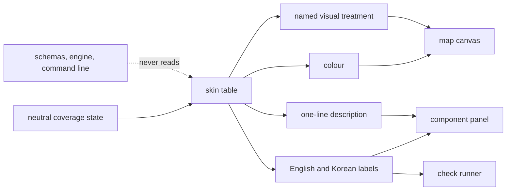

## Summary

This module is the boundary between what the system stores and what the learner reads. Internally
every component has a neutral coverage state — unexplored, explored, validated, or drifted — and
nothing outside this file translates those into the strategy-game vocabulary the map presents. It
maps each state to a colour, a named visual treatment, bilingual labels, and a one-line
description, and it holds the same kind of table for the wording of comprehension checks. The
translation is one-way by design: nothing that records or analyses evidence ever reads from here.

## What it does

The map's presentation is a deliberate metaphor. Components appear as holdings to be surveyed and
secured, coverage states are dressed as degrees of control, and a pending comprehension check is
framed as an engagement to take on. That framing is doing real work — it gives a learner a reason to
care which parts of a codebase they have actually understood, and it makes the consequence of
skipping one visible rather than abstract.

It is also a liability if it spreads. The system is a research prototype whose output is evidence
about comprehension; that evidence has to be legible to people who have never seen the metaphor, and
the metaphor itself may be changed, translated, or removed for a different audience. So the design
states a rule and this module enforces it: schemas, the engine, the command line, and the papers all
use neutral terms, and exactly one file knows the other vocabulary.

That is why this component is worth a paper of its own despite being about a hundred lines of
constants. It is not a styling file. It is the enforcement point of a naming discipline that the
rest of the system depends on staying clean.

## Related components

The values being translated are defined by [Coverage States and the Three Dimensions](../../comprehension/coverage-schema/):
that schema names the four states and the three dimensions in neutral terms, and this module is
downstream of it in one direction only. The largest consumer is [Drawing the Map from Frozen Geometry](../map-canvas/),
which asks for a treatment per node and branches on the returned category rather than on the state
name — that indirection is what keeps the canvas honest. [Reading a Doc In-App](../component-panel/)
uses the labels, the accent colour, and the one-line description together to form its state chip and
its score bars. [Running a Quest in the Browser](../quest-runner-ui/) draws its modality names, its
call to action, and its completion wording from the check-vocabulary table here.
[Composition and the Unification Header](../app-shell/) uses the whole table at once to build the
legend and takes the weighted-progress label from here as well.

One state in the table exists because of [Source Drift and Staleness Flagging](../../map/drift-detection/):
the drifted state is presented as an active problem requiring re-validation, and its distinct colour
and ring treatment on the map are the entire user-facing consequence of drift. Worth knowing while
reading this module: that detection path is currently incomplete, so the drifted state is more
thoroughly designed here than it is produced upstream.

## How it works

The core of the module is a record keyed by every coverage state. Each entry carries the state
itself, so a consumer holding only a skin entry can still recover the neutral value; a Korean label
and an English label; a colour; a treatment category; and a short sentence describing what the state
means for the learner. A single accessor returns the entry for a state, and because the record is
typed over the complete set of states, adding a state to the schema makes this table fail to compile
until it is filled in.

The four entries are a graded progression. The unexplored state is presented as unsurveyed, in a
muted grey, with a treatment named for fog and a description saying no coverage has been recorded.
The explored state is presented as scouted, in blue, with an outlined treatment and a description
that says explicitly it was passively encountered and not yet validated — a sentence carrying the
system's central distinction into the interface. The validated state is presented as taken, in
green, with a filled treatment, described as held through active comprehension checks. The drifted
state is presented as an uprising, in amber, with its own treatment, described as source code having
changed since the last validation and re-validation being needed.

The treatment values are the important design detail. They are category names, not styles: the
canvas turns filled into a solid interior, outlined into a stroked ring, the fog category into a
lowered opacity, and the drift category into an extra pulsing ring — and the panel ignores treatment
entirely and uses only the colour and labels. Nothing here knows how any surface draws.

Beyond states, the module holds three loose labels — two of them proper pairs, being the name for
weighted total coverage and the name for the three-dimension readout, and one of them a lone Korean
word for a province with no English counterpart, which is a small asymmetry a reader should notice
rather than assume away — plus a larger constant covering
the vocabulary of comprehension checks: what a pending check is called, a glyph used as its badge on
a node, the call to action for beginning one, display names for the two modalities, the offer wording
when a badge is activated, and the wording used when a check completes and the component's state
improves. Its comment states the intent directly: the runner, the panel, and the map badges pull
their learner-facing copy from this object and never write the flavour inline.

That intent is nearly, but not entirely, honoured. A small amount of flavoured copy is written
directly into the panel — its challenge action's label, its failure message when preparing a check
does not work, and the heading over its pending list, which is selected by comparing a value from
this very table against a literal string instead of reading a label out of it. The dialogue runner
labels its two speakers with inline Korean strings rather than drawing them from here, and its send,
submit, and read-the-paper buttons are written inline in English. The map's navigation hint line and
the tagline under the product name in the header are inline as well. These are minor leaks rather
than a broken boundary, but a reader should not assume the file is the exhaustive inventory of
learner-facing wording that its comment claims.

## Design decisions

Confining the vocabulary to one module inside the viewer is the decision the whole component exists
for, and its justification is stated as a principle: the metaphor is a rendering layer, and the
schemas are neutral. The code follows that faithfully — nothing in the engine, the command line, the
stored evidence, or the papers uses any of these words, and this file imports only a type. The
consequence of reversing it is concrete and severe. If the stored states were named with the
flavour, every recorded outcome, every exported analysis, and every paper would carry a metaphor
that a reader outside the project would have to decode, and swapping the metaphor for a different
audience would become a data migration rather than an edit to one file.

Returning a treatment category rather than finished styling appears to be about keeping the module
ignorant of its consumers. Three surfaces render the same state very differently — a node, a chip,
a summary badge — and any attempt to centralise the appearance would require this module to know
about all three and to grow with each new one. Naming the category instead lets each surface decide,
while still guaranteeing that all of them agree about which category applies.

Making the table total over the state union is a small correctness choice with an outsized effect. A
partial map with a fallback would let a newly added state render as an existing one everywhere at
once, and the mistake would be invisible — the interface would look intentional. Forcing the table
to be complete converts that into an error before anything runs.

Centralising the check vocabulary alongside the state vocabulary looks like the same discipline
extended to verbs. The wording appears in three separate surfaces that must feel like one system,
and it is bilingual, so scattering it would guarantee drift in both languages at once. The partial
leaks noted above are exactly the failure this decision was meant to prevent, which suggests the
boundary needs enforcement rather than only convention.

## Where it sits

This module is a hundred lines that hold a design principle in place. It converts four neutral
coverage states into everything a learner sees about them, keeps that conversion one-directional,
and makes the mapping total so it cannot silently fall behind the schema. Read
[Coverage States and the Three Dimensions](../../comprehension/coverage-schema/) for what is being
translated, and [Drawing the Map from Frozen Geometry](../map-canvas/) for the largest consumer of
the translation — and if you ever find yourself writing a colour or a flavoured phrase into another viewer file, this
is the file it belongs in.
