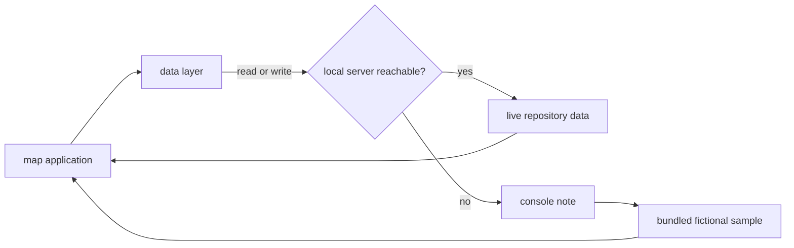

## Abstract

This component is the single place the map application talks to the outside world. It wraps four
read operations and three write operations, each of which tries the local server first and, on any
failure at all, returns bundled hand-seeded sample data instead. That fallback is what makes the
interface developable and demonstrable with no backend running — and it is also the component's
main hazard, because the sample describes a fictional repository and the offline write helpers
fabricate results that are never recorded anywhere.

## Introduction

The map application is a single-page front end that in production is served by the same local
process that exposes its data. That arrangement makes the normal case trivial: a relative path is
always correct, there is no cross-origin concern, and there is nothing to configure. But front-end
work does not happen only in the normal case. Someone iterating on layout, colour, or interaction
runs the development server on its own, with no data process at all, and a screen that renders
nothing is a screen nobody can style.

So this layer exists to make the application's data dependencies total. Every function it exports
resolves to something usable. The cost of that guarantee is that a reader must be able to tell,
at a glance, whether what is on screen is the real repository or a fiction — and the only signal
is a warning logged to the browser console.

## Related Work

The live half of every call in this module is answered by [Serving the Map and Its JSON API](../local-server/),
whose endpoint shapes this layer mirrors exactly; the response interfaces declared here are the
client-side statement of that server's contract. [Composition and the Unification Header](../app-shell/)
is the main reader: it loads the map, the coverage view, and the pending work items together on
mount and re-loads the latter two whenever a check completes. [Reading a Paper In-App](../component-panel/)
uses the per-component paper loader lazily as the learner selects nodes, and the on-demand quest
creator behind its challenge action. [Running a Quest in the Browser](../quest-runner-ui/) drives
the three write helpers and is the only consumer of their offline synthesis.

The types every function here traffics in come through [Keeping Platform Builtins Out of the Viewer](../../platform/browser-safe-surface/) —
the deliberately narrowed export surface that omits anything touching file system builtins, so
schema types can be shared with the browser bundle without dragging server code into it. Finally,
the offline synthesis mirrors [Scoring: Exponential Averaging, Loyalty, Classification](../../comprehension/coverage-model/):
it reimplements that module's blending rule and its validation threshold locally so an offline
demonstration moves the same way the real engine would. That duplication is the interesting
contrast — it is correct today by inspection, not by construction.

## Description

The read side is four functions with an identical shape: attempt a call, return the parsed result,
and on any thrown error log a note naming what became unavailable and return the corresponding
bundled sample. Non-success responses are converted into thrown errors first, so a not-found reply
falls back exactly like a connection refusal. The paper loader is the one variation — its sample is
keyed by component identifier, so a component with no seeded sample returns nothing at all rather
than a wrong paper, and the panel renders its own not-found message.

The bundled samples are a small, coherent fiction. The sample map describes an imaginary
document-signing product with three provinces and nine components, carrying frozen normalized
coordinates and importance weights in exactly the shape the real map document uses, including both
hierarchy edges and reference edges so the map's edge rendering has something to draw. The sample
coverage assigns those nine components across all four coverage states on purpose: two validated,
one previously validated but now stale with a low loyalty value, three explored with low scores,
and three still unexplored with zero everywhere. The sample papers carry realistic frontmatter —
stable identifiers, quizzable concepts, and rationale entries with inferred provenance — plus short
prose bodies, one of which includes a diagram fence specifically so the panel's diagram handling is
exercised. The sample work items include one multiple-choice set and one dialogue seed, again so
both runner modalities can be opened without a backend.

The write side is where a reader must be most careful. Creating a learner-initiated check normally
posts a component identifier and receives a prepared item set from the server. Offline, it instead
reaches into the sample papers, takes up to two concepts, and manufactures multiple-choice items in
which the correct option is the concept's own name and the distractors are three fixed, obviously
unrelated strings. Those items are not a comprehension check in any meaningful sense; they exist so
the runner opens and animates. If no sample paper exists for the requested component, the function
returns nothing and the panel shows a prepared-nothing message.

There is a real defect hiding in those manufactured items, and it is worth stating plainly because
it is the kind of thing a reader will otherwise trip over. The synthesized items record which option
is correct under a different field name than the one the runner reads. Scoring survives it by luck:
the runner defaults to treating the first option as correct when the field it expects is absent, and
the correct option here happens to be first. The answer reveal does not survive it — the runner
displays the field it finds, which in this case holds a numeric index rather than the option text,
so a learner who submits an offline check is shown a bare number where the answer should be. Nothing
detects this, because these items only ever exist when the server is unreachable.

Recording a completed multiple-choice set normally posts per-dimension scores and receives the
updated component coverage. Offline, it returns a fabricated record: three dimensions all starting
from a fixed low baseline, each graded dimension blended once using the real blending weights, a
state derived by comparing the mean against the real validation threshold, and a placeholder marker
in place of a validation identifier. The component identifier comes back empty, which is why the
runner falls back to the identifier it already holds. Nothing is written to any file.

The dialogue helper normally posts one learner message and follows the server's completion flag.
Offline, it uses a turn number the caller supplies — a value the live path ignores entirely — to
walk a scripted sequence: two fixed probing questions, then on the third turn a fixed closing
message with three fixed grades and a synthesized coverage record. The comment in the code is
explicit that this turn number exists only for the offline branch, which is worth holding onto,
because it is otherwise easy to mistake it for something the server uses to enforce its cap.

In development, the same relative paths work because the development server proxies all data paths
to the running local server, forwarding every method so the write endpoints reach it too. That is
why the module has no notion of a base address anywhere: the two environments differ in
configuration outside this file, not in code inside it.

## Rationale

Falling back rather than failing appears to be the founding decision, and everything else follows
from it. The code suggests the motivation is straightforward developer ergonomics: interface work
on a map, a panel, and a modal runner is impossible against a blank screen, and requiring a data
process for every styling change would make the front end painful to iterate on. The rejected
alternative of a separate mock mode is worth taking seriously, because it is the conventional
answer — but a mode toggle creates two code paths that are separately maintained, and the sample
shapes would drift away from the real ones the moment a schema changed. Deriving the fallback types
from the same shared schema types keeps the fiction structurally honest even as it stays factually
fictional.

The absence of a configurable base address looks like a deliberate refusal of a setting that can
only be wrong. There is exactly one correct value in production — the origin the page was served
from — so exposing it would create a class of misconfiguration with no compensating flexibility.
The development case is handled by a proxy outside the application code, which keeps the
application itself environment-blind.

Reproducing the real blending rule offline is the subtlest choice here. A fabricated result that
jumped a score to full marks would make the demonstration feel better and teach a false model of how
comprehension accrues; instead the offline path blends the new score in at the same modest weight
the real engine uses, so a single perfect answer visibly moves a dimension only partway. This
appears to be about preserving the system's central message — that one correct answer is evidence,
not proof. The cost is a duplicated constant that nothing enforces; if the real weighting changed,
this copy would silently disagree.

Seeding the sample coverage across all four states is a testing decision expressed as data. Without
it, the stale treatment and the unexplored treatment would only appear in a real repository under
conditions that are tedious to create, and would therefore rot. What breaks if this is reversed is
not the product but the ability to see the product's full visual vocabulary at once.

The real risk this component carries is one it does not mitigate: a fallback is announced only in
the browser console. Someone who opens the map with no server running sees a plausible,
well-populated map of a repository they have never worked in, and nothing on screen says so. Any
reader of this paper should treat an unfamiliar three-province document-signing map as the tell.

## Conclusion

This is the application's entire relationship with the world: seven functions, each of which
prefers the learner's real repository and settles for a bundled fiction. Understanding it means
holding two things at once — the live contract it mirrors from [Serving the Map and Its JSON API](../local-server/),
and the deliberately incomplete fiction it substitutes when that contract cannot be honoured. The
consumers to read next are [Composition and the Unification Header](../app-shell/), which drives
the reads, and [Running a Quest in the Browser](../quest-runner-ui/), which is the only place the
fabricated write results ever reach a learner's eyes.
