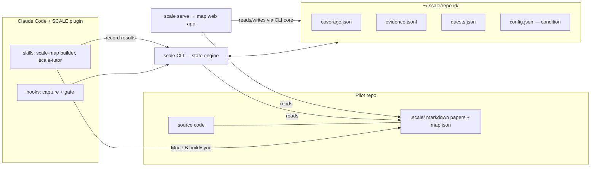

# SCALE — Implementation Plan

**S**caffolded **C**overage-**A**ware **L**earning **E**ngine.
A system that helps a junior engineer build genuine comprehension of a codebase while working on it with Claude Code, guided by a coverage memory built by a high-capability LLM (Mode B) and visualized as a territory map.

Research prototype targeting UIST. Study logging / condition assignment infra is **out of scope for now** (deferred), but **all four intervention conditions must be fully functional** and switchable by config.

> **⚠ Superseded in part by [`PLAN-GATE.md`](./PLAN-GATE.md) (2026-09-01).** The
> intervention design changed: the pre-commit gate (§6.1) is replaced by an
> edit-time gate with a durable per-user unlock ledger, the 2×2
> `condition.{timing,modality}` keys became `gate.{assessment,modality}`, and
> team-lead defaults live in a committed `.scale/policy.json` that members may
> override. §6.1's mechanics, `inflow.triggers`, `maxPerCommit`, and
> `minChangedLines` are historical. Everything else here stands.

---

## 1. Principles

1. **Learning-first.** The system exists to improve the junior engineer's comprehension of the codebase. Every mechanic must map to a comprehension construct. The strategy-game metaphor (territories, conquest) is a *UI skin only* — schemas and code use neutral terms (`component`, `coverage`, `staleness`), never game terms.
2. **Minimal interruption.** The junior's Claude Code flow is sacred. In-flow interventions fire only at natural boundaries, under a strict deterministic budget, and are always deferrable. All passive signal collection is async and adds no perceptible latency.
3. **Files, not databases.** The coverage memory is markdown in the target repo (git-versioned). Per-user state is JSON/JSONL under `~/.scale/`. No DB, no hosted server; `scale serve` is a local process.
4. **Grounded and stale-aware.** Every component anchors to source files at a git SHA. Code drift is detected and surfaces as staleness ("rebellion") requiring re-validation.
5. **Stock Claude Code.** Junior and senior both use unmodified Claude Code; SCALE ships as one plugin (hooks + skills) plus a CLI. Ecological validity for the study, one-step install for participants. *Stock means default tool settings too*: the edit gate hooks `PreToolUse(Edit|Write|MultiEdit)`, so any mode that routes file edits through Bash instead — **auto mode** does exactly this — leaves the gate inert. See §10 for the protocol requirement this imposes.

## 2. Terminology

| Schema / code (canonical) | Map UI skin (English) | Map UI skin (Korean) |
|---|---|---|
| component | castle / territory | 성 / 영지 |
| top-level feature group | province | 주(州) |
| coverage state: `fog` | unexplored (fog) | 미탐사 |
| coverage state: `explored` | scouted | 정찰됨 |
| coverage state: `validated` | conquered | 정복 |
| coverage state: `stale` | rebellion | 반란 |
| dims: structure / concepts / rationale | development stats | 내정 3스탯 |
| weighted total coverage | unification progress | 천하통일 진행도 |

Koei Sangokushi is inspiration, not spec. v1 mechanics = fog / conquest / 3 dev stats / rebellion / importance-sized nodes. No officers, no battles animation, no AI factions, no leaderboards.

## 3. Architecture



Monorepo (npm workspaces, TypeScript everywhere):

```
scale/
├── PLAN.md
├── packages/
│   ├── core/        # shared: schema types (zod), state engine, coverage model,
│   │                #   file→component index, layout, drift detection
│   ├── cli/         # `scale` CLI wrapping core (also used by hooks)
│   ├── web/         # React + Vite + SVG map app (served by `scale serve`)
│   └── plugin/      # Claude Code plugin: hooks.json + hook scripts,
│                    #   skills (scale-map, scale-tutor), commands
└── scripts/         # build-plugin.mjs (plugin payload), graphify-check.mjs (map audit)
```

*A `pilot/` directory was planned to hold a pinned clone of the study's pilot
repository. It does not exist: the pilot repo is still unpicked, and SCALE is
currently its own target (`.scale/` in this repo maps this codebase).*

Single language (TS) so CLI, hooks, and web share the schema types in `core`.

## 4. Coverage memory (`.scale/` in the pilot repo)

Derived from cluedoc (MIT) — capability tree of markdown "papers", one folder per component — with SCALE extensions.

### 4.1 Paper format

Layout: `.scale/README.md` (root) + `<province>/README.md` + `<province>/<component>/README.md`. The component count is **sized per repo by `scale estimate`** (source LOC, capped by source file count) and enforced afterwards by `scale map check`; provinces hold 5–9 components each. The former fixed **20–60 / 5–9** target is superseded — it was a hard floor that overrode the estimate and produced a 36-component map for a repo sized at 8 (koa, 2026-09-01).

Frontmatter (extends cluedoc's `title`/`sources`):

```yaml
---
id: session-management        # stable slug — coverage key; NEVER renamed
title: Session Management
sources:                      # file-granularity code anchors
  - src/server/auth/sessions.ts
  - src/server/middleware/session.ts
concepts:                     # named, quizzable concept units
  - id: server-side-sessions
    name: Server-side session store, cookie carries only the id
  - id: session-rotation
    name: Rotation on privilege change
rationale:
  - decision: Sessions are server-side; the cookie is an opaque id
    why: Revocation must be immediate for shared-document access control
    alternatives: JWT-in-cookie (rejected — revocation complexity)
    provenance: inferred      # inferred | prompt:<ref> | interview:<ref>
---
```

Body sections (cluedoc's six + one): hero visual (mermaid) → `Summary` → `What it does` → `Related components` (cross-doc links = the graph) → `How it works` → **`Design decisions`** (new; prose form of the frontmatter entries) → `Where it sits`. *These replaced the academic headings (Abstract / Introduction / Related Work / Description / Rationale / Conclusion) on 2026-09-17; the loader still accepts the old ones as aliases — see [Vocabulary and translation](#vocabulary-and-translation-2026-09-17).* cluedoc's prose rules kept: no code symbols/paths/snippets in the body; anchoring lives in `sources` only.

### 4.2 `map.json` — frozen spatial layout

Spatial stability is the point of a map (survey knowledge / method-of-loci): layout is computed **once** at build time and frozen. New components are placed incrementally near their neighbors without moving existing nodes.

```json
{
  "version": 1,
  "builtFromSha": "abc1234",
  "provinces": [{ "id": "auth", "name": "Authentication" }],
  "nodes": [{ "id": "session-management", "province": "auth",
              "x": 0.62, "y": 0.31, "importance": 0.8 }],
  "edges": [{ "from": "session-management", "to": "sharing", "kind": "reference" }]
}
```

- Layout: deterministic seeded placement (per-province sunflower spiral + collision relaxation against fixed neighbours), run offline by `scale map layout`, coordinates normalized 0–1. *Designed as d3-force; the shipped layout has no d3 dependency.*
- `importance`: normalized in-degree of `reference`/`depends_on` edges — how many papers link to a component (drives node size and unification weighting). *Designed as dependency-graph centrality × git churn; **not implemented** — see `.scale/map/frozen-layout/`.*
- `edges.kind`: `hierarchy` (parent/child) | `reference` (Related Work links) | `depends_on` (reserved for AST-derived dependencies; no producer yet).
- Generated artifacts: `map.json` committed; `index.json` (file→component reverse index from all `sources`) regenerated on demand, gitignored.

### 4.3 Mode B builder — `scale-map` skill (senior side, delegated to Opus)

A Claude Code skill run once in the pilot repo (with Opus or better), then in sync mode after changes:

1. **Survey** — run `scale estimate` first; propose that many components with `sources`, grouped into provinces of 5–9, as a plan for approval. A proposal outside the estimate's band (±1.5×) must be re-estimated and re-approved before any paper is written, never built past and explained afterwards.
2. **Write** — subagent fan-out per province; write every paper (structure/concepts prose + hero visuals + *inferred* rationale, `provenance: inferred`).
3. **Link** — Related Work cross-links; verify no dead links.
4. **Layout** — run `scale map layout` (deterministic, CLI) to freeze coordinates + importance.
5. **Sync mode** (later runs) — given a diff, update affected papers up/down the tree (cluedoc's progressive model); `scale map drift` flags components whose `sources` changed since `builtFromSha`.

Senior-side interviewer (rationale Q&A to replace `inferred` provenance) is **deferred**; schema already carries provenance so it slots in later.

## 5. Per-user state (`~/.scale/<repo-id>/`)

Single local user for the prototype (multi-user later = separate state dirs).

- **`coverage.json`** — per component: `state` (fog|explored|validated|stale), `dims {structure, concepts, rationale}` ∈ [0,1], `lastValidatedSha`, `loyalty` ∈ [0,1].
- **`evidence.jsonl`** — append-only raw signals (kept raw so the coverage model can be re-fit later without data loss):
  - `prompt` (component mentions extracted by keyword/slug match), `touch` (files edited → components via index), `diff_review` (proposal→execution latency per Edit), `doc_read` (component doc opened in web; legacy `paper_read` rows still read), `quiz_result` / `socratic_result` (per-dim scores), `intervention` (shown/deferred/completed).
- **`quests.json`** — pending web quests: `{id, componentId, modality, items, origin: session|rebellion|voluntary, status}`.
- **`config.json`** — `condition: {timing: inflow|postsession, modality: quiz|socratic}`, `inflow.triggers` (§6.1), `language: en|ko` (interaction language, §6), budgets/thresholds (all tunable), user label.

### 5.1 Coverage model v1 (simple, config-tunable constants)

- **Passive signals explore, never conquer.** `touch`/`prompt` → fog→explored, small structure credit (cap 0.3 from passive alone). `doc_read` → cap 0.4 (`thresholds.docReadCap`). Diff-review latency: logged only, not modeled in v1.
- **Active validation conquers.** Quiz items are tagged with a dim; result updates that dim by EMA (`dim ← 0.7·dim + 0.3·score`). Socratic yields rubric scores per dim touched. `validated` when weighted dims ≥ 0.6 with ≥ 2 active validations; sets `lastValidatedSha`.
- **Staleness.** `loyalty = 1 − min(1, churn(sources since lastValidatedSha) / size)`; recomputed by `scale map drift` (async at SessionStart, and on web refresh). Previously-validated component with loyalty < 0.5 → `stale` → re-validation quest.
- **Unification progress** = Σ(importance × mean dims) / Σ(importance).

## 6. Interventions — the 2×2, all four implemented

Condition is read from `config.json`; each cell is fully functional.

| | **Quiz** (lightweight, LingoQ-style) | **Socratic** (dialogic, comprehension-demanding) |
|---|---|---|
| **In-flow** (in Claude Code, at boundaries) | tutor skill asks 1–2 grounded MCQ/short items in chat | tutor skill runs a capped dialogue (≤ 3 exchanges) in chat |
| **Post-session** (web map, after session) | quest = quiz cards on the map | quest = chat-style Socratic session in the web app (server proxies Claude API) |

Both modalities: grounded in the component's paper (`concepts` + rationale) and, when available, the session's actual diff; graded per-dim; results recorded via `scale record` → coverage update → map state change. Intervention delivery language follows `config.language` (per-user, default `en`): with `ko` the whole check — items, dialogue, feedback — runs in Korean, keeping code identifiers and established dev terms English (the `.scale/` papers are repo-shared state and stay English regardless).

### 6.1 In-flow triggers & interruption budget (hard rules, deterministic in CLI)

Trigger points are **user-configurable** (`config.json → inflow.triggers`) — interruption tolerance differs per person. v1 ships two, both natural boundaries (never mid-edit, never mid-thought); the gate architecture accepts new trigger kinds without schema changes:

- **`pre-commit`** (default: on) — `PreToolUse` hook on Bash matching `git commit` → `scale gate commit`.
- **`post-task`** (default: off) — `Stop` hook; offers a check right after the agent finishes work that touched low-coverage territory.

Gate policy (shared across triggers):

- Fire only if: a touched component is `fog`/low-coverage/`stale` **and** budget allows.
- **Budget:** ≤ 1 intervention per commit, ≤ 2 per session, ≥ 15 min cooldown, no firing on trivial diffs (< N changed lines). All constants in `config.json`.
- **A "session" is a period of work in the repo, not a window.** SessionStart increments an open-window count and SessionEnd decrements it; the budget period ends when it reaches zero, so opening a second terminal *joins* the running budget rather than refilling it. `budgets.sessionIdleResetMinutes` (default 12h) is only a backstop for a SessionEnd lost to a crash — it is deliberately far longer than a working day so that a long quiet stretch of work never silently refills the budget. The decision itself is taken under an exclusive lock on the session record, so two commits landing together cannot both spend the same slot.
- Mechanics (pre-commit): gate returns deny-with-reason instructing the agent to run the tutor protocol → tutor runs in chat → `scale record` writes a validation marker → agent retries commit → gate sees fresh marker (TTL 10 min) → allow.
- **Defer is final.** "Skip" passes the gate immediately and the item is **dropped** — logged as evidence, never queued anywhere. Timings stay fully independent: nothing crosses from in-flow into the post-session queue. The component simply stays unconquered — that is the user's prerogative, and precisely what the territory metaphor is for: the map shows the consequence; the choice stays with the user. A deferred component comes up again only through natural re-encounter (a later gate hit on the same territory, budget permitting) or voluntary learning (§6.3).
- Additionally (non-interruptive): `SessionStart` injects a 3-line coverage context; first entry into unfamiliar territory in a session may add one *silent context note* to the agent (no user-facing prompt).
- Post-session conditions: gates never fire; hooks only collect evidence silently.

### 6.2 Post-session pipeline

(Post-session conditions only.) `SessionEnd` hook → `scale quest generate` (detached, async — never blocks exit): pick top-K (default 3) components by (touched this session) × (low coverage or stale) × importance → generate items in the configured modality on the **intervention tier** (`models.provider`: Anthropic Sonnet 5 / Opus 4.8, or the matching GPT-5.6 model; the build runs on the Claude Code session's own model, chosen with `/model`) → `quests.json` → appears on the map as pending quests. Rebellion quests are generated from drift independent of sessions. In in-flow conditions no quests are ever generated; stale components surface through map state, re-encounter gates, and voluntary learning.

### 6.3 Voluntary learning (user-initiated, available in every condition)

The interventions above are *system-initiated* — that is the manipulated variable. Independently of condition, the user can always initiate learning themselves: autonomy over *which territory to take, and when* is the core of the game framing.

- **In chat:** ask naturally ("이 부분 이해하고 싶어") or run `/scale-study [component]` → tutor gives a reading guide over the papers, then offers a comprehension check in the configured modality; passing counts as validation (voluntary conquest). Works with no coding task at hand — reading the realm is a legitimate activity.
- **On the map:** open any component's paper from its panel; a **Challenge** button starts a voluntary quest in the configured modality (`origin: voluntary`).
- **No budget applies** to voluntary learning — budgets constrain interruptions, not the user's own initiative.

## 7. Components to build

### 7.1 `scale` CLI (wraps `core`)

`init` (state dir), `context` (SessionStart summary), `log prompt|touch|review` (async appends), `gate commit` (policy decision), `record` (quiz/Socratic outcomes from agent), `quest generate|list|complete`, `map layout|drift|index`, `serve`, `config get|set` (condition switch), `reset` (demo/pilot).

Latency budget: hook-path commands are pure file reads/appends, < 200 ms; anything LLM or heavy runs detached.

### 7.2 Plugin (hooks + skills)

Hooks (`hooks.json`): `SessionStart→scale context`, `UserPromptSubmit→scale log prompt`, `PostToolUse(Edit|Write|MultiEdit)→scale log touch` (+ `PreToolUse` timestamp pairing for review latency), `PreToolUse(Bash: git commit)→scale gate commit`, `SessionEnd→scale quest generate` (detached).

Skills: **`scale-map`** (Mode B builder + sync; senior), **`scale-tutor`** (junior; quiz & Socratic protocols: grounded item generation, no answer-reveal before attempt, per-dim grading rubric, `scale record` calls, brief supportive tone; also handles voluntary study mode, §6.3). Commands: `/scale-map`, `/scale-status`, `/scale-study [component]` (voluntary learning), `/scale-quiz` (manual trigger for testing).

### 7.3 Web app (`scale serve` + React SPA)

- **Map screen:** SVG; provinces as tinted regions, components as nodes sized by importance; visual states fog/scouted/conquered/rebellion; pan/zoom; stable layout from `map.json`. Mobile-friendly (touch pan/zoom) — PWA/push deferred.
- **Component panel:** rendered paper (markdown + mermaid), 3 dev stats, state history, its quests, **Challenge** button (voluntary quest, §6.3).
- **Quest runner:** quiz cards; Socratic chat panel (server proxies Claude API, capped exchanges, rubric at end). Completion → coverage update → map animates state change.
- **Header:** unification progress (weighted coverage), session recap ("today you visited …"), **⚙ Settings**.
- **Settings modal:** the whole of `config.json` — language (`en`/`ko`, a Language row at the top), condition (timing × modality), in-flow triggers, budgets, model policy — plus API keys, editable without a terminal. Every write is re-validated server-side by `ScaleConfigSchema`. Keys are write-only: env vars (`ANTHROPIC_API_KEY`/`OPENAI_API_KEY`) take precedence, stored keys live in `~/.scale/keys.json` mode 0600, and only a masked tail ever crosses the API.
- API: `GET /api/map|coverage|paper/:id|quests|settings`, `POST /api/quests`, `POST /api/quests/:id/…`, `POST /api/socratic/:id/message`, `POST /api/settings|keys`. Binds loopback by default (no auth + accepts keys); `--host` is an explicit opt-in.

## 8. Phases

| # | Phase | Contents | Acceptance criteria | Size |
|---|---|---|---|---|
| 0 | Scaffold | monorepo, core schema types (zod), CLI/plugin/web skeletons, git init | `scale --help` runs; schemas validate fixtures | S (~½d) |
| 1 | Memory substrate | `scale-map` skill v1; **dry-run on 2 pilot candidates**; pick repo, pin SHA; full build → papers sized by `scale estimate`; `map layout`/`index`/`check` | papers readable & well-linked; `scale map check` exits zero; layout stable across runs | M (2–3d) |
| 2 | Map viewer (read-only) | `scale serve` + map screen + paper panel; renders hand-seeded coverage.json | pilot repo demoable as a map; castle click → paper | M (2–3d) |
| 3 | Evidence & state engine | junior hooks (capture only), file→component join, coverage model v1, drift/loyalty | work one real session → map afterwards shows explored territory + review latencies logged; zero perceived latency | M (2–3d) |
| 4 | In-flow interventions | tutor skill (both modalities), configurable triggers (pre-commit default, post-task opt-in) + budget policy, record→conquest, `/scale-study` voluntary path | budget rules provably honored (≤1/commit, ≤2/session, cooldown, defer=drop, nothing leaks to quest queue); both modalities complete in chat | M (2–3d) |
| 5 | Post-session interventions + quest runner | quest generation (async), web quest runner (quiz + Socratic via API proxy), ~~rebellion quests~~ (**not built** — the `rebellion` quest origin and the map ring exist, but nothing produces one and `scale map drift` is still a stub), voluntary Challenge (§6.3) | end session → quests on map → complete → territory updates; works on phone via LAN | L (3–4d) |
| 6 | 2×2 wiring & polish | condition switch end-to-end, interruption audit, seed/demo script, README | all 4 conditions runnable by flipping `config.json`; demo script clean | S–M (1–2d) |

Dependencies: 1→2→(3,4,5 partially parallel)→6. Phases 4 and 5 both depend on 3's state engine and share the tutor's item-generation core.

## 9. Pilot repo

Criteria: TS/JS full-stack (single language → dependency analysis + junior familiarity), self-hostable dev env, feature diversity and **enough source files to anchor one component each** (a repo of few large files caps the partition below what its LOC deserves — `scale estimate` reports this as granularity-limited), moderate size (~20–80k LOC) so Mode B build is tractable, realistic feature-add/bug-fix tasks for a study, permissive license. **Pin a fork at a fixed SHA.**

Shortlist (validate top candidates with a 30-min survey dry-run in Phase 1):

| Candidate | Domain | Notes |
|---|---|---|
| **Umami** | web analytics (Next.js) | compact, clear feature seams (tracking, sessions, reports, teams) |
| **Documenso** | document signing (Next.js/tRPC/Prisma) | diverse: auth, signing pipeline, templates, teams, webhooks, billing |
| Outline | team wiki (React/Koa) | very diverse but larger; everyone understands the domain |
| Dub | link shortener SaaS (Next.js) | analytics + API + billing; mid-size |

## 10. Risks & mitigations

- **Component granularity wrong** → the make-or-break; hence Phase 1 dry-runs on two candidates before committing.
- **In-flow annoyance** → single trigger point, hard budget, defer escape hatch, all constants tunable; Phase 6 includes an explicit interruption audit.
- **Quiz/Socratic item quality** → items grounded in paper `concepts` + actual session diff; per-dim tagging; iterate prompts on pilot papers early (Phase 4).
- **Passive-signal validity** → passive signals only explore, never conquer; raw evidence retained for later re-modeling.
- **file→component gaps** (new files in no `sources`) → fallback to nearest directory match + flag for `scale-map` sync.
- **Web Socratic needs an API key** → `scale serve` proxies with local `ANTHROPIC_API_KEY`; capped exchanges bound cost.
- **Layout drift breaking spatial memory** → incremental placement only; never re-run global layout after freeze.
- **Bash-mediated edits bypass the gate** (the IV silently fails to apply) → the `PreToolUse` matcher is `Edit|Write|MultiEdit`; an edit written by `sed -i`, a heredoc, a redirect or a script never reaches `pre-edit.mjs`. Claude Code's **auto mode** instructs the agent to prefer exactly those Bash forms, so a participant with it enabled produces a gate-condition session with no gate in it. **Study protocol requirement: auto mode OFF for every participant session, verified at setup.** Widening the matcher to `Bash` was considered and rejected — deciding which shell commands write files is a parse problem, and a false positive blocks a read command, which violates §1.2 (fail-open, never block the flow). Post-hoc check: `~/.scale/<repo-id>/session.json` records `counters.edits`, so a session with `edits: 0` and a non-empty diff is a bypassed session and should be excluded or re-run.

## 11. Deferred (explicitly out of scope now)

Study infra (condition assignment, analytics, consent), senior rationale interviews (schema-ready via `provenance`), Mode A live co-construction (hook infra will already exist), mobile PWA/push, multi-user server & sync, any competitive mechanics (leaderboards — intentionally never).

---

## Vocabulary and translation (2026-09-17)

The content model is unchanged; the **vocabulary** is not. A component doc has always been an engineering artifact — six fixed sections, file anchors, quizzable `concepts`, ADR-shaped `rationale` entries (decision / why / alternatives / provenance) — and calling it a "paper" with an "Abstract" and a "Related Work" section invited the writer to hedge, survey and generalize where the reader needs a claim about this code; arc42, Backstage TechDocs and Diátaxis all name a section after the question it answers, which is what the six headings now do.

| canonical (now) | legacy alias (still read) |
|---|---|
| `Summary` | Abstract |
| `What it does` | Introduction |
| `Related components` | Related Work |
| `How it works` | Description |
| `Design decisions` | Rationale |
| `Where it sits` | Conclusion |

**Why this cost a rename and the game skin did not.** §1 holds the strategy-game metaphor to a UI skin: `territory` and `conquest` never reach a schema, so the skin can be re-themed without touching code. The academic metaphor was never held to that line, and it had leaked all the way down — `schema/paper.ts`, `paper-loader.ts`, `paperGrounding`, the `paper_read` evidence kind, `thresholds.paperReadCap`, `GET /api/paper/:id`. Those are now `doc` throughout: the same discipline, applied late. Component **ids** are deliberately exempt — `paper-format` and `paper-loader` are coverage keys, and §4.1's "NEVER renamed" binds them like any other id.

**Translation is per-user and render-time.** The memory stays English and shared, because it is repo state reviewed like code. A `language` other than `en` gets `POST /api/doc/:id/translation` `{"lang":"ko"}` and `scale doc show <id> --lang ko`: the intervention model translates the doc once — preserving code identifiers, file paths, concept ids and fenced code — and the result is cached at `~/.scale/<repo-id>/translations/<id>.<lang>.json`, keyed by a sha256 of the doc file so a rewritten doc invalidates its translation instead of serving a stale one. It is a **POST** although it reads: this is the only route on the server that spends API money, and a GET is reachable as a sub-resource (an ``, a `<script>` on any page the reader has open), which carries no `Origin` header for §7.2's allowlist to refuse. POST plus a required `application/json` content-type is what makes that allowlist a sufficient CSRF gate on loopback — anything else is 415. Concurrent readers of the same doc share one in-flight call, keyed by doc path, language and source sha, so the panel and a terminal asking together cost one translation, not two. No API key, or a failed call, falls back to the English source with a note. **It never grounds anything:** quizzes and Socratic checks read the English source, so a translation defect can cost a reader comprehension but can never move a score.

**Deliberately not done.**

- `doc_read` is defined (and legacy `paper_read` rows still count), but **nothing emits it** — the viewer still does not log a doc open, so `thresholds.docReadCap` remains unexercised. This was true before the rename and is unchanged by it.
- **No committed translations.** A `ko` doc under `.scale/` would be a second source of truth to keep in sync, and a wrong claim in it would pass review unread.
- **No id renames, no state migration.** The rename touches text and code only; nothing under `~/.scale/` is rewritten.

**Migration.** Legacy headings load as aliases and `/scale-map` never writes them again; legacy `paper_read` evidence still counts toward coverage; a config carrying `thresholds.paperReadCap` is migrated to `docReadCap` silently on read. An existing `.scale/` build and an existing state dir both keep working untouched.
