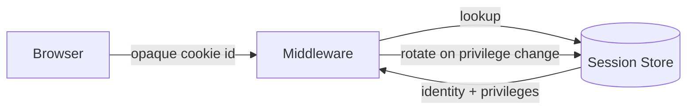

## Summary

Session Management is how the system remembers who a visitor is between
requests. It keeps the authoritative record of every active session on the
server and hands the browser only an unguessable identifier. This lets the
realm revoke access the instant a session should no longer be trusted, which
is the property the rest of the sharing and access-control machinery leans on.

## What it does

Every request that is not anonymous must be tied back to a person. The
component sits at the edge of the server: it reads the incoming identifier,
resolves it to a living session, and attaches the resulting identity to the
request for everything downstream to use. When a session cannot be resolved
the request proceeds as anonymous rather than failing outright, so public
surfaces keep working.

## Related components

- [Document Sharing](../sharing/) — asks on every request whether the current
  identity may reach a given resource.
- [Password Hashing](../password-hashing/) — the privilege changes that trigger
  a rotation here originate around it.

## How it works

A session is created when a person authenticates and is stored server-side
with its identity, its privileges, and an expiry. The browser receives only
the identifier. On each request the middleware looks the identifier up, and on
a hit it refreshes the session and attaches the identity. Sessions expire on
inactivity and are removed on sign-out, and a rotation replaces the identifier
whenever the privileges attached to a session change.

## Design decisions

Sessions are kept server-side and the cookie carries only an opaque identifier
because revocation has to be immediate: shared-document access control depends
on being able to cut off a session at once. A self-contained token carried in
the cookie was considered and rejected, because invalidating such a token
before its natural expiry reintroduces exactly the server-side bookkeeping the
token was meant to avoid. Rotation on privilege change exists so that an
identifier captured under lower privileges cannot be replayed to exercise
higher ones.

## Where it sits

Session Management trades a little server-side storage for immediate, reliable
revocation and clean privilege boundaries. Because everything else in the
realm trusts the identity it attaches, its correctness and freshness matter
out of proportion to its size.
